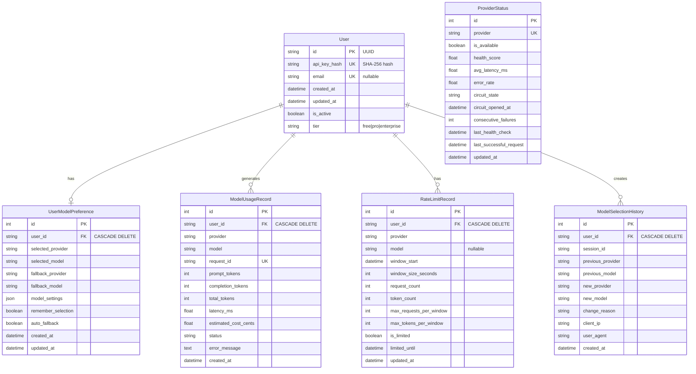

# Chimera Database Schema Documentation

**Version:** 1.0.0
**Last Updated:** 2025-12-15
**Database:** SQLite (Development) / PostgreSQL (Production)

## Table of Contents
1. [Overview](#overview)
2. [Entity Relationship Diagram](#entity-relationship-diagram)
3. [Table Definitions](#table-definitions)
4. [Indexing Strategy](#indexing-strategy)
5. [Data Access Patterns](#data-access-patterns)
6. [Performance Optimization](#performance-optimization)
7. [Migration Recommendations](#migration-recommendations)

---

## Overview

The Chimera database schema supports a multi-tenant AI prompt optimization system with user management, model preferences, usage tracking, rate limiting, and provider health monitoring.

### Key Features
- **User Management**: API key-based authentication with tier-based access control
- **Model Preferences**: Per-user AI model selection with fallback configuration
- **Usage Tracking**: Comprehensive request/token tracking for billing and analytics
- **Rate Limiting**: Per-model, per-provider rate limiting with sliding windows
- **Provider Health**: Circuit breaker pattern with health score tracking
- **Audit Trail**: Model selection history for compliance and debugging

### Database Technology

**Development:** SQLite 3.x
- File-based: `sqlite:///./chimera.db`
- Suitable for single-instance development
- Limited concurrency support

**Production:** PostgreSQL 12+
- Required for production deployments (enforced by validation)
- Full ACID compliance with row-level locking
- Advanced indexing (GIN, BRIN, partial indexes)
- JSON/JSONB support for flexible schema

---

## Entity Relationship Diagram



---

## Table Definitions

### 1. users

**Purpose:** Core user accounts with API key authentication and tier-based access control.

| Column | Type | Constraints | Description |
|--------|------|-------------|-------------|
| id | VARCHAR(36) | PRIMARY KEY | UUID v4 identifier |
| api_key_hash | VARCHAR(64) | UNIQUE, NOT NULL | SHA-256 hash of API key |
| email | VARCHAR(255) | UNIQUE, NULLABLE | User email (optional) |
| created_at | TIMESTAMP | NOT NULL, DEFAULT NOW | Account creation timestamp |
| updated_at | TIMESTAMP | DEFAULT NOW, ON UPDATE | Last modification timestamp |
| is_active | BOOLEAN | NOT NULL, DEFAULT TRUE | Account status flag |
| tier | VARCHAR(20) | NOT NULL, DEFAULT 'free' | Subscription tier (free/pro/enterprise) |

**Indexes:**
- `idx_users_api_key_hash` (api_key_hash) - Authentication lookups
- `idx_users_email` (email) - Email-based queries

**Relationships:**
- One-to-one with `user_model_preferences`
- One-to-many with `model_usage_records`
- One-to-many with `rate_limit_records`
- One-to-many with `model_selection_history`

---

### 2. user_model_preferences

**Purpose:** User-specific AI model selection and configuration preferences.

| Column | Type | Constraints | Description |
|--------|------|-------------|-------------|
| id | INTEGER | PRIMARY KEY, AUTOINCREMENT | Sequential identifier |
| user_id | VARCHAR(36) | FK users(id), UNIQUE, NOT NULL | User reference |
| selected_provider | VARCHAR(50) | NOT NULL, DEFAULT 'gemini' | Current provider |
| selected_model | VARCHAR(100) | NOT NULL, DEFAULT 'gemini-3-pro-preview' | Current model |
| fallback_provider | VARCHAR(50) | NULLABLE | Fallback provider |
| fallback_model | VARCHAR(100) | NULLABLE | Fallback model |
| model_settings | JSON/JSONB | DEFAULT '{}' | Provider-specific settings |
| remember_selection | BOOLEAN | DEFAULT TRUE | Persist selection flag |
| auto_fallback | BOOLEAN | DEFAULT TRUE | Auto-fallback enabled |
| created_at | TIMESTAMP | NOT NULL, DEFAULT NOW | Creation timestamp |
| updated_at | TIMESTAMP | DEFAULT NOW, ON UPDATE | Last update timestamp |

**Indexes:**
- `idx_preferences_user_id` (user_id) - User preference lookups
- `idx_preferences_provider` (selected_provider) - Provider-based queries

**Foreign Keys:**
- `user_id` → `users(id)` ON DELETE CASCADE

---

### 3. model_usage_records

**Purpose:** Comprehensive usage tracking for billing, analytics, and quota enforcement.

| Column | Type | Constraints | Description |
|--------|------|-------------|-------------|
| id | INTEGER | PRIMARY KEY, AUTOINCREMENT | Sequential identifier |
| user_id | VARCHAR(36) | FK users(id), NOT NULL | User reference |
| provider | VARCHAR(50) | NOT NULL | Provider name |
| model | VARCHAR(100) | NOT NULL | Model name |
| request_id | VARCHAR(36) | UNIQUE, NOT NULL | Request UUID |
| prompt_tokens | INTEGER | DEFAULT 0 | Input token count |
| completion_tokens | INTEGER | DEFAULT 0 | Output token count |
| total_tokens | INTEGER | DEFAULT 0 | Total token count |
| latency_ms | FLOAT | DEFAULT 0.0 | Request latency |
| estimated_cost_cents | FLOAT | DEFAULT 0.0 | Cost in USD cents |
| status | VARCHAR(20) | DEFAULT 'success' | success/error/timeout/rate_limited |
| error_message | TEXT | NULLABLE | Error details |
| created_at | TIMESTAMP | NOT NULL, DEFAULT NOW, INDEXED | Request timestamp |

**Indexes:**
- `idx_usage_user_id` (user_id) - User usage queries
- `idx_usage_provider_model` (provider, model) - Provider/model analytics
- `idx_usage_created_at` (created_at) - Time-based queries
- `idx_usage_request_id` (request_id) - Request lookups

**Foreign Keys:**
- `user_id` → `users(id)` ON DELETE CASCADE

**Query Patterns:**
- Time-series aggregations (daily/monthly usage)
- Cost calculations per user/provider
- Error rate analysis
- Performance monitoring

---

### 4. rate_limit_records

**Purpose:** Per-model rate limiting with sliding window algorithm.

| Column | Type | Constraints | Description |
|--------|------|-------------|-------------|
| id | INTEGER | PRIMARY KEY, AUTOINCREMENT | Sequential identifier |
| user_id | VARCHAR(36) | FK users(id), NOT NULL | User reference |
| provider | VARCHAR(50) | NOT NULL | Provider name |
| model | VARCHAR(100) | NULLABLE | Model name (NULL = provider-level) |
| window_start | TIMESTAMP | NOT NULL, INDEXED | Window start time |
| window_size_seconds | INTEGER | DEFAULT 60 | Window duration |
| request_count | INTEGER | DEFAULT 0 | Requests in window |
| token_count | INTEGER | DEFAULT 0 | Tokens in window |
| max_requests_per_window | INTEGER | DEFAULT 60 | Request limit |
| max_tokens_per_window | INTEGER | DEFAULT 100000 | Token limit |
| is_limited | BOOLEAN | DEFAULT FALSE | Currently limited flag |
| limited_until | TIMESTAMP | NULLABLE | Limit expiration |
| updated_at | TIMESTAMP | DEFAULT NOW, ON UPDATE | Last update |

**Indexes:**
- `idx_rate_limit_user_provider` (user_id, provider) - Rate limit checks
- `idx_rate_limit_window` (window_start) - Window cleanup

**Constraints:**
- `uq_rate_limit_user_provider_model` UNIQUE (user_id, provider, model)

**Foreign Keys:**
- `user_id` → `users(id)` ON DELETE CASCADE

---

### 5. provider_status

**Purpose:** Provider health monitoring and circuit breaker state management.

| Column | Type | Constraints | Description |
|--------|------|-------------|-------------|
| id | INTEGER | PRIMARY KEY, AUTOINCREMENT | Sequential identifier |
| provider | VARCHAR(50) | UNIQUE, NOT NULL | Provider name |
| is_available | BOOLEAN | DEFAULT TRUE, INDEXED | Availability flag |
| health_score | FLOAT | DEFAULT 1.0 | Health score (0.0-1.0) |
| avg_latency_ms | FLOAT | DEFAULT 0.0 | Rolling average latency |
| error_rate | FLOAT | DEFAULT 0.0 | Error rate (0.0-1.0) |
| circuit_state | VARCHAR(20) | DEFAULT 'closed' | closed/open/half_open |
| circuit_opened_at | TIMESTAMP | NULLABLE | Circuit open timestamp |
| consecutive_failures | INTEGER | DEFAULT 0 | Failure counter |
| last_health_check | TIMESTAMP | DEFAULT NOW | Last health check |
| last_successful_request | TIMESTAMP | NULLABLE | Last success timestamp |
| updated_at | TIMESTAMP | DEFAULT NOW, ON UPDATE | Last update |

**Indexes:**
- `idx_provider_status_provider` (provider) - Provider lookups
- `idx_provider_status_available` (is_available) - Availability queries

---

### 6. model_selection_history

**Purpose:** Audit trail for model selection changes and debugging.

| Column | Type | Constraints | Description |
|--------|------|-------------|-------------|
| id | INTEGER | PRIMARY KEY, AUTOINCREMENT | Sequential identifier |
| user_id | VARCHAR(36) | FK users(id), NOT NULL | User reference |
| session_id | VARCHAR(36) | NULLABLE | Session identifier |
| previous_provider | VARCHAR(50) | NULLABLE | Previous provider |
| previous_model | VARCHAR(100) | NULLABLE | Previous model |
| new_provider | VARCHAR(50) | NOT NULL | New provider |
| new_model | VARCHAR(100) | NOT NULL | New model |
| change_reason | VARCHAR(50) | DEFAULT 'user_selection' | user_selection/fallback/auto_switch |
| client_ip | VARCHAR(45) | NULLABLE | Client IP address |
| user_agent | VARCHAR(255) | NULLABLE | User agent string |
| created_at | TIMESTAMP | NOT NULL, DEFAULT NOW, INDEXED | Change timestamp |

**Indexes:**
- `idx_history_user_id` (user_id) - User history queries
- `idx_history_created_at` (created_at) - Time-based queries

**Foreign Keys:**
- `user_id` → `users(id)` ON DELETE CASCADE

---

## Indexing Strategy

### Current Indexes (Implemented)

#### Primary Indexes
All tables have primary key indexes (B-tree) for unique identification and fast lookups.

#### Foreign Key Indexes
- `user_model_preferences.user_id`
- `model_usage_records.user_id`
- `rate_limit_records.user_id`
- `model_selection_history.user_id`

#### Unique Constraint Indexes
- `users.api_key_hash` - Authentication
- `users.email` - User lookup
- `model_usage_records.request_id` - Request deduplication
- `provider_status.provider` - Provider uniqueness
- `rate_limit_records(user_id, provider, model)` - Rate limit uniqueness

#### Query Optimization Indexes
- `model_usage_records.created_at` - Time-series queries
- `model_usage_records(provider, model)` - Analytics
- `rate_limit_records.window_start` - Window management
- `provider_status.is_available` - Health checks

### Recommended Additional Indexes

#### 1. Composite Indexes for Common Query Patterns

```sql
-- User usage by date range (most common analytics query)
CREATE INDEX idx_usage_user_date ON model_usage_records(user_id, created_at DESC);

-- Provider usage analytics
CREATE INDEX idx_usage_provider_date ON model_usage_records(provider, created_at DESC);

-- Status-based error analysis
CREATE INDEX idx_usage_status_date ON model_usage_records(status, created_at DESC)
WHERE status != 'success';

-- Active users lookup
CREATE INDEX idx_users_active_tier ON users(is_active, tier)
WHERE is_active = TRUE;
```

#### 2. Partial Indexes (PostgreSQL)

```sql
-- Failed requests only (reduces index size by ~95%)
CREATE INDEX idx_usage_errors ON model_usage_records(user_id, created_at, provider)
WHERE status IN ('error', 'timeout', 'rate_limited');

-- Currently rate-limited users
CREATE INDEX idx_rate_limit_active ON rate_limit_records(user_id, provider, limited_until)
WHERE is_limited = TRUE;

-- Open circuit breakers
CREATE INDEX idx_provider_circuit_open ON provider_status(provider, circuit_opened_at)
WHERE circuit_state = 'open';
```

#### 3. JSON/JSONB Indexes (PostgreSQL)

```sql
-- Index specific model settings paths
CREATE INDEX idx_preferences_settings_temp ON user_model_preferences
USING GIN ((model_settings->'gemini'->'temperature'));

-- Full GIN index for flexible JSON queries
CREATE INDEX idx_preferences_settings_gin ON user_model_preferences
USING GIN (model_settings);
```

#### 4. Covering Indexes (Index-Only Scans)

```sql
-- Cover common usage summary queries
CREATE INDEX idx_usage_summary ON model_usage_records(
    user_id,
    created_at,
    total_tokens,
    estimated_cost_cents,
    status
);

-- Cover rate limit checks
CREATE INDEX idx_rate_limit_check ON rate_limit_records(
    user_id,
    provider,
    model,
    window_start,
    request_count,
    token_count,
    is_limited
);
```

#### 5. Time-Series Optimization (PostgreSQL)

```sql
-- BRIN index for large time-series data (very space-efficient)
CREATE INDEX idx_usage_created_brin ON model_usage_records
USING BRIN (created_at) WITH (pages_per_range = 128);

-- Partition by month for large datasets (future consideration)
-- CREATE TABLE model_usage_records_2025_12 PARTITION OF model_usage_records
-- FOR VALUES FROM ('2025-12-01') TO ('2026-01-01');
```

### Index Maintenance Strategy

#### SQLite (Development)
```sql
-- Rebuild indexes and update statistics
REINDEX;
ANALYZE;
```

#### PostgreSQL (Production)
```sql
-- Update statistics (run nightly)
ANALYZE VERBOSE;

-- Rebuild bloated indexes (run monthly)
REINDEX INDEX CONCURRENTLY idx_usage_user_date;

-- Monitor index usage
SELECT schemaname, tablename, indexname, idx_scan, idx_tup_read, idx_tup_fetch
FROM pg_stat_user_indexes
WHERE idx_scan = 0 AND indexrelname NOT LIKE 'pg_toast%'
ORDER BY pg_relation_size(indexrelid) DESC;
```

---

## Data Access Patterns

### 1. Authentication Flow
```python
# Pattern: API key lookup (high frequency)
SELECT id, tier, is_active
FROM users
WHERE api_key_hash = ? AND is_active = TRUE;

# Index: idx_users_api_key_hash (existing)
# Performance: O(log n) - B-tree lookup
```

### 2. Rate Limit Check
```python
# Pattern: Check user rate limits (very high frequency)
SELECT request_count, token_count, max_requests_per_window, is_limited
FROM rate_limit_records
WHERE user_id = ? AND provider = ? AND model = ?;

# Index: idx_rate_limit_user_provider (existing)
# Recommended: Add covering index for index-only scan
```

### 3. Usage Tracking
```python
# Pattern: Record request (high frequency - write)
INSERT INTO model_usage_records (
    user_id, provider, model, request_id,
    prompt_tokens, completion_tokens, total_tokens,
    latency_ms, estimated_cost_cents, status, created_at
) VALUES (?, ?, ?, ?, ?, ?, ?, ?, ?, ?, ?);

# Index: Primary key + unique constraint on request_id
# Optimization: Batch inserts for high throughput
```

### 4. Usage Analytics
```python
# Pattern: Daily usage summary (medium frequency)
SELECT
    DATE(created_at) as date,
    provider,
    COUNT(*) as request_count,
    SUM(total_tokens) as total_tokens,
    SUM(estimated_cost_cents) as total_cost,
    AVG(latency_ms) as avg_latency
FROM model_usage_records
WHERE user_id = ?
  AND created_at >= ?
  AND created_at < ?
GROUP BY DATE(created_at), provider;

# Index: idx_usage_user_date (recommended)
# Alternative: Materialized view for dashboard queries
```

### 5. Provider Health Check
```python
# Pattern: Get available providers (high frequency)
SELECT provider, health_score, avg_latency_ms, circuit_state
FROM provider_status
WHERE is_available = TRUE
ORDER BY health_score DESC;

# Index: idx_provider_status_available (existing)
# Optimization: Cache results with 30s TTL
```

### 6. Model Preference Lookup
```python
# Pattern: Get user preferences (high frequency)
SELECT selected_provider, selected_model, fallback_provider,
       fallback_model, model_settings
FROM user_model_preferences
WHERE user_id = ?;

# Index: idx_preferences_user_id (existing)
# Optimization: Application-level caching
```

---

## Performance Optimization

### Query Optimization Recommendations

#### 1. Avoid N+1 Queries
```python
# BAD: N+1 query pattern
for user in users:
    preferences = get_preferences(user.id)  # N queries

# GOOD: Single query with JOIN
SELECT u.*, p.*
FROM users u
LEFT JOIN user_model_preferences p ON u.id = p.user_id
WHERE u.is_active = TRUE;
```

#### 2. Use Batch Operations
```python
# BAD: Individual inserts
for record in usage_records:
    db.execute("INSERT INTO model_usage_records ...")

# GOOD: Bulk insert
db.executemany("INSERT INTO model_usage_records ...", usage_records)
```

#### 3. Implement Query Result Caching
```python
# Cache frequently accessed data
@cache(ttl=300)  # 5 minutes
def get_user_preferences(user_id: str):
    return db.query(UserModelPreference).filter_by(user_id=user_id).first()

# Cache provider status
@cache(ttl=30)  # 30 seconds
def get_available_providers():
    return db.query(ProviderStatus).filter_by(is_available=True).all()
```

#### 4. Use Connection Pooling
```python
# SQLAlchemy configuration
engine = create_engine(
    DATABASE_URL,
    pool_size=20,          # Base pool size
    max_overflow=10,       # Additional connections
    pool_timeout=30,       # Connection timeout
    pool_recycle=3600,     # Recycle connections hourly
    pool_pre_ping=True     # Verify connections
)
```

### Database-Specific Optimizations

#### SQLite (Development)
```sql
-- Enable WAL mode for better concurrency
PRAGMA journal_mode = WAL;

-- Increase cache size (in pages, default 2000)
PRAGMA cache_size = -64000;  -- 64MB

-- Enable foreign keys
PRAGMA foreign_keys = ON;

-- Optimize for speed over safety (dev only)
PRAGMA synchronous = NORMAL;
```

#### PostgreSQL (Production)
```sql
-- Connection pooling (PgBouncer recommended)
-- pool_mode = transaction
-- max_client_conn = 1000
-- default_pool_size = 25

-- Autovacuum tuning
ALTER TABLE model_usage_records SET (
    autovacuum_vacuum_scale_factor = 0.05,
    autovacuum_analyze_scale_factor = 0.02
);

-- Parallel query execution
SET max_parallel_workers_per_gather = 4;

-- Work memory for sorting/hashing
SET work_mem = '64MB';
```

### Monitoring Queries

#### Slow Query Detection (PostgreSQL)
```sql
-- Enable slow query logging
ALTER SYSTEM SET log_min_duration_statement = 1000;  -- 1 second

-- Find slow queries
SELECT
    query,
    calls,
    total_time,
    mean_time,
    max_time
FROM pg_stat_statements
ORDER BY mean_time DESC
LIMIT 20;
```

#### Index Usage Analysis
```sql
-- Unused indexes (candidates for removal)
SELECT
    schemaname,
    tablename,
    indexname,
    pg_size_pretty(pg_relation_size(indexrelid)) as size
FROM pg_stat_user_indexes
WHERE idx_scan = 0
  AND indexrelname NOT LIKE 'pg_toast%'
ORDER BY pg_relation_size(indexrelid) DESC;

-- Missing indexes (high seq scans)
SELECT
    schemaname,
    tablename,
    seq_scan,
    seq_tup_read,
    idx_scan,
    seq_tup_read / seq_scan as avg_seq_read
FROM pg_stat_user_tables
WHERE seq_scan > 0
ORDER BY seq_tup_read DESC
LIMIT 20;
```

---

## Migration Recommendations

### Immediate Actions

#### 1. Add Recommended Indexes
```sql
-- High-priority indexes for production
CREATE INDEX CONCURRENTLY idx_usage_user_date
ON model_usage_records(user_id, created_at DESC);

CREATE INDEX CONCURRENTLY idx_usage_provider_date
ON model_usage_records(provider, created_at DESC);

CREATE INDEX CONCURRENTLY idx_usage_errors
ON model_usage_records(user_id, created_at, provider)
WHERE status IN ('error', 'timeout', 'rate_limited');
```

#### 2. Implement Partitioning (PostgreSQL)
```sql
-- Partition model_usage_records by month
CREATE TABLE model_usage_records_partitioned (
    LIKE model_usage_records INCLUDING ALL
) PARTITION BY RANGE (created_at);

-- Create monthly partitions
CREATE TABLE model_usage_records_2025_12
PARTITION OF model_usage_records_partitioned
FOR VALUES FROM ('2025-12-01') TO ('2026-01-01');

-- Migrate data (zero-downtime)
-- 1. Create partitioned table
-- 2. Copy data in batches
-- 3. Swap tables atomically
```

#### 3. Add Materialized Views for Analytics
```sql
-- Daily usage summary (refresh hourly)
CREATE MATERIALIZED VIEW daily_usage_summary AS
SELECT
    user_id,
    DATE(created_at) as usage_date,
    provider,
    COUNT(*) as request_count,
    SUM(total_tokens) as total_tokens,
    SUM(estimated_cost_cents) as total_cost,
    AVG(latency_ms) as avg_latency
FROM model_usage_records
GROUP BY user_id, DATE(created_at), provider;

CREATE UNIQUE INDEX ON daily_usage_summary(user_id, usage_date, provider);

-- Refresh strategy (cron job)
REFRESH MATERIALIZED VIEW CONCURRENTLY daily_usage_summary;
```

### Future Enhancements

#### 1. Time-Series Database for Metrics
Consider migrating usage metrics to TimescaleDB (PostgreSQL extension) or InfluxDB for:
- Automatic data retention policies
- Optimized time-series queries
- Continuous aggregations
- Compression

#### 2. Read Replicas
For high-traffic scenarios:
- Primary: Write operations
- Replica 1: Analytics queries
- Replica 2: Dashboard/reporting

#### 3. Caching Layer
Implement Redis for:
- Rate limit counters (atomic operations)
- User session data
- Provider health status
- Query result caching

#### 4. Archive Strategy
```sql
-- Archive old usage records (>90 days)
CREATE TABLE model_usage_records_archive (
    LIKE model_usage_records INCLUDING ALL
);

-- Move old data monthly
INSERT INTO model_usage_records_archive
SELECT * FROM model_usage_records
WHERE created_at < NOW() - INTERVAL '90 days';

DELETE FROM model_usage_records
WHERE created_at < NOW() - INTERVAL '90 days';
```

---

## Performance Benchmarks

### Expected Query Performance (PostgreSQL)

| Query Type | Without Index | With Index | Target |
|------------|---------------|------------|--------|
| API key lookup | 50-100ms | <5ms | <10ms |
| Rate limit check | 20-50ms | <2ms | <5ms |
| Usage insert | 5-10ms | 5-10ms | <10ms |
| Daily summary | 500-2000ms | 50-100ms | <200ms |
| Provider health | 10-20ms | <5ms | <10ms |

### Capacity Planning

**Current Schema Capacity:**
- Users: 10M+ (with proper indexing)
- Usage Records: 100M+ per year (with partitioning)
- Rate Limit Records: 1M+ (with cleanup)
- Provider Status: <100 (static)

**Storage Estimates (per million records):**
- model_usage_records: ~500MB
- model_selection_history: ~200MB
- Indexes: ~30% overhead

---

## Conclusion

The current schema is well-designed for the application's needs with proper normalization, foreign key relationships, and basic indexing. The recommended enhancements focus on:

1. **Query optimization** through composite and partial indexes
2. **Scalability** via partitioning and materialized views
3. **Performance monitoring** with PostgreSQL statistics
4. **Future-proofing** with archive strategies and read replicas

Implement the high-priority indexes immediately for production deployments, and consider the advanced optimizations as traffic grows.

---

**Document Maintained By:** Database Architecture Team
**Review Schedule:** Quarterly
**Next Review:** 2026-03-15
