# Chimera AI Research Platform - Database Schema Analysis

## Entity Relationship Diagram (Mermaid)

```mermaid
erDiagram
    %% User Management Domain
    USERS {
        serial id PK
        varchar email UK
        varchar username UK
        varchar hashed_password
        user_role role
        account_status account_status
        boolean is_verified
        varchar email_verification_token
        timestamptz created_at
        timestamptz last_login
        jsonb preferences
    }

    USER_API_KEYS {
        serial id PK
        integer user_id FK
        varchar name
        varchar key_prefix
        varchar hashed_key UK
        jsonb scopes
        boolean is_active
        timestamptz expires_at
        bigint usage_count
    }

    USER_SESSIONS {
        uuid id PK
        integer user_id FK
        varchar session_token UK
        varchar refresh_token_hash
        inet ip_address
        text user_agent
        boolean is_active
        timestamptz expires_at
    }

    %% Campaign Management Domain
    CAMPAIGNS {
        uuid id PK
        varchar name
        text description
        text objective
        integer created_by FK
        campaign_visibility visibility
        campaign_status status
        varchar target_provider
        varchar target_model
        jsonb technique_suites
        jsonb transformation_config
        jsonb config
        decimal success_rate
        timestamptz created_at
    }

    CAMPAIGN_SHARES {
        serial id PK
        uuid campaign_id FK
        integer user_id FK
        share_permission permission
        integer shared_by FK
        timestamptz shared_at
        timestamptz expires_at
    }

    CAMPAIGN_EXECUTIONS {
        uuid id PK
        uuid campaign_id FK
        integer iteration_number
        execution_status execution_status
        text original_prompt
        text transformed_prompt
        varchar technique_applied
        text llm_response
        decimal success_score
        boolean is_successful
        integer latency_ms
        decimal cost_usd
        varchar provider_used
        timestamptz started_at
    }

    %% Prompt Library Domain
    PROMPT_TEMPLATES {
        uuid id PK
        varchar title
        text description
        text prompt_text
        technique_type technique_type
        vulnerability_type vulnerability_type
        jsonb tags
        template_status template_status
        sharing_level sharing_level
        integer version_number
        uuid parent_template_id FK
        decimal success_rate
        decimal average_rating
        integer total_ratings
        integer created_by FK
        timestamptz created_at
    }

    TEMPLATE_RATINGS {
        serial id PK
        uuid template_id FK
        integer user_id FK
        integer rating
        boolean effectiveness_vote
        text review_comment
        uuid used_in_campaign_id FK
        timestamptz created_at
    }

    TEMPLATE_USAGE {
        serial id PK
        uuid template_id FK
        integer used_by FK
        uuid campaign_id FK
        text original_prompt
        jsonb customizations_made
        boolean was_successful
        decimal success_score
        timestamptz used_at
    }

    %% Analytics and Telemetry Domain
    TELEMETRY_EVENTS {
        bigserial id PK
        uuid event_id
        telemetry_event_type event_type
        uuid campaign_id FK
        integer user_id FK
        jsonb payload
        varchar session_id
        uuid correlation_id
        integer latency_ms
        decimal cost_usd
        timestamptz event_timestamp
    }

    CAMPAIGN_ANALYTICS {
        serial id PK
        uuid campaign_id FK
        timestamptz time_window_start
        timestamptz time_window_end
        interval window_duration
        integer total_attempts
        integer successful_attempts
        decimal success_rate
        decimal avg_latency_ms
        decimal total_cost_usd
        jsonb technique_breakdown
        jsonb provider_breakdown
        timestamptz computed_at
    }

    %% Provider Management Domain
    LLM_PROVIDERS {
        serial id PK
        varchar name UK
        varchar display_name
        varchar provider_type
        varchar base_url
        boolean is_active
        varchar health_status
        timestamptz last_health_check
        jsonb default_config
        timestamptz created_at
    }

    LLM_MODELS {
        serial id PK
        integer provider_id FK
        varchar model_name
        varchar display_name
        integer max_tokens
        decimal cost_per_input_token
        decimal cost_per_output_token
        varchar model_version
        boolean is_available
    }

    USER_PROVIDER_KEYS {
        serial id PK
        integer user_id FK
        integer provider_id FK
        bytea encrypted_api_key
        varchar key_name
        varchar key_prefix
        boolean is_active
        timestamptz last_used_at
        bigint usage_count
    }

    %% Audit and Compliance Domain
    AUDIT_LOG {
        bigserial id PK
        uuid event_id
        audit_action action
        integer user_id FK
        varchar session_id
        integer api_key_id FK
        varchar resource_type
        varchar resource_id
        jsonb details
        audit_severity severity
        inet ip_address
        text user_agent
        varchar event_hash
        varchar previous_hash
        timestamptz event_timestamp
    }

    CONFIG_AUDIT {
        serial id PK
        varchar config_key
        jsonb old_value
        jsonb new_value
        integer changed_by FK
        text change_reason
        boolean requires_approval
        integer approved_by FK
        timestamptz changed_at
    }

    %% Relationships
    USERS ||--o{ USER_API_KEYS : owns
    USERS ||--o{ USER_SESSIONS : has
    USERS ||--o{ CAMPAIGNS : creates
    USERS ||--o{ PROMPT_TEMPLATES : creates
    USERS ||--o{ USER_PROVIDER_KEYS : configures

    CAMPAIGNS ||--o{ CAMPAIGN_SHARES : shared_via
    CAMPAIGNS ||--o{ CAMPAIGN_EXECUTIONS : contains
    CAMPAIGNS ||--o{ CAMPAIGN_ANALYTICS : analyzed_in
    CAMPAIGNS ||--o{ TELEMETRY_EVENTS : generates

    PROMPT_TEMPLATES ||--o{ TEMPLATE_RATINGS : receives
    PROMPT_TEMPLATES ||--o{ TEMPLATE_USAGE : tracked_in
    PROMPT_TEMPLATES ||--o{ PROMPT_TEMPLATES : versioned_from

    LLM_PROVIDERS ||--o{ LLM_MODELS : provides
    LLM_PROVIDERS ||--o{ USER_PROVIDER_KEYS : configured_for

    USERS ||--o{ AUDIT_LOG : generates
    USER_API_KEYS ||--o{ AUDIT_LOG : tracked_in
```



## Schema Performance Analysis

### **Normalization Level: 3NF with Strategic Denormalization**

The schema follows Third Normal Form (3NF) principles while strategically denormalizing for performance:

#### **Normalized Aspects:**
- ✅ Users separated from sessions and API keys
- ✅ Campaigns isolated from executions and analytics
- ✅ Templates versioned with proper parent-child relationships
- ✅ Providers and models properly separated

#### **Strategic Denormalization:**
- 📊 **Campaign success_rate** cached in campaigns table (updated via trigger)
- 📊 **Template ratings** aggregated in prompt_templates table
- 📊 **User activity** denormalized in preferences JSONB
- 📊 **Analytics breakdowns** stored as JSONB for flexibility

### **Indexing Strategy**

#### **Critical Performance Indexes:**
```sql
-- Time-series queries (most frequent)
idx_campaign_executions_campaign_time  -- Campaign analytics
idx_telemetry_events_type_time         -- Real-time monitoring
idx_audit_log_user_time                -- Security analysis

-- User experience critical
idx_users_email_verified               -- Login performance
idx_campaigns_owner_status             -- Dashboard loading
idx_prompt_templates_search (GIN)      -- Template discovery

-- Security and compliance
idx_audit_log_severity                 -- Incident investigation
idx_user_sessions_expires              -- Session cleanup
```

#### **Query Pattern Optimization:**

1. **Dashboard Queries** (sub-100ms target):
   - Campaign list by user: `idx_campaigns_owner_status`
   - User activity: Materialized view `user_activity_summary`

2. **Real-time Analytics** (sub-50ms target):
   - Live telemetry: Partitioned `telemetry_events` with time-based indexes
   - Campaign progress: Cached aggregates in `campaigns` table

3. **Search Operations** (sub-200ms target):
   - Template search: Full-text GIN index on combined fields
   - Technique filtering: Separate indexes on enum columns

### **Scalability Features**

#### **Horizontal Partitioning:**
```sql
-- Telemetry events partitioned by month
telemetry_events_y2024m01, telemetry_events_y2024m02, ...

-- Audit log can be partitioned similarly for compliance retention
```

#### **Data Lifecycle Management:**
- 🗂️ **Retention Policies**: Automated cleanup via stored procedures
- 📦 **Archival Strategy**: Configurable policies in `data_retention_policies`
- 🔄 **Partition Management**: Monthly partitions for time-series data

#### **Read Replicas Support:**
- 👁️ **Analytics Queries**: Direct to read replicas
- 📊 **Reporting**: Materialized views refreshed on replicas
- ⚡ **Dashboard**: Mixed read/write with intelligent routing

### **Security Design**

#### **Row-Level Security (RLS):**
```sql
-- Campaign isolation
CREATE POLICY campaign_owner_access ON campaigns
    USING (created_by = current_user_id());

-- Template sharing controls
CREATE POLICY template_public_access ON prompt_templates
    USING (sharing_level IN ('public', 'team'));
```

#### **Audit Trail Integrity:**
- 🔗 **Hash Chain**: Tamper-evident audit log with SHA-256 linking
- 🔐 **Encrypted Storage**: API keys stored with application-level encryption
- 📝 **Comprehensive Logging**: All CRUD operations tracked with context

#### **Access Control Layers:**
1. **Database Level**: RLS policies + role-based grants
2. **Application Level**: JWT-based authentication + authorization
3. **API Level**: Rate limiting + API key scopes

### **Performance Projections**

#### **Expected Performance at Scale:**

| **Operation** | **Current Load** | **Target Scale** | **Expected Latency** |
|---------------|------------------|------------------|---------------------|
| User Login | 100/min | 10K/min | <100ms |
| Campaign List | 1K/min | 100K/min | <150ms |
| Telemetry Insert | 10K/sec | 100K/sec | <10ms |
| Analytics Query | 100/min | 10K/min | <500ms |
| Template Search | 500/min | 50K/min | <200ms |

#### **Database Size Projections:**
- **Year 1**: ~100GB (10M executions, 1M telemetry events/day)
- **Year 3**: ~1TB (100M executions, 10M telemetry events/day)
- **Year 5**: ~10TB (1B executions, 100M telemetry events/day)

### **Monitoring and Optimization**

#### **Key Metrics to Monitor:**
```sql
-- Query performance
SELECT query, calls, mean_exec_time, total_exec_time
FROM pg_stat_statements
ORDER BY total_exec_time DESC;

-- Index usage
SELECT schemaname, tablename, indexname, idx_tup_read, idx_tup_fetch
FROM pg_stat_user_indexes
WHERE idx_tup_read = 0; -- Unused indexes

-- Table bloat
SELECT schemaname, tablename, n_dead_tup, n_live_tup,
       round((n_dead_tup::float/n_live_tup)*100, 2) as dead_percent
FROM pg_stat_user_tables;
```

#### **Optimization Strategies:**

1. **Connection Pooling**: PgBouncer for connection management
2. **Query Optimization**: Regular EXPLAIN ANALYZE reviews
3. **Vacuum Strategy**: Automated maintenance for high-write tables
4. **Memory Tuning**: Work_mem, shared_buffers optimization
5. **Parallel Processing**: Parallel workers for analytics queries

This schema design provides a robust foundation for the Chimera AI Research Platform, balancing normalization principles with performance optimization, ensuring scalability from startup to enterprise scale while maintaining data integrity and security compliance.