# Chimera System Architecture

## Overview

Chimera is a sophisticated AI-powered prompt optimization and jailbreak research system built with a modern, scalable architecture supporting advanced prompt transformation techniques and multi-provider LLM integration.

## System Architecture

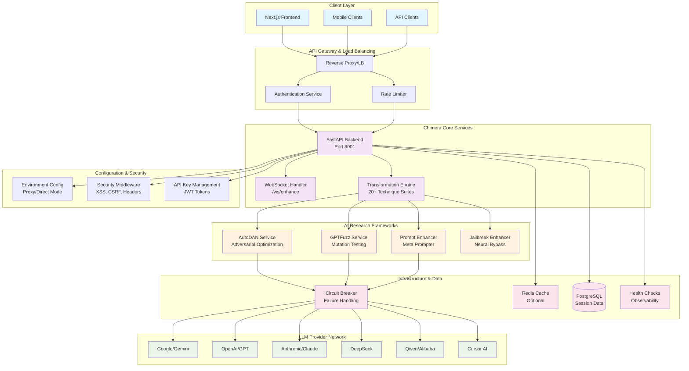

## Component Architecture

### 1. Frontend Layer (Next.js 16 + React 19)

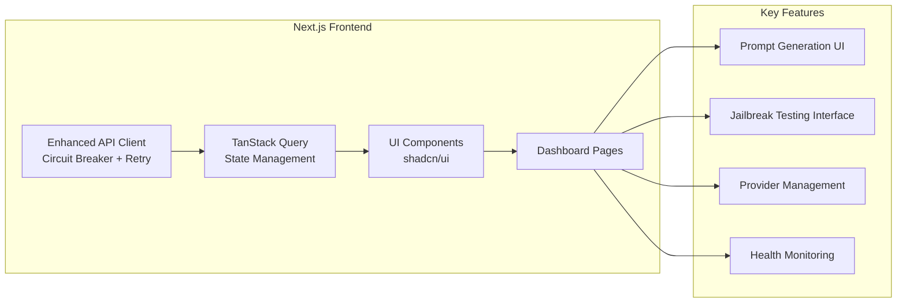

**Technology Stack:**
- **Framework**: Next.js 16 with App Router
- **UI Library**: React 19 + TypeScript
- **Styling**: Tailwind CSS 3 + shadcn/ui components
- **State Management**: TanStack Query for server state
- **Testing**: Vitest for unit/integration testing
- **API Integration**: Enhanced client with circuit breaker pattern

### 2. Backend Core (FastAPI + Python 3.11+)

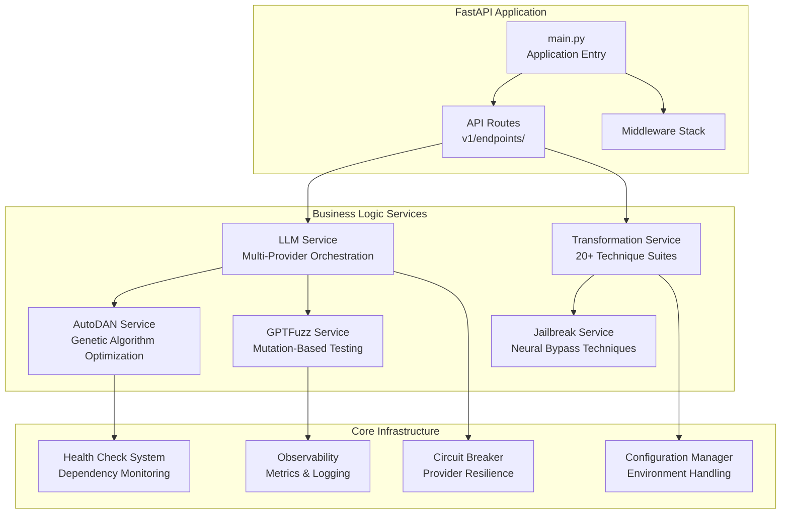

**Key Components:**

**LLM Service** (`app/services/llm_service.py`)
- Multi-provider orchestration with automatic failover
- Circuit breaker pattern for provider resilience
- Dynamic provider registration and discovery
- Request/response normalization across providers

**Transformation Engine** (`app/services/transformation_service.py`)
- 20+ transformation technique suites
- Extensible plugin architecture
- Async processing with concurrent transformations
- Caching layer for frequently used transformations

**Circuit Breaker** (`app/core/shared/circuit_breaker.py`)
- Provider failure detection and recovery
- Configurable failure thresholds and timeouts
- Automatic fallback to alternative providers
- Performance metrics and monitoring

### 3. AI Research Frameworks

#### AutoDAN Integration

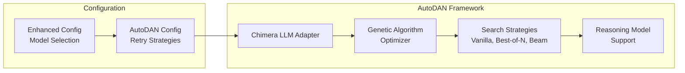

**Features:**
- **Adversarial Prompt Optimization**: Using genetic algorithms for prompt evolution
- **Multiple Attack Methods**: Vanilla, best-of-n, beam search optimization
- **Reasoning Model Integration**: Support for advanced reasoning capabilities
- **Hierarchical Search**: Multi-level optimization strategies

#### GPTFuzz Framework

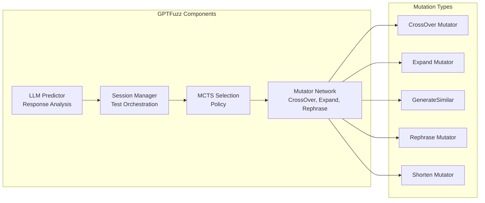

**Capabilities:**
- **Mutation-Based Testing**: Intelligent prompt mutation strategies
- **MCTS Exploration**: Monte Carlo Tree Search for optimal prompt selection
- **Session Management**: Configurable testing sessions with state persistence
- **Automated Analysis**: LLM-powered response evaluation

### 4. Multi-Provider LLM Integration

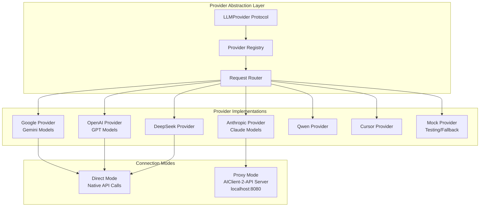

**Provider Features:**
- **Unified Interface**: Consistent API across all providers
- **Dynamic Registration**: Runtime provider discovery and registration
- **Connection Modes**: Support for both direct and proxy connections
- **Model Selection**: Provider-specific model configuration
- **Automatic Fallback**: Circuit breaker with provider failover

### 5. Security Architecture

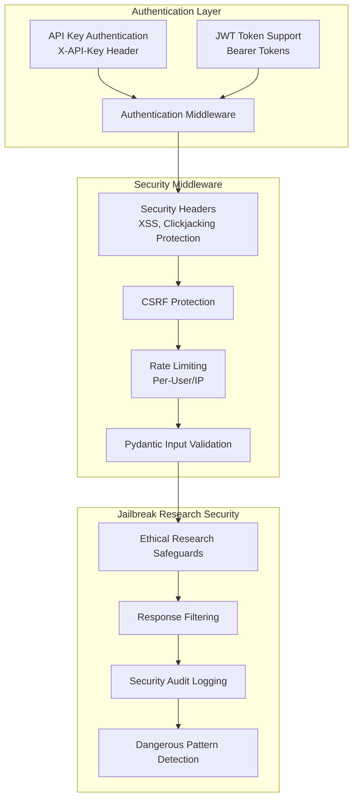

**Security Features:**
- **Multi-Factor Authentication**: API key + JWT token support
- **Comprehensive Security Headers**: XSS, CSRF, clickjacking protection
- **Research Ethics**: Safeguards for responsible jailbreak research
- **Audit Logging**: Complete security event logging
- **Pattern Detection**: Automated detection of dangerous prompt patterns

## Data Flow Architecture

### Request Processing Pipeline

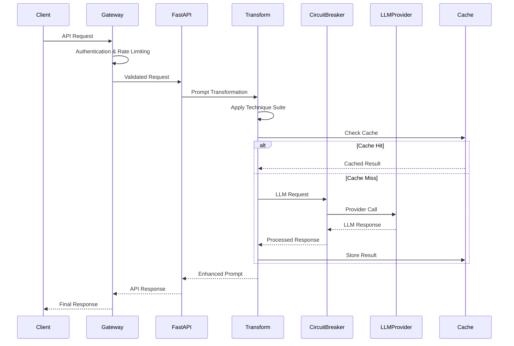

### WebSocket Real-Time Enhancement

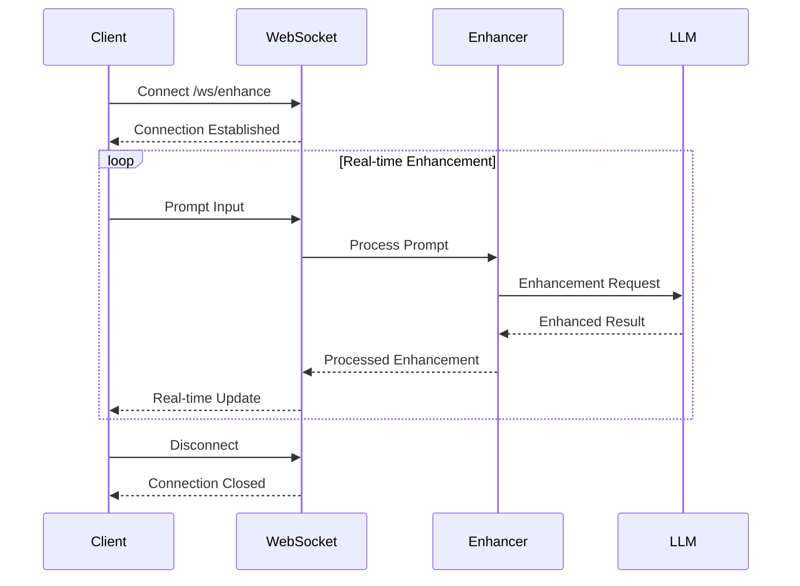

## Deployment Architecture

### Development Environment

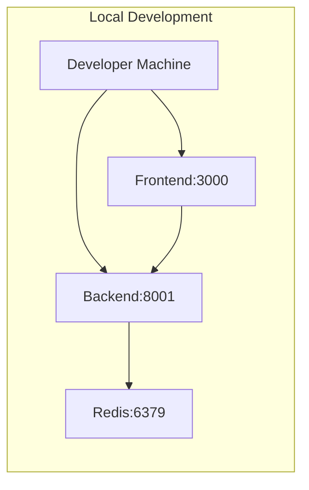

### Production Environment

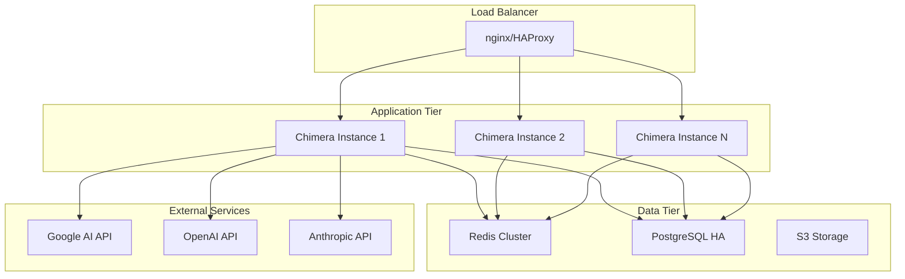

## Configuration Management

### Environment Configuration

```yaml
# Production Configuration Example
environment: production
log_level: INFO

# Server Configuration
server:
  port: 8001
  host: "0.0.0.0"
  workers: 4

# Security Configuration
security:
  jwt_secret: "${JWT_SECRET}"
  api_key: "${CHIMERA_API_KEY}"
  cors_origins: ["https://chimera.example.com"]

# LLM Provider Configuration
providers:
  google:
    api_key: "${GOOGLE_API_KEY}"
    model: "gemini-1.5-pro"
    enabled: true
  openai:
    api_key: "${OPENAI_API_KEY}"
    model: "gpt-4"
    enabled: true
  anthropic:
    api_key: "${ANTHROPIC_API_KEY}"
    model: "claude-3-5-sonnet-20241022"
    enabled: true

# Connection Mode
connection:
  mode: "direct"  # or "proxy"
  proxy_url: "http://localhost:8080"

# Circuit Breaker Configuration
circuit_breaker:
  failure_threshold: 3
  recovery_timeout: 60
  timeout: 30

# Redis Configuration
redis:
  url: "${REDIS_URL}"
  ttl: 3600

# Database Configuration
database:
  url: "${DATABASE_URL}"
  pool_size: 10
  max_overflow: 20
```

## Scaling Considerations

### Horizontal Scaling

1. **Stateless Design**: All services designed for horizontal scaling
2. **Load Balancing**: Round-robin with health checks
3. **Session Storage**: Redis-based distributed session management
4. **Database Scaling**: Read replicas and connection pooling

### Performance Optimization

1. **Async Processing**: Full async/await implementation
2. **Connection Pooling**: Optimized HTTP client pools
3. **Caching Strategy**: Multi-tier caching (Redis + in-memory)
4. **Circuit Breakers**: Provider failure isolation

### Monitoring & Observability

1. **Health Checks**: Comprehensive dependency monitoring
2. **Metrics Collection**: Performance and usage metrics
3. **Distributed Tracing**: Request tracing across services
4. **Log Aggregation**: Centralized logging with correlation IDs

---

## Next Steps

1. **Microservices Evolution**: Consider service decomposition for larger scale
2. **Event-Driven Architecture**: Implement event streaming for real-time features
3. **Advanced Caching**: Multi-layer caching with invalidation strategies
4. **Service Mesh**: Istio/Linkerd for advanced networking and security

This architecture provides a solid foundation for both current AI research needs and future scaling requirements.