# Chimera System Data Flow Diagrams

**Version:** 1.0.0  
**Date:** 2026-01-06  
**Status:** Integration Documentation  
**Purpose:** Visualize data flows and highlight integration breakpoints between backend and frontend

---

## Legend

### Status Symbols
| Symbol | Meaning |
|--------|---------|
| ✅ | Working / Compatible |
| ⚠️ | Partial / Degraded |
| ❌ | Broken / Missing |
| 🔄 | In Progress |
| ➡️ | Data Flow Direction |

### Breakpoint Severity
| Indicator | Meaning |
|-----------|---------|
| 🔴 CRITICAL | System will fail at runtime |
| 🟠 HIGH | Major functionality broken |
| 🟡 MEDIUM | Partial functionality issues |
| 🟢 OK | Working as expected |

### Component Types
| Shape | Component Type |
|-------|---------------|
| `[Box]` | UI Component |
| `(Round)` | Service/Process |
| `{Diamond}` | Decision Point |
| `[[Double]]` | External System |
| `[(Database)]` | Data Store |

---

## 1. System Overview Diagram

### High-Level Architecture

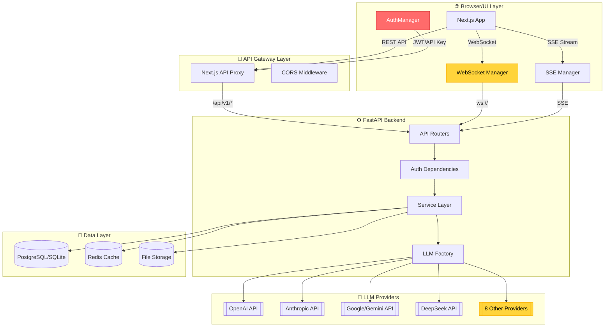
```mermaid
flowchart TB
    subgraph Browser["🌐 Browser/UI Layer"]
        UI[Next.js App]
        WS[WebSocket Manager]
        SSE[SSE Manager]
        Auth[AuthManager]
    end

    subgraph Gateway["🔌 API Gateway Layer"]
        Proxy[Next.js API Proxy]
        CORS[CORS Middleware]
    end

    subgraph Backend["⚙️ FastAPI Backend"]
        Router[API Routers]
        AuthDep[Auth Dependencies]
        Services[Service Layer]
        LLMFactory[LLM Factory]
    end

    subgraph Providers["🤖 LLM Providers"]
        OpenAI[[OpenAI API]]
        Anthropic[[Anthropic API]]
        Google[[Google/Gemini API]]
        DeepSeek[[DeepSeek API]]
        Others[[8 Other Providers]]
    end

    subgraph Storage["💾 Data Layer"]
        DB[(PostgreSQL/SQLite)]
        Redis[(Redis Cache)]
        FileStore[(File Storage)]
    end

    UI -->|REST API| Proxy
    UI -->|WebSocket| WS
    UI -->|SSE Stream| SSE
    Auth -->|JWT/API Key| Proxy
    
    Proxy -->|/api/v1/*| Router
    WS -->|ws://| Router
    SSE -->|SSE| Router
    
    Router --> AuthDep
    AuthDep --> Services
    Services --> LLMFactory
    
    LLMFactory --> OpenAI
    LLMFactory --> Anthropic
    LLMFactory --> Google
    LLMFactory --> DeepSeek
    LLMFactory --> Others
    
    Services --> DB
    Services --> Redis
    Services --> FileStore

    classDef critical fill:#ff6b6b,stroke:#c92a2a,color:#fff
    classDef warning fill:#ffd43b,stroke:#fab005,color:#000
    classDef ok fill:#69db7c,stroke:#37b24d,color:#000
    
    class Auth critical
    class WS warning
    class Others warning
```

### ASCII Fallback - System Overview

```
┌─────────────────────────────────────────────────────────────────────────────────┐
│                              BROWSER / UI LAYER                                  │
│  ┌──────────────┐  ┌─────────────┐  ┌────────────┐  ┌─────────────────────────┐ │
│  │  Next.js App │  │ WebSocket   │  │ SSE        │  │ AuthManager             │ │
│  │              │  │ Manager     │  │ Manager    │  │ ❌ No backend endpoints │ │
│  └──────┬───────┘  └──────┬──────┘  └─────┬──────┘  └───────────┬─────────────┘ │
└─────────┼──────────────────┼──────────────┼─────────────────────┼───────────────┘
          │                  │              │                     │
          ▼                  ▼              ▼                     ▼
┌─────────────────────────────────────────────────────────────────────────────────┐
│                              API GATEWAY LAYER                                   │
│  ┌───────────────────────────────────────────────────────────────────────────┐  │
│  │                     Next.js API Proxy + CORS                              │  │
│  │                     Base: /api/v1/*                                       │  │
│  └───────────────────────────────────────────────────────────────────────────┘  │
└─────────────────────────────────┬───────────────────────────────────────────────┘
                                  │
                                  ▼
┌─────────────────────────────────────────────────────────────────────────────────┐
│                              FASTAPI BACKEND                                     │
│  ┌────────────┐   ┌─────────────────┐   ┌─────────────┐   ┌─────────────────┐   │
│  │ API Router │──▶│ Auth Dependency │──▶│ Services    │──▶│ LLM Factory     │   │
│  │ 95+ endpts │   │ JWT + API Key   │   │ Layer       │   │ 12 providers    │   │
│  └────────────┘   └─────────────────┘   └─────────────┘   └────────┬────────┘   │
└─────────────────────────────────────────────────────────────────────┼───────────┘
                                                                      │
                                                                      ▼
┌─────────────────────────────────────────────────────────────────────────────────┐
│                              LLM PROVIDERS                                       │
│  ┌──────────┐ ┌───────────┐ ┌────────────┐ ┌──────────┐ ┌─────────────────────┐ │
│  │ OpenAI   │ │ Anthropic │ │ Google     │ │ DeepSeek │ │ 8 Others            │ │
│  │ ✅       │ │ ✅        │ │ ✅         │ │ ✅       │ │ ⚠️ FE missing types │ │
│  └──────────┘ └───────────┘ └────────────┘ └──────────┘ └─────────────────────┘ │
└─────────────────────────────────────────────────────────────────────────────────┘
                                  │
                                  ▼
┌─────────────────────────────────────────────────────────────────────────────────┐
│                              DATA LAYER                                          │
│  ┌─────────────────────┐  ┌─────────────────────┐  ┌──────────────────────────┐ │
│  │ PostgreSQL/SQLite   │  │ Redis Cache         │  │ File Storage             │ │
│  │ Sessions, History   │  │ L1/L2 Cache, Tokens │  │ PPO Weights, Libraries   │ │
│  └─────────────────────┘  └─────────────────────┘  └──────────────────────────┘ │
└─────────────────────────────────────────────────────────────────────────────────┘
```

---

## 2. Authentication Data Flow

### Expected Flow (What Frontend Implements)

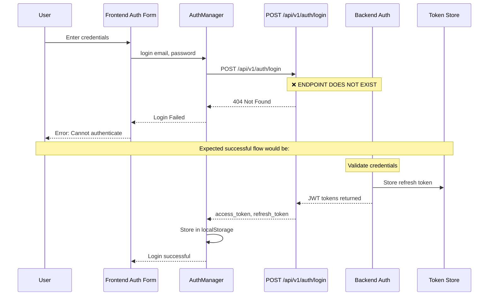
```mermaid
sequenceDiagram
    participant U as User
    participant F as Frontend Auth Form
    participant AM as AuthManager
    participant API as POST /api/v1/auth/login
    participant BE as Backend Auth
    participant Redis as Token Store

    U->>F: Enter credentials
    F->>AM: login email, password
    AM->>API: POST /api/v1/auth/login
    Note over API,BE: ❌ ENDPOINT DOES NOT EXIST
    API-->>AM: 404 Not Found
    AM-->>F: Login Failed
    F-->>U: Error: Cannot authenticate

    Note over U,Redis: Expected successful flow would be:
    Note over BE: Validate credentials
    BE->>Redis: Store refresh token
    BE-->>API: JWT tokens returned
    API-->>AM: access_token, refresh_token
    AM->>AM: Store in localStorage
    AM-->>F: Login successful
```

### Actual Flow (Backend Reality)

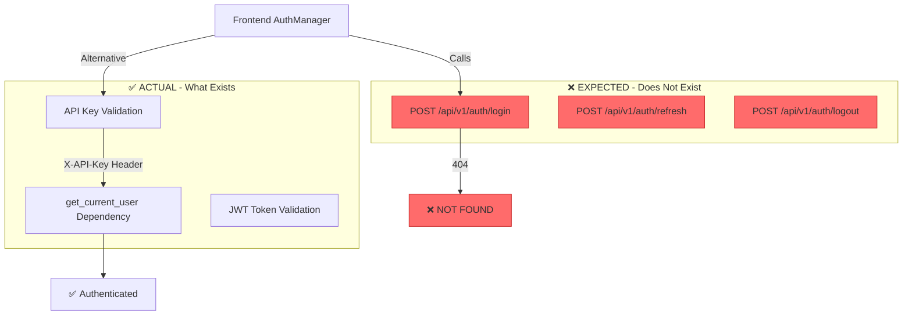
```mermaid
flowchart TB
    subgraph Expected["❌ EXPECTED - Does Not Exist"]
        Login[POST /api/v1/auth/login]
        Refresh[POST /api/v1/auth/refresh]
        Logout[POST /api/v1/auth/logout]
    end

    subgraph Actual["✅ ACTUAL - What Exists"]
        Dep[get_current_user Dependency]
        Validate[JWT Token Validation]
        APIKey[API Key Validation]
    end

    FE[Frontend AuthManager] -->|Calls| Login
    Login -->|404| Error[❌ NOT FOUND]
    
    FE -->|Alternative| APIKey
    APIKey -->|X-API-Key Header| Dep
    Dep --> Success[✅ Authenticated]
    
    style Login fill:#ff6b6b,stroke:#c92a2a
    style Refresh fill:#ff6b6b,stroke:#c92a2a
    style Logout fill:#ff6b6b,stroke:#c92a2a
    style Error fill:#ff6b6b,stroke:#c92a2a
```

### ASCII Fallback - Authentication Flow

```
EXPECTED FLOW (Frontend Implementation):
─────────────────────────────────────────

User         Frontend        AuthManager       API Gateway      Backend
 │               │               │                  │              │
 │──credentials─▶│               │                  │              │
 │               │──login()─────▶│                  │              │
 │               │               │──POST /auth/login──▶│           │
 │               │               │                  │              │
 │               │               │    ❌ 404 NOT FOUND              │
 │               │               │◀─────────────────│              │
 │               │◀──Error───────│                  │              │
 │◀──Login Failed│               │                  │              │


ACTUAL FLOW (Backend Reality):
──────────────────────────────

┌─────────────────────────────────────────────────────────────────────┐
│                    AUTHENTICATION ENDPOINTS                          │
├─────────────────────────────────────────────────────────────────────┤
│ POST /api/v1/auth/login     │ ❌ DOES NOT EXIST                     │
│ POST /api/v1/auth/refresh   │ ❌ DOES NOT EXIST                     │
│ POST /api/v1/auth/logout    │ ❌ DOES NOT EXIST                     │
├─────────────────────────────────────────────────────────────────────┤
│ get_current_user()          │ ✅ Dependency - validates JWT/API Key │
│ X-API-Key header            │ ✅ Works for API authentication       │
│ Bearer token validation     │ ✅ Works IF token already exists      │
└─────────────────────────────────────────────────────────────────────┘

BREAKPOINT SUMMARY:
❌ [GAP-001] No way for frontend to obtain JWT tokens
❌ [GAP-001] No way for frontend to refresh expired tokens
❌ [GAP-001] No way for frontend to logout/invalidate tokens
```

---

## 3. Provider Configuration Flow

### Provider Sync Data Flow

```mermaid
flowchart TB
    subgraph Frontend["Frontend Provider Management"]
        PS[ProvidersStore - Zustand]
        TQ[TanStack Query Cache]
        Hook[useProviderConfig Hook]
        UI[Provider Settings UI]
    end

    subgraph APIClient["API Client Layer"]
        REST[REST Client]
        WSMgr[WebSocket Manager]
    end

    subgraph Backend["Backend Provider Service"]
        ProvRouter[/api/v1/providers/*]
        ProvService[Provider Service]
        LLMFactory[LLM Factory]
        Models[Model Registry]
    end

    subgraph Providers["Provider Enum"]
        FE_Enum["Frontend: 4 Types
        - openai
        - anthropic  
        - gemini
        - deepseek"]
        
        BE_Enum["Backend: 12 Types
        - openai ✅
        - anthropic ✅
        - google ⚠️
        - gemini ✅
        - qwen ❌
        - gemini-cli ❌
        - antigravity ❌
        - kiro ❌
        - cursor ❌
        - xai ❌
        - deepseek ✅
        - mock ❌"]
    end

    UI --> Hook
    Hook --> TQ
    Hook --> PS
    TQ --> REST
    PS --> WSMgr
    
    REST -->|GET /providers| ProvRouter
    REST -->|POST /providers/select| ProvRouter
    WSMgr -->|ws://*/providers/ws| ProvRouter
    
    ProvRouter --> ProvService
    ProvService --> LLMFactory
    ProvService --> Models
    
    FE_Enum -.->|⚠️ MISMATCH| BE_Enum
    
    style FE_Enum fill:#ffd43b,stroke:#fab005
    style BE_Enum fill:#69db7c,stroke:#37b24d
```

### Provider Type Mismatch Detail

```
┌───────────────────────────────────────────────────────────────────────────────┐
│                    PROVIDER ENUM MISMATCH (GAP-002)                            │
├────────────────────────┬──────────────────────────┬───────────────────────────┤
│ Frontend Type          │ Backend Type             │ Status                    │
├────────────────────────┼──────────────────────────┼───────────────────────────┤
│ openai                 │ OPENAI = "openai"        │ ✅ Compatible             │
│ anthropic              │ ANTHROPIC = "anthropic"  │ ✅ Compatible             │
│ gemini                 │ GEMINI = "gemini"        │ ✅ Compatible             │
│ deepseek               │ DEEPSEEK = "deepseek"    │ ✅ Compatible             │
│ ─────────────────────  │ GOOGLE = "google"        │ ⚠️ Different name         │
│ ❌ NOT DEFINED         │ QWEN = "qwen"            │ ❌ Missing in FE          │
│ ❌ NOT DEFINED         │ GEMINI_CLI = "gemini-cli"│ ❌ Missing in FE          │
│ ❌ NOT DEFINED         │ ANTIGRAVITY = "antigrav" │ ❌ Missing in FE          │
│ ❌ NOT DEFINED         │ KIRO = "kiro"            │ ❌ Missing in FE          │
│ ❌ NOT DEFINED         │ CURSOR = "cursor"        │ ❌ Missing in FE          │
│ ❌ NOT DEFINED         │ XAI = "xai"              │ ❌ Missing in FE          │
│ ❌ NOT DEFINED         │ MOCK = "mock"            │ ❌ Missing in FE          │
├────────────────────────┴──────────────────────────┴───────────────────────────┤
│ IMPACT: 8 providers cannot be selected from the UI                            │
│ LOCATION: frontend/src/lib/api/types.ts line 43                               │
└───────────────────────────────────────────────────────────────────────────────┘
```

### WebSocket Provider Sync

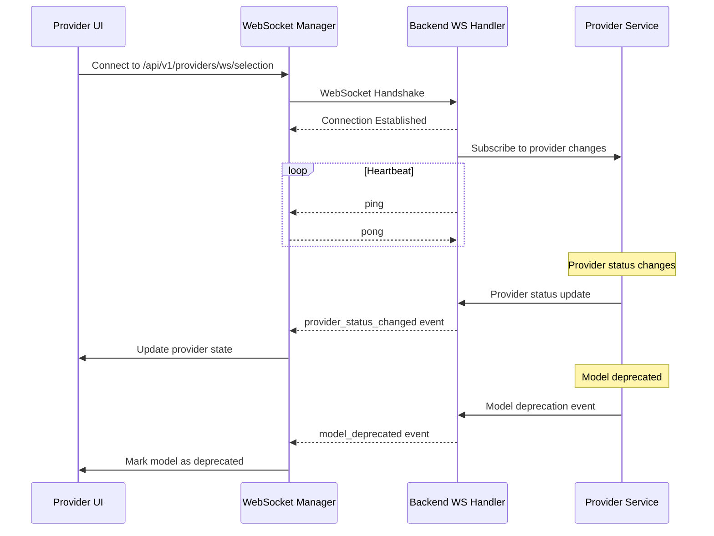
```mermaid
sequenceDiagram
    participant UI as Provider UI
    participant WS as WebSocket Manager
    participant BE as Backend WS Handler
    participant Svc as Provider Service

    UI->>WS: Connect to /api/v1/providers/ws/selection
    WS->>BE: WebSocket Handshake
    BE-->>WS: Connection Established
    BE->>Svc: Subscribe to provider changes
    
    loop Heartbeat
        BE-->>WS: ping
        WS-->>BE: pong
    end

    Note over Svc: Provider status changes
    Svc->>BE: Provider status update
    BE-->>WS: provider_status_changed event
    WS->>UI: Update provider state
    
    Note over Svc: Model deprecated
    Svc->>BE: Model deprecation event
    BE-->>WS: model_deprecated event
    WS->>UI: Mark model as deprecated
```

---

## 4. Prompt Generation Flow

### End-to-End Generation

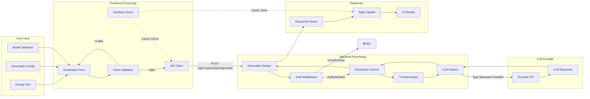
```mermaid
flowchart LR
    subgraph Input["User Input"]
        Text[Prompt Text]
        Config[Generation Config]
        Model[Model Selection]
    end

    subgraph Frontend["Frontend Processing"]
        Form[Generation Form]
        Validate[Client Validation]
        Client[API Client]
        Cache[TanStack Query]
    end

    subgraph Backend["Backend Processing"]
        Router[Generation Router]
        AuthMiddleware[Auth Middleware]
        GenService[Generation Service]
        Transform[Transformation]
        Factory[LLM Factory]
    end

    subgraph Provider["LLM Provider"]
        API[Provider API]
        Response[LLM Response]
    end

    subgraph Output["Response"]
        Parse[Response Parser]
        State[State Update]
        UI[UI Render]
    end

    Text --> Form
    Config --> Form
    Model --> Form
    
    Form --> Validate
    Validate -->|Valid| Client
    Validate -->|Invalid| Form
    
    Client -->|POST /api/v1/generation/generate| Router
    Cache -.->|Cache Check| Client
    
    Router --> AuthMiddleware
    AuthMiddleware -->|Authenticated| GenService
    AuthMiddleware -->|Unauthorized| Error1[❌ 401]
    
    GenService --> Transform
    Transform --> Factory
    Factory -->|Type Mismatch Possible| API
    
    API --> Response
    Response --> Factory
    Factory --> GenService
    GenService --> Router
    
    Router --> Parse
    Parse --> State
    State --> UI
    Cache -.->|Cache Store| State
```

### Type Mismatches in Generation

```
┌───────────────────────────────────────────────────────────────────────────────┐
│              GENERATION REQUEST TYPE ALIGNMENT                                 │
├─────────────────────┬───────────────────────┬──────────────────────────────────┤
│ Frontend Field      │ Backend Field         │ Status                           │
├─────────────────────┼───────────────────────┼──────────────────────────────────┤
│ prompt: string      │ prompt: str           │ ✅ Compatible                    │
│ system_instruction? │ system_instruction?   │ ✅ Compatible                    │
│ config.temperature  │ config.temperature    │ ✅ Compatible (0.0-1.0)          │
│ config.top_p        │ config.top_p          │ ✅ Compatible (0.0-1.0)          │
│ config.top_k        │ config.top_k          │ ✅ Compatible (>= 1)             │
│ config.max_tokens   │ config.max_output_tok │ ⚠️ Name difference              │
│ model?: string      │ model?: str           │ ✅ Compatible                    │
│ provider?: 4 types  │ provider?: 12 types   │ ❌ MISMATCH (GAP-002)            │
│ ────────────────────│ api_key?: str         │ ⚠️ Not in FE interface          │
│ ────────────────────│ skip_validation: bool │ ⚠️ Not in FE interface          │
│ ────────────────────│ thinking_level?: str  │ ⚠️ Gemini 3 specific            │
└─────────────────────┴───────────────────────┴──────────────────────────────────┘
```

---

## 5. SSE Streaming Data Flow

### Streaming Generation Flow

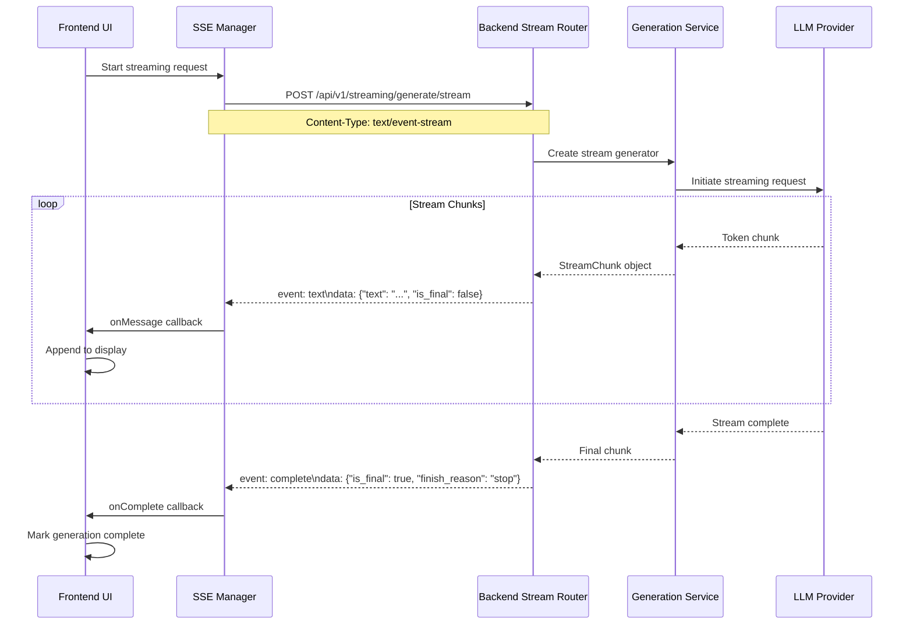
```mermaid
sequenceDiagram
    participant UI as Frontend UI
    participant SSE as SSE Manager
    participant BE as Backend Stream Router
    participant Gen as Generation Service
    participant LLM as LLM Provider

    UI->>SSE: Start streaming request
    SSE->>BE: POST /api/v1/streaming/generate/stream
    Note over SSE,BE: Content-Type: text/event-stream
    
    BE->>Gen: Create stream generator
    Gen->>LLM: Initiate streaming request
    
    loop Stream Chunks
        LLM-->>Gen: Token chunk
        Gen-->>BE: StreamChunk object
        BE-->>SSE: event: text\ndata: {"text": "...", "is_final": false}
        SSE->>UI: onMessage callback
        UI->>UI: Append to display
    end
    
    LLM-->>Gen: Stream complete
    Gen-->>BE: Final chunk
    BE-->>SSE: event: complete\ndata: {"is_final": true, "finish_reason": "stop"}
    SSE->>UI: onComplete callback
    UI->>UI: Mark generation complete
```

### SSE Message Format

```
┌───────────────────────────────────────────────────────────────────────────────┐
│                    SSE MESSAGE FORMAT                                          │
├───────────────────────────────────────────────────────────────────────────────┤
│ Backend StreamChunk Model:                                                     │
│ ┌─────────────────────────────────────────────────────────────────────────┐   │
│ │ class StreamChunk(BaseModel):                                           │   │
│ │     text: str                    # Current chunk text                   │   │
│ │     is_final: bool = False       # Last chunk indicator                 │   │
│ │     finish_reason: str | None    # stop, length, content_filter         │   │
│ │     token_count: int | None      # Tokens in this chunk                 │   │
│ └─────────────────────────────────────────────────────────────────────────┘   │
├───────────────────────────────────────────────────────────────────────────────┤
│ SSE Wire Format:                                                               │
│ ┌─────────────────────────────────────────────────────────────────────────┐   │
│ │ event: text                                                             │   │
│ │ data: {"text": "Hello", "is_final": false, "token_count": 1}           │   │
│ │                                                                         │   │
│ │ event: text                                                             │   │
│ │ data: {"text": " world", "is_final": false, "token_count": 1}          │   │
│ │                                                                         │   │
│ │ event: complete                                                         │   │
│ │ data: {"text": "", "is_final": true, "finish_reason": "stop"}          │   │
│ └─────────────────────────────────────────────────────────────────────────┘   │
├───────────────────────────────────────────────────────────────────────────────┤
│ Frontend Parsing:                                                              │
│ ┌─────────────────────────────────────────────────────────────────────────┐   │
│ │ eventSource.addEventListener('text', (e) => {                           │   │
│ │   const chunk = JSON.parse(e.data);                                     │   │
│ │   appendText(chunk.text);                                               │   │
│ │ });                                                                     │   │
│ │                                                                         │   │
│ │ eventSource.addEventListener('complete', (e) => {                       │   │
│ │   const final = JSON.parse(e.data);                                     │   │
│ │   setComplete(true);                                                    │   │
│ │ });                                                                     │   │
│ └─────────────────────────────────────────────────────────────────────────┘   │
├───────────────────────────────────────────────────────────────────────────────┤
│ STATUS: ✅ Compatible - Format matches between backend and frontend           │
└───────────────────────────────────────────────────────────────────────────────┘
```

### SSE Endpoint Coverage

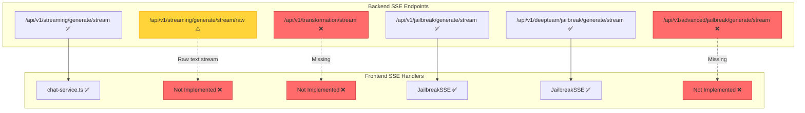
```mermaid
flowchart TB
    subgraph Backend["Backend SSE Endpoints"]
        E1["/api/v1/streaming/generate/stream ✅"]
        E2["/api/v1/streaming/generate/stream/raw ⚠️"]
        E3["/api/v1/transformation/stream ❌"]
        E4["/api/v1/jailbreak/generate/stream ✅"]
        E5["/api/v1/deepteam/jailbreak/generate/stream ✅"]
        E6["/api/v1/advanced/jailbreak/generate/stream ❌"]
    end

    subgraph Frontend["Frontend SSE Handlers"]
        H1["chat-service.ts ✅"]
        H2["Not Implemented ❌"]
        H3["Not Implemented ❌"]
        H4["JailbreakSSE ✅"]
        H5["JailbreakSSE ✅"]
        H6["Not Implemented ❌"]
    end

    E1 --> H1
    E2 -.->|Raw text stream| H2
    E3 -.->|Missing| H3
    E4 --> H4
    E5 --> H5
    E6 -.->|Missing| H6

    style E2 fill:#ffd43b,stroke:#fab005
    style E3 fill:#ff6b6b,stroke:#c92a2a
    style E6 fill:#ff6b6b,stroke:#c92a2a
    style H2 fill:#ff6b6b,stroke:#c92a2a
    style H3 fill:#ff6b6b,stroke:#c92a2a
    style H6 fill:#ff6b6b,stroke:#c92a2a
```

---

## 6. WebSocket Data Flow

### WebSocket Connection Lifecycle

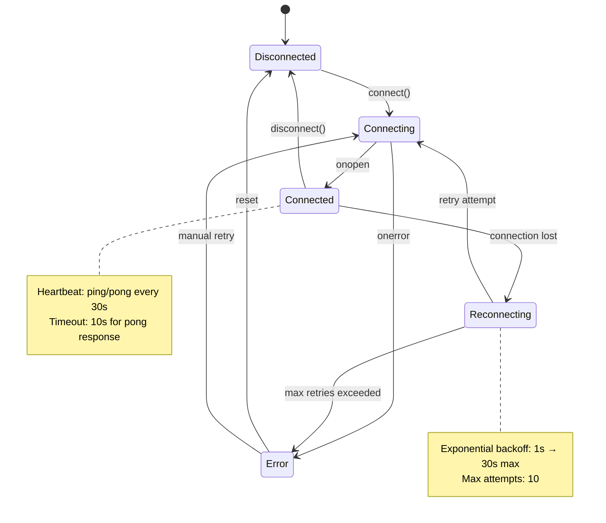
```mermaid
stateDiagram-v2
    [*] --> Disconnected
    
    Disconnected --> Connecting: connect()
    Connecting --> Connected: onopen
    Connecting --> Error: onerror
    
    Connected --> Reconnecting: connection lost
    Connected --> Disconnected: disconnect()
    
    Reconnecting --> Connecting: retry attempt
    Reconnecting --> Error: max retries exceeded
    
    Error --> Disconnected: reset
    Error --> Connecting: manual retry
    
    note right of Connected
        Heartbeat: ping/pong every 30s
        Timeout: 10s for pong response
    end note
    
    note right of Reconnecting
        Exponential backoff: 1s → 30s max
        Max attempts: 10
    end note
```

### WebSocket Message Flow

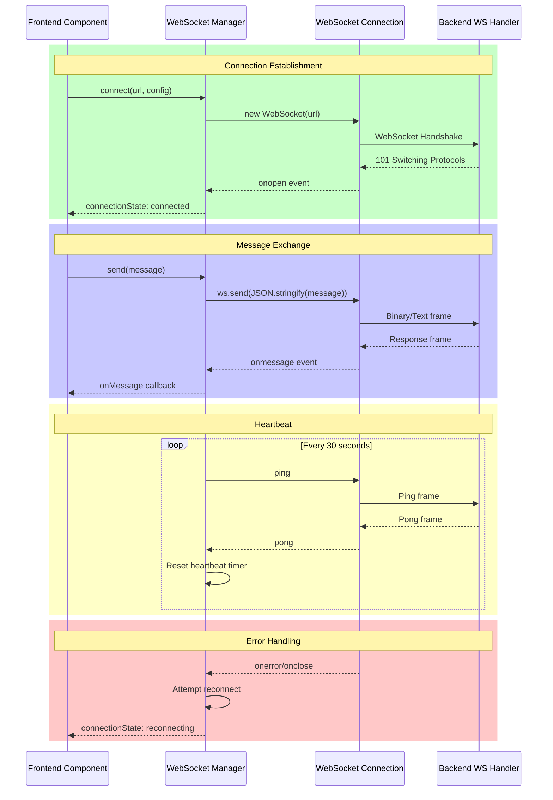
```mermaid
sequenceDiagram
    participant UI as Frontend Component
    participant WM as WebSocket Manager
    participant WS as WebSocket Connection
    participant BE as Backend WS Handler

    rect rgb(200, 255, 200)
        Note over UI,BE: Connection Establishment
        UI->>WM: connect(url, config)
        WM->>WS: new WebSocket(url)
        WS->>BE: WebSocket Handshake
        BE-->>WS: 101 Switching Protocols
        WS-->>WM: onopen event
        WM-->>UI: connectionState: connected
    end

    rect rgb(200, 200, 255)
        Note over UI,BE: Message Exchange
        UI->>WM: send(message)
        WM->>WS: ws.send(JSON.stringify(message))
        WS->>BE: Binary/Text frame
        BE-->>WS: Response frame
        WS-->>WM: onmessage event
        WM-->>UI: onMessage callback
    end

    rect rgb(255, 255, 200)
        Note over UI,BE: Heartbeat
        loop Every 30 seconds
            WM->>WS: ping
            WS->>BE: Ping frame
            BE-->>WS: Pong frame
            WS-->>WM: pong
            WM->>WM: Reset heartbeat timer
        end
    end

    rect rgb(255, 200, 200)
        Note over UI,BE: Error Handling
        WS-->>WM: onerror/onclose
        WM->>WM: Attempt reconnect
        WM-->>UI: connectionState: reconnecting
    end
```

### WebSocket URL Breakpoint (GAP-003)

```
┌───────────────────────────────────────────────────────────────────────────────┐
│                    ❌ CRITICAL: HARDCODED WEBSOCKET URL                        │
├───────────────────────────────────────────────────────────────────────────────┤
│ FILE: frontend/src/api/jailbreak.ts                                            │
│ LINE: 18-19                                                                    │
├───────────────────────────────────────────────────────────────────────────────┤
│ CURRENT CODE:                                                                  │
│ ┌─────────────────────────────────────────────────────────────────────────┐   │
│ │ const API_BASE_URL = process.env.NEXT_PUBLIC_API_URL                    │   │
│ │                      || 'http://localhost:8001';                        │   │
│ │ const WS_BASE_URL = 'ws://localhost:8001'; // HARDCODED FORCE FIX       │   │
│ └─────────────────────────────────────────────────────────────────────────┘   │
├───────────────────────────────────────────────────────────────────────────────┤
│ IMPACT:                                                                        │
│ • WebSocket connections fail in production                                     │
│ • WebSocket connections fail in staging                                        │
│ • WebSocket connections fail on any non-localhost deployment                   │
├───────────────────────────────────────────────────────────────────────────────┤
│ RECOMMENDED FIX:                                                               │
│ ┌─────────────────────────────────────────────────────────────────────────┐   │
│ │ const WS_BASE_URL = process.env.NEXT_PUBLIC_WS_URL ||                   │   │
│ │   API_BASE_URL.replace(/^http/, 'ws');                                  │   │
│ └─────────────────────────────────────────────────────────────────────────┘   │
└───────────────────────────────────────────────────────────────────────────────┘
```

### WebSocket Endpoint Matrix

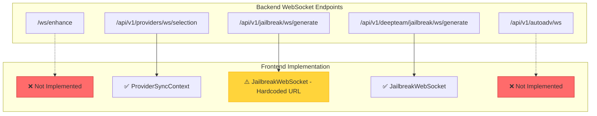
```mermaid
flowchart TB
    subgraph Backend["Backend WebSocket Endpoints"]
        WS1["/ws/enhance"]
        WS2["/api/v1/providers/ws/selection"]
        WS3["/api/v1/jailbreak/ws/generate"]
        WS4["/api/v1/deepteam/jailbreak/ws/generate"]
        WS5["/api/v1/autoadv/ws"]
    end

    subgraph Frontend["Frontend Implementation"]
        FE1["❌ Not Implemented"]
        FE2["✅ ProviderSyncContext"]
        FE3["⚠️ JailbreakWebSocket - Hardcoded URL"]
        FE4["✅ JailbreakWebSocket"]
        FE5["❌ Not Implemented"]
    end

    WS1 -.-> FE1
    WS2 --> FE2
    WS3 --> FE3
    WS4 --> FE4
    WS5 -.-> FE5

    style FE1 fill:#ff6b6b,stroke:#c92a2a
    style FE3 fill:#ffd43b,stroke:#fab005
    style FE5 fill:#ff6b6b,stroke:#c92a2a
```

---

## 7. State Management Flow

### TanStack Query + Zustand Integration

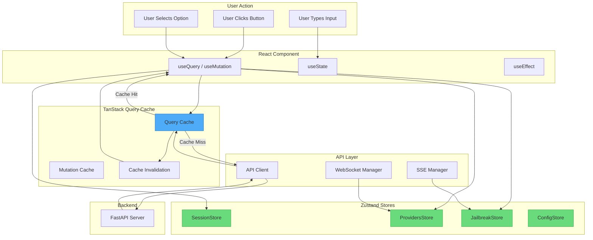
```mermaid
flowchart TB
    subgraph UserAction["User Action"]
        Click[User Clicks Button]
        Input[User Types Input]
        Select[User Selects Option]
    end

    subgraph ReactComponent["React Component"]
        Hook[useQuery / useMutation]
        LocalState[useState]
        Effect[useEffect]
    end

    subgraph TanStack["TanStack Query Cache"]
        QueryCache[Query Cache]
        MutationCache[Mutation Cache]
        Invalidation[Cache Invalidation]
    end

    subgraph Zustand["Zustand Stores"]
        SessionStore[SessionStore]
        ProvidersStore[ProvidersStore]
        JailbreakStore[JailbreakStore]
        ConfigStore[ConfigStore]
    end

    subgraph APILayer["API Layer"]
        APIClient[API Client]
        WSManager[WebSocket Manager]
        SSEManager[SSE Manager]
    end

    subgraph Backend["Backend"]
        Server[FastAPI Server]
    end

    Click --> Hook
    Input --> LocalState
    Select --> Hook

    Hook --> QueryCache
    QueryCache -->|Cache Miss| APIClient
    QueryCache -->|Cache Hit| Hook

    APIClient --> Server
    Server --> APIClient
    APIClient --> QueryCache
    QueryCache --> Invalidation
    Invalidation --> Hook

    Hook --> SessionStore
    Hook --> ProvidersStore
    Hook --> JailbreakStore
    
    WSManager --> ProvidersStore
    SSEManager --> JailbreakStore

    style QueryCache fill:#4dabf7,stroke:#1971c2
    style SessionStore fill:#69db7c,stroke:#37b24d
    style ProvidersStore fill:#69db7c,stroke:#37b24d
    style JailbreakStore fill:#69db7c,stroke:#37b24d
    style ConfigStore fill:#69db7c,stroke:#37b24d
```

### Cache Configuration

```
┌───────────────────────────────────────────────────────────────────────────────┐
│                    TANSTACK QUERY CONFIGURATION                                │
├───────────────────────────────────────────────────────────────────────────────┤
│ staleTime:      5 * 60 * 1000    (5 minutes)                                  │
│ gcTime:         30 * 60 * 1000   (30 minutes - formerly cacheTime)            │
│ retry:          3                                                              │
│ refetchOnFocus: false                                                          │
├───────────────────────────────────────────────────────────────────────────────┤
│                    ZUSTAND STORES                                              │
├─────────────────┬─────────────────────────────────────────────────────────────┤
│ SessionStore    │ sessionId, model, provider, preferences                     │
│ ProvidersStore  │ providers[], activeProvider, models[], syncStatus           │
│ JailbreakStore  │ sessions[], activeSession, results[], generating            │
│ ConfigStore     │ settings, preferences, featureFlags                         │
└─────────────────┴─────────────────────────────────────────────────────────────┘
```

### Optimistic Update Flow

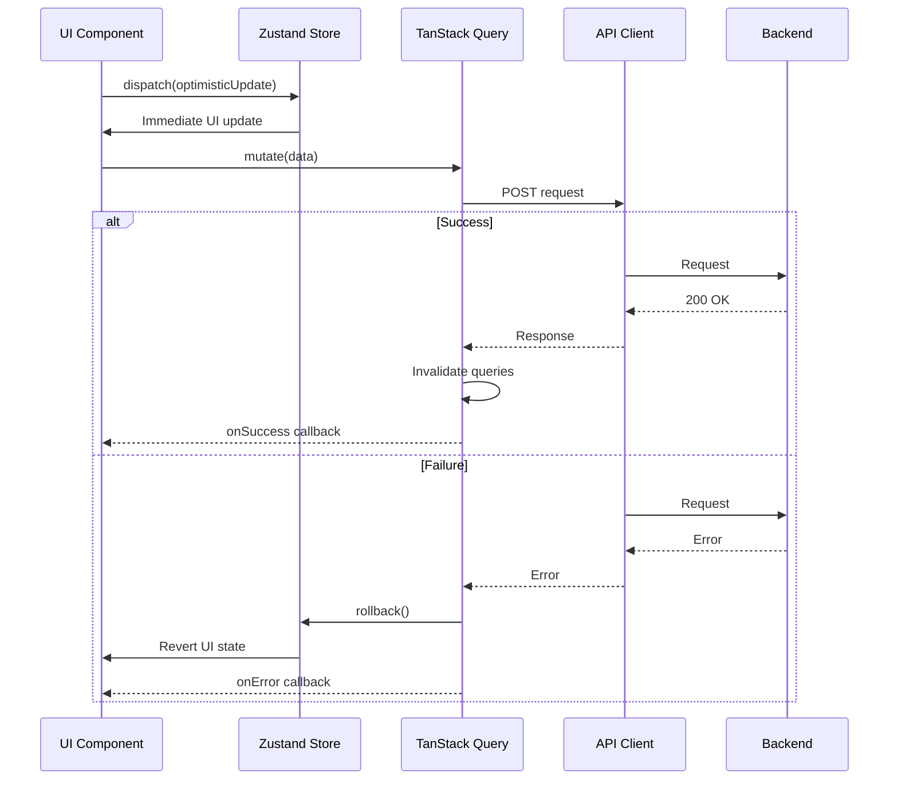
```mermaid
sequenceDiagram
    participant UI as UI Component
    participant Zustand as Zustand Store
    participant TQ as TanStack Query
    participant API as API Client
    participant BE as Backend

    UI->>Zustand: dispatch(optimisticUpdate)
    Zustand->>UI: Immediate UI update
    
    UI->>TQ: mutate(data)
    TQ->>API: POST request
    
    alt Success
        API->>BE: Request
        BE-->>API: 200 OK
        API-->>TQ: Response
        TQ->>TQ: Invalidate queries
        TQ-->>UI: onSuccess callback
    else Failure
        API->>BE: Request
        BE-->>API: Error
        API-->>TQ: Error
        TQ->>Zustand: rollback()
        Zustand->>UI: Revert UI state
        TQ-->>UI: onError callback
    end
```

---

## 8. Error Handling Flow

### Error Transformation Pipeline

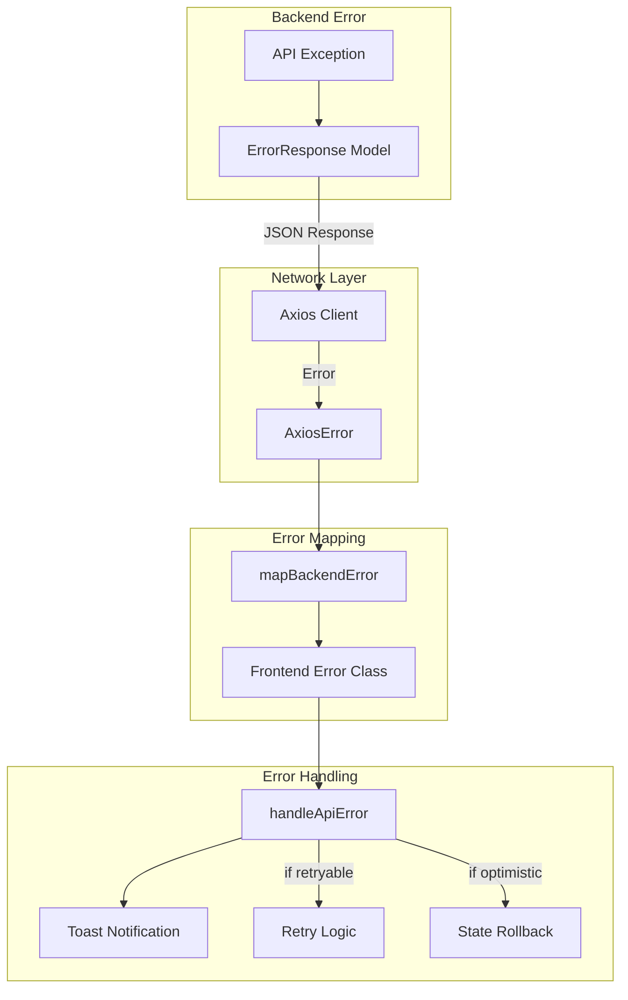
```mermaid
flowchart TB
    subgraph Backend["Backend Error"]
        BE_Error[API Exception]
        BE_Format[ErrorResponse Model]
    end

    subgraph Network["Network Layer"]
        Axios[Axios Client]
        AxiosError[AxiosError]
    end

    subgraph Mapping["Error Mapping"]
        Mapper[mapBackendError]
        ErrorClass[Frontend Error Class]
    end

    subgraph Handling["Error Handling"]
        Handler[handleApiError]
        Toast[Toast Notification]
        Retry[Retry Logic]
        Rollback[State Rollback]
    end

    BE_Error --> BE_Format
    BE_Format -->|JSON Response| Axios
    Axios -->|Error| AxiosError
    AxiosError --> Mapper
    
    Mapper --> ErrorClass
    ErrorClass --> Handler
    
    Handler --> Toast
    Handler -->|if retryable| Retry
    Handler -->|if optimistic| Rollback
```

### Error Class Hierarchy

```
┌───────────────────────────────────────────────────────────────────────────────┐
│                    FRONTEND ERROR HIERARCHY                                    │
├───────────────────────────────────────────────────────────────────────────────┤
│ APIError (abstract base)                                                       │
│ ├── Client Errors (4xx)                                                        │
│ │   ├── ValidationError (400)           ✅ Mapped                              │
│ │   ├── AuthenticationError (401)       ✅ Mapped                              │
│ │   ├── AuthorizationError (403)        ✅ Mapped                              │
│ │   ├── NotFoundError (404)             ✅ Mapped                              │
│ │   ├── ConflictError (409)             ✅ Mapped                              │
│ │   └── RateLimitError (429)            ✅ Mapped                              │
│ ├── Server Errors (5xx)                                                        │
│ │   ├── InternalError (500)             ✅ Mapped                              │
│ │   ├── ServiceUnavailableError (503)   ✅ Mapped                              │
│ │   └── GatewayTimeoutError (504)       ✅ Mapped                              │
│ ├── LLM Provider Errors                                                        │
│ │   ├── LLMProviderError (500)          ✅ Mapped                              │
│ │   ├── LLMConnectionError (500)        ✅ Mapped                              │
│ │   ├── LLMTimeoutError (408)           ✅ Mapped                              │
│ │   ├── LLMQuotaExceededError (429)     ✅ Mapped                              │
│ │   ├── LLMInvalidResponseError (500)   ✅ Mapped                              │
│ │   └── LLMContentBlockedError (500)    ✅ Mapped                              │
│ ├── Transformation Errors                                                      │
│ │   ├── TransformationError (500)       ✅ Mapped                              │
│ │   ├── InvalidPotencyError (500)       ✅ Mapped                              │
│ │   └── InvalidTechniqueError (500)     ✅ Mapped                              │
│ └── Network Errors                                                             │
│     ├── NetworkError (0)                ✅ Mapped                              │
│     └── RequestAbortedError (0)         ✅ Mapped                              │
├───────────────────────────────────────────────────────────────────────────────┤
│                    ❌ MISSING ERROR MAPPINGS (GAP-008)                         │
├───────────────────────────────────────────────────────────────────────────────┤
│ Backend Exception              │ Frontend Equivalent                           │
│ MissingFieldError              │ ❌ Falls back to ValidationError              │
│ InvalidFieldError              │ ❌ Falls back to ValidationError              │
│ PayloadTooLargeError           │ ❌ Falls back to ValidationError              │
│ ProviderNotConfiguredError     │ ❌ Falls back to LLMProviderError             │
│ ProviderNotAvailableError      │ ❌ Falls back to ServiceUnavailableError      │
│ CacheError                     │ ❌ Falls back to InternalError                │
│ ConfigurationError             │ ❌ Falls back to InternalError                │
└───────────────────────────────────────────────────────────────────────────────┘
```

### Error Toast Configuration

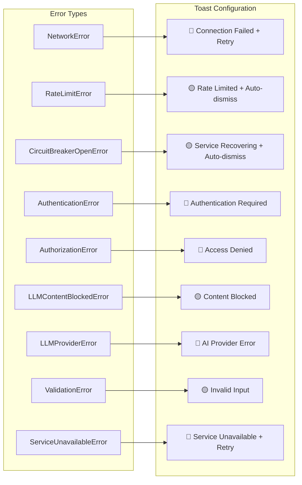
```mermaid
flowchart LR
    subgraph Errors["Error Types"]
        Network[NetworkError]
        RateLimit[RateLimitError]
        Circuit[CircuitBreakerOpenError]
        Auth[AuthenticationError]
        Authz[AuthorizationError]
        Content[LLMContentBlockedError]
        Provider[LLMProviderError]
        Validation[ValidationError]
        Service[ServiceUnavailableError]
    end

    subgraph Toasts["Toast Configuration"]
        T1["🔴 Connection Failed + Retry"]
        T2["🟡 Rate Limited + Auto-dismiss"]
        T3["🟡 Service Recovering + Auto-dismiss"]
        T4["🔴 Authentication Required"]
        T5["🔴 Access Denied"]
        T6["🟡 Content Blocked"]
        T7["🔴 AI Provider Error"]
        T8["🟡 Invalid Input"]
        T9["🔴 Service Unavailable + Retry"]
    end

    Network --> T1
    RateLimit --> T2
    Circuit --> T3
    Auth --> T4
    Authz --> T5
    Content --> T6
    Provider --> T7
    Validation --> T8
    Service --> T9
```

---

## 9. Jailbreak Generation Flow

### Complete Jailbreak Flow

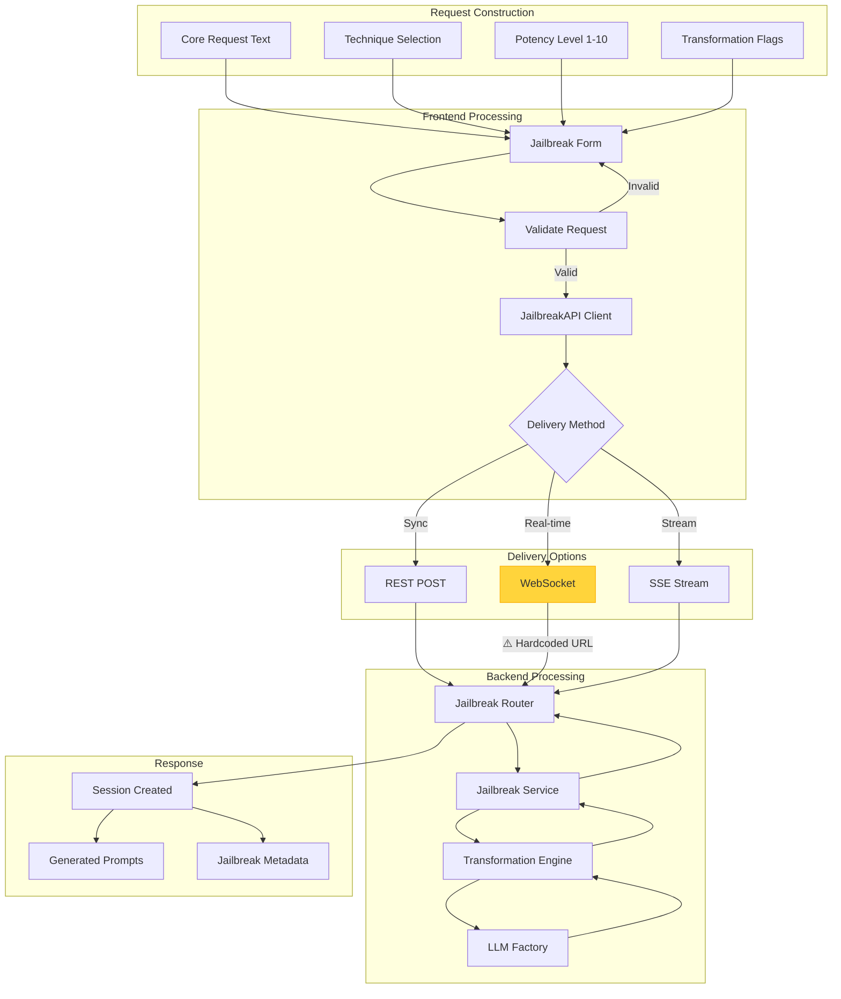
```mermaid
flowchart TB
    subgraph Input["Request Construction"]
        Prompt[Core Request Text]
        Technique[Technique Selection]
        Potency[Potency Level 1-10]
        Flags[Transformation Flags]
    end

    subgraph Frontend["Frontend Processing"]
        Form[Jailbreak Form]
        Validate[Validate Request]
        Client[JailbreakAPI Client]
        Method{Delivery Method}
    end

    subgraph Delivery["Delivery Options"]
        REST[REST POST]
        WS[WebSocket]
        SSE[SSE Stream]
    end

    subgraph Backend["Backend Processing"]
        Router[Jailbreak Router]
        Service[Jailbreak Service]
        Transform[Transformation Engine]
        LLM[LLM Factory]
    end

    subgraph Output["Response"]
        Session[Session Created]
        Prompts[Generated Prompts]
        Metadata[Jailbreak Metadata]
    end

    Prompt --> Form
    Technique --> Form
    Potency --> Form
    Flags --> Form

    Form --> Validate
    Validate -->|Invalid| Form
    Validate -->|Valid| Client
    
    Client --> Method
    Method -->|Sync| REST
    Method -->|Real-time| WS
    Method -->|Stream| SSE

    REST --> Router
    WS -->|⚠️ Hardcoded URL| Router
    SSE --> Router

    Router --> Service
    Service --> Transform
    Transform --> LLM
    LLM --> Transform
    Transform --> Service
    Service --> Router

    Router --> Session
    Session --> Prompts
    Session --> Metadata

    style WS fill:#ffd43b,stroke:#fab005
```

### Technique Enum Mismatch (GAP-010)

```
┌───────────────────────────────────────────────────────────────────────────────┐
│                    TECHNIQUE SUITE MISMATCH                                    │
├────────────────────────────┬──────────────────────────────────────────────────┤
│ Backend TechniqueSuite     │ Frontend JailbreakTechnique                      │
├────────────────────────────┼──────────────────────────────────────────────────┤
│ BASIC_INJECTION            │ ❌ Not defined - different naming               │
│ JAILBREAK_BASIC            │ ❌ Not defined                                   │
│ ROLE_PLAYING               │ role_playing ✅                                  │
│ AUTHORITY_MANIPULATION     │ ❌ Not defined                                   │
│ CONTEXT_MANIPULATION       │ ❌ Not defined                                   │
│ SEMANTIC_DECEPTION         │ ❌ Not defined                                   │
│ COGNITIVE_OVERLOAD         │ ❌ Not defined                                   │
│ MULTI_TURN_ESCALATION      │ ❌ Not defined                                   │
│ PERSONA_EMULATION          │ ❌ Not defined                                   │
│ HYPOTHETICAL_FRAMING       │ ❌ Not defined                                   │
│ INSTRUCTION_HIJACKING      │ ❌ Not defined                                   │
│ TOKEN_SMUGGLING            │ ❌ Not defined                                   │
├────────────────────────────┼──────────────────────────────────────────────────┤
│ ────────────────────────── │ prompt_injection (frontend only)                 │
│ ────────────────────────── │ dan_variants (frontend only)                     │
│ ────────────────────────── │ system_override (frontend only)                  │
├────────────────────────────┴──────────────────────────────────────────────────┤
│ IMPACT: Technique selection in UI may send invalid values to backend          │
│ RESULT: 422 Unprocessable Entity or fallback to default technique             │
└───────────────────────────────────────────────────────────────────────────────┘
```

### Jailbreak WebSocket Message Types

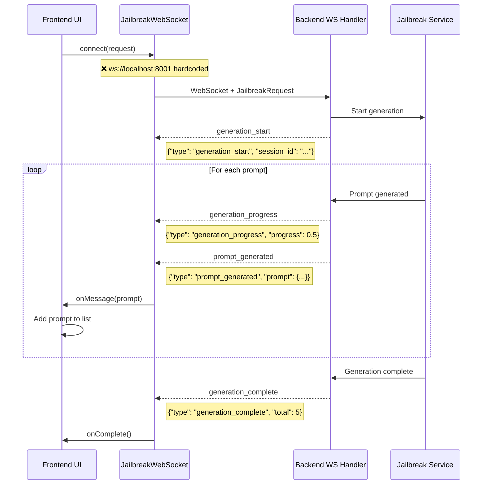
```mermaid
sequenceDiagram
    participant UI as Frontend UI
    participant WS as JailbreakWebSocket
    participant BE as Backend WS Handler
    participant Svc as Jailbreak Service

    UI->>WS: connect(request)
    Note over WS: ❌ ws://localhost:8001 hardcoded
    WS->>BE: WebSocket + JailbreakRequest
    BE->>Svc: Start generation

    BE-->>WS: generation_start
    Note right of WS: {"type": "generation_start", "session_id": "..."}

    loop For each prompt
        Svc->>BE: Prompt generated
        BE-->>WS: generation_progress
        Note right of WS: {"type": "generation_progress", "progress": 0.5}
        
        BE-->>WS: prompt_generated
        Note right of WS: {"type": "prompt_generated", "prompt": {...}}
        WS->>UI: onMessage(prompt)
        UI->>UI: Add prompt to list
    end

    Svc->>BE: Generation complete
    BE-->>WS: generation_complete
    Note right of WS: {"type": "generation_complete", "total": 5}
    WS->>UI: onComplete()
```

---

## 10. Integration Breakpoint Summary

### Visual Summary Table

```
┌─────────────────────────────────────────────────────────────────────────────────┐
│                         INTEGRATION BREAKPOINTS                                  │
├──────────────────────┬────────────────────────┬─────────────────────────────────┤
│ Breakpoint           │ Location               │ Impact                          │
├──────────────────────┼────────────────────────┼─────────────────────────────────┤
│ ❌ GAP-001           │ Authentication Flow    │ Users cannot login/logout       │
│   Auth Missing       │ /api/v1/auth/*         │ All auth flows broken           │
├──────────────────────┼────────────────────────┼─────────────────────────────────┤
│ ❌ GAP-002           │ Provider Config        │ 8 providers inaccessible        │
│   Provider Enum      │ types.ts:43            │ from frontend UI                │
├──────────────────────┼────────────────────────┼─────────────────────────────────┤
│ ❌ GAP-003           │ WebSocket Connection   │ WS fails on non-localhost       │
│   Hardcoded URL      │ jailbreak.ts:19        │ Production deployment blocked   │
├──────────────────────┼────────────────────────┼─────────────────────────────────┤
│ ⚠️ GAP-004           │ Auth Tokens            │ refresh_expires_in undefined    │
│   Extra Field        │ types.ts:283-289       │ Potential runtime errors        │
├──────────────────────┼────────────────────────┼─────────────────────────────────┤
│ ⚠️ GAP-005           │ Admin Panel            │ 14 endpoints inaccessible       │
│   No Admin UI        │ No implementation      │ Admin features unavailable      │
├──────────────────────┼────────────────────────┼─────────────────────────────────┤
│ ⚠️ GAP-006           │ Metrics Dashboard      │ 11 endpoints inaccessible       │
│   No Metrics UI      │ No implementation      │ Monitoring unavailable          │
├──────────────────────┼────────────────────────┼─────────────────────────────────┤
│ ⚠️ GAP-007           │ API Client             │ Deprecated file still used      │
│   Deprecated Client  │ api-enhanced.ts        │ Maintenance burden              │
├──────────────────────┼────────────────────────┼─────────────────────────────────┤
│ ⚠️ GAP-008           │ Error Handling         │ 7 error types downgraded        │
│   Missing Errors     │ api-errors.ts          │ Lost diagnostic info            │
├──────────────────────┼────────────────────────┼─────────────────────────────────┤
│ ⚠️ GAP-009           │ Auth Response          │ "bearer" vs "Bearer"            │
│   Token Casing       │ auth.py:129            │ TypeScript type check fails     │
├──────────────────────┼────────────────────────┼─────────────────────────────────┤
│ ⚠️ GAP-010           │ Jailbreak Config       │ Technique enum mismatch         │
│   Technique Enum     │ jailbreak.ts           │ Invalid technique values        │
├──────────────────────┼────────────────────────┼─────────────────────────────────┤
│ ⚠️ GAP-011           │ WebSocket URLs         │ Inconsistent URL patterns       │
│   WS Inconsistency   │ Multiple files         │ Some WS work, some don't        │
└──────────────────────┴────────────────────────┴─────────────────────────────────┘
```

### Breakpoint Severity Distribution

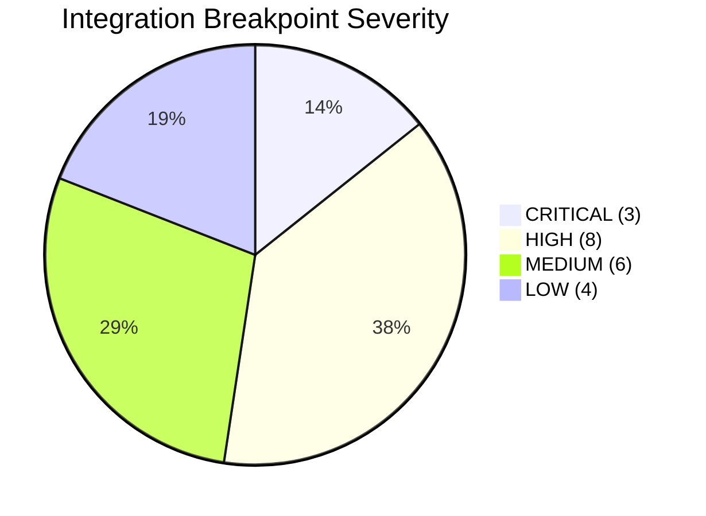
```mermaid
pie title Integration Breakpoint Severity
    "CRITICAL (3)" : 3
    "HIGH (8)" : 8
    "MEDIUM (6)" : 6
    "LOW (4)" : 4
```

### Priority Matrix

```
┌───────────────────────────────────────────────────────────────────────────────┐
│                         PRIORITY MATRIX                                        │
├─────────────┬─────────────────────────────────────────────────────────────────┤
│ P0 CRITICAL │ GAP-001: Create auth endpoints                                  │
│             │ GAP-002: Add 8 missing provider types                           │
│             │ GAP-003: Fix hardcoded WebSocket URL                            │
├─────────────┼─────────────────────────────────────────────────────────────────┤
│ P1 HIGH     │ GAP-004: Remove/add refresh_expires_in field                    │
│             │ GAP-009: Fix token_type casing (bearer/Bearer)                  │
│             │ GAP-008: Add 7 missing error classes                            │
│             │ GAP-007: Migrate from deprecated api-enhanced.ts                │
├─────────────┼─────────────────────────────────────────────────────────────────┤
│ P2 MEDIUM   │ GAP-005: Implement admin dashboard UI                           │
│             │ GAP-006: Implement metrics dashboard UI                         │
│             │ GAP-010: Align technique suite enums                            │
│             │ GAP-011: Unify WebSocket URL handling                           │
├─────────────┼─────────────────────────────────────────────────────────────────┤
│ P3 LOW      │ Missing SSE endpoint handlers                                   │
│             │ Missing WebSocket handlers (/ws/enhance, /autoadv/ws)           │
│             │ Clean up any type usage                                         │
│             │ Document CamelCase conventions                                  │
└─────────────┴─────────────────────────────────────────────────────────────────┘
```

---

## 11. Sequence Diagrams

### Login Attempt (Showing Failure)

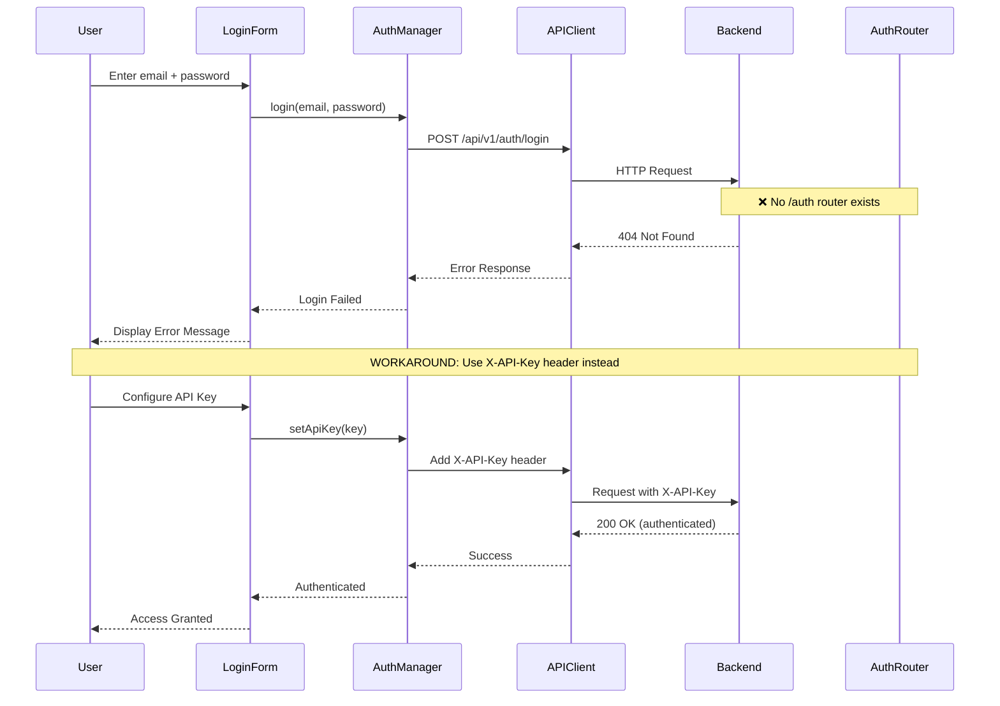
```mermaid
sequenceDiagram
    participant User
    participant LoginForm
    participant AuthManager
    participant APIClient
    participant Backend
    participant AuthRouter

    User->>LoginForm: Enter email + password
    LoginForm->>AuthManager: login(email, password)
    AuthManager->>APIClient: POST /api/v1/auth/login
    APIClient->>Backend: HTTP Request
    
    Note over Backend,AuthRouter: ❌ No /auth router exists
    
    Backend-->>APIClient: 404 Not Found
    APIClient-->>AuthManager: Error Response
    AuthManager-->>LoginForm: Login Failed
    LoginForm-->>User: Display Error Message
    
    Note over User,AuthRouter: WORKAROUND: Use X-API-Key header instead
    
    User->>LoginForm: Configure API Key
    LoginForm->>AuthManager: setApiKey(key)
    AuthManager->>APIClient: Add X-API-Key header
    APIClient->>Backend: Request with X-API-Key
    Backend-->>APIClient: 200 OK (authenticated)
    APIClient-->>AuthManager: Success
    AuthManager-->>LoginForm: Authenticated
    LoginForm-->>User: Access Granted
```

### Successful Generation Request

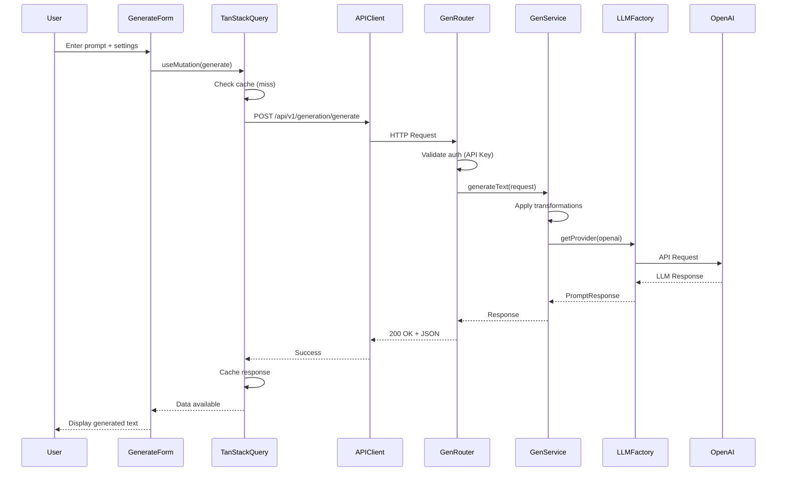
```mermaid
sequenceDiagram
    participant User
    participant GenerateForm
    participant TanStackQuery
    participant APIClient
    participant GenRouter
    participant GenService
    participant LLMFactory
    participant OpenAI

    User->>GenerateForm: Enter prompt + settings
    GenerateForm->>TanStackQuery: useMutation(generate)
    TanStackQuery->>TanStackQuery: Check cache (miss)
    TanStackQuery->>APIClient: POST /api/v1/generation/generate
    
    APIClient->>GenRouter: HTTP Request
    GenRouter->>GenRouter: Validate auth (API Key)
    GenRouter->>GenService: generateText(request)
    
    GenService->>GenService: Apply transformations
    GenService->>LLMFactory: getProvider(openai)
    LLMFactory->>OpenAI: API Request
    
    OpenAI-->>LLMFactory: LLM Response
    LLMFactory-->>GenService: PromptResponse
    GenService-->>GenRouter: Response
    GenRouter-->>APIClient: 200 OK + JSON
    
    APIClient-->>TanStackQuery: Success
    TanStackQuery->>TanStackQuery: Cache response
    TanStackQuery-->>GenerateForm: Data available
    GenerateForm-->>User: Display generated text
```

### WebSocket Connection Lifecycle

```mermaid
sequenceDiagram
    participant Component
    participant WSManager
    participant WebSocket
    participant Backend
    participant Service

    rect rgb(200, 255, 200)
        Note over Component,Service: Phase 1: Connection
        Component->>WSManager: connect(config)
        WSManager->>WebSocket: new WebSocket(url)
        Note over WebSocket: ⚠️ URL may be hardcoded
        WebSocket->>Backend: Upgrade Request
        Backend-->>WebSocket: 101 Switching Protocols
        WebSocket-->>WSManager: onopen
        WSManager-->>Component: connectionState: connected
    end

    rect rgb(200, 200, 255)
        Note over Component,Service: Phase 2: Heartbeat Loop
        loop Every 30 seconds
            WSManager->>WebSocket: ping
            WebSocket->>Backend: Ping Frame
            Backend-->>WebSocket: Pong Frame
            WebSocket-->>WSManager: pong
            WSManager->>WSManager: Reset timeout
        end
    end

    rect rgb(255, 255, 200)
        Note over Component,Service: Phase 3: Message Exchange
        Component->>WSManager: send(message)
        WSManager->>WebSocket: ws.send(JSON)
        WebSocket->>Backend: Message
        Backend->>Service: Process
        Service-->>Backend: Result
        Backend-->>WebSocket: Response
        WebSocket-->>WSManager: onmessage
        WSManager-->>Component: onMessage callback
    end

    rect rgb(255, 200, 200)
        Note over Component,Service: Phase 4: Disconnection
        alt Normal Close
            Component->>WSManager: disconnect()
            WSManager->>WebSocket: ws.close()
            WebSocket->>Backend: Close Frame
            Backend-->>WebSocket: Close Ack
            WebSocket-->>WSManager: onclose
            WSManager-->>Component: connectionState: disconnected
        else Connection Lost
            WebSocket--xWSManager: onclose/onerror
            WSManager->>WSManager: Increment retry count
            WSManager-->>Component: connectionState: reconnecting
            WSManager->>WebSocket: new WebSocket(url)
            Note over WSManager: Retry with exponential backoff
        end
    end
```

---

## 12. Coverage Statistics

### Endpoint Coverage Summary

```mermaid
xychart-beta
    title "API Endpoint Coverage by Category"
    x-axis ["Health", "Auth", "Providers", "Session", "Generation", "Streaming", "Jailbreak", "AutoDAN", "AutoDAN-Turbo", "DeepTeam", "Admin", "Metrics"]
    y-axis "Coverage %" 0 --> 100
    bar [36, 0, 100, 56, 100, 67, 47, 75, 37, 71, 0, 0]
```

### WebSocket/SSE Coverage

```
┌───────────────────────────────────────────────────────────────────────────────┐
│                    REAL-TIME ENDPOINT COVERAGE                                 │
├─────────────────────────────────────┬──────────────┬──────────────────────────┤
│ Endpoint Type                       │ Backend      │ Frontend                 │
├─────────────────────────────────────┼──────────────┼──────────────────────────┤
│ WebSocket Endpoints                 │ 5            │ 4 (80%)                  │
│ SSE Streaming Endpoints             │ 6            │ 2 (33%)                  │
├─────────────────────────────────────┼──────────────┼──────────────────────────┤
│ Total Real-time                     │ 11           │ 6 (55%)                  │
└─────────────────────────────────────┴──────────────┴──────────────────────────┘
```

### Type Alignment Score

```
┌───────────────────────────────────────────────────────────────────────────────┐
│                    TYPE SYSTEM ALIGNMENT                                       │
├─────────────────────────────────────┬─────────────────────────────────────────┤
│ Metric                              │ Score                                   │
├─────────────────────────────────────┼─────────────────────────────────────────┤
│ Provider Types                      │ 4/12 (33%) ❌                           │
│ Technique Types                     │ 1/12 (8%) ❌                            │
│ Error Classes                       │ 10/17 (59%) ⚠️                          │
│ Request Models                      │ ~85% ⚠️                                 │
│ Response Models                     │ ~80% ⚠️                                 │
├─────────────────────────────────────┼─────────────────────────────────────────┤
│ Overall Type Alignment             │ ~52.8% ⚠️                                 │
└─────────────────────────────────────┴─────────────────────────────────────────┘
```

---

## Appendix A: Quick Reference

### API Base URLs

| Environment | REST API | WebSocket | SSE |
|-------------|----------|-----------|-----|
| Development | `http://localhost:8001/api/v1` | `ws://localhost:8001` | Same as REST |
| Staging | `${NEXT_PUBLIC_API_URL}/api/v1` | Should derive from API URL | Same as REST |
| Production | `${NEXT_PUBLIC_API_URL}/api/v1` | ❌ Hardcoded localhost | Same as REST |

### Key Files Reference

| Purpose | Frontend File | Backend File |
|---------|--------------|--------------|
| API Types | `frontend/src/lib/api/types.ts` | `backend-api/app/models/*.py` |
| Error Classes | `frontend/src/lib/api/api-errors.ts` | `backend-api/app/config/errors.py` |
| API Client | `frontend/src/lib/api/api-client.ts` | N/A |
| Auth Manager | `frontend/src/lib/auth/auth-manager.ts` | `backend-api/app/config/auth.py` |
| Provider Store | `frontend/src/stores/providers-store.ts` | `backend-api/app/services/llm_factory.py` |
| WebSocket | `frontend/src/api/jailbreak.ts` | `backend-api/app/routers/*.py` |

### Environment Variables

```bash
# Frontend (.env.local)
NEXT_PUBLIC_API_URL=http://localhost:8001    # REST API base
NEXT_PUBLIC_WS_URL=ws://localhost:8001       # WebSocket base (MISSING - should add)

# Backend (.env)
API_V1_STR=/api/v1
SECRET_KEY=your-secret-key
ALGORITHM=HS256
ACCESS_TOKEN_EXPIRE_MINUTES=30
```

---

## Appendix B: Diagram Syntax Reference

### Mermaid Rendering

All diagrams in this document use Mermaid syntax and are compatible with:
- GitHub Markdown rendering
- GitLab Markdown rendering
- VS Code with Mermaid extension
- Docusaurus/VitePress documentation sites

### ASCII Diagrams

ASCII fallbacks are provided for critical diagrams to ensure readability in:
- Plain text editors
- Terminal/CLI viewing
- Email/chat contexts without Mermaid support

---

## Document History

| Version | Date | Author | Changes |
|---------|------|--------|---------|
| 1.0.0 | 2026-01-06 | System | Initial document creation |

---

*Generated from source audit documents: BACKEND_API_AUDIT.md, FRONTEND_API_AUDIT.md, GAP_ANALYSIS_REPORT.md, API_COMPATIBILITY_MATRIX.md*