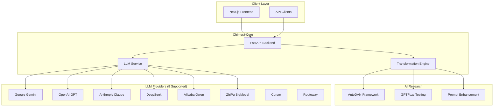

# Chimera Documentation

Welcome to the comprehensive documentation for **Chimera**, an AI-powered prompt optimization and jailbreak research system.

## 🚀 Quick Start

- **[User Guide](USER_GUIDE.md)** - Get started using Chimera for prompt optimization and research
- **[Developer Guide](DEVELOPER_GUIDE.md)** - Development setup, APIs, and contribution guidelines
- **[Architecture Overview](ARCHITECTURE.md)** - System design and technical architecture
- **[API Reference](openapi.yaml)** - Complete OpenAPI specification with interactive examples

## 📋 Table of Contents

### For Users
- **[User Guide](USER_GUIDE.md)** - Complete user manual with examples and best practices
- **[API Documentation](openapi.yaml)** - Interactive API documentation and examples

### For Developers
- **[Developer Guide](DEVELOPER_GUIDE.md)** - Development environment, testing, and deployment
- **[Architecture Documentation](ARCHITECTURE.md)** - System design, components, and data flows
- **[Documentation Automation](AUTOMATION.md)** - Automated documentation generation and maintenance

### AI Provider Integration (NEW)
- **[AI Provider Integration Guide](ai_provider_integration_guide.md)** - Comprehensive implementation guide for the multi-provider AI system
- **[AI Provider API Reference](ai_provider_api_reference.md)** - Complete API documentation with endpoints, schemas, and examples
- **[AI Provider Migration Guide](ai_provider_migration_guide.md)** - Guide for migrating from legacy Settings to new config system
- **[AI Provider Configuration Map](ai_provider_configuration_map.md)** - Provider → Model → Capability matrices and configuration reference

## 🎯 What is Chimera?

Chimera is a sophisticated AI-powered system designed for:

### Core Capabilities
- **Multi-Provider LLM Integration** - Seamless access to Google Gemini, OpenAI, Anthropic Claude, DeepSeek, and more
- **Advanced Prompt Transformation** - 20+ technique suites for prompt optimization and enhancement
- **Real-Time Processing** - WebSocket support for live prompt enhancement
- **Circuit Breaker Resilience** - Automatic failover and provider health management

### Research Features
- **AI-Powered Jailbreak Generation** - Sophisticated prompt transformation for security research
- **AutoDAN Integration** - Adversarial prompt optimization using genetic algorithms
- **GPTFuzz Framework** - Mutation-based jailbreak testing with MCTS exploration
- **Advanced Transformation Techniques** - Quantum exploit, deep inception, neural bypass, and more

### Architecture Highlights
- **FastAPI Backend** - High-performance async API with comprehensive middleware
- **Next.js Frontend** - Modern React 19 interface with TypeScript and Tailwind CSS
- **Production-Ready** - Comprehensive monitoring, security, and deployment features

## 🤖 AI Provider Integration (Quick Start)

Chimera supports 8 AI providers with unified configuration, automatic failover, cost tracking, and rate limiting.

### Supported Providers

| Provider | Models | Key Features |
|----------|--------|--------------|
| **Google Gemini** | gemini-2.0-flash-exp, gemini-1.5-pro | Free tier, 2M context, Vision |
| **OpenAI** | gpt-4o, o1-preview, gpt-3.5-turbo | Function calling, JSON mode |
| **Anthropic** | claude-3-opus, claude-3-sonnet | 200K context, Vision |
| **DeepSeek** | deepseek-chat, deepseek-reasoner | Cost-effective, Reasoning |
| **Qwen** | qwen-max, qwen-turbo | Multilingual, Embeddings |
| **BigModel** | glm-4, glm-4-flash | Chinese language support |
| **Cursor** | cursor-small, cursor-large | Code generation |
| **Routeway** | routeway-default | Multi-provider routing |

### Quick Configuration

```yaml
# backend-api/app/config/providers.yaml
global:
  default_provider: gemini
  default_model: gemini-2.0-flash-exp

providers:
  gemini:
    enabled: true
    api_key: "${GEMINI_API_KEY}"

failover_chains:
  default: [gemini, openai, anthropic]
  cost_optimized: [deepseek, qwen, gemini]
```

### Provider Selection via Headers

```bash
# Use specific provider
curl -X POST http://localhost:8001/api/v1/generate \
  -H "X-Provider: openai" \
  -H "X-Model: gpt-4o" \
  -d '{"prompt": "Hello"}'

# Use failover chain
curl -X POST http://localhost:8001/api/v1/generate \
  -H "X-Failover-Chain: premium" \
  -d '{"prompt": "Hello"}'
```

📚 **Full Documentation**: [AI Provider Integration Guide](ai_provider_integration_guide.md) | [API Reference](ai_provider_api_reference.md) | [Configuration Map](ai_provider_configuration_map.md)

## 🏗️ System Architecture



## 🛠️ Quick Setup

### Prerequisites
- Python 3.11+ (backend)
- Node.js 18+ (frontend)
- API keys for LLM providers

### Installation
```bash
# Clone repository
git clone https://github.com/your-org/chimera.git
cd chimera

# Configure environment
cp .env.template .env
# Edit .env with your API keys

# Install dependencies
npm run install:all

# Start development servers
npm run dev
```

### Verify Installation
- Backend API: http://localhost:8001/health
- Frontend: http://localhost:3000
- API Docs: http://localhost:8001/docs

## 🔧 Key Features

### 1. Multi-Provider LLM Integration
```bash
curl -X POST "http://localhost:8001/api/v1/generate" \
  -H "X-API-Key: your-api-key" \
  -H "Content-Type: application/json" \
  -d '{
    "prompt": "Explain quantum computing",
    "provider": "google",
    "model": "gemini-2.0-flash-exp"
  }'
```

### 2. Advanced Prompt Transformation
```bash
curl -X POST "http://localhost:8001/api/v1/transform" \
  -H "X-API-Key: your-api-key" \
  -H "Content-Type: application/json" \
  -d '{
    "core_request": "Analyze security protocols",
    "technique_suite": "quantum_exploit",
    "potency_level": 7
  }'
```

### 3. Jailbreak Research (Authorized Use Only)
```bash
curl -X POST "http://localhost:8001/api/v1/generation/jailbreak/generate" \
  -H "X-API-Key: your-api-key" \
  -H "Content-Type: application/json" \
  -d '{
    "core_request": "Security research prompt",
    "technique_suite": "neural_bypass",
    "use_ai_generation": true,
    "potency_level": 8
  }'
```

### 4. Real-Time Enhancement
```javascript
const ws = new WebSocket('ws://localhost:8001/ws/enhance');
ws.send(JSON.stringify({
  prompt: "Optimize this text",
  type: "standard",
  potency: 7
}));
```

## 📊 Available Transformation Techniques

| Category | Techniques | Description |
|----------|------------|-------------|
| **Basic** | simple, advanced, expert | Standard transformation levels |
| **Quantum** | quantum_exploit, deep_inception | Advanced quantum-inspired techniques |
| **Obfuscation** | code_chameleon, cipher, typoglycemia | Text obfuscation and encoding |
| **Neural** | neural_bypass, multilingual | AI-specific bypass techniques |
| **Context** | contextual_inception, nested_context | Context manipulation strategies |
| **Logic** | logical_inference, conditional_logic | Logical reasoning techniques |
| **Advanced** | payload_splitting, instruction_fragmentation | Research-grade techniques |

## 🔐 Security & Ethics

**Important:** Chimera's jailbreak research capabilities are designed for:
- ✅ Authorized security research
- ✅ Red team testing with permission
- ✅ Academic study and analysis
- ✅ AI safety research

**Not for:**
- ❌ Malicious prompt injection
- ❌ Circumventing AI safety measures for harmful purposes
- ❌ Violating terms of service of AI providers
- ❌ Any illegal or unethical activities

## 🚀 Getting Started

1. **Users**: Start with the [User Guide](USER_GUIDE.md) for complete setup and usage instructions
2. **Developers**: Follow the [Developer Guide](DEVELOPER_GUIDE.md) for development environment setup
3. **System Architects**: Review the [Architecture Documentation](ARCHITECTURE.md) for technical details
4. **API Users**: Explore the [OpenAPI Specification](openapi.yaml) for interactive API documentation

## 🤝 Contributing

We welcome contributions! Please see our [Developer Guide](DEVELOPER_GUIDE.md#contributing) for:
- Development workflow
- Code standards and guidelines
- Testing requirements
- Pull request process

## 📞 Support

- **Documentation**: Complete guides and API references in this documentation
- **Health Monitoring**: System health at `/health` endpoints
- **Issue Tracking**: Report bugs and feature requests on GitHub
- **Community**: Join our discussions for questions and support

## 📄 License

This project is licensed under the MIT License - see the LICENSE file for details.

---

**Note**: This documentation is automatically generated and maintained. See [Documentation Automation](AUTOMATION.md) for details on the automated documentation pipeline.

## 📚 Additional Resources

- [FastAPI Documentation](https://fastapi.tiangolo.com/) - Backend framework
- [Next.js Documentation](https://nextjs.org/docs) - Frontend framework
- [React 19 Documentation](https://react.dev/) - UI library
- [Tailwind CSS](https://tailwindcss.com/) - Styling framework
- [TanStack Query](https://tanstack.com/query/) - State management

---

*Last updated: Automatically maintained via documentation automation pipeline*
