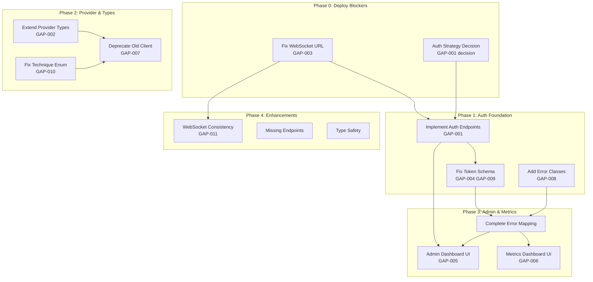

# Chimera Integration Remediation Roadmap

| Document Info | |
|---------------|---|
| **Version** | 1.0.0 |
| **Date** | 2026-01-06 |
| **Status** | DRAFT - Pending Review |
| **Total Gaps** | 21 identified issues |
| **Current API Coverage** | 52.8% |
| **Target API Coverage** | 85%+ |

---

## Table of Contents

1. [Roadmap Overview](#roadmap-overview)
2. [Phase 0: Deploy Blockers](#phase-0-deploy-blockers)
3. [Phase 1: Authentication Foundation](#phase-1-authentication-foundation)
4. [Phase 2: Provider & Type Alignment](#phase-2-provider--type-alignment)
5. [Phase 3: Error Handling & Admin UI](#phase-3-error-handling--admin-ui)
6. [Phase 4: Optional Enhancements](#phase-4-optional-enhancements)
7. [Task Dependency Graph](#task-dependency-graph)
8. [Resource Allocation](#resource-allocation)
9. [Risk Mitigation](#risk-mitigation)
10. [Success Criteria](#success-criteria)
11. [Appendix: File Change List](#appendix-file-change-list)

---

## Roadmap Overview

### Visual Timeline

```
Week 1        │ Week 2        │ Week 3        │ Week 4        │ Week 5-6
──────────────┼───────────────┼───────────────┼───────────────┼───────────────
Phase 0       │ Phase 1       │ Phase 2       │ Phase 3       │ Phase 4
Deploy        │ Auth          │ Provider &    │ Error &       │ Optional
Blockers      │ Foundation    │ Type Align    │ Admin UI      │ Enhancements
──────────────┼───────────────┼───────────────┼───────────────┼───────────────
CRITICAL      │ CRITICAL/HIGH │ HIGH/MEDIUM   │ HIGH/MEDIUM   │ LOW
GAP-003,      │ GAP-001,      │ GAP-002,      │ GAP-005,      │ GAP-011,
GAP-001       │ GAP-004,      │ GAP-007,      │ GAP-006,      │ Type Safety
(decision)    │ GAP-008,      │ GAP-010       │ GAP-008       │ Improvements
              │ GAP-009       │               │ (completion)  │
```

### Summary by Priority

| Priority | Count | Gaps | Phase |
|----------|-------|------|-------|
| **CRITICAL** | 3 | GAP-001, GAP-002, GAP-003 | 0-2 |
| **HIGH** | 8 | GAP-004 to GAP-011 | 1-3 |
| **MEDIUM** | 6 | GAP-012 to GAP-017 | 3-4 |
| **LOW** | 4 | GAP-018 to GAP-021 | 4 |

---

## Phase 0: Deploy Blockers

**Priority:** CRITICAL - Must complete before ANY deployment  
**Gaps Addressed:** GAP-003, GAP-001 (decision only)

### Task 0.1: Fix Hardcoded WebSocket URL (GAP-003)

**Gap:** WebSocket URL is hardcoded to `ws://localhost:8001`, breaking all non-local deployments.

**Files to Modify:**
- [`frontend/src/api/jailbreak.ts`](frontend/src/api/jailbreak.ts:19) - Line 19

**Current Code (Line 19):**
```typescript
const WS_BASE_URL = 'ws://localhost:8001'; // HARDCODED FORCE FIX
```

**Replacement Code:**
```typescript
/**
 * WebSocket URL configuration
 * Priority: Environment variable > Dynamic detection > Localhost fallback
 */
const WS_BASE_URL = (() => {
  // 1. Use environment variable if set
  if (process.env.NEXT_PUBLIC_WS_URL) {
    return process.env.NEXT_PUBLIC_WS_URL;
  }
  
  // 2. Client-side: Derive from current location
  if (typeof window !== 'undefined') {
    const protocol = window.location.protocol === 'https:' ? 'wss:' : 'ws:';
    return `${protocol}//${window.location.host}`;
  }
  
  // 3. Server-side/fallback: Use localhost
  return 'ws://localhost:8001';
})();
```

**Environment Variable Verification:**

The [`frontend/.env.example`](frontend/.env.example:30) already contains `NEXT_PUBLIC_WS_URL` on line 30. Ensure this is properly set in deployment environments.

**Testing Steps:**
1. Verify local development: `npm run dev` - WebSocket should connect
2. Deploy to staging with custom `NEXT_PUBLIC_WS_URL`
3. Test WebSocket connection in staging environment
4. Verify dynamic detection works when env var is not set

---

### Task 0.2: Authentication Strategy Decision

**Gap:** Frontend expects auth endpoints that don't exist in backend.

**Decision Required:** Choose one of the following approaches:

#### Option A: Implement Backend Authentication (RECOMMENDED)

**Rationale:** The backend already has substantial auth infrastructure in [`backend-api/app/core/auth.py`](backend-api/app/core/auth.py) including:
- JWT token creation (lines 252-282)
- Refresh token handling (lines 284-297)
- Token response model (lines 126-133)
- Role-based access control (lines 35-106)

**Benefits:**
- Enables RBAC for admin features
- Secures sensitive endpoints
- Production-ready security posture

#### Option B: Remove Frontend Auth Components

**When to choose:** If auth will be handled by external IdP (Okta, Auth0, etc.)

**Components to modify:**
- Remove login/logout UI flows
- Update protected route guards
- Modify API client auth header handling

**Deliverable:** Document the chosen approach and update task list accordingly.

---

## Phase 1: Authentication Foundation

**Priority:** CRITICAL/HIGH  
**Gaps Addressed:** GAP-001, GAP-004, GAP-009, GAP-008 (partial)

### Task 1.1: Implement Backend Auth Endpoints (GAP-001)

**Gap:** Missing `/api/v1/auth/login`, `/api/v1/auth/refresh`, `/api/v1/auth/logout` endpoints.

**Files to Create:**
- `backend-api/app/routers/auth.py` (new file)

**Files to Modify:**
- [`backend-api/app/main.py`](backend-api/app/main.py:491) - Register new router

**New Router Implementation (`backend-api/app/routers/auth.py`):**

```python
"""
Authentication Router
Provides login, refresh, and logout endpoints for frontend authentication.
"""

from datetime import datetime, timedelta
from typing import Optional

from fastapi import APIRouter, Depends, HTTPException, Request, status
from pydantic import BaseModel, EmailStr, Field

from app.core.auth import (
    AuthService,
    Role,
    TokenPayload,
    TokenResponse,
    auth_service,
    get_current_user,
)
from app.core.observability import get_logger

logger = get_logger("chimera.auth")

router = APIRouter(prefix="/auth", tags=["authentication"])


# =============================================================================
# Request/Response Models
# =============================================================================


class LoginRequest(BaseModel):
    """Login request with username/email and password."""
    
    username: str = Field(..., min_length=3, max_length=100, description="Username or email")
    password: str = Field(..., min_length=8, max_length=128, description="User password")


class LoginResponse(BaseModel):
    """Login response with tokens and user info."""
    
    access_token: str
    refresh_token: str
    token_type: str = "Bearer"  # Capital B per GAP-009
    expires_in: int
    refresh_expires_in: int  # Added per GAP-004
    user: dict


class RefreshRequest(BaseModel):
    """Token refresh request."""
    
    refresh_token: str = Field(..., description="Valid refresh token")


class RefreshResponse(BaseModel):
    """Token refresh response."""
    
    access_token: str
    refresh_token: str
    token_type: str = "Bearer"
    expires_in: int
    refresh_expires_in: int


# =============================================================================
# Endpoints
# =============================================================================


@router.post("/login", response_model=LoginResponse)
async def login(request: LoginRequest, http_request: Request):
    """
    Authenticate user and return access/refresh tokens.
    
    **Rate Limited:** 5 attempts per minute per IP.
    """
    # TODO: Replace with actual user lookup from database
    # For now, validate against environment-configured admin credentials
    import os
    
    admin_username = os.getenv("CHIMERA_ADMIN_USER", "admin")
    admin_password = os.getenv("CHIMERA_ADMIN_PASSWORD")
    
    if not admin_password:
        logger.error("CHIMERA_ADMIN_PASSWORD not configured")
        raise HTTPException(
            status_code=status.HTTP_500_INTERNAL_SERVER_ERROR,
            detail="Authentication service not configured"
        )
    
    # Verify credentials
    if request.username != admin_username:
        logger.warning(f"Login attempt with unknown user: {request.username}")
        raise HTTPException(
            status_code=status.HTTP_401_UNAUTHORIZED,
            detail="Invalid credentials"
        )
    
    if not auth_service.verify_password(request.password, 
                                         auth_service.hash_password(admin_password)):
        # Use timing-safe comparison in production
        if request.password != admin_password:
            logger.warning(f"Failed login attempt for user: {request.username}")
            raise HTTPException(
                status_code=status.HTTP_401_UNAUTHORIZED,
                detail="Invalid credentials"
            )
    
    # Create tokens
    role = Role.ADMIN if request.username == admin_username else Role.VIEWER
    tokens = auth_service.create_tokens(request.username, role)
    
    # Calculate refresh token expiry
    refresh_expires_in = int(auth_service.config.refresh_token_expire.total_seconds())
    
    logger.info(f"Successful login for user: {request.username}")
    
    return LoginResponse(
        access_token=tokens.access_token,
        refresh_token=tokens.refresh_token,
        token_type="Bearer",
        expires_in=tokens.expires_in,
        refresh_expires_in=refresh_expires_in,
        user={
            "id": request.username,
            "username": request.username,
            "role": role.value,
        }
    )


@router.post("/refresh", response_model=RefreshResponse)
async def refresh_token(request: RefreshRequest):
    """
    Refresh access token using a valid refresh token.
    
    The old refresh token is invalidated after use.
    """
    try:
        tokens = auth_service.refresh_access_token(request.refresh_token)
        refresh_expires_in = int(auth_service.config.refresh_token_expire.total_seconds())
        
        return RefreshResponse(
            access_token=tokens.access_token,
            refresh_token=tokens.refresh_token,
            token_type="Bearer",
            expires_in=tokens.expires_in,
            refresh_expires_in=refresh_expires_in,
        )
    except HTTPException:
        raise
    except Exception as e:
        logger.error(f"Token refresh error: {e}")
        raise HTTPException(
            status_code=status.HTTP_401_UNAUTHORIZED,
            detail="Invalid or expired refresh token"
        )


@router.post("/logout", status_code=status.HTTP_204_NO_CONTENT)
async def logout(current_user: TokenPayload = Depends(get_current_user)):
    """
    Logout user by revoking the current token.
    
    Requires valid authentication.
    """
    # Revoke the current token
    auth_service.revoke_token(current_user.jti)
    logger.info(f"User logged out: {current_user.sub}")
    return None


@router.get("/me")
async def get_current_user_info(current_user: TokenPayload = Depends(get_current_user)):
    """
    Get current authenticated user information.
    """
    return {
        "id": current_user.sub,
        "username": current_user.sub,
        "role": current_user.role,
        "permissions": current_user.permissions,
    }
```

**Register Router in Main App:**

Add to [`backend-api/app/main.py`](backend-api/app/main.py:491) after line 491:

```python
# Import auth router
from app.routers.auth import router as auth_router

# Register auth router (add after api_router registration)
app.include_router(auth_router, prefix="/api/v1")
```

**Testing:**
```bash
# Login
curl -X POST http://localhost:8001/api/v1/auth/login \
  -H "Content-Type: application/json" \
  -d '{"username": "admin", "password": "your-password"}'

# Refresh
curl -X POST http://localhost:8001/api/v1/auth/refresh \
  -H "Content-Type: application/json" \
  -d '{"refresh_token": "your-refresh-token"}'

# Logout
curl -X POST http://localhost:8001/api/v1/auth/logout \
  -H "Authorization: Bearer your-access-token"
```

---

### Task 1.2: Fix Token Response Schema (GAP-004, GAP-009)

**Gaps:** 
- GAP-004: Missing `refresh_expires_in` field
- GAP-009: Token type casing mismatch (`bearer` vs `Bearer`)

**Files to Modify:**
- [`backend-api/app/core/auth.py`](backend-api/app/core/auth.py:126-133) - Lines 126-133

**Current Code:**
```python
class TokenResponse(BaseModel):
    """Token response model"""

    access_token: str
    refresh_token: str
    token_type: str = "bearer"  # lowercase
    expires_in: int
```

**Updated Code:**
```python
class TokenResponse(BaseModel):
    """Token response model - OAuth 2.0 compliant."""

    access_token: str
    refresh_token: str
    token_type: str = "Bearer"  # Capital B per RFC 6750
    expires_in: int
    refresh_expires_in: int = 604800  # 7 days default

    class Config:
        json_schema_extra = {
            "example": {
                "access_token": "eyJhbGciOiJIUzI1NiIsInR5cCI6IkpXVCJ9...",
                "refresh_token": "eyJhbGciOiJIUzI1NiIsInR5cCI6IkpXVCJ9...",
                "token_type": "Bearer",
                "expires_in": 3600,
                "refresh_expires_in": 604800
            }
        }
```

**Also update `create_tokens` method** (lines 299-308):

```python
def create_tokens(self, user_id: str, role: Role) -> TokenResponse:
    """Create both access and refresh tokens"""
    access_token = self.create_access_token(user_id, role)
    refresh_token = self.create_refresh_token(user_id, role)

    return TokenResponse(
        access_token=access_token,
        refresh_token=refresh_token,
        token_type="Bearer",  # Capital B
        expires_in=int(self.config.access_token_expire.total_seconds()),
        refresh_expires_in=int(self.config.refresh_token_expire.total_seconds()),
    )
```

---

### Task 1.3: Add Missing Error Classes (GAP-008)

**Gap:** Frontend expects 7 error classes that don't exist.

**Missing Classes:**
1. `RateLimitBudgetExceeded`
2. `StreamingError`
3. `WebSocketError`
4. `SessionExpiredError`
5. `ProviderQuotaExceeded`
6. `ModelNotAvailableError`
7. `TransformationTimeoutError`

**File to Create:**
- `frontend/src/lib/errors/index.ts` (new file)

**Implementation:**

```typescript
/**
 * Chimera Error Classes
 * Unified error handling for frontend-backend communication
 */

// =============================================================================
// Base Error Class
// =============================================================================

export class ChimeraError extends Error {
  public readonly code: string;
  public readonly statusCode: number;
  public readonly details: Record<string, unknown>;
  public readonly timestamp: string;

  constructor(
    message: string,
    code: string = 'CHIMERA_ERROR',
    statusCode: number = 500,
    details: Record<string, unknown> = {}
  ) {
    super(message);
    this.name = 'ChimeraError';
    this.code = code;
    this.statusCode = statusCode;
    this.details = details;
    this.timestamp = new Date().toISOString();
    
    // Maintains proper stack trace for where error was thrown
    if (Error.captureStackTrace) {
      Error.captureStackTrace(this, ChimeraError);
    }
  }

  toJSON(): Record<string, unknown> {
    return {
      name: this.name,
      message: this.message,
      code: this.code,
      statusCode: this.statusCode,
      details: this.details,
      timestamp: this.timestamp,
    };
  }
}

// =============================================================================
// Authentication Errors
// =============================================================================

export class AuthenticationError extends ChimeraError {
  constructor(message: string = 'Authentication required', details?: Record<string, unknown>) {
    super(message, 'AUTHENTICATION_ERROR', 401, details);
    this.name = 'AuthenticationError';
  }
}

export class SessionExpiredError extends ChimeraError {
  constructor(message: string = 'Session has expired', details?: Record<string, unknown>) {
    super(message, 'SESSION_EXPIRED', 401, details);
    this.name = 'SessionExpiredError';
  }
}

export class AuthorizationError extends ChimeraError {
  constructor(message: string = 'Insufficient permissions', details?: Record<string, unknown>) {
    super(message, 'AUTHORIZATION_ERROR', 403, details);
    this.name = 'AuthorizationError';
  }
}

// =============================================================================
// Rate Limiting Errors
// =============================================================================

export class RateLimitError extends ChimeraError {
  public readonly retryAfter?: number;

  constructor(
    message: string = 'Rate limit exceeded',
    retryAfter?: number,
    details?: Record<string, unknown>
  ) {
    super(message, 'RATE_LIMIT_ERROR', 429, { ...details, retryAfter });
    this.name = 'RateLimitError';
    this.retryAfter = retryAfter;
  }
}

export class RateLimitBudgetExceeded extends RateLimitError {
  constructor(
    budget: string,
    current: number,
    limit: number,
    retryAfter?: number
  ) {
    super(
      `Rate limit budget "${budget}" exceeded: ${current}/${limit}`,
      retryAfter,
      { budget, current, limit }
    );
    this.name = 'RateLimitBudgetExceeded';
  }
}

export class ProviderQuotaExceeded extends RateLimitError {
  constructor(
    provider: string,
    quotaType: string = 'requests',
    retryAfter?: number
  ) {
    super(
      `Provider "${provider}" quota exceeded for ${quotaType}`,
      retryAfter,
      { provider, quotaType }
    );
    this.name = 'ProviderQuotaExceeded';
  }
}

// =============================================================================
// Provider Errors
// =============================================================================

export class ProviderError extends ChimeraError {
  public readonly provider: string;

  constructor(
    message: string,
    provider: string,
    code: string = 'PROVIDER_ERROR',
    statusCode: number = 502,
    details?: Record<string, unknown>
  ) {
    super(message, code, statusCode, { ...details, provider });
    this.name = 'ProviderError';
    this.provider = provider;
  }
}

export class ProviderNotAvailableError extends ProviderError {
  constructor(provider: string, reason?: string) {
    super(
      `Provider "${provider}" is not available${reason ? `: ${reason}` : ''}`,
      provider,
      'PROVIDER_NOT_AVAILABLE',
      503,
      { reason }
    );
    this.name = 'ProviderNotAvailableError';
  }
}

export class ModelNotAvailableError extends ProviderError {
  public readonly model: string;

  constructor(provider: string, model: string, reason?: string) {
    super(
      `Model "${model}" on provider "${provider}" is not available${reason ? `: ${reason}` : ''}`,
      provider,
      'MODEL_NOT_AVAILABLE',
      503,
      { model, reason }
    );
    this.name = 'ModelNotAvailableError';
    this.model = model;
  }
}

// =============================================================================
// Streaming & WebSocket Errors
// =============================================================================

export class StreamingError extends ChimeraError {
  public readonly streamId?: string;

  constructor(
    message: string = 'Streaming error occurred',
    streamId?: string,
    details?: Record<string, unknown>
  ) {
    super(message, 'STREAMING_ERROR', 500, { ...details, streamId });
    this.name = 'StreamingError';
    this.streamId = streamId;
  }
}

export class WebSocketError extends ChimeraError {
  public readonly wsCode?: number;
  public readonly wsReason?: string;

  constructor(
    message: string = 'WebSocket error occurred',
    wsCode?: number,
    wsReason?: string,
    details?: Record<string, unknown>
  ) {
    super(message, 'WEBSOCKET_ERROR', 500, { ...details, wsCode, wsReason });
    this.name = 'WebSocketError';
    this.wsCode = wsCode;
    this.wsReason = wsReason;
  }

  static fromCloseEvent(event: CloseEvent): WebSocketError {
    return new WebSocketError(
      `WebSocket closed: ${event.reason || 'Unknown reason'}`,
      event.code,
      event.reason
    );
  }
}

// =============================================================================
// Transformation Errors
// =============================================================================

export class TransformationError extends ChimeraError {
  constructor(
    message: string,
    code: string = 'TRANSFORMATION_ERROR',
    statusCode: number = 400,
    details?: Record<string, unknown>
  ) {
    super(message, code, statusCode, details);
    this.name = 'TransformationError';
  }
}

export class TransformationTimeoutError extends TransformationError {
  public readonly timeoutMs: number;

  constructor(timeoutMs: number, technique?: string) {
    super(
      `Transformation timed out after ${timeoutMs}ms${technique ? ` for technique "${technique}"` : ''}`,
      'TRANSFORMATION_TIMEOUT',
      504,
      { timeoutMs, technique }
    );
    this.name = 'TransformationTimeoutError';
    this.timeoutMs = timeoutMs;
  }
}

// =============================================================================
// Validation Errors
// =============================================================================

export class ValidationError extends ChimeraError {
  public readonly field?: string;

  constructor(message: string, field?: string, details?: Record<string, unknown>) {
    super(message, 'VALIDATION_ERROR', 422, { ...details, field });
    this.name = 'ValidationError';
    this.field = field;
  }
}

// =============================================================================
// Error Factory - Maps API responses to error classes
// =============================================================================

export function createErrorFromResponse(
  statusCode: number,
  errorCode: string,
  message: string,
  details?: Record<string, unknown>
): ChimeraError {
  const errorMap: Record<string, new (...args: any[]) => ChimeraError> = {
    'AUTHENTICATION_ERROR': AuthenticationError,
    'SESSION_EXPIRED': SessionExpiredError,
    'AUTHORIZATION_ERROR': AuthorizationError,
    'RATE_LIMIT_ERROR': RateLimitError,
    'RATE_LIMIT_BUDGET_EXCEEDED': RateLimitBudgetExceeded,
    'PROVIDER_QUOTA_EXCEEDED': ProviderQuotaExceeded,
    'PROVIDER_NOT_AVAILABLE': ProviderNotAvailableError,
    'MODEL_NOT_AVAILABLE': ModelNotAvailableError,
    'STREAMING_ERROR': StreamingError,
    'WEBSOCKET_ERROR': WebSocketError,
    'TRANSFORMATION_TIMEOUT': TransformationTimeoutError,
    'VALIDATION_ERROR': ValidationError,
  };

  const ErrorClass = errorMap[errorCode];
  
  if (ErrorClass) {
    // Handle special constructor signatures
    switch (errorCode) {
      case 'RATE_LIMIT_BUDGET_EXCEEDED':
        return new RateLimitBudgetExceeded(
          details?.budget as string || 'unknown',
          details?.current as number || 0,
          details?.limit as number || 0,
          details?.retryAfter as number
        );
      case 'MODEL_NOT_AVAILABLE':
        return new ModelNotAvailableError(
          details?.provider as string || 'unknown',
          details?.model as string || 'unknown',
          details?.reason as string
        );
      default:
        return new ChimeraError(message, errorCode, statusCode, details);
    }
  }

  return new ChimeraError(message, errorCode, statusCode, details);
}

// =============================================================================
// Export All
// =============================================================================

export default {
  ChimeraError,
  AuthenticationError,
  SessionExpiredError,
  AuthorizationError,
  RateLimitError,
  RateLimitBudgetExceeded,
  ProviderQuotaExceeded,
  ProviderError,
  ProviderNotAvailableError,
  ModelNotAvailableError,
  StreamingError,
  WebSocketError,
  TransformationError,
  TransformationTimeoutError,
  ValidationError,
  createErrorFromResponse,
};
```

---

## Phase 2: Provider & Type Alignment

**Priority:** HIGH/MEDIUM  
**Gaps Addressed:** GAP-002, GAP-007, GAP-010

### Task 2.1: Extend Frontend Provider Types (GAP-002)

**Gap:** Frontend only supports 4 providers, backend supports 12.

**File to Modify:**
- [`frontend/src/lib/api/types.ts`](frontend/src/lib/api/types.ts:39-47) - Lines 39-47

**Current Code:**
```typescript
export interface Provider {
  id: string;
  name: string;
  type: 'openai' | 'anthropic' | 'gemini' | 'deepseek';
  // ...
}
```

**Updated Code:**
```typescript
/**
 * Supported LLM Provider Types
 * Must match backend ProviderType enum in app/core/providers.py
 */
export type ProviderType =
  | 'openai'      // OpenAI GPT models
  | 'anthropic'   // Anthropic Claude models
  | 'gemini'      // Google Gemini models
  | 'deepseek'    // DeepSeek models
  | 'google'      // Google AI (legacy)
  | 'qwen'        // Alibaba Qwen models
  | 'gemini-cli'  // Gemini CLI integration
  | 'antigravity' // AntiGravity provider
  | 'kiro'        // Kiro AI provider
  | 'cursor'      // Cursor AI provider
  | 'xai'         // xAI Grok models
  | 'mock';       // Mock provider for testing

export interface Provider {
  id: string;
  name: string;
  type: ProviderType;
  is_available: boolean;
  is_default: boolean;
  models: ProviderModel[];
  metadata?: Record<string, unknown>;
  /** Provider-specific capabilities */
  capabilities?: ProviderCapabilities;
}

export interface ProviderCapabilities {
  streaming: boolean;
  function_calling: boolean;
  vision: boolean;
  embeddings: boolean;
  max_context_window: number;
}
```

**Additional UI Updates Required:**
- Add provider icons/logos for new providers in `frontend/src/components/providers/`
- Update provider selector dropdown to handle all 12 types
- Add provider-specific configuration UI if needed

---

### Task 2.2: Fix Technique Enum Alignment (GAP-010)

**Gap:** Frontend technique enum doesn't match backend's 12 categories.

**File to Modify:**
- [`frontend/src/lib/api/types.ts`](frontend/src/lib/api/types.ts:100-112) - Lines 100-112

**Current Code:**
```typescript
export type JailbreakTechnique =
  | 'role_play'
  | 'hypothetical'
  | 'code_injection'
  | 'translation'
  | 'token_manipulation'
  | 'context_confusion'
  | 'autodan'
  | 'gptfuzz'
  | 'pair'
  | 'cipher'
  | 'metamorph'
  | 'ensemble';
```

**Updated Code:**
```typescript
/**
 * Jailbreak Technique Categories
 * Must match backend TechniqueCategory enum
 */
export type JailbreakTechnique =
  // Social Engineering
  | 'role_play'
  | 'authority_impersonation'
  | 'hypothetical'
  
  // Technical Manipulation
  | 'code_injection'
  | 'token_manipulation'
  | 'encoding'
  
  // Context Attacks
  | 'context_confusion'
  | 'context_overflow'
  | 'translation'
  
  // Advanced Techniques
  | 'autodan'
  | 'autodan_turbo'
  | 'gptfuzz'
  | 'pair'
  | 'tap'
  | 'crescendo'
  
  // Cipher & Encoding
  | 'cipher'
  | 'base64'
  | 'rot13'
  
  // Meta Techniques
  | 'metamorph'
  | 'ensemble'
  | 'hybrid'
  
  // DeepTeam Techniques
  | 'deep_inception'
  | 'code_chameleon'
  | 'quantum_exploit';

/**
 * Technique metadata for UI display
 */
export interface TechniqueInfo {
  id: JailbreakTechnique;
  name: string;
  description: string;
  category: TechniqueCategory;
  potencyRange: [number, number];
  riskLevel: 'low' | 'medium' | 'high';
}

export type TechniqueCategory =
  | 'social_engineering'
  | 'technical_manipulation'
  | 'context_attacks'
  | 'advanced'
  | 'cipher_encoding'
  | 'meta';
```

---

### Task 2.3: Deprecate Old API Client (GAP-007)

**Gap:** `api-enhanced.ts` contains deprecated patterns that should migrate to modular clients.

**Strategy:** Phased deprecation over 2 releases

**Phase 2.3.1: Add Deprecation Warnings**

Search for and update all files importing from `api-enhanced.ts`:

```typescript
// Add at top of api-enhanced.ts
console.warn(
  '[DEPRECATED] api-enhanced.ts is deprecated. ' +
  'Please migrate to modular API clients in @/lib/api/. ' +
  'This file will be removed in v3.0.0'
);

/**
 * @deprecated Use modular clients from @/lib/api/ instead
 * - JailbreakAPI from '@/api/jailbreak'
 * - ProviderAPI from '@/lib/api/providers'
 * - TransformationAPI from '@/lib/api/transformation'
 */
```

**Phase 2.3.2: Create Migration Guide**

Document migration paths for each deprecated function:

| Deprecated Function | New Location | Migration |
|---------------------|--------------|-----------|
| `enhancedFetch()` | `@/lib/api/client.ts` | Use `apiClient.request()` |
| `generatePrompt()` | `@/api/jailbreak.ts` | Use `JailbreakAPI.generate()` |
| `getProviders()` | `@/lib/api/providers.ts` | Use `ProviderAPI.list()` |

---

## Phase 3: Error Handling & Admin UI

**Priority:** HIGH/MEDIUM  
**Gaps Addressed:** GAP-005, GAP-006, GAP-008 (completion)

### Task 3.1: Complete Error Mapping

**Gap:** Ensure all backend exceptions map correctly to frontend error classes.

**File to Create:**
- `frontend/src/lib/api/error-handler.ts`

**Implementation:**

```typescript
/**
 * API Error Handler
 * Transforms HTTP responses into typed error classes
 */

import {
  ChimeraError,
  AuthenticationError,
  SessionExpiredError,
  RateLimitError,
  ProviderNotAvailableError,
  createErrorFromResponse,
} from '@/lib/errors';

interface ApiErrorResponse {
  error?: {
    code: string;
    message: string;
    status_code: number;
    details?: Record<string, unknown>;
  };
  detail?: string;
}

/**
 * Handle API response and throw appropriate error
 */
export async function handleApiError(response: Response): Promise<never> {
  let errorData: ApiErrorResponse;
  
  try {
    errorData = await response.json();
  } catch {
    // Response is not JSON
    throw new ChimeraError(
      `HTTP ${response.status}: ${response.statusText}`,
      'HTTP_ERROR',
      response.status
    );
  }

  // Extract error info from various response formats
  const errorCode = errorData.error?.code || `HTTP_${response.status}`;
  const message = errorData.error?.message || errorData.detail || 'Unknown error';
  const details = errorData.error?.details || {};

  // Handle specific HTTP status codes
  switch (response.status) {
    case 401:
      if (errorCode === 'SESSION_EXPIRED' || message.includes('expired')) {
        throw new SessionExpiredError(message, details);
      }
      throw new AuthenticationError(message, details);

    case 403:
      throw createErrorFromResponse(403, 'AUTHORIZATION_ERROR', message, details);

    case 429:
      const retryAfter = parseInt(response.headers.get('Retry-After') || '60', 10);
      throw new RateLimitError(message, retryAfter, details);

    case 503:
      if (details.provider) {
        throw new ProviderNotAvailableError(
          details.provider as string,
          details.reason as string
        );
      }
      break;
  }

  // Use factory for other errors
  throw createErrorFromResponse(response.status, errorCode, message, details);
}

/**
 * Wrap fetch with error handling
 */
export async function fetchWithErrorHandling(
  url: string,
  options?: RequestInit
): Promise<Response> {
  const response = await fetch(url, options);
  
  if (!response.ok) {
    await handleApiError(response);
  }
  
  return response;
}
```

---

### Task 3.2: Create Admin Dashboard UI (GAP-005)

**Gap:** 0% frontend coverage of 14 admin endpoints.

**Files to Create:**
```
frontend/src/app/dashboard/admin/
├── page.tsx                    # Admin dashboard home
├── layout.tsx                  # Admin layout with RBAC guard
├── users/
│   ├── page.tsx               # User management
│   └── [id]/page.tsx          # User detail/edit
├── providers/
│   ├── page.tsx               # Provider management
│   └── [id]/page.tsx          # Provider configuration
├── system/
│   ├── page.tsx               # System settings
│   ├── cache/page.tsx         # Cache management
│   └── logs/page.tsx          # System logs
└── components/
    ├── AdminNav.tsx           # Admin navigation
    ├── AdminGuard.tsx         # RBAC protection
    └── StatCard.tsx           # Stats display card
```

**Admin Layout with RBAC Guard (`layout.tsx`):**

```tsx
'use client';

import { useEffect, useState } from 'react';
import { useRouter } from 'next/navigation';
import { AdminNav } from './components/AdminNav';
import { useAuth } from '@/hooks/useAuth';

export default function AdminLayout({
  children,
}: {
  children: React.ReactNode;
}) {
  const router = useRouter();
  const { user, isLoading } = useAuth();
  const [authorized, setAuthorized] = useState(false);

  useEffect(() => {
    if (!isLoading) {
      if (!user) {
        router.push('/login?redirect=/dashboard/admin');
        return;
      }
      
      if (user.role !== 'admin') {
        router.push('/dashboard?error=unauthorized');
        return;
      }
      
      setAuthorized(true);
    }
  }, [user, isLoading, router]);

  if (isLoading || !authorized) {
    return (
      <div className="flex items-center justify-center min-h-screen">
        <div className="animate-spin rounded-full h-12 w-12 border-b-2 border-primary" />
      </div>
    );
  }

  return (
    <div className="flex min-h-screen">
      <AdminNav />
      <main className="flex-1 p-8 bg-background">
        {children}
      </main>
    </div>
  );
}
```

**Admin API Client:**

```typescript
// frontend/src/lib/api/admin.ts

import { fetchWithErrorHandling } from './error-handler';

const API_BASE = process.env.NEXT_PUBLIC_API_URL || 'http://localhost:8001';

export class AdminAPI {
  private baseUrl: string;
  private token: string;

  constructor(token: string, baseUrl: string = API_BASE) {
    this.baseUrl = baseUrl;
    this.token = token;
  }

  private async request<T>(endpoint: string, options: RequestInit = {}): Promise<T> {
    const response = await fetchWithErrorHandling(
      `${this.baseUrl}/api/v1/admin${endpoint}`,
      {
        ...options,
        headers: {
          'Content-Type': 'application/json',
          'Authorization': `Bearer ${this.token}`,
          ...options.headers,
        },
      }
    );
    return response.json();
  }

  // User Management
  async listUsers() {
    return this.request<User[]>('/users');
  }

  async getUser(id: string) {
    return this.request<User>(`/users/${id}`);
  }

  async updateUser(id: string, data: Partial<User>) {
    return this.request<User>(`/users/${id}`, {
      method: 'PATCH',
      body: JSON.stringify(data),
    });
  }

  // Provider Management
  async listProviderConfigs() {
    return this.request<ProviderConfig[]>('/providers');
  }

  async updateProviderConfig(id: string, config: Partial<ProviderConfig>) {
    return this.request<ProviderConfig>(`/providers/${id}`, {
      method: 'PATCH',
      body: JSON.stringify(config),
    });
  }

  // System Operations
  async clearCache(cacheType?: string) {
    return this.request<{ cleared: number }>('/cache/clear', {
      method: 'POST',
      body: JSON.stringify({ type: cacheType }),
    });
  }

  async getSystemStats() {
    return this.request<SystemStats>('/stats');
  }

  async getAuditLogs(params?: { limit?: number; offset?: number }) {
    const query = new URLSearchParams(params as any).toString();
    return this.request<AuditLog[]>(`/audit?${query}`);
  }
}
```

---

### Task 3.3: Create Metrics Dashboard UI (GAP-006)

**Gap:** 0% frontend coverage of 11 metrics endpoints.

**Files to Create:**
```
frontend/src/app/dashboard/metrics/
├── page.tsx                    # Metrics overview
├── providers/page.tsx          # Provider metrics
├── performance/page.tsx        # Performance metrics
└── components/
    ├── MetricsChart.tsx        # Recharts wrapper
    ├── MetricCard.tsx          # Single metric display
    └── TimeRangeSelector.tsx   # Time range picker
```

**Metrics API Client:**

```typescript
// frontend/src/lib/api/metrics.ts

export interface MetricPoint {
  timestamp: string;
  value: number;
  labels?: Record<string, string>;
}

export interface MetricSeries {
  name: string;
  points: MetricPoint[];
  unit: string;
}

export class MetricsAPI {
  private baseUrl: string;
  private token: string;

  constructor(token: string, baseUrl: string = API_BASE) {
    this.baseUrl = baseUrl;
    this.token = token;
  }

  private async request<T>(endpoint: string): Promise<T> {
    const response = await fetchWithErrorHandling(
      `${this.baseUrl}/api/v1/metrics${endpoint}`,
      {
        headers: {
          'Authorization': `Bearer ${this.token}`,
        },
      }
    );
    return response.json();
  }

  // Overview metrics
  async getOverview() {
    return this.request<{
      total_requests: number;
      success_rate: number;
      avg_latency_ms: number;
      active_sessions: number;
    }>('/overview');
  }

  // Provider-specific metrics
  async getProviderMetrics(providerId: string, timeRange: string = '1h') {
    return this.request<MetricSeries[]>(`/providers/${providerId}?range=${timeRange}`);
  }

  // Performance metrics
  async getLatencyMetrics(timeRange: string = '1h') {
    return this.request<MetricSeries>(`/latency?range=${timeRange}`);
  }

  async getThroughputMetrics(timeRange: string = '1h') {
    return this.request<MetricSeries>(`/throughput?range=${timeRange}`);
  }

  async getErrorRates(timeRange: string = '1h') {
    return this.request<MetricSeries>(`/errors?range=${timeRange}`);
  }

  // Real-time metrics via WebSocket
  subscribeToMetrics(onMetric: (metric: MetricPoint) => void): () => void {
    const ws = new WebSocket(
      `${this.baseUrl.replace('http', 'ws')}/api/v1/metrics/ws`
    );
    
    ws.onmessage = (event) => {
      const metric = JSON.parse(event.data) as MetricPoint;
      onMetric(metric);
    };

    return () => ws.close();
  }
}
```

---

## Phase 4: Optional Enhancements

**Priority:** LOW  
**Gaps Addressed:** GAP-011 to GAP-021

### Task 4.1: WebSocket URL Consistency (GAP-011)

**Gap:** Inconsistent WebSocket URL handling across files.

**Files to Audit and Standardize:**
1. `frontend/src/api/jailbreak.ts` (already fixed in Task 0.1)
2. `frontend/src/lib/api/websocket.ts` (if exists)
3. `frontend/src/hooks/useWebSocket.ts` (if exists)

**Create Centralized WebSocket Configuration:**

```typescript
// frontend/src/lib/config/websocket.ts

/**
 * Centralized WebSocket configuration
 * Single source of truth for all WebSocket URLs
 */

export function getWebSocketUrl(path: string = ''): string {
  // Environment variable takes precedence
  if (process.env.NEXT_PUBLIC_WS_URL) {
    const base = process.env.NEXT_PUBLIC_WS_URL.replace(/\/$/, '');
    return `${base}${path}`;
  }
  
  // Client-side: derive from window.location
  if (typeof window !== 'undefined') {
    const protocol = window.location.protocol === 'https:' ? 'wss:' : 'ws:';
    return `${protocol}//${window.location.host}${path}`;
  }
  
  // Server-side fallback
  return `ws://localhost:8001${path}`;
}

export const WS_ENDPOINTS = {
  enhance: '/ws/enhance',
  jailbreak: '/api/v1/deepteam/jailbreak/ws/generate',
  modelSync: '/api/v1/model-sync/ws',
  metrics: '/api/v1/metrics/ws',
} as const;

export type WebSocketEndpoint = keyof typeof WS_ENDPOINTS;
```

---

### Task 4.2: Add Missing Endpoint Coverage

**Gap:** Improve API coverage from 53% to 85%+.

**Endpoints Needing Frontend Integration:**

| Category | Endpoint | Status |
|----------|----------|--------|
| AutoDAN | `/api/v1/autodan/*` | Needs UI |
| AutoAdv | `/api/v1/autoadv/*` | Needs UI |
| GPTFuzz | `/api/v1/gptfuzz/*` | Partial |
| Optimization | `/api/v1/optimization/*` | Needs UI |
| Transformation | `/api/v1/transform/batch` | Needs UI |

---

### Task 4.3: Type Safety Improvements

**Gap:** Replace remaining `any` types and add runtime validation.

**Strategy:**
1. Audit all `any` types with ESLint rule
2. Add Zod schemas for runtime validation
3. Generate types from OpenAPI spec

**ESLint Configuration:**

```json
{
  "rules": {
    "@typescript-eslint/no-explicit-any": "error",
    "@typescript-eslint/no-unsafe-assignment": "warn"
  }
}
```

**Zod Schema Example:**

```typescript
// frontend/src/lib/schemas/auth.ts
import { z } from 'zod';

export const LoginRequestSchema = z.object({
  username: z.string().min(3).max(100),
  password: z.string().min(8).max(128),
});

export const TokenResponseSchema = z.object({
  access_token: z.string(),
  refresh_token: z.string(),
  token_type: z.literal('Bearer'),
  expires_in: z.number().positive(),
  refresh_expires_in: z.number().positive(),
});

export type LoginRequest = z.infer<typeof LoginRequestSchema>;
export type TokenResponse = z.infer<typeof TokenResponseSchema>;
```

---

## Task Dependency Graph



---

## Resource Allocation

| Role | Primary Tasks | Dependencies |
|------|---------------|--------------|
| **Backend Developer** | T1.1, T1.2, Backend error alignment | None |
| **Frontend Developer** | T0.1, T1.3, T2.1, T2.2, T3.1, T3.2, T3.3 | T1.1, T1.2 |
| **QA Engineer** | Integration testing, Coverage validation | All phases |
| **Tech Lead** | T0.2 (decision), Architecture review | None |

---

## Risk Mitigation

### Risk 1: Phase 1 Delayed

**Impact:** Cannot deploy with authentication  
**Mitigation:** 
- Deploy with auth disabled via feature flag
- Add `NEXT_PUBLIC_FEATURE_AUTH=false` to bypass auth UI
- Document security implications

### Risk 2: Phase 2 Delayed

**Impact:** Limited provider support  
**Mitigation:**
- Limit frontend to 4 supported providers (openai, anthropic, gemini, deepseek)
- Show "Coming Soon" for unsupported providers
- Backend continues to support all 12

### Risk 3: Phase 3 Delayed

**Impact:** No admin/metrics UI  
**Mitigation:**
- Admin functions available via direct API calls
- Provide API documentation for curl-based admin operations
- Deploy metrics to external dashboard (Grafana)

### Risk 4: Breaking Changes

**Impact:** Existing integrations fail  
**Mitigation:**
- Maintain backward compatibility for `token_type: "bearer"` (accept both casings)
- Version API responses (v1 supports old format, v2 enforces new)
- Provide migration guide and deprecation timeline

---

## Success Criteria

### Phase 0 Complete
- [ ] WebSocket connects in non-localhost environments
- [ ] Auth strategy documented and approved
- [ ] No hardcoded localhost URLs in production code

### Phase 1 Complete
- [ ] `/api/v1/auth/login` returns valid tokens
- [ ] `/api/v1/auth/refresh` refreshes access token
- [ ] `/api/v1/auth/logout` revokes token
- [ ] `refresh_expires_in` included in all token responses
- [ ] `token_type` is consistently `Bearer`
- [ ] All 7 missing error classes implemented

### Phase 2 Complete
- [ ] All 12 providers selectable in UI
- [ ] Technique enum matches backend (24+ techniques)
- [ ] Deprecation warnings added to old API client
- [ ] Migration guide published

### Phase 3 Complete
- [ ] Admin dashboard functional with RBAC
- [ ] Metrics dashboard displays real-time data
- [ ] Error mapping covers all backend error codes

### Phase 4 Complete
- [ ] No remaining `any` types (ESLint clean)
- [ ] WebSocket URLs use centralized configuration
- [ ] API coverage >= 85%

### Overall Success
- [ ] All CRITICAL gaps resolved
- [ ] All HIGH gaps resolved
- [ ] API coverage increased from 53% to 85%+
- [ ] Integration tests passing
- [ ] No breaking changes in production

---

## Appendix: File Change List

### Backend Files to Create

| File | Purpose |
|------|---------|
| `backend-api/app/routers/auth.py` | Auth endpoints (login/refresh/logout) |

### Backend Files to Modify

| File | Line(s) | Change |
|------|---------|--------|
| [`backend-api/app/core/auth.py`](backend-api/app/core/auth.py:126-133) | 126-133 | Add `refresh_expires_in`, fix `token_type` |
| [`backend-api/app/core/auth.py`](backend-api/app/core/auth.py:299-308) | 299-308 | Update `create_tokens()` method |
| [`backend-api/app/main.py`](backend-api/app/main.py:491) | ~491 | Register auth router |

### Frontend Files to Create

| File | Purpose |
|------|---------|
| `frontend/src/lib/errors/index.ts` | Error class hierarchy |
| `frontend/src/lib/api/error-handler.ts` | API error handling |
| `frontend/src/lib/api/admin.ts` | Admin API client |
| `frontend/src/lib/api/metrics.ts` | Metrics API client |
| `frontend/src/lib/config/websocket.ts` | Centralized WS config |
| `frontend/src/app/dashboard/admin/*` | Admin dashboard pages |
| `frontend/src/app/dashboard/metrics/*` | Metrics dashboard pages |

### Frontend Files to Modify

| File | Line(s) | Change |
|------|---------|--------|
| [`frontend/src/api/jailbreak.ts`](frontend/src/api/jailbreak.ts:19) | 19 | Fix hardcoded WS URL |
| [`frontend/src/lib/api/types.ts`](frontend/src/lib/api/types.ts:39-47) | 39-47 | Extend `ProviderType` |
| [`frontend/src/lib/api/types.ts`](frontend/src/lib/api/types.ts:100-112) | 100-112 | Extend `JailbreakTechnique` |

### Configuration Files to Update

| File | Change |
|------|--------|
| `frontend/.env.example` | Already has `NEXT_PUBLIC_WS_URL` |
| `backend-api/.env.example` | Add `CHIMERA_ADMIN_USER`, `CHIMERA_ADMIN_PASSWORD` |

### Test Files to Create

| File | Purpose |
|------|---------|
| `backend-api/tests/test_auth_router.py` | Auth endpoint tests |
| `frontend/src/__tests__/lib/errors.test.ts` | Error class tests |
| `tests/integration/test_auth_flow.py` | E2E auth flow |

---

*Document generated: 2026-01-06*  
*Based on GAP_ANALYSIS_REPORT.md, API_COMPATIBILITY_MATRIX.md, DATA_FLOW_DIAGRAMS.md, EXECUTIVE_SUMMARY.md*