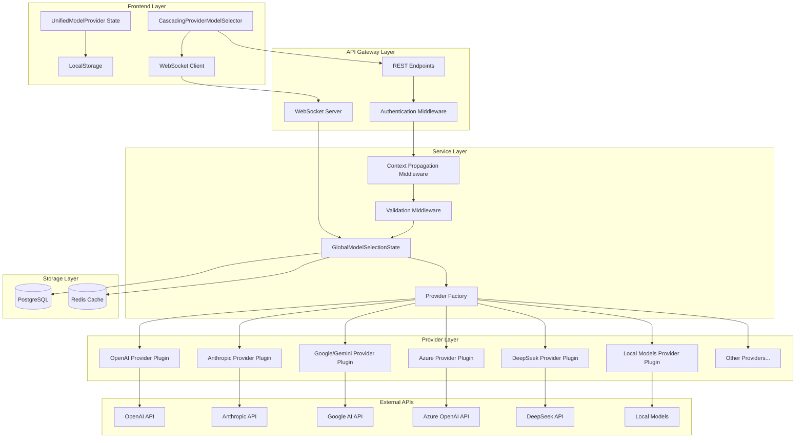
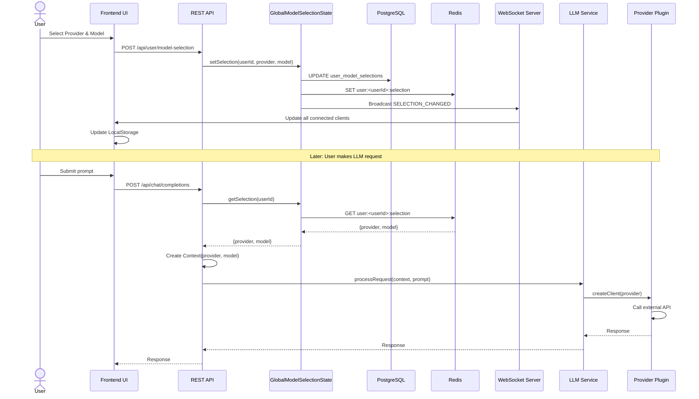
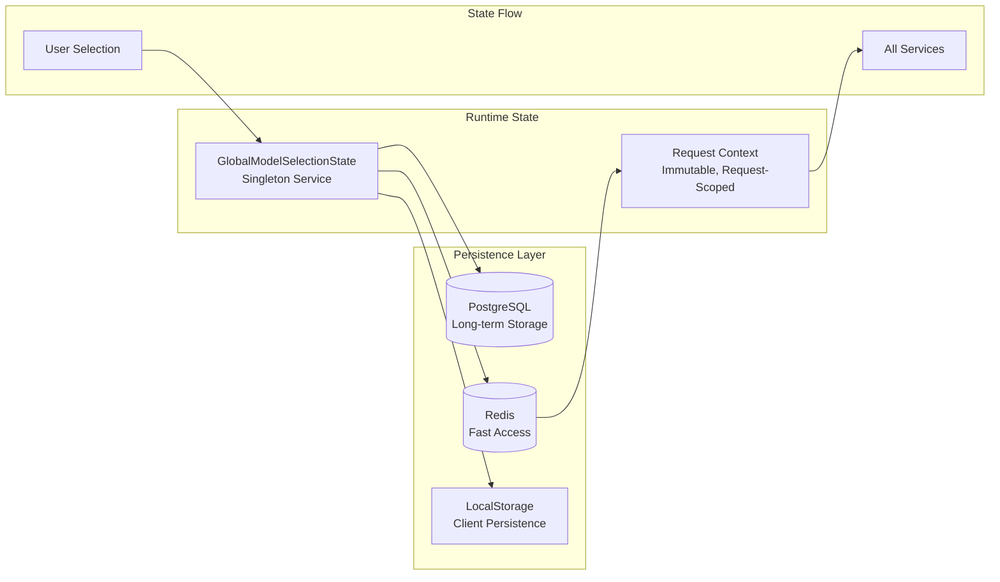

# Unified Provider System Design

**Version:** 1.0  
**Date:** 2026-01-07  
**Status:** Design Proposal

## Executive Summary

This document presents a comprehensive architectural design for the **Dynamic AI Provider and Model Selection System** for the Chimera project. The system enables users to dynamically select AI providers (OpenAI, Anthropic, Google/Gemini, Azure, DeepSeek, local models, etc.) and models through a unified interface, with the selection propagating consistently through all application layers.

### Key Objectives

1. **Unified Provider Dropdown**: Centralized UI component for provider selection
2. **Cascading Model Dropdown**: Dynamic model population based on selected provider
3. **Global Enforcement**: Selection propagates through ALL layers (API, orchestration, middleware, LLM services, streaming, caching, logging)
4. **Migration Strategy**: Replace 300+ hardcoded model references
5. **Robust Error Handling**: Provider-specific API differences normalized
6. **Session Persistence**: Selection persists across sessions
7. **Concurrent Request Support**: Consistency during concurrent operations
8. **Real-time Streaming**: Maintain consistency during streaming operations

---

## 1. System Architecture Overview

### 1.1 Current Architecture Issues

| Issue | Impact | Priority |
|-------|--------|----------|
| **11 provider types defined, only 2 implemented** | Limited provider support | High |
| **300+ hardcoded model references** | Inflexible, difficult to maintain | Critical |
| **Multiple overlapping state management systems** | Inconsistent behavior | High |
| **Google/Gemini alias complexity** | Confusing user experience | Medium |
| **Fragmented WebSocket endpoints** | Increased complexity | Medium |

### 1.2 Architecture Principles

1. **Single Source of Truth**: `GlobalModelSelectionState` service as the authoritative source for current selections
2. **Plugin Architecture**: Provider implementations follow a standard protocol
3. **Context Propagation**: Immutable request-scoped context flows through all layers
4. **Layered Design**: Clear separation between configuration, abstraction, service, and provider layers
5. **Backward Compatibility**: Phased migration with feature flags

### 1.3 Component Diagram



### 1.4 Data Flow Diagram



### 1.5 State Management Architecture



---

## 2. Backend Design

### 2.1 GlobalModelSelectionState Service

**Purpose**: Central singleton service that manages the current provider/model selection for all users.

**Responsibilities**:

- Maintain authoritative source of provider/model selections
- Validate provider and model choices
- Persist selections to database and cache
- Notify subscribers of selection changes
- Provide fast lookups for request processing

**Interface**:

```typescript
interface IGlobalModelSelectionState {
  // Selection Management
  setSelection(userId: string, provider: string, model: string): Promise<void>;
  getSelection(userId: string): Promise<Selection>;
  
  // Provider/Model Discovery
  getAvailableProviders(): Promise<Provider[]>;
  getAvailableModels(providerId: string): Promise<Model[]>;
  
  // Validation
  validateSelection(provider: string, model: string): Promise<boolean>;
  
  // Subscription
  subscribeToChanges(userId: string, callback: (selection: Selection) => void): string;
  unsubscribe(subscriptionId: string): void;
}

interface Selection {
  userId: string;
  provider: string;
  model: string;
  timestamp: Date;
}

interface Provider {
  id: string;
  displayName: string;
  aliases: string[];
  isEnabled: boolean;
  requiresApiKey: boolean;
  capabilities: string[];
}

interface Model {
  id: string;
  providerId: string;
  displayName: string;
  capabilities: ModelCapabilities;
  parameters: ModelParameters;
}
```

**Implementation Details**:

```typescript
class GlobalModelSelectionState implements IGlobalModelSelectionState {
  private static instance: GlobalModelSelectionState;
  private db: DatabaseConnection;
  private cache: RedisConnection;
  private subscriptions: Map<string, Callback>;
  
  private constructor() {
    // Singleton pattern - private constructor
  }
  
  static getInstance(): GlobalModelSelectionState {
    if (!GlobalModelSelectionState.instance) {
      GlobalModelSelectionState.instance = new GlobalModelSelectionState();
    }
    return GlobalModelSelectionState.instance;
  }
  
  async setSelection(userId: string, provider: string, model: string): Promise<void> {
    // 1. Validate selection
    const isValid = await this.validateSelection(provider, model);
    if (!isValid) {
      throw new InvalidSelectionError('Provider/model combination is invalid');
    }
    
    // 2. Update database
    await this.db.query(
      'UPDATE user_model_selections SET provider_id = $1, model_id = $2, updated_at = NOW() WHERE user_id = $3',
      [provider, model, userId]
    );
    
    // 3. Update cache
    await this.cache.set(`user:${userId}:selection`, JSON.stringify({ provider, model }), 'EX', 86400);
    
    // 4. Notify subscribers via WebSocket
    this.notifySubscribers(userId, { userId, provider, model, timestamp: new Date() });
  }
  
  async getSelection(userId: string): Promise<Selection> {
    // 1. Try cache first
    const cached = await this.cache.get(`user:${userId}:selection`);
    if (cached) {
      return JSON.parse(cached);
    }
    
    // 2. Fallback to database
    const result = await this.db.query(
      'SELECT provider_id, model_id, updated_at FROM user_model_selections WHERE user_id = $1 AND is_active = true',
      [userId]
    );
    
    if (result.rows.length === 0) {
      // Return default selection
      return { userId, provider: 'openai', model: 'gpt-4', timestamp: new Date() };
    }
    
    const selection = {
      userId,
      provider: result.rows[0].provider_id,
      model: result.rows[0].model_id,
      timestamp: result.rows[0].updated_at
    };
    
    // 3. Populate cache
    await this.cache.set(`user:${userId}:selection`, JSON.stringify(selection), 'EX', 86400);
    
    return selection;
  }
}
```

### 2.2 Provider Plugin Protocol

**Purpose**: Standardized interface that all provider implementations must follow, enabling consistent integration of 11+ providers.

**Protocol Interface**:

```typescript
interface IProviderPlugin {
  // Metadata
  getProviderId(): string;
  getDisplayName(): string;
  getCapabilities(): ProviderCapabilities;
  
  // Configuration
  validateConfig(config: ProviderConfig): Promise<boolean>;
  getAvailableModels(): Promise<Model[]>;
  
  // Client Management
  createClient(apiKey: string, config?: ProviderConfig): Promise<ProviderClient>;
  
  // Request Handling
  handleCompletion(client: ProviderClient, request: CompletionRequest): Promise<CompletionResponse>;
  handleStreaming(client: ProviderClient, request: CompletionRequest): AsyncIterator<StreamChunk>;
  
  // Error Handling
  normalizeError(error: any): NormalizedError;
  isRetryable(error: any): boolean;
  
  // Response Processing
  normalizeResponse(response: any): CompletionResponse;
}

interface ProviderCapabilities {
  supportsStreaming: boolean;
  supportsVision: boolean;
  supportsFunctionCalling: boolean;
  supportsEmbeddings: boolean;
  maxTokens: number;
  maxContextWindow: number;
}

interface CompletionRequest {
  model: string;
  messages: Message[];
  temperature?: number;
  maxTokens?: number;
  stream?: boolean;
  [key: string]: any;
}

interface CompletionResponse {
  id: string;
  provider: string;
  model: string;
  choices: Choice[];
  usage: Usage;
  timestamp: Date;
}

interface NormalizedError {
  code: string;
  message: string;
  provider: string;
  model: string;
  isRetryable: boolean;
  userMessage: string;
  originalError: any;
}
```

**Provider Implementations**:

Each provider gets its own plugin implementation:

1. **OpenAIProviderPlugin** - OpenAI GPT models
2. **AnthropicProviderPlugin** - Claude models
3. **GoogleProviderPlugin** - Gemini models (handles both "Google" and "Gemini" aliases)
4. **AzureOpenAIProviderPlugin** - Azure-hosted OpenAI models
5. **DeepSeekProviderPlugin** - DeepSeek models
6. **LocalModelsProviderPlugin** - Ollama, LM Studio, etc.
7. **CohereProviderPlugin** - Cohere models
8. **MistralProviderPlugin** - Mistral AI models
9. **PerplexityProviderPlugin** - Perplexity API
10. **TogetherAIProviderPlugin** - Together AI models
11. **CustomProviderPlugin** - User-defined custom endpoints

**Example: Google/Gemini Provider Plugin**:

```typescript
class GoogleProviderPlugin implements IProviderPlugin {
  getProviderId(): string {
    return 'google';  // Canonical ID
  }
  
  getDisplayName(): string {
    return 'Google AI (Gemini)';  // User-facing name
  }
  
  // Handle alias normalization
  static normalizeAlias(providerName: string): string {
    const aliases = ['google', 'gemini', 'google-ai', 'google-gemini'];
    if (aliases.includes(providerName.toLowerCase())) {
      return 'google';
    }
    return providerName;
  }
  
  async getAvailableModels(): Promise<Model[]> {
    return [
      { id: 'gemini-2.5-pro', displayName: 'Gemini 2.5 Pro', ... },
      { id: 'gemini-1.5-pro', displayName: 'Gemini 1.5 Pro', ... },
      { id: 'gemini-1.5-flash', displayName: 'Gemini 1.5 Flash', ... }
    ];
  }
  
  async createClient(apiKey: string, config?: ProviderConfig): Promise<ProviderClient> {
    // Use OpenAI-compatible endpoint
    return new OpenAI({
      apiKey,
      baseURL: 'https://generativelanguage.googleapis.com/v1beta/openai/'
    });
  }
  
  async handleCompletion(client: ProviderClient, request: CompletionRequest): Promise<CompletionResponse> {
    const response = await client.chat.completions.create({
      model: request.model,
      messages: request.messages,
      reasoning_effort: request.reasoningEffort || 'medium',  // Gemini-specific
      ...request
    });
    
    return this.normalizeResponse(response);
  }
  
  normalizeError(error: any): NormalizedError {
    // Convert Google-specific errors to standard format
    return {
      code: error.code || 'UNKNOWN_ERROR',
      message: error.message,
      provider: 'google',
      model: error.model || 'unknown',
      isRetryable: error.status === 429 || error.status === 503,
      userMessage: this.getUserFriendlyMessage(error),
      originalError: error
    };
  }
}
```

### 2.3 Provider Factory

**Purpose**: Instantiate the correct provider plugin based on the current selection.

```typescript
class ProviderFactory {
  private static plugins: Map<string, IProviderPlugin> = new Map();
  
  static registerProvider(providerId: string, plugin: IProviderPlugin): void {
    this.plugins.set(providerId, plugin);
  }
  
  static getProvider(providerId: string): IProviderPlugin {
    // Normalize aliases first
    const normalizedId = this.normalizeProviderId(providerId);
    
    const plugin = this.plugins.get(normalizedId);
    if (!plugin) {
      throw new ProviderNotFoundError(`Provider '${providerId}' not found`);
    }
    return plugin;
  }
  
  static getAllProviders(): Provider[] {
    return Array.from(this.plugins.values()).map(plugin => ({
      id: plugin.getProviderId(),
      displayName: plugin.getDisplayName(),
      capabilities: plugin.getCapabilities()
    }));
  }
  
  private static normalizeProviderId(providerId: string): string {
    // Handle aliases (e.g., "gemini" -> "google")
    const aliasMap: Record<string, string> = {
      'gemini': 'google',
      'google-ai': 'google',
      'google-gemini': 'google',
      'azure-openai': 'azure',
      'ollama': 'local',
      'lm-studio': 'local'
    };
    
    return aliasMap[providerId.toLowerCase()] || providerId.toLowerCase();
  }
}

// Initialize all providers at startup
ProviderFactory.registerProvider('openai', new OpenAIProviderPlugin());
ProviderFactory.registerProvider('anthropic', new AnthropicProviderPlugin());
ProviderFactory.registerProvider('google', new GoogleProviderPlugin());
ProviderFactory.registerProvider('azure', new AzureOpenAIProviderPlugin());
ProviderFactory.registerProvider('deepseek', new DeepSeekProviderPlugin());
ProviderFactory.registerProvider('local', new LocalModelsProviderPlugin());
// ... register all 11+ providers
```

### 2.4 Request Context Propagation

**Purpose**: Immutable, request-scoped context that carries provider/model selection through all layers.

```typescript
interface RequestContext {
  requestId: string;
  userId: string;
  sessionId: string;
  provider: string;
  model: string;
  timestamp: Date;
  metadata?: Record<string, any>;
}

class ContextManager {
  private static asyncLocalStorage = new AsyncLocalStorage<RequestContext>();
  
  static async runWithContext<T>(
    context: RequestContext,
    fn: () => Promise<T>
  ): Promise<T> {
    return this.asyncLocalStorage.run(context, fn);
  }
  
  static getContext(): RequestContext {
    const context = this.asyncLocalStorage.getStore();
    if (!context) {
      throw new MissingContextError('Request context not found');
    }
    return context;
  }
  
  static hasContext(): boolean {
    return this.asyncLocalStorage.getStore() !== undefined;
  }
}

// Middleware to create context at API boundary
async function contextPropagationMiddleware(req: Request, res: Response, next: NextFunction) {
  const userId = req.user.id;
  const sessionId = req.sessionID;
  
  // Fetch current selection from GlobalModelSelectionState
  const selection = await GlobalModelSelectionState.getInstance().getSelection(userId);
  
  const context: RequestContext = {
    requestId: uuidv4(),
    userId,
    sessionId,
    provider: selection.provider,
    model: selection.model,
    timestamp: new Date(),
    metadata: {
      ip: req.ip,
      userAgent: req.headers['user-agent']
    }
  };
  
  // Run the rest of the request within this context
  await ContextManager.runWithContext(context, async () => {
    next();
  });
}
```

### 2.5 Validation Middleware

**Purpose**: Validate provider/model selection at service boundaries.

```typescript
// Decorator for service methods
function RequiresModelSelection() {
  return function (target: any, propertyKey: string, descriptor: PropertyDescriptor) {
    const originalMethod = descriptor.value;
    
    descriptor.value = async function (...args: any[]) {
      // 1. Check context exists
      if (!ContextManager.hasContext()) {
        throw new MissingContextError('Request must have a valid context');
      }
      
      const context = ContextManager.getContext();
      
      // 2. Validate provider
      const provider = ProviderFactory.getProvider(context.provider);
      if (!provider) {
        throw new InvalidProviderError(`Provider '${context.provider}' is not available`);
      }
      
      // 3. Validate model for provider
      const availableModels = await provider.getAvailableModels();
      const modelExists = availableModels.some(m => m.id === context.model);
      if (!modelExists) {
        throw new InvalidModelError(`Model '${context.model}' not available for provider '${context.provider}'`);
      }
      
      // 4. Check user has necessary API keys
      const hasApiKey = await checkUserApiKey(context.userId, context.provider);
      if (!hasApiKey) {
        throw new MissingApiKeyError(`API key required for provider '${context.provider}'`);
      }
      
      // 5. Call original method
      return originalMethod.apply(this, args);
    };
    
    return descriptor;
  };
}

// Usage in LLM service
class LLMService {
  @RequiresModelSelection()
  async generateCompletion(prompt: string): Promise<CompletionResponse> {
    const context = ContextManager.getContext();
    const provider = ProviderFactory.getProvider(context.provider);
    const client = await provider.createClient(getUserApiKey(context.userId, context.provider));
    
    return provider.handleCompletion(client, {
      model: context.model,
      messages: [{ role: 'user', content: prompt }]
    });
  }
}
```

### 2.6 Database Schema

```sql
-- Providers table
CREATE TABLE providers (
  provider_id VARCHAR(50) PRIMARY KEY,
  display_name VARCHAR(100) NOT NULL,
  aliases TEXT[],  -- For handling Google/Gemini, etc.
  api_base_url VARCHAR(255),
  is_enabled BOOLEAN DEFAULT true,
  requires_api_key BOOLEAN DEFAULT true,
  capabilities JSONB,
  config_schema JSONB,
  created_at TIMESTAMP DEFAULT NOW(),
  updated_at TIMESTAMP DEFAULT NOW()
);

-- Models table
CREATE TABLE models (
  model_id VARCHAR(100) PRIMARY KEY,
  provider_id VARCHAR(50) REFERENCES providers(provider_id),
  display_name VARCHAR(100) NOT NULL,
  description TEXT,
  capabilities JSONB,  -- {supportsStreaming, supportsVision, etc.}
  parameters JSONB,    -- {maxTokens, contextWindow, etc.}
  is_enabled BOOLEAN DEFAULT true,
  created_at TIMESTAMP DEFAULT NOW(),
  updated_at TIMESTAMP DEFAULT NOW()
);

-- User model selections table
CREATE TABLE user_model_selections (
  id SERIAL PRIMARY KEY,
  user_id VARCHAR(50) NOT NULL,
  provider_id VARCHAR(50) REFERENCES providers(provider_id),
  model_id VARCHAR(100) REFERENCES models(model_id),
  is_active BOOLEAN DEFAULT true,
  created_at TIMESTAMP DEFAULT NOW(),
  updated_at TIMESTAMP DEFAULT NOW(),
  UNIQUE(user_id, is_active)  -- Only one active selection per user
);

-- User API keys table
CREATE TABLE user_api_keys (
  id SERIAL PRIMARY KEY,
  user_id VARCHAR(50) NOT NULL,
  provider_id VARCHAR(50) REFERENCES providers(provider_id),
  api_key_encrypted TEXT NOT NULL,
  is_active BOOLEAN DEFAULT true,
  created_at TIMESTAMP DEFAULT NOW(),
  updated_at TIMESTAMP DEFAULT NOW(),
  UNIQUE(user_id, provider_id, is_active)
);

-- Indexes
CREATE INDEX idx_user_selections_user_id ON user_model_selections(user_id);
CREATE INDEX idx_user_api_keys_user_provider ON user_api_keys(user_id, provider_id);
CREATE INDEX idx_models_provider_id ON models(provider_id);
```

### 2.7 Unified API Contract

**REST Endpoints**:

| Method | Endpoint | Description |
|--------|----------|-------------|
| GET | `/api/providers` | List all available providers |
| GET | `/api/providers/:providerId/models` | List models for a provider |
| GET | `/api/user/model-selection` | Get current user's selection |
| POST | `/api/user/model-selection` | Set user's provider/model selection |
| GET | `/api/user/api-keys` | List user's configured API keys |
| POST | `/api/user/api-keys` | Add/update API key for a provider |
| DELETE | `/api/user/api-keys/:providerId` | Remove API key for a provider |
| POST | `/api/chat/completions` | Generate completion (uses current selection) |
| POST | `/api/chat/stream` | Stream completion (uses current selection) |

**OpenAPI Specification** (abbreviated):

```yaml
openapi: 3.0.0
info:
  title: Unified Provider System API
  version: 1.0.0

paths:
  /api/providers:
    get:
      summary: Get all available providers
      responses:
        '200':
          description: List of providers
          content:
            application/json:
              schema:
                type: array
                items:
                  $ref: '#/components/schemas/Provider'

  /api/providers/{providerId}/models:
    get:
      summary: Get models for a provider
      parameters:
        - name: providerId
          in: path
          required: true
          schema:
            type: string
      responses:
        '200':
          description: List of models
          content:
            application/json:
              schema:
                type: array
                items:
                  $ref: '#/components/schemas/Model'

  /api/user/model-selection:
    get:
      summary: Get current selection
      responses:
        '200':
          description: Current selection
          content:
            application/json:
              schema:
                $ref: '#/components/schemas/Selection'
    
    post:
      summary: Set provider/model selection
      requestBody:
        required: true
        content:
          application/json:
            schema:
              type: object
              properties:
                provider:
                  type: string
                model:
                  type: string
      responses:
        '200':
          description: Selection updated
        '400':
          description: Invalid selection

components:
  schemas:
    Provider:
      type: object
      properties:
        id:
          type: string
        displayName:
          type: string
        aliases:
          type: array
          items:
            type: string
        isEnabled:
          type: boolean
        requiresApiKey:
          type: boolean
        capabilities:
          type: object
    
    Model:
      type: object
      properties:
        id:
          type: string
        providerId:
          type: string
        displayName:
          type: string
        capabilities:
          type: object
        parameters:
          type: object
    
    Selection:
      type: object
      properties:
        userId:
          type: string
        provider:
          type: string
        model:
          type: string
        timestamp:
          type: string
          format: date-time
```

---

## 3. Frontend Design

### 3.1 Unified Provider/Model Dropdown Component

**Component: `CascadingProviderModelSelector.tsx`**

```typescript
import React, { useState, useEffect } from 'react';
import { useUnifiedModelProvider } from './UnifiedModelProvider';

interface CascadingProviderModelSelectorProps {
  onSelectionChange?: (provider: string, model: string) => void;
}

export const CascadingProviderModelSelector: React.FC<CascadingProviderModelSelectorProps> = ({
  onSelectionChange
}) => {
  const {
    providers,
    models,
    currentSelection,
    loadProviders,
    loadModels,
    setSelection
  } = useUnifiedModelProvider();
  
  const [selectedProvider, setSelectedProvider] = useState<string>(currentSelection.provider);
  const [selectedModel, setSelectedModel] = useState<string>(currentSelection.model);
  const [isLoadingModels, setIsLoadingModels] = useState(false);
  
  // Load providers on mount
  useEffect(() => {
    loadProviders();
  }, []);
  
  // Load models when provider changes
  useEffect(() => {
    if (selectedProvider) {
      setIsLoadingModels(true);
      loadModels(selectedProvider).finally(() => setIsLoadingModels(false));
    }
  }, [selectedProvider]);
  
  const handleProviderChange = (provider: string) => {
    setSelectedProvider(provider);
    setSelectedModel('');  // Reset model when provider changes
  };
  
  const handleModelChange = (model: string) => {
    setSelectedModel(model);
    
    // Update both local state and backend
    setSelection(selectedProvider, model);
    
    // Notify parent component
    onSelectionChange?.(selectedProvider, model);
  };
  
  return (
    <div className="provider-model-selector">
      <div className="provider-dropdown">
        <label htmlFor="provider-select">AI Provider</label>
        <select
          id="provider-select"
          value={selectedProvider}
          onChange={(e) => handleProviderChange(e.target.value)}
        >
          <option value="">Select a provider...</option>
          {providers.map(provider => (
            <option key={provider.id} value={provider.id}>
              {provider.displayName}
            </option>
          ))}
        </select>
      </div>
      
      <div className="model-dropdown">
        <label htmlFor="model-select">Model</label>
        <select
          id="model-select"
          value={selectedModel}
          onChange={(e) => handleModelChange(e.target.value)}
          disabled={!selectedProvider || isLoadingModels}
        >
          <option value="">
            {isLoadingModels ? 'Loading models...' : 'Select a model...'}
          </option>
          {models.map(model => (
            <option key={model.id} value={model.id}>
              {model.displayName}
            </option>
          ))}
        </select>
      </div>
    </div>
  );
};
```

### 3.2 State Management Hook

**Hook: `useUnifiedModelProvider.ts`**

```typescript
import { create } from 'zustand';
import { persist } from 'zustand/middleware';

interface Provider {
  id: string;
  displayName: string;
  aliases: string[];
  isEnabled: boolean;
  requiresApiKey: boolean;
}

interface Model {
  id: string;
  providerId: string;
  displayName: string;
  capabilities: any;
}

interface Selection {
  provider: string;
  model: string;
  timestamp: Date;
}

interface ModelProviderState {
  providers: Provider[];
  models: Model[];
  currentSelection: Selection;
  
  loadProviders: () => Promise<void>;
  loadModels: (providerId: string) => Promise<void>;
  setSelection: (provider: string, model: string) => Promise<void>;
}

export const useUnifiedModelProvider = create<ModelProviderState>()(
  persist(
    (set, get) => ({
      providers: [],
      models: [],
      currentSelection: {
        provider: '',
        model: '',
        timestamp: new Date()
      },
      
      loadProviders: async () => {
        const response = await fetch('/api/providers');
        const providers = await response.json();
        set({ providers });
      },
      
      loadModels: async (providerId: string) => {
        const response = await fetch(`/api/providers/${providerId}/models`);
        const models = await response.json();
        set({ models });
      },
      
      setSelection: async (provider: string, model: string) => {
        // 1. Update backend
        await fetch('/api/user/model-selection', {
          method: 'POST',
          headers: { 'Content-Type': 'application/json' },
          body: JSON.stringify({ provider, model })
        });
        
        // 2. Update local state
        set({
          currentSelection: {
            provider,
            model,
            timestamp: new Date()
          }
        });
      }
    }),
    {
      name: 'model-provider-storage',  // LocalStorage key
      partialize: (state) => ({
        currentSelection: state.currentSelection  // Only persist selection
      })
    }
  )
);
```

### 3.3 WebSocket Integration

**WebSocket Client: `modelSelectionWebSocket.ts`**

```typescript
class ModelSelectionWebSocket {
  private ws: WebSocket | null = null;
  private reconnectAttempts = 0;
  private maxReconnectAttempts = 5;
  private subscribers: Map<string, (selection: Selection) => void> = new Map();
  
  connect() {
    this.ws = new WebSocket('ws://localhost:3000/ws/model-selection');
    
    this.ws.onopen = () => {
      console.log('WebSocket connected');
      this.reconnectAttempts = 0;
    };
    
    this.ws.onmessage = (event) => {
      const message = JSON.parse(event.data);
      
      switch (message.type) {
        case 'SELECTION_CHANGED':
          this.handleSelectionChanged(message.payload);
          break;
        case 'PROVIDER_STATUS':
          this.handleProviderStatus(message.payload);
          break;
        case 'MODEL_VALIDATION':
          this.handleModelValidation(message.payload);
          break;
      }
    };
    
    this.ws.onclose = () => {
      console.log('WebSocket disconnected');
      this.attemptReconnect();
    };
    
    this.ws.onerror = (error) => {
      console.error('WebSocket error:', error);
    };
  }
  
  private handleSelectionChanged(selection: Selection) {
    // Update all subscribers (e.g., useUnifiedModelProvider hook)
    this.subscribers.forEach(callback => callback(selection));
    
    // Update localStorage
    localStorage.setItem('model-provider-storage', JSON.stringify({
      state: { currentSelection: selection }
    }));
  }
  
  subscribe(id: string, callback: (selection: Selection) => void) {
    this.subscribers.set(id, callback);
    return () => this.subscribers.delete(id);
  }
  
  private attemptReconnect() {
    if (this.reconnectAttempts < this.maxReconnectAttempts) {
      this.reconnectAttempts++;
      setTimeout(() => this.connect(), 1000 * this.reconnectAttempts);
    }
  }
}

export const modelSelectionWS = new ModelSelectionWebSocket();
```

**Integration with State Hook**:

```typescript
// In useUnifiedModelProvider, add WebSocket subscription
useEffect(() => {
  const unsubscribe = modelSelectionWS.subscribe('main', (selection) => {
    set({ currentSelection: selection });
  });
  
  modelSelectionWS.connect();
  
  return () => {
    unsubscribe();
  };
}, []);
```

### 3.4 LocalStorage Persistence Strategy

**Strategy**:

1. **What to Persist**: Only `currentSelection` (provider, model, timestamp)
2. **When to Update**:
   - When user makes a selection
   - When WebSocket receives `SELECTION_CHANGED` event
3. **When to Read**: On application mount/page refresh
4. **Sync with Backend**:
   - On mount, fetch from backend to get authoritative state
   - If local and backend differ, backend wins
   - Update local to match backend

**Implementation**:

```typescript
// In app initialization
async function initializeModelSelection() {
  // 1. Read from localStorage (fast, immediate UI update)
  const stored = localStorage.getItem('model-provider-storage');
  if (stored) {
    const { state } = JSON.parse(stored);
    useUnifiedModelProvider.setState({ currentSelection: state.currentSelection });
  }
  
  // 2. Fetch from backend (authoritative source)
  const response = await fetch('/api/user/model-selection');
  const backendSelection = await response.json();
  
  // 3. If different, backend wins
  if (stored) {
    const { state } = JSON.parse(stored);
    if (state.currentSelection.provider !== backendSelection.provider ||
        state.currentSelection.model !== backendSelection.model) {
      console.log('Local storage out of sync, updating from backend');
      useUnifiedModelProvider.setState({ currentSelection: backendSelection });
      localStorage.setItem('model-provider-storage', JSON.stringify({
        state: { currentSelection: backendSelection }
      }));
    }
  }
}
```

---

## 4. Integration Points

### 4.1 LLM Service Integration

**How LLM services obtain current selection**:

```typescript
class LLMOrchestrationService {
  @RequiresModelSelection()  // Validates context exists and is valid
  async generateResponse(prompt: string, options?: CompletionOptions): Promise<string> {
    // 1. Get context (automatically set by middleware)
    const context = ContextManager.getContext();
    
    // 2. Get provider plugin
    const provider = ProviderFactory.getProvider(context.provider);
    
    // 3. Get user's API key for this provider
    const apiKey = await this.getUserApiKey(context.userId, context.provider);
    
    // 4. Create client
    const client = await provider.createClient(apiKey);
    
    // 5. Make request using context's model
    const response = await provider.handleCompletion(client, {
      model: context.model,
      messages: [{ role: 'user', content: prompt }],
      ...options
    });
    
    // 6. Log with context
    this.logRequest(context, prompt, response);
    
    return response.choices[0].message.content;
  }
  
  private async getUserApiKey(userId: string, providerId: string): Promise<string> {
    const result = await db.query(
      'SELECT api_key_encrypted FROM user_api_keys WHERE user_id = $1 AND provider_id = $2 AND is_active = true',
      [userId, providerId]
    );
    
    if (result.rows.length === 0) {
      throw new MissingApiKeyError(`API key not configured for provider '${providerId}'`);
    }
    
    return decrypt(result.rows[0].api_key_encrypted);
  }
}
```

### 4.2 Streaming Service Integration

**Streaming with Context Capture**:

```typescript
class StreamingService {
  @RequiresModelSelection()
  async* streamCompletion(prompt: string): AsyncIterator<string> {
    // 1. Capture context at stream start (immutable for stream lifetime)
    const context = ContextManager.getContext();
    const streamContext = {
      ...context,
      streamId: uuidv4(),
      startTime: new Date()
    };
    
    // 2. Get provider and client
    const provider = ProviderFactory.getProvider(streamContext.provider);
    const apiKey = await this.getUserApiKey(streamContext.userId, streamContext.provider);
    const client = await provider.createClient(apiKey);
    
    // 3. Start streaming
    const stream = provider.handleStreaming(client, {
      model: streamContext.model,
      messages: [{ role: 'user', content: prompt }],
      stream: true
    });
    
    // 4. Yield chunks
    for await (const chunk of stream) {
      // Log each chunk with stream context
      this.logStreamChunk(streamContext, chunk);
      
      yield chunk.choices[0]?.delta?.content || '';
    }
    
    // 5. Log stream completion
    this.logStreamComplete(streamContext);
  }
}

// Usage in API endpoint
app.get('/api/chat/stream', async (req, res) => {
  res.setHeader('Content-Type', 'text/event-stream');
  res.setHeader('Cache-Control', 'no-cache');
  res.setHeader('Connection', 'keep-alive');
  
  const streamingService = new StreamingService();
  const stream = streamingService.streamCompletion(req.body.prompt);
  
  for await (const chunk of stream) {
    res.write(`data: ${JSON.stringify({ content: chunk })}\n\n`);
  }
  
  res.end();
});
```

### 4.3 Cache Invalidation Strategy

**Cache Key Structure**:

```
cache:completion:{userId}:{provider}:{model}:{promptHash}
```

**Invalidation Rules**:

1. **On provider/model change**: Invalidate all keys for that user
2. **On prompt change**: Automatically missed (different hash)
3. **Time-based expiration**: TTL of 24 hours

**Implementation**:

```typescript
class CacheService {
  async getCachedCompletion(userId: string, provider: string, model: string, prompt: string): Promise<string | null> {
    const promptHash = this.hashPrompt(prompt);
    const key = `cache:completion:${userId}:${provider}:${model}:${promptHash}`;
    return await redis.get(key);
  }
  
  async setCachedCompletion(userId: string, provider: string, model: string, prompt: string, response: string): Promise<void> {
    const promptHash = this.hashPrompt(prompt);
    const key = `cache:completion:${userId}:${provider}:${model}:${promptHash}`;
    await redis.set(key, response, 'EX', 86400);  // 24-hour TTL
  }
  
  async invalidateUserCache(userId: string): Promise<void> {
    const pattern = `cache:completion:${userId}:*`;
    const keys = await redis.keys(pattern);
    if (keys.length > 0) {
      await redis.del(...keys);
    }
  }
}

// When selection changes
GlobalModelSelectionState.getInstance().setSelection(userId, provider, model).then(() => {
  CacheService.invalidateUserCache(userId);  // Invalidate all cached completions
});
```

### 4.4 Logging Integration

**Structured Logging with Context**:

```typescript
class LoggingService {
  private logger: Logger;
  
  logRequest(context: RequestContext, prompt: string, response: CompletionResponse): void {
    this.logger.info('LLM Request Completed', {
      requestId: context.requestId,
      userId: context.userId,
      sessionId: context.sessionId,
      provider: context.provider,
      model: context.model,
      timestamp: context.timestamp,
      promptLength: prompt.length,
      responseLength: response.choices[0].message.content.length,
      tokensUsed: response.usage.total_tokens,
      latencyMs: Date.now() - context.timestamp.getTime()
    });
  }
  
  logError(context: RequestContext, error: NormalizedError): void {
    this.logger.error('LLM Request Failed', {
      requestId: context.requestId,
      userId: context.userId,
      provider: context.provider,
      model: context.model,
      errorCode: error.code,
      errorMessage: error.message,
      isRetryable: error.isRetryable,
      timestamp: new Date()
    });
  }
  
  logProviderChange(userId: string, oldSelection: Selection, newSelection: Selection): void {
    this.logger.info('Provider/Model Selection Changed', {
      userId,
      oldProvider: oldSelection.provider,
      oldModel: oldSelection.model,
      newProvider: newSelection.provider,
      newModel: newSelection.model,
      timestamp: new Date()
    });
  }
}
```

---

## 5. Migration Strategy

### 5.1 Phased Rollout Approach

**Phase 1: Foundation (Weeks 1-2)**

- ✅ Implement `GlobalModelSelectionState` service
- ✅ Implement Provider Plugin Protocol
- ✅ Create all 11+ provider plugins
- ✅ Set up database schema
- ✅ Implement Context Propagation mechanism
- ✅ Set up Redis cache

**Phase 2: API Layer (Weeks 3-4)**

- ✅ Create unified REST endpoints
- ✅ Implement WebSocket server
- ✅ Add authentication and validation middleware
- ✅ Update API routes to use `ContextManager`

**Phase 3: Frontend (Week 5)**

- ✅ Build `CascadingProviderModelSelector` component
- ✅ Integrate with `useUnifiedModelProvider` hook
- ✅ Set up WebSocket client
- ✅ Implement LocalStorage persistence

**Phase 4: Service Layer Migration (Weeks 6-8)**

- ✅ Refactor LLM orchestration services to use `@RequiresModelSelection`
- ✅ Update streaming services
- ✅ Migrate middleware components
- ✅ Update prompt routers
- ✅ Integrate cache invalidation

**Phase 5: Gradual Rollout with Feature Flags (Weeks 9-10)**

- ✅ Enable feature flag `ENABLE_DYNAMIC_MODEL_SELECTION` for 10% of users
- ✅ Monitor for errors and performance issues
- ✅ Gradually increase to 25%, 50%, 75%, 100%

**Phase 6: Cleanup (Weeks 11-12)**

- ✅ Remove hardcoded model references (300+ instances)
- ✅ Remove legacy code
- ✅ Update documentation
- ✅ Remove feature flags

### 5.2 Backward Compatibility Considerations

**LegacyModelResolver**:

```typescript
class LegacyModelResolver {
  private static readonly FEATURE_FLAG = 'ENABLE_DYNAMIC_MODEL_SELECTION';
  
  static async resolveModel(userId: string, hardcodedModel?: string): Promise<{ provider: string; model: string }> {
    // Check if feature flag is enabled for this user
    const isDynamicEnabled = await FeatureFlagService.isEnabled(this.FEATURE_FLAG, userId);
    
    if (isDynamicEnabled) {
      // Use dynamic selection
      const selection = await GlobalModelSelectionState.getInstance().getSelection(userId);
      
      // Log deprecation warning if hardcoded value was provided
      if (hardcodedModel) {
        console.warn(`DEPRECATION: Hardcoded model '${hardcodedModel}' ignored in favor of user selection: ${selection.provider}/${selection.model}`);
      }
      
      return { provider: selection.provider, model: selection.model };
    } else {
      // Fallback to hardcoded model
      if (!hardcodedModel) {
        hardcodedModel = 'gpt-4';  // Default fallback
      }
      
      return { provider: this.inferProviderFromModel(hardcodedModel), model: hardcodedModel };
    }
  }
  
  private static inferProviderFromModel(model: string): string {
    if (model.startsWith('gpt')) return 'openai';
    if (model.startsWith('claude')) return 'anthropic';
    if (model.startsWith('gemini')) return 'google';
    return 'openai';  // Default
  }
}

// Usage in legacy code
async function legacyGenerateCompletion(userId: string, prompt: string) {
  const { provider, model } = await LegacyModelResolver.resolveModel(userId, 'gpt-4');  // Hardcoded value
  
  // ... rest of logic uses provider/model
}
```

### 5.3 Feature Flag Strategy

**Feature Flag Configuration**:

```typescript
interface FeatureFlag {
  name: string;
  enabled: boolean;
  rolloutPercentage: number;
  enabledUserIds?: string[];
  disabledUserIds?: string[];
}

class FeatureFlagService {
  private static flags: Map<string, FeatureFlag> = new Map();
  
  static async isEnabled(flagName: string, userId: string): Promise<boolean> {
    const flag = this.flags.get(flagName);
    if (!flag) return false;
    
    // Check if globally disabled
    if (!flag.enabled) return false;
    
    // Check if explicitly disabled for this user
    if (flag.disabledUserIds?.includes(userId)) return false;
    
    // Check if explicitly enabled for this user
    if (flag.enabledUserIds?.includes(userId)) return true;
    
    // Check rollout percentage
    const hash = this.hashUserId(userId);
    return hash < flag.rolloutPercentage;
  }
  
  static setRolloutPercentage(flagName: string, percentage: number): void {
    const flag = this.flags.get(flagName);
    if (flag) {
      flag.rolloutPercentage = percentage;
    }
  }
  
  private static hashUserId(userId: string): number {
    // Hash to 0-100 for percentage-based rollout
    let hash = 0;
    for (let i = 0; i < userId.length; i++) {
      hash = ((hash << 5) - hash) + userId.charCodeAt(i);
      hash = hash & hash;
    }
    return Math.abs(hash) % 100;
  }
}

// Initialize feature flag
FeatureFlagService.flags.set('ENABLE_DYNAMIC_MODEL_SELECTION', {
  name: 'ENABLE_DYNAMIC_MODEL_SELECTION',
  enabled: true,
  rolloutPercentage: 10,  // Start with 10%
  enabledUserIds: ['admin-user-1', 'admin-user-2'],  // Always enabled for admins
  disabledUserIds: []
});
```

**Rollout Timeline**:

- Week 9: 10% rollout
- Week 9 (mid): 25% rollout
- Week 10: 50% rollout
- Week 10 (mid): 75% rollout
- Week 11: 100% rollout
- Week 12: Remove feature flag

---

## 6. API Specifications

### 6.1 REST API OpenAPI Specification

See Section 2.7 for full OpenAPI spec.

**Error Response Format**:

```json
{
  "error": {
    "code": "INVALID_MODEL_SELECTION",
    "message": "Model 'gpt-5' is not available for provider 'openai'",
    "provider": "openai",
    "model": "gpt-5",
    "isRetryable": false,
    "userMessage": "The selected model is not available. Please choose a different model.",
    "details": {
      "availableModels": ["gpt-4", "gpt-4-turbo", "gpt-3.5-turbo"]
    }
  }
}
```

### 6.2 WebSocket Message Formats

**Server → Client Messages**:

```typescript
// Selection changed
{
  "type": "SELECTION_CHANGED",
  "payload": {
    "userId": "user-123",
    "provider": "google",
    "model": "gemini-2.5-pro",
    "timestamp": "2026-01-07T10:00:00Z"
  }
}

// Provider status update
{
  "type": "PROVIDER_STATUS",
  "payload": {
    "providerId": "openai",
    "isAvailable": false,
    "reason": "API key invalid",
    "timestamp": "2026-01-07T10:00:00Z"
  }
}

// Model validation result
{
  "type": "MODEL_VALIDATION",
  "payload": {
    "provider": "anthropic",
    "model": "claude-3-opus",
    "isValid": true,
    "timestamp": "2026-01-07T10:00:00Z"
  }
}
```

**Client → Server Messages**:

```typescript
// Subscribe to selection changes
{
  "type": "SUBSCRIBE",
  "payload": {
    "userId": "user-123"
  }
}

// Unsubscribe
{
  "type": "UNSUBSCRIBE",
  "payload": {
    "userId": "user-123"
  }
}

// Ping (keep-alive)
{
  "type": "PING",
  "payload": {}
}
```

---

## 7. Testing & Validation

### 7.1 Unit Tests

**Test Coverage**:

- GlobalModelSelectionState CRUD operations
- Provider Plugin Protocol implementations
- Context propagation
- Validation middleware
- Cache invalidation logic
- Error normalization

**Example Test**:

```typescript
describe('GlobalModelSelectionState', () => {
  it('should set and retrieve user selection', async () => {
    const gmss = GlobalModelSelectionState.getInstance();
    await gmss.setSelection('user-1', 'openai', 'gpt-4');
    
    const selection = await gmss.getSelection('user-1');
    expect(selection.provider).toBe('openai');
    expect(selection.model).toBe('gpt-4');
  });
  
  it('should invalidate cache on selection change', async () => {
    const gmss = GlobalModelSelectionState.getInstance();
    const cacheService = new CacheService();
    
    await cacheService.setCachedCompletion('user-1', 'openai', 'gpt-4', 'test', 'response');
    
    await gmss.setSelection('user-1', 'anthropic', 'claude-3');
    
    const cached = await cacheService.getCachedCompletion('user-1', 'openai', 'gpt-4', 'test');
    expect(cached).toBeNull();
  });
});
```

### 7.2 Integration Tests

**Test Scenarios**:

1. Full flow: Select provider → Select model → Make LLM request → Verify correct provider used
2. WebSocket synchronization: Change selection in one tab → Verify update in another tab
3. Concurrent requests: Multiple requests with different selections
4. Streaming: Start stream → Change selection mid-stream → Verify stream continues with original selection

### 7.3 Performance Benchmarks

**Metrics to Track**:

- Provider/model lookup latency (target: <10ms from cache)
- Context propagation overhead (target: <1ms)
- WebSocket message delivery latency (target: <100ms)
- Cache hit rate (target: >80%)
- Database query performance (target: <50ms)

---

## 8. Security Considerations

### 8.1 API Key Storage

- **Encryption**: All API keys encrypted at rest using AES-256
- **Access Control**: Users can only access their own API keys
- **Audit Logging**: All API key operations logged
- **Rotation**: Support for API key rotation without downtime

### 8.2 Validation & Sanitization

- **Input Validation**: Validate provider/model selections against whitelist
- **SQL Injection Prevention**: Use parameterized queries
- **XSS Prevention**: Sanitize all user inputs
- **CSRF Protection**: Use CSRF tokens for state-changing operations

---

## 9. Monitoring & Observability

### 9.1 Metrics to Track

| Metric | Description | Target |
|--------|-------------|--------|
| `provider_selection_changes` | Count of provider/model changes | N/A |
| `provider_error_rate` | Error rate per provider | <1% |
| `model_usage_distribution` | Distribution of model usage | N/A |
| `cache_hit_rate` | Cache hit rate | >80% |
| `api_response_time` | API response time | <100ms (p95) |
| `websocket_connection_count` | Active WebSocket connections | N/A |

### 9.2 Alerts

- **High Error Rate**: Alert if provider error rate >5%
- **Cache Degradation**: Alert if cache hit rate <50%
- **WebSocket Issues**: Alert if >10% of connections failing
- **Database Latency**: Alert if query latency >200ms

---

## 10. Documentation & Training

### 10.1 Developer Documentation

- **Provider Plugin Development Guide**: How to add new providers
- **API Integration Guide**: How to use the unified endpoints
- **Migration Guide**: How to migrate from hardcoded models

### 10.2 User Documentation

- **User Guide**: How to select providers and models
- **API Key Management**: How to add/remove API keys
- **Troubleshooting**: Common issues and solutions

---

## 11. Future Enhancements

### 11.1 Short-term (3-6 months)

- **Model Comparison Tool**: Side-by-side comparison of responses from different models
- **Cost Tracking**: Track API costs per provider/model
- **Custom Model Endpoints**: Support for custom fine-tuned models

### 11.2 Long-term (6-12 months)

- **Auto-failover**: Automatically switch providers if one fails
- **Smart Model Selection**: AI-powered model recommendation based on task
- **Multi-model Responses**: Run same prompt on multiple models and aggregate results

---

## 12. Appendices

### 12.1 Glossary

| Term | Definition |
|------|------------|
| **Provider** | AI service provider (e.g., OpenAI, Anthropic) |
| **Model** | Specific AI model (e.g., GPT-4, Claude-3) |
| **Context** | Request-scoped data structure carrying provider/model selection |
| **Plugin** | Provider-specific implementation following the protocol |
| **GlobalModelSelectionState** | Singleton service managing all selections |

### 12.2 References

- [OpenAI API Documentation](https://platform.openai.com/docs)
- [Anthropic API Documentation](https://docs.anthropic.com)
- [Google AI API Documentation](https://ai.google.dev/docs)
- [AsyncLocalStorage Documentation](https://nodejs.org/api/async_context.html)

---

## 13. Approval & Sign-off

**Prepared by**: System Architect  
**Date**: 2026-01-07  
**Version**: 1.0

**Stakeholder Approval**:

| Role | Name | Signature | Date |
|------|------|-----------|------|
| Technical Lead | | | |
| Product Manager | | | |
| Engineering Manager | | | |

---

*This document represents the proposed architecture for the Dynamic AI Provider and Model Selection System. Feedback and revisions are welcome before implementation begins.*
