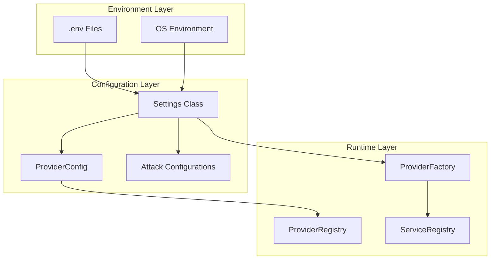
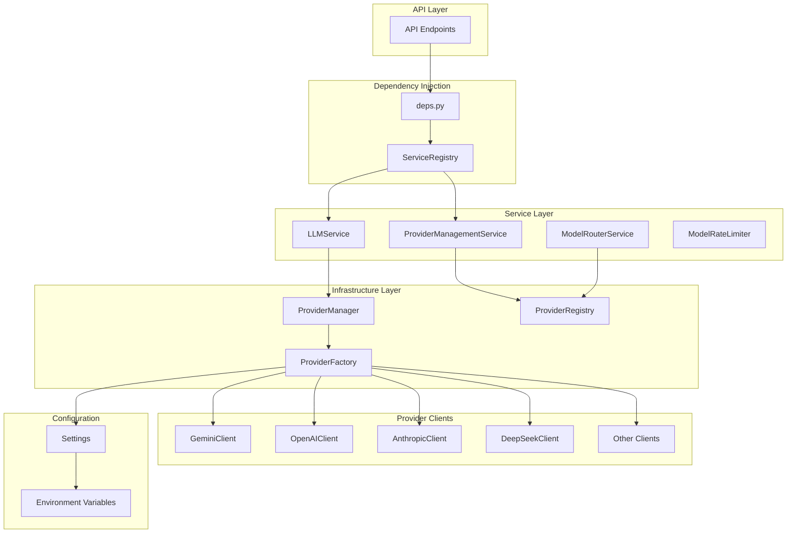

# AI Provider Architecture Analysis

## Executive Summary

This document provides a comprehensive analysis of Chimera's AI provider configuration system, integration patterns, and component architecture. The analysis reveals a sophisticated multi-layered provider management system supporting 8+ LLM providers with centralized configuration, failover mechanisms, encryption, and real-time health monitoring.

**Key Findings:**
- 8 AI providers supported: Gemini, OpenAI, Anthropic, DeepSeek, Qwen, Cursor, BigModel/ZhiPu, Routeway
- Multi-tier architecture: Settings → ProviderFactory → ProviderRegistry → ProviderManager → LLMService
- Robust failover chains with circuit breaker protection
- API key encryption at rest (Fernet-based)
- Real-time provider status via WebSocket
- Comprehensive REST API for dynamic provider management

---

## Table of Contents

1. [Configuration Architecture](#1-configuration-architecture)
2. [AI Provider Inventory](#2-ai-provider-inventory)
3. [Service Layer Components](#3-service-layer-components)
4. [Infrastructure Layer](#4-infrastructure-layer)
5. [API Integration Points](#5-api-integration-points)
6. [Dependency Injection Pattern](#6-dependency-injection-pattern)
7. [Environment Variables Reference](#7-environment-variables-reference)
8. [Component Dependency Map](#8-component-dependency-map)
9. [Recommendations](#9-recommendations)
10. [Implementation Priority](#10-implementation-priority)

---

## 1. Configuration Architecture

### 1.1 Core Configuration System

The central configuration is managed through a Pydantic-based Settings class:

**Location:** [`backend-api/app/core/config.py`](../backend-api/app/core/config.py)

```python
class Settings(BaseSettings):
    """
    Application settings loaded from environment variables.
    Supports hot-reload via ENABLE_CONFIG_HOT_RELOAD.
    """
    
    # API Keys Map - Provider name to environment variable
    API_KEY_NAME_MAP = {
        "google": "GOOGLE_API_KEY",
        "gemini": "GOOGLE_API_KEY",
        "openai": "OPENAI_API_KEY",
        "anthropic": "ANTHROPIC_API_KEY",
        "deepseek": "DEEPSEEK_API_KEY",
        "qwen": "QWEN_API_KEY",
        "cursor": "CURSOR_API_KEY",
        "bigmodel": "BIGMODEL_API_KEY",
        "zhipu": "BIGMODEL_API_KEY",
        "routeway": "ROUTEWAY_API_KEY",
    }
```

### 1.2 Configuration Layers



### 1.3 Configuration Files

| File | Path | Purpose |
|------|------|---------|
| `.env.example` | [`backend-api/.env.example`](../backend-api/.env.example) | Environment variable template |
| `config.py` | [`backend-api/app/core/config.py`](../backend-api/app/core/config.py) | Central settings class |
| `cors.py` | [`backend-api/app/config/cors.py`](../backend-api/app/config/cors.py) | CORS configuration |
| `overthink.yaml` | [`backend-api/app/config/overthink.yaml`](../backend-api/app/config/overthink.yaml) | OVERTHINK attack settings |
| `techniques.yaml` | [`backend-api/app/config/techniques.yaml`](../backend-api/app/config/techniques.yaml) | Jailbreak technique definitions |

---

## 2. AI Provider Inventory

### 2.1 Supported Providers

| Provider ID | Display Name | API Key Variable | Priority | Default Model |
|-------------|--------------|------------------|----------|---------------|
| `gemini` | Google Gemini | `GOOGLE_API_KEY` | 100 (highest) | `gemini-3-pro-preview` |
| `openai` | OpenAI | `OPENAI_API_KEY` | 90 | `gpt-4o` |
| `anthropic` | Anthropic | `ANTHROPIC_API_KEY` | 80 | `claude-3-5-sonnet-20241022` |
| `deepseek` | DeepSeek | `DEEPSEEK_API_KEY` | 70 | `deepseek-chat` |
| `qwen` | Alibaba Qwen | `QWEN_API_KEY` | 60 | N/A |
| `cursor` | Cursor | `CURSOR_API_KEY` | 50 | N/A |
| `bigmodel` | ZhiPu BigModel | `BIGMODEL_API_KEY` | 40 | N/A |
| `routeway` | Routeway | `ROUTEWAY_API_KEY` | 30 | N/A |

### 2.2 Provider Aliases

```python
PROVIDER_ALIASES = {
    "google": "gemini",
    "zhipu": "bigmodel",
}
```

### 2.3 Default Failover Chains

Each provider has a configured failover chain for resilience:

```python
_DEFAULT_FAILOVER_CHAIN = {
    "gemini": ["openai", "anthropic", "deepseek"],
    "google": ["openai", "anthropic", "deepseek"],
    "openai": ["anthropic", "gemini", "deepseek"],
    "anthropic": ["openai", "gemini", "deepseek"],
    "deepseek": ["gemini", "openai", "anthropic"],
    "qwen": ["deepseek", "gemini", "openai"],
    "cursor": ["openai", "anthropic", "gemini"],
    "bigmodel": ["deepseek", "qwen", "gemini"],
    "routeway": ["openai", "gemini", "anthropic"],
}
```

---

## 3. Service Layer Components

### 3.1 LLM Service

**Location:** [`backend-api/app/services/llm_service.py`](../backend-api/app/services/llm_service.py)

The primary service for LLM interactions with advanced features:

```python
class LLMService:
    """
    Features:
    - Response caching with configurable TTL
    - Request deduplication (prevents duplicate in-flight requests)
    - Circuit breaker protection per provider
    - Automatic provider failover
    - Streaming support
    - Token counting
    """
    
    def __init__(self):
        self._provider_manager = ProviderManager()
        self._default_provider = "gemini"
        self._cache: dict[str, CachedResponse] = {}
        self._pending_requests: dict[str, asyncio.Task] = {}
```

**Key Methods:**
- `generate_text(request: PromptRequest) -> PromptResponse`
- `generate_text_stream(request: PromptRequest) -> AsyncGenerator[StreamChunk]`
- `count_tokens(text: str, provider: str) -> int`
- `supports_streaming(provider: str) -> bool`
- `get_available_providers() -> list[str]`

### 3.2 Provider Management Service

**Location:** [`backend-api/app/services/provider_management_service.py`](../backend-api/app/services/provider_management_service.py)

Comprehensive provider management with encryption support:

```python
class ProviderManagementService:
    """
    Features:
    - Provider CRUD operations
    - API key encryption/decryption
    - Health monitoring
    - Priority-based selection
    - Real-time status broadcasting
    """
    
    def __init__(self):
        self._encryption_key = self._load_encryption_key()
        self._providers: dict[str, ProviderConfig] = {}
        self._health_status: dict[str, ProviderHealthStatus] = {}
```

### 3.3 Generation Service

**Location:** [`backend-api/app/services/generation_service.py`](../backend-api/app/services/generation_service.py)

Simple wrapper for text generation:

```python
class GenerationService:
    """Lightweight service for basic text generation."""
    
    async def generate(self, prompt: str, provider: str = None) -> str
```

### 3.4 Model Router Service

**Location:** [`backend-api/app/services/model_router_service.py`](../backend-api/app/services/model_router_service.py)

Handles model selection and session-based provider tracking:

```python
class ModelRouterService:
    """
    Manages:
    - Session-to-provider mapping
    - Model selection events
    - Provider health integration
    - WebSocket event broadcasting
    """
```

### 3.5 Service Registry

**Location:** [`backend-api/app/core/service_registry.py`](../backend-api/app/core/service_registry.py)

Centralized dependency injection container:

```python
class ServiceRegistry:
    """
    Singleton registry for service instances.
    Supports:
    - Lazy registration (instantiate on first access)
    - Eager registration (instantiate immediately)
    - Service overrides for testing
    """
    
    def register(self, name: str, factory: Callable, lazy: bool = True)
    def get(self, name: str) -> Any
```

---

## 4. Infrastructure Layer

### 4.1 Provider Manager

**Location:** [`backend-api/app/infrastructure/provider_manager.py`](../backend-api/app/infrastructure/provider_manager.py)

Central coordinator for all provider clients:

```python
class ProviderManager:
    """
    Manages provider lifecycle:
    - Client initialization based on available API keys
    - Health tracking and status updates
    - Priority-based provider selection
    - Automatic failover on errors
    """
    
    # Provider initialization configuration
    providers_config = [
        ("gemini", GeminiClient, settings.GOOGLE_API_KEY, 100, True),
        ("openai", OpenAIClient, settings.OPENAI_API_KEY, 90, False),
        ("anthropic", AnthropicClient, settings.ANTHROPIC_API_KEY, 80, False),
        ("deepseek", DeepSeekClient, settings.DEEPSEEK_API_KEY, 70, False),
        ("qwen", QwenClient, settings.QWEN_API_KEY, 60, False),
        ("cursor", CursorClient, settings.CURSOR_API_KEY, 50, False),
        ("bigmodel", BigModelClient, settings.BIGMODEL_API_KEY, 40, False),
        ("routeway", RoutewayClient, settings.ROUTEWAY_API_KEY, 30, False),
    ]
```

### 4.2 Provider Factory

**Location:** [`backend-api/app/core/provider_factory.py`](../backend-api/app/core/provider_factory.py)

Factory pattern for creating provider client instances:

```python
class ProviderFactory:
    """
    Factory for creating LLM provider clients.
    
    Registry of available providers:
    - gemini: GeminiClient
    - openai: OpenAIClient
    - anthropic: AnthropicClient
    - deepseek: DeepSeekClient
    - qwen: QwenClient
    - cursor: CursorClient
    - bigmodel: BigModelClient
    - routeway: RoutewayClient
    """
    
    _providers: dict[str, type[LLMProviderInterface]] = {
        "gemini": GeminiClient,
        "openai": OpenAIClient,
        "anthropic": AnthropicClient,
        "deepseek": DeepSeekClient,
        "qwen": QwenClient,
        "cursor": CursorClient,
        "bigmodel": BigModelClient,
        "routeway": RoutewayClient,
    }
```

### 4.3 Provider Registry

**Location:** [`backend-api/app/core/provider_registry.py`](../backend-api/app/core/provider_registry.py)

Runtime registry for provider endpoint management:

```python
class ProviderRegistry:
    """
    Singleton registry for provider configurations.
    
    Features:
    - Dynamic provider registration/deregistration
    - Health status tracking
    - Circuit breaker per provider
    - Event emission for status changes
    - Persistence to file
    """
```

### 4.4 Provider Client Implementations

**Location:** [`backend-api/app/infrastructure/providers/`](../backend-api/app/infrastructure/providers/)

| Client | File | SDK/Library |
|--------|------|-------------|
| `GeminiClient` | `gemini_client.py` | `google-genai` |
| `OpenAIClient` | `openai_client.py` | `openai` |
| `AnthropicClient` | `anthropic_client.py` | `anthropic` |
| `DeepSeekClient` | `deepseek_client.py` | `openai` (compatible) |
| `QwenClient` | `qwen_client.py` | `openai` (compatible) |
| `CursorClient` | `cursor_client.py` | `openai` (compatible) |
| `BigModelClient` | `bigmodel_client.py` | `openai` (compatible) |
| `RoutewayClient` | `routeway_client.py` | `openai` (compatible) |

### 4.5 Base Provider Interface

**Location:** [`backend-api/app/domain/interfaces.py`](../backend-api/app/domain/interfaces.py)

```python
class LLMProvider(ABC):
    """Abstract interface for LLM providers."""
    
    @abstractmethod
    async def generate(self, prompt: str, config: GenerationConfig) -> ProviderResponse:
        """Generate text from prompt."""
        pass
    
    @abstractmethod
    async def check_health(self) -> bool:
        """Check provider health status."""
        pass
    
    @abstractmethod
    async def generate_stream(self, prompt: str, config: GenerationConfig) -> AsyncGenerator[StreamChunk]:
        """Stream text generation."""
        pass
    
    @abstractmethod
    async def count_tokens(self, text: str) -> int:
        """Count tokens in text."""
        pass
```

---

## 5. API Integration Points

### 5.1 Provider Management Endpoints

**Base Path:** `/api/v1/provider-config`

| Endpoint | Method | Description |
|----------|--------|-------------|
| `/providers` | GET | List all providers |
| `/providers` | POST | Create new provider |
| `/providers/{id}` | GET | Get provider details |
| `/providers/{id}` | PATCH | Update provider |
| `/providers/{id}` | DELETE | Delete provider |
| `/providers/{id}/api-key` | PUT | Update API key |
| `/providers/{id}/api-key` | DELETE | Remove API key |
| `/providers/{id}/api-key/verify` | GET | Verify API key |
| `/active` | GET | Get active provider |
| `/active` | POST | Set active provider |
| `/health` | GET | Get all provider health |
| `/providers/{id}/health` | GET | Get provider health |
| `/providers/{id}/health/check` | POST | Trigger health check |
| `/providers/{id}/circuit-breaker/reset` | POST | Reset circuit breaker |
| `/fallback` | GET | Get fallback suggestions |
| `/ws/updates` | WebSocket | Real-time provider updates |

### 5.2 Provider Selection Endpoints

**Base Path:** `/api/v1/providers`

| Endpoint | Method | Description |
|----------|--------|-------------|
| `/` | GET | List available providers |
| `/{provider}/models` | GET | Get provider models |
| `/select` | POST | Select provider/model |
| `/current` | GET | Get current selection |
| `/health` | GET | Get provider health |
| `/rate-limit` | GET | Check rate limits |
| `/ws/selection` | WebSocket | Real-time selection sync |

### 5.3 Generation Endpoints

**Base Path:** `/api/v1`

| Endpoint | Method | Description |
|----------|--------|-------------|
| `/generate` | POST | Generate text |
| `/generate/stream` | POST | Stream text generation |
| `/generate/stream/raw` | POST | Raw text streaming |
| `/generate/stream/capabilities` | GET | Get streaming capabilities |
| `/chat/completions` | POST | Chat completion |

### 5.4 Model Management Endpoints

**Base Path:** `/api/v1`

| Endpoint | Method | Description |
|----------|--------|-------------|
| `/target-models` | GET | List target models |
| `/target-models` | POST | Register new model |
| `/target-models/{id}` | GET | Get model details |
| `/target-models/{id}` | DELETE | Delete model |

---

## 6. Dependency Injection Pattern

### 6.1 Service Dependencies

**Location:** [`backend-api/app/core/deps.py`](../backend-api/app/core/deps.py)

```python
# Generic service factory
def get_service(service_name: str):
    def _get_service():
        yield service_registry.get(service_name)
    return _get_service

# Specific service dependencies
get_llm_service = get_service("llm_service")
get_transformation_service = get_service("transformation_engine")
get_metamorph_service = get_service("metamorph_service")
```

### 6.2 Usage in Endpoints

```python
# Example from chat.py
@router.post("/completions")
async def execute_chat_completion(
    request: ExecuteRequest, 
    llm_service: LLMService = Depends(get_llm_service)
):
    # Use injected service
    response = await llm_service.generate_text(prompt_request)
```

### 6.3 Registry Initialization

```python
# During application startup
service_registry.register("llm_service", lambda: LLMService())
service_registry.register("transformation_engine", lambda: TransformationEngine())
service_registry.register("provider_registry", lambda: ProviderRegistry(), lazy=False)
```

---

## 7. Environment Variables Reference

### 7.1 Provider API Keys

| Variable | Provider | Required |
|----------|----------|----------|
| `GOOGLE_API_KEY` | Gemini | Yes (default) |
| `OPENAI_API_KEY` | OpenAI | No |
| `ANTHROPIC_API_KEY` | Anthropic | No |
| `DEEPSEEK_API_KEY` | DeepSeek | No |
| `QWEN_API_KEY` | Qwen | No |
| `CURSOR_API_KEY` | Cursor | No |
| `BIGMODEL_API_KEY` | BigModel/ZhiPu | No |
| `ROUTEWAY_API_KEY` | Routeway | No |

### 7.2 Provider Configuration

| Variable | Description | Default |
|----------|-------------|---------|
| `DEFAULT_PROVIDER` | Default provider ID | `deepseek` |
| `AI_PROVIDER` | Active AI provider | `deepseek` |
| `ENABLE_PROVIDER_FALLBACK` | Enable failover | `true` |
| `PROVIDER_FALLBACK_ORDER` | Failover order | `deepseek,google,openai,anthropic` |
| `PROVIDER_HEALTH_CHECK_INTERVAL` | Health check interval (seconds) | `60` |

### 7.3 Proxy Configuration

| Variable | Description | Default |
|----------|-------------|---------|
| `API_CONNECTION_MODE` | `direct` or `proxy` | `direct` |
| `PROXY_MODE_ENDPOINT` | Proxy server URL | `http://localhost:8080` |
| `PROXY_MODE_ENABLED` | Enable proxy mode | `false` |
| `PROXY_MODE_TIMEOUT` | Proxy timeout (seconds) | `30` |
| `PROXY_MODE_FALLBACK_TO_DIRECT` | Fallback to direct | `true` |

### 7.4 Security Configuration

| Variable | Description | Default |
|----------|-------------|---------|
| `ENCRYPT_API_KEYS_AT_REST` | Enable key encryption | `true` |
| `CHIMERA_ENCRYPTION_KEY` | Base64 encryption key | Auto-derived |
| `CHIMERA_ENCRYPTION_PASSWORD` | Encryption password | `chimera-default-key-2025` |
| `ENABLE_CONFIG_HOT_RELOAD` | Hot-reload config | `true` |

### 7.5 Rate Limiting

| Variable | Description | Default |
|----------|-------------|---------|
| `ENABLE_RATE_LIMITING` | Enable rate limiting | `true` |
| `RATE_LIMIT_PER_MINUTE` | Requests per minute | `60` |
| `RATE_LIMIT_WINDOW` | Window duration (seconds) | `60` |
| `MODEL_RATE_LIMITS` | Per-model limits | `gpt-4:10,gpt-3.5-turbo:30` |

---

## 8. Component Dependency Map

### 8.1 Provider Architecture Flow



### 8.2 Component Dependencies Matrix

| Component | Depends On | Used By |
|-----------|------------|---------|
| `LLMService` | ProviderManager, Settings | Endpoints, Services |
| `ProviderManager` | ProviderFactory, Settings | LLMService |
| `ProviderFactory` | Client Classes, Settings | ProviderManager |
| `ProviderRegistry` | Settings, CircuitBreaker | ProviderManagementService |
| `ServiceRegistry` | All Services | deps.py |
| `Settings` | Environment Variables | All Components |

### 8.3 AI-Powered Components Requiring Provider Integration

| Component | Location | Provider Usage |
|-----------|----------|----------------|
| `LLMService` | `services/llm_service.py` | Text generation, streaming |
| `InputUnderstandingService` | `services/input_understanding_service.py` | Prompt expansion |
| `TransformationEngine` | `services/transformation_service.py` | Prompt transformation |
| `OverthinkEngine` | `engines/overthink/engine.py` | Attack generation |
| `AutoDANService` | `services/autodan/service.py` | Adversarial generation |
| `DeepTeamService` | `services/deepteam/service.py` | Red teaming |
| `JailbreakService` | `services/deepteam/jailbreak_service.py` | Jailbreak generation |
| `MetaPrompterOrchestrator` | `meta_prompter/orchestrator.py` | Multi-agent attacks |
| `CombinedAttackEngine` | `meta_prompter/unified/engine.py` | Unified attacks |

---

## 9. Recommendations

### 9.1 Current Architecture Strengths

1. **Comprehensive Provider Support**: 8 providers with extensible architecture
2. **Robust Failover**: Configurable failover chains with circuit breaker protection
3. **Security**: API key encryption at rest with Fernet
4. **Real-time Monitoring**: WebSocket-based provider status updates
5. **Flexible Configuration**: Environment-based with hot-reload support

### 9.2 Recommended Improvements

#### 9.2.1 Centralize Provider Configuration

Create a unified provider configuration file:

```yaml
# providers.yaml
providers:
  gemini:
    type: google
    api_key_env: GOOGLE_API_KEY
    priority: 100
    is_default: true
    models:
      - id: gemini-3-pro-preview
        max_tokens: 8192
        supports_streaming: true
    failover_chain: [openai, anthropic, deepseek]
    
  openai:
    type: openai
    api_key_env: OPENAI_API_KEY
    priority: 90
    # ...
```

#### 9.2.2 Unified Provider Interface

Standardize the provider client interface:

```python
class UnifiedProviderInterface(ABC):
    """Unified interface for all providers."""
    
    @property
    @abstractmethod
    def provider_id(self) -> str: pass
    
    @property
    @abstractmethod
    def capabilities(self) -> ProviderCapabilities: pass
    
    @abstractmethod
    async def generate(self, request: UnifiedRequest) -> UnifiedResponse: pass
    
    @abstractmethod
    async def stream(self, request: UnifiedRequest) -> AsyncGenerator[UnifiedChunk]: pass
    
    @abstractmethod
    async def health_check(self) -> HealthStatus: pass
    
    @abstractmethod
    async def get_models(self) -> list[ModelInfo]: pass
```

#### 9.2.3 Provider Metrics Collection

Add comprehensive metrics for provider performance:

```python
class ProviderMetrics:
    """Collect provider performance metrics."""
    
    def record_request(self, provider: str, latency_ms: float, success: bool)
    def record_tokens(self, provider: str, input_tokens: int, output_tokens: int)
    def record_cost(self, provider: str, cost: float)
    def get_statistics(self, provider: str) -> ProviderStats
```

#### 9.2.4 Configuration Validation

Add startup validation for provider configurations:

```python
async def validate_provider_configs():
    """Validate all provider configurations at startup."""
    for provider_id, config in providers.items():
        # Check API key presence
        if not config.api_key:
            logger.warning(f"No API key for {provider_id}")
            continue
        
        # Test connectivity
        try:
            await config.client.health_check()
            logger.info(f"Provider {provider_id} validated")
        except Exception as e:
            logger.error(f"Provider {provider_id} validation failed: {e}")
```

### 9.3 Missing Components to Consider

1. **Cost Tracking Service**: Track and limit API costs per provider
2. **Model Capability Registry**: Centralized registry of model capabilities
3. **Provider Quota Management**: Track and enforce provider quotas
4. **Request Auditing**: Log all provider requests for compliance
5. **A/B Testing Support**: Route requests to different providers for testing

---

## 10. Implementation Priority

### Priority 1: Critical (Immediate)

| Task | Component | Impact |
|------|-----------|--------|
| Centralized provider config file | Configuration | Simplify management |
| Startup validation | Initialization | Prevent runtime errors |
| Health check improvements | Monitoring | Better reliability |

### Priority 2: High (Short-term)

| Task | Component | Impact |
|------|-----------|--------|
| Unified provider interface | Infrastructure | Easier maintenance |
| Metrics collection | Monitoring | Performance insights |
| Cost tracking | Services | Budget management |

### Priority 3: Medium (Mid-term)

| Task | Component | Impact |
|------|-----------|--------|
| Model capability registry | Services | Better model selection |
| Request auditing | Security | Compliance support |
| Provider quota management | Services | Resource control |

### Priority 4: Low (Long-term)

| Task | Component | Impact |
|------|-----------|--------|
| A/B testing support | Services | Optimization |
| Advanced caching | Performance | Cost reduction |
| Provider analytics dashboard | UI | Visibility |

---

## Appendix A: File Reference Summary

### Configuration Files

| File | Path | Purpose |
|------|------|---------|
| `config.py` | `backend-api/app/core/config.py` | Central settings |
| `.env.example` | `backend-api/.env.example` | Environment template |
| `cors.py` | `backend-api/app/config/cors.py` | CORS settings |
| `overthink.yaml` | `backend-api/app/config/overthink.yaml` | Attack config |
| `techniques.yaml` | `backend-api/app/config/techniques.yaml` | Technique config |

### Service Files

| File | Path | Purpose |
|------|------|---------|
| `llm_service.py` | `backend-api/app/services/llm_service.py` | Main LLM service |
| `llm_factory.py` | `backend-api/app/services/llm_factory.py` | LLM adapter factory |
| `provider_management_service.py` | `backend-api/app/services/provider_management_service.py` | Provider CRUD |
| `generation_service.py` | `backend-api/app/services/generation_service.py` | Text generation |
| `model_router_service.py` | `backend-api/app/services/model_router_service.py` | Model routing |

### Infrastructure Files

| File | Path | Purpose |
|------|------|---------|
| `provider_manager.py` | `backend-api/app/infrastructure/provider_manager.py` | Provider coordinator |
| `provider_factory.py` | `backend-api/app/core/provider_factory.py` | Client factory |
| `provider_registry.py` | `backend-api/app/core/provider_registry.py` | Runtime registry |
| `service_registry.py` | `backend-api/app/core/service_registry.py` | DI container |

### API Endpoint Files

| File | Path | Purpose |
|------|------|---------|
| `providers.py` | `backend-api/app/api/v1/endpoints/providers.py` | Provider selection |
| `provider_config.py` | `backend-api/app/api/v1/endpoints/provider_config.py` | Provider CRUD |
| `generation.py` | `backend-api/app/api/v1/endpoints/generation.py` | Text generation |
| `streaming.py` | `backend-api/app/api/v1/endpoints/streaming.py` | SSE streaming |
| `chat.py` | `backend-api/app/api/v1/endpoints/chat.py` | Chat completions |
| `models.py` | `backend-api/app/api/v1/endpoints/models.py` | Model management |

---

## Appendix B: Quick Reference Commands

### Check Provider Status

```bash
# Get all provider health
curl http://localhost:8000/api/v1/provider-config/health

# Get specific provider health
curl http://localhost:8000/api/v1/provider-config/providers/gemini/health

# Trigger health check
curl -X POST http://localhost:8000/api/v1/provider-config/providers/gemini/health/check
```

### Manage Providers

```bash
# List all providers
curl http://localhost:8000/api/v1/provider-config/providers

# Set active provider
curl -X POST http://localhost:8000/api/v1/provider-config/active \
  -H "Content-Type: application/json" \
  -d '{"provider_id": "openai"}'

# Update API key
curl -X PUT http://localhost:8000/api/v1/provider-config/providers/openai/api-key \
  -H "Content-Type: application/json" \
  -d '{"api_key": "sk-..."}'
```

### Generate Text

```bash
# Basic generation
curl -X POST http://localhost:8000/api/v1/generate \
  -H "Content-Type: application/json" \
  -d '{"prompt": "Hello, world!", "provider": "gemini"}'

# Streaming generation
curl -X POST http://localhost:8000/api/v1/generate/stream \
  -H "Content-Type: application/json" \
  -d '{"prompt": "Tell me a story"}'
```

---

*Document generated: 2026-01-07*
*Analysis scope: Chimera AI Provider Architecture*
