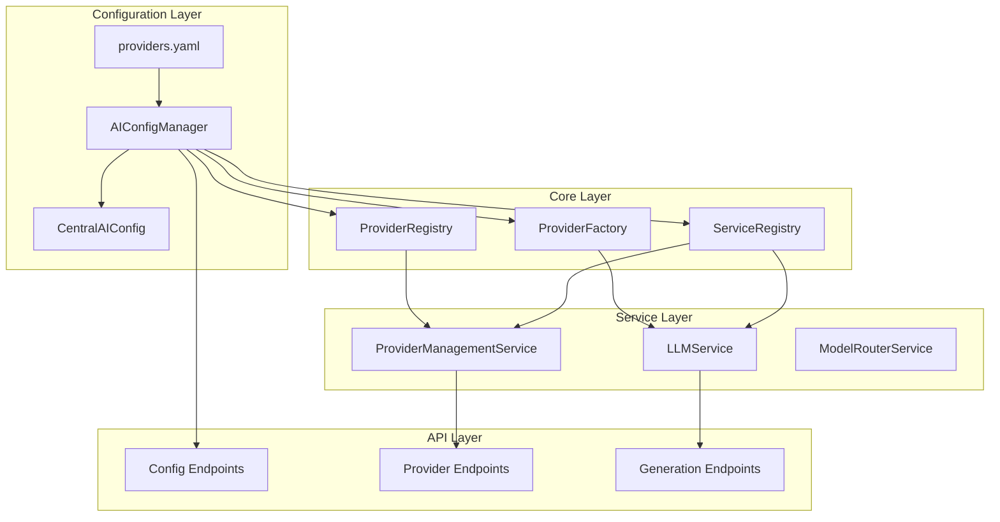
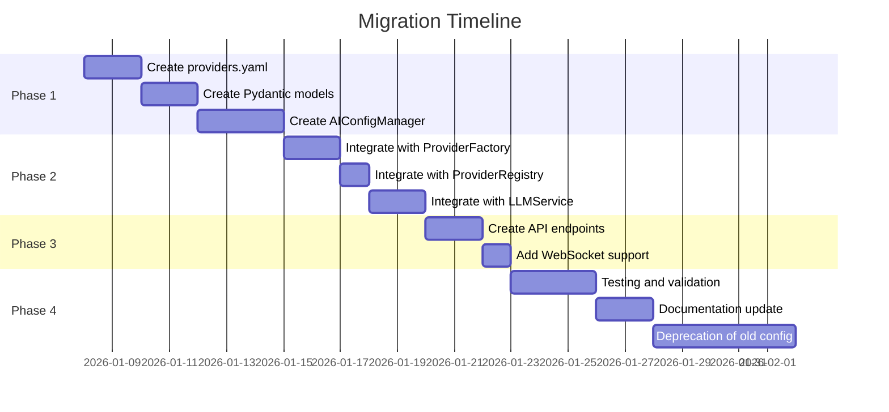
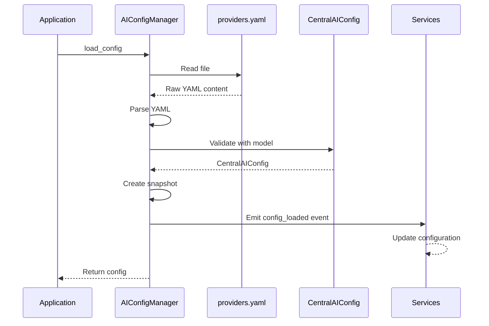
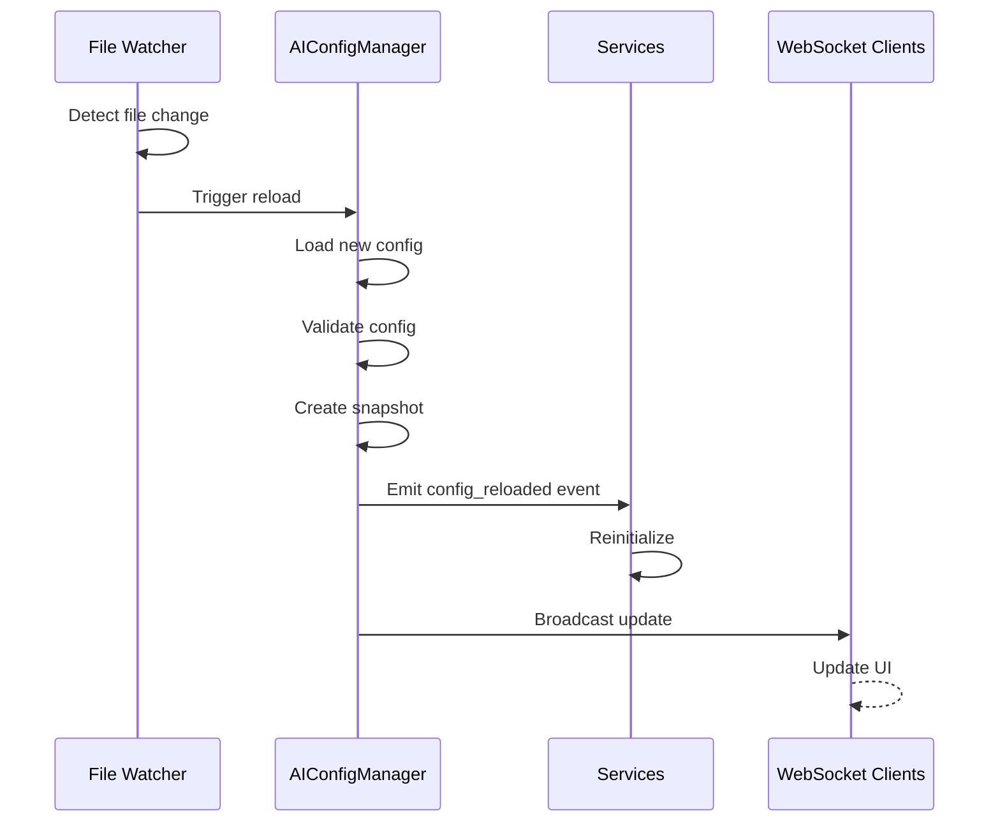
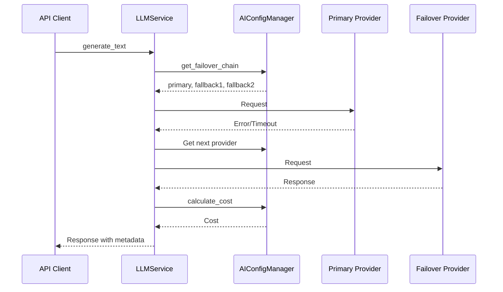
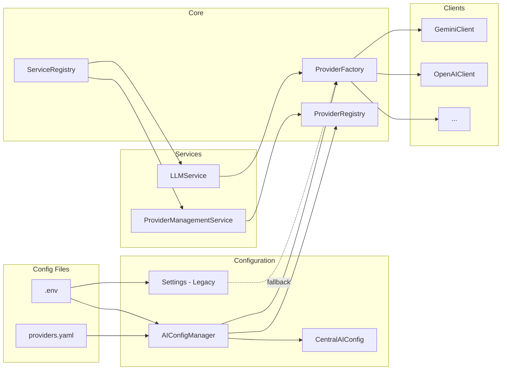
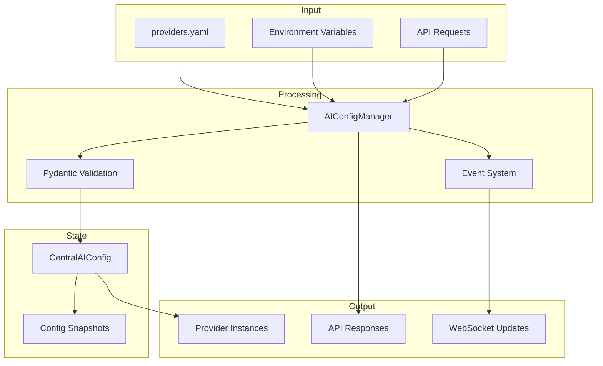

# AI Provider Configuration Design Document

## Executive Summary

This document specifies a comprehensive centralized AI provider configuration schema and management system for the Chimera project. The design introduces a YAML-based provider configuration file, enhanced Pydantic models, and a configuration manager that integrates seamlessly with the existing provider infrastructure.

**Key Design Goals:**
- Centralize all provider configurations in a single, versioned YAML file
- Provide type-safe Pydantic models for configuration validation
- Enable hot-reload of configurations without service restart
- Support failover chains, circuit breaker settings, and cost tracking
- Maintain backward compatibility with existing components

---

## Table of Contents

1. [Provider Configuration Schema](#1-provider-configuration-schema)
2. [Enhanced Settings Schema](#2-enhanced-settings-schema)
3. [Configuration Manager Design](#3-configuration-manager-design)
4. [Integration Points Specification](#4-integration-points-specification)
5. [API Contract](#5-api-contract)
6. [Migration Path](#6-migration-path)
7. [Architecture Diagrams](#7-architecture-diagrams)

---

## 1. Provider Configuration Schema

### 1.1 File Location

**Path:** `backend-api/app/config/providers.yaml`

### 1.2 Complete YAML Schema

```yaml
# =============================================================================
# Chimera AI Provider Configuration
# Version: 1.0.0
# =============================================================================
# This file defines all AI provider configurations, model parameters,
# failover chains, and operational settings for the Chimera platform.
# =============================================================================

# Schema version for migration support
schema_version: "1.0.0"

# =============================================================================
# Global Configuration
# =============================================================================
global:
  # Default provider to use when none specified
  default_provider: "gemini"
  
  # Default model (must be from default_provider)
  default_model: "gemini-3-pro-preview"
  
  # Enable automatic failover to backup providers
  failover_enabled: true
  
  # Maximum failover attempts before giving up
  max_failover_attempts: 3
  
  # Health check interval in seconds
  health_check_interval: 60
  
  # Enable response caching
  cache_enabled: true
  cache_ttl_seconds: 300
  
  # Cost tracking settings
  cost_tracking:
    enabled: true
    daily_budget_usd: 100.0
    alert_threshold_percent: 80
    hard_limit_enabled: false
  
  # Rate limiting defaults
  rate_limiting:
    enabled: true
    default_requests_per_minute: 60
    default_tokens_per_minute: 100000

# =============================================================================
# Provider Definitions
# =============================================================================
providers:
  # ---------------------------------------------------------------------------
  # Google Gemini Provider
  # ---------------------------------------------------------------------------
  gemini:
    # Provider metadata
    type: "google"
    name: "Google Gemini"
    description: "Google's Gemini family of multimodal AI models"
    enabled: true
    
    # API configuration
    api:
      base_url: "https://generativelanguage.googleapis.com/v1beta"
      key_env_var: "GOOGLE_API_KEY"
      timeout_seconds: 120
      max_retries: 3
    
    # Priority for failover ordering (higher = tried first)
    priority: 100
    
    # Provider capabilities
    capabilities:
      supports_streaming: true
      supports_vision: true
      supports_function_calling: true
      supports_json_mode: true
      supports_system_prompt: true
      supports_token_counting: true
      supports_embeddings: true
    
    # Circuit breaker configuration
    circuit_breaker:
      enabled: true
      failure_threshold: 5
      recovery_timeout_seconds: 60
      half_open_max_requests: 3
    
    # Rate limiting
    rate_limits:
      requests_per_minute: 60
      tokens_per_minute: 1000000
      requests_per_day: 10000
    
    # Model definitions
    models:
      gemini-3-pro-preview:
        name: "Gemini 3 Pro Preview"
        description: "Latest flagship model with advanced reasoning"
        context_length: 1000000
        max_output_tokens: 8192
        supports_streaming: true
        supports_vision: true
        is_default: true
        tier: "premium"
        pricing:
          input_per_1k_tokens: 0.00025
          output_per_1k_tokens: 0.001
          cached_input_per_1k_tokens: 0.0000625
      
      gemini-2.5-flash:
        name: "Gemini 2.5 Flash"
        description: "Fast and efficient for most tasks"
        context_length: 1000000
        max_output_tokens: 8192
        supports_streaming: true
        supports_vision: true
        tier: "standard"
        pricing:
          input_per_1k_tokens: 0.000075
          output_per_1k_tokens: 0.0003
      
      gemini-2.0-flash:
        name: "Gemini 2.0 Flash"
        description: "Balanced performance and cost"
        context_length: 1000000
        max_output_tokens: 8192
        supports_streaming: true
        supports_vision: true
        tier: "standard"
        pricing:
          input_per_1k_tokens: 0.0001
          output_per_1k_tokens: 0.0004
      
      gemini-1.5-pro:
        name: "Gemini 1.5 Pro"
        description: "Stable production model"
        context_length: 1000000
        max_output_tokens: 8192
        supports_streaming: true
        supports_vision: true
        tier: "standard"
        pricing:
          input_per_1k_tokens: 0.00125
          output_per_1k_tokens: 0.005
    
    # Failover chain (ordered list of providers to try)
    failover_chain:
      - "openai"
      - "anthropic"
      - "deepseek"

  # ---------------------------------------------------------------------------
  # OpenAI Provider
  # ---------------------------------------------------------------------------
  openai:
    type: "openai"
    name: "OpenAI"
    description: "OpenAI GPT models including GPT-4o and o1"
    enabled: true
    
    api:
      base_url: "https://api.openai.com/v1"
      key_env_var: "OPENAI_API_KEY"
      timeout_seconds: 120
      max_retries: 3
    
    priority: 90
    
    capabilities:
      supports_streaming: true
      supports_vision: true
      supports_function_calling: true
      supports_json_mode: true
      supports_system_prompt: true
      supports_token_counting: false  # Requires tiktoken
      supports_embeddings: true
    
    circuit_breaker:
      enabled: true
      failure_threshold: 5
      recovery_timeout_seconds: 60
      half_open_max_requests: 3
    
    rate_limits:
      requests_per_minute: 60
      tokens_per_minute: 150000
      requests_per_day: null  # No daily limit
    
    models:
      gpt-4o:
        name: "GPT-4o"
        description: "Most capable GPT-4 model for complex tasks"
        context_length: 128000
        max_output_tokens: 16384
        supports_streaming: true
        supports_vision: true
        is_default: true
        tier: "premium"
        pricing:
          input_per_1k_tokens: 0.0025
          output_per_1k_tokens: 0.01
      
      gpt-4o-mini:
        name: "GPT-4o Mini"
        description: "Smaller, faster, cheaper GPT-4o variant"
        context_length: 128000
        max_output_tokens: 16384
        supports_streaming: true
        supports_vision: true
        tier: "standard"
        pricing:
          input_per_1k_tokens: 0.00015
          output_per_1k_tokens: 0.0006
      
      o1:
        name: "o1"
        description: "Advanced reasoning model with chain-of-thought"
        context_length: 200000
        max_output_tokens: 100000
        supports_streaming: false
        supports_vision: false
        tier: "premium"
        pricing:
          input_per_1k_tokens: 0.015
          output_per_1k_tokens: 0.06
          reasoning_per_1k_tokens: 0.06
      
      o1-mini:
        name: "o1 Mini"
        description: "Smaller reasoning model for coding tasks"
        context_length: 128000
        max_output_tokens: 65536
        supports_streaming: false
        supports_vision: false
        tier: "standard"
        pricing:
          input_per_1k_tokens: 0.003
          output_per_1k_tokens: 0.012
          reasoning_per_1k_tokens: 0.012
      
      gpt-3.5-turbo:
        name: "GPT-3.5 Turbo"
        description: "Fast and cost-effective for simple tasks"
        context_length: 16385
        max_output_tokens: 4096
        supports_streaming: true
        supports_vision: false
        tier: "economy"
        pricing:
          input_per_1k_tokens: 0.0005
          output_per_1k_tokens: 0.0015
    
    failover_chain:
      - "anthropic"
      - "gemini"
      - "deepseek"

  # ---------------------------------------------------------------------------
  # Anthropic Provider
  # ---------------------------------------------------------------------------
  anthropic:
    type: "anthropic"
    name: "Anthropic"
    description: "Anthropic Claude models with strong safety features"
    enabled: true
    
    api:
      base_url: "https://api.anthropic.com/v1"
      key_env_var: "ANTHROPIC_API_KEY"
      timeout_seconds: 120
      max_retries: 3
      custom_headers:
        anthropic-version: "2024-01-01"
    
    priority: 80
    
    capabilities:
      supports_streaming: true
      supports_vision: true
      supports_function_calling: true
      supports_json_mode: false
      supports_system_prompt: true
      supports_token_counting: false
      supports_embeddings: false
    
    circuit_breaker:
      enabled: true
      failure_threshold: 5
      recovery_timeout_seconds: 60
      half_open_max_requests: 3
    
    rate_limits:
      requests_per_minute: 50
      tokens_per_minute: 100000
      requests_per_day: null
    
    models:
      claude-3-5-sonnet-20241022:
        name: "Claude 3.5 Sonnet"
        description: "Balanced capability and speed"
        context_length: 200000
        max_output_tokens: 8192
        supports_streaming: true
        supports_vision: true
        is_default: true
        tier: "premium"
        pricing:
          input_per_1k_tokens: 0.003
          output_per_1k_tokens: 0.015
      
      claude-3-5-haiku-20241022:
        name: "Claude 3.5 Haiku"
        description: "Fastest Claude model"
        context_length: 200000
        max_output_tokens: 8192
        supports_streaming: true
        supports_vision: true
        tier: "standard"
        pricing:
          input_per_1k_tokens: 0.001
          output_per_1k_tokens: 0.005
      
      claude-3-opus-20240229:
        name: "Claude 3 Opus"
        description: "Most capable Claude model"
        context_length: 200000
        max_output_tokens: 4096
        supports_streaming: true
        supports_vision: true
        tier: "premium"
        pricing:
          input_per_1k_tokens: 0.015
          output_per_1k_tokens: 0.075
    
    failover_chain:
      - "openai"
      - "gemini"
      - "deepseek"

  # ---------------------------------------------------------------------------
  # DeepSeek Provider
  # ---------------------------------------------------------------------------
  deepseek:
    type: "deepseek"
    name: "DeepSeek"
    description: "Cost-effective models with strong reasoning capabilities"
    enabled: true
    
    api:
      base_url: "https://api.deepseek.com/v1"
      key_env_var: "DEEPSEEK_API_KEY"
      timeout_seconds: 120
      max_retries: 3
    
    priority: 70
    
    capabilities:
      supports_streaming: true
      supports_vision: false
      supports_function_calling: true
      supports_json_mode: true
      supports_system_prompt: true
      supports_token_counting: false
      supports_embeddings: false
    
    circuit_breaker:
      enabled: true
      failure_threshold: 5
      recovery_timeout_seconds: 60
      half_open_max_requests: 3
    
    rate_limits:
      requests_per_minute: 60
      tokens_per_minute: 200000
      requests_per_day: null
    
    models:
      deepseek-chat:
        name: "DeepSeek Chat (V3.2)"
        description: "Standard chat model with strong performance"
        context_length: 64000
        max_output_tokens: 8192
        supports_streaming: true
        is_default: true
        tier: "economy"
        pricing:
          input_per_1k_tokens: 0.00014
          output_per_1k_tokens: 0.00028
          cached_input_per_1k_tokens: 0.000014
      
      deepseek-reasoner:
        name: "DeepSeek Reasoner (V3.2)"
        description: "Chain-of-thought reasoning model"
        context_length: 64000
        max_output_tokens: 8192
        supports_streaming: true
        tier: "standard"
        pricing:
          input_per_1k_tokens: 0.00055
          output_per_1k_tokens: 0.00219
          reasoning_per_1k_tokens: 0.00219
    
    failover_chain:
      - "openai"
      - "gemini"
      - "anthropic"

  # ---------------------------------------------------------------------------
  # Qwen Provider
  # ---------------------------------------------------------------------------
  qwen:
    type: "qwen"
    name: "Alibaba Qwen"
    description: "Alibaba Cloud's Qwen model family via DashScope"
    enabled: true
    
    api:
      base_url: "https://dashscope.aliyuncs.com/api/v1"
      key_env_var: "QWEN_API_KEY"
      timeout_seconds: 120
      max_retries: 3
    
    priority: 60
    
    capabilities:
      supports_streaming: true
      supports_vision: true
      supports_function_calling: true
      supports_json_mode: false
      supports_system_prompt: true
      supports_token_counting: false
      supports_embeddings: true
    
    circuit_breaker:
      enabled: true
      failure_threshold: 5
      recovery_timeout_seconds: 60
      half_open_max_requests: 3
    
    rate_limits:
      requests_per_minute: 60
      tokens_per_minute: 100000
      requests_per_day: null
    
    models:
      qwen-max:
        name: "Qwen Max"
        description: "Most capable Qwen model"
        context_length: 32768
        max_output_tokens: 8192
        supports_streaming: true
        is_default: true
        tier: "premium"
        pricing:
          input_per_1k_tokens: 0.004
          output_per_1k_tokens: 0.012
      
      qwen-plus:
        name: "Qwen Plus"
        description: "Balanced performance model"
        context_length: 32768
        max_output_tokens: 8192
        supports_streaming: true
        tier: "standard"
        pricing:
          input_per_1k_tokens: 0.002
          output_per_1k_tokens: 0.006
      
      qwen-turbo:
        name: "Qwen Turbo"
        description: "Fast and cost-effective"
        context_length: 8192
        max_output_tokens: 4096
        supports_streaming: true
        tier: "economy"
        pricing:
          input_per_1k_tokens: 0.0008
          output_per_1k_tokens: 0.002
    
    failover_chain:
      - "deepseek"
      - "gemini"
      - "openai"

  # ---------------------------------------------------------------------------
  # BigModel (ZhiPu AI) Provider
  # ---------------------------------------------------------------------------
  bigmodel:
    type: "bigmodel"
    name: "ZhiPu BigModel"
    description: "ZhiPu AI's GLM model family"
    enabled: true
    
    api:
      base_url: "https://open.bigmodel.cn/api/paas/v4"
      key_env_var: "BIGMODEL_API_KEY"
      timeout_seconds: 120
      max_retries: 3
    
    priority: 40
    
    capabilities:
      supports_streaming: true
      supports_vision: true
      supports_function_calling: true
      supports_json_mode: false
      supports_system_prompt: true
      supports_token_counting: false
      supports_embeddings: true
    
    circuit_breaker:
      enabled: true
      failure_threshold: 5
      recovery_timeout_seconds: 60
      half_open_max_requests: 3
    
    rate_limits:
      requests_per_minute: 60
      tokens_per_minute: 100000
      requests_per_day: null
    
    models:
      glm-4.7:
        name: "GLM-4.7"
        description: "Latest flagship GLM model"
        context_length: 128000
        max_output_tokens: 8192
        supports_streaming: true
        is_default: true
        tier: "premium"
        pricing:
          input_per_1k_tokens: 0.001
          output_per_1k_tokens: 0.001
      
      glm-4.5-flash:
        name: "GLM-4.5 Flash"
        description: "Fast and efficient"
        context_length: 128000
        max_output_tokens: 8192
        supports_streaming: true
        tier: "standard"
        pricing:
          input_per_1k_tokens: 0.0001
          output_per_1k_tokens: 0.0001
    
    failover_chain:
      - "deepseek"
      - "qwen"
      - "gemini"

  # ---------------------------------------------------------------------------
  # Cursor Provider
  # ---------------------------------------------------------------------------
  cursor:
    type: "cursor"
    name: "Cursor"
    description: "Cursor IDE's AI backend (OpenAI-compatible)"
    enabled: true
    
    api:
      base_url: "https://api.openai.com/v1"
      key_env_var: "CURSOR_API_KEY"
      timeout_seconds: 120
      max_retries: 3
    
    priority: 50
    
    capabilities:
      supports_streaming: true
      supports_vision: true
      supports_function_calling: true
      supports_json_mode: true
      supports_system_prompt: true
      supports_token_counting: false
      supports_embeddings: false
    
    circuit_breaker:
      enabled: true
      failure_threshold: 5
      recovery_timeout_seconds: 60
      half_open_max_requests: 3
    
    rate_limits:
      requests_per_minute: 60
      tokens_per_minute: 150000
      requests_per_day: null
    
    # Inherits OpenAI models
    models:
      gpt-4o:
        name: "GPT-4o (via Cursor)"
        context_length: 128000
        max_output_tokens: 16384
        supports_streaming: true
        supports_vision: true
        is_default: true
        tier: "premium"
    
    failover_chain:
      - "openai"
      - "anthropic"
      - "gemini"

  # ---------------------------------------------------------------------------
  # Routeway Provider
  # ---------------------------------------------------------------------------
  routeway:
    type: "routeway"
    name: "Routeway"
    description: "Unified AI Gateway with multi-provider routing"
    enabled: true
    
    api:
      base_url: "https://api.routeway.ai/v1"
      key_env_var: "ROUTEWAY_API_KEY"
      timeout_seconds: 120
      max_retries: 3
    
    priority: 30
    
    capabilities:
      supports_streaming: true
      supports_vision: true
      supports_function_calling: true
      supports_json_mode: true
      supports_system_prompt: true
      supports_token_counting: false
      supports_embeddings: false
    
    circuit_breaker:
      enabled: true
      failure_threshold: 5
      recovery_timeout_seconds: 60
      half_open_max_requests: 3
    
    rate_limits:
      requests_per_minute: 60
      tokens_per_minute: 150000
      requests_per_day: null
    
    models:
      gpt-4o-mini:
        name: "GPT-4o Mini (via Routeway)"
        context_length: 128000
        max_output_tokens: 16384
        supports_streaming: true
        is_default: true
        tier: "standard"
    
    failover_chain:
      - "openai"
      - "gemini"
      - "anthropic"

# =============================================================================
# Provider Aliases
# =============================================================================
aliases:
  google: "gemini"
  gpt: "openai"
  gpt-4: "openai"
  claude: "anthropic"
  zhipu: "bigmodel"
  glm: "bigmodel"
  dashscope: "qwen"
  alibaba: "qwen"

# =============================================================================
# Named Failover Chains (Reusable)
# =============================================================================
failover_chains:
  premium:
    description: "Chain for premium/complex tasks"
    providers:
      - "gemini"
      - "openai"
      - "anthropic"
  
  cost_optimized:
    description: "Chain optimized for cost"
    providers:
      - "deepseek"
      - "qwen"
      - "bigmodel"
      - "gemini"
  
  fast:
    description: "Chain optimized for speed"
    providers:
      - "gemini"
      - "deepseek"
      - "openai"
  
  reasoning:
    description: "Chain for complex reasoning tasks"
    providers:
      - "openai"  # o1 models
      - "anthropic"
      - "deepseek"  # DeepSeek Reasoner
```

### 1.3 Schema Description

| Section | Purpose |
|---------|---------|
| `schema_version` | Version string for migration support |
| `global` | Default settings and global configurations |
| `providers` | Individual provider definitions with models |
| `aliases` | Provider name aliases for flexibility |
| `failover_chains` | Named reusable failover configurations |

---

## 2. Enhanced Settings Schema

### 2.1 File Location

**Path:** `backend-api/app/config/ai_provider_settings.py`

### 2.2 Pydantic Model Hierarchy

```python
"""
AI Provider Configuration Settings

Pydantic models for type-safe AI provider configuration management.
Provides validation, serialization, and hot-reload support.
"""

from datetime import datetime
from enum import Enum
from typing import Any, ClassVar, Optional

from pydantic import BaseModel, ConfigDict, Field, field_validator, model_validator


# =============================================================================
# Enumerations
# =============================================================================

class ProviderType(str, Enum):
    """Supported AI provider types."""
    GOOGLE = "google"
    GEMINI = "gemini"
    OPENAI = "openai"
    ANTHROPIC = "anthropic"
    DEEPSEEK = "deepseek"
    QWEN = "qwen"
    BIGMODEL = "bigmodel"
    CURSOR = "cursor"
    ROUTEWAY = "routeway"
    CUSTOM = "custom"


class ModelTier(str, Enum):
    """Model pricing/capability tier."""
    ECONOMY = "economy"
    STANDARD = "standard"
    PREMIUM = "premium"
    ENTERPRISE = "enterprise"


class ProviderStatus(str, Enum):
    """Provider operational status."""
    HEALTHY = "healthy"
    DEGRADED = "degraded"
    UNHEALTHY = "unhealthy"
    RATE_LIMITED = "rate_limited"
    DISABLED = "disabled"
    UNKNOWN = "unknown"


class CircuitState(str, Enum):
    """Circuit breaker state."""
    CLOSED = "closed"
    OPEN = "open"
    HALF_OPEN = "half_open"


# =============================================================================
# Pricing Configuration
# =============================================================================

class ModelPricing(BaseModel):
    """Pricing information for a model (per 1K tokens)."""
    
    input_per_1k_tokens: float = Field(
        default=0.0,
        ge=0.0,
        description="Cost per 1K input tokens in USD"
    )
    output_per_1k_tokens: float = Field(
        default=0.0,
        ge=0.0,
        description="Cost per 1K output tokens in USD"
    )
    cached_input_per_1k_tokens: Optional[float] = Field(
        default=None,
        ge=0.0,
        description="Cost per 1K cached input tokens (if supported)"
    )
    reasoning_per_1k_tokens: Optional[float] = Field(
        default=None,
        ge=0.0,
        description="Cost per 1K reasoning tokens (for o1-like models)"
    )
    
    model_config = ConfigDict(frozen=True)


# =============================================================================
# Model Configuration
# =============================================================================

class ModelConfig(BaseModel):
    """Configuration for a specific AI model."""
    
    # Model identification
    model_id: str = Field(..., description="Unique model identifier")
    name: str = Field(..., description="Human-readable model name")
    description: Optional[str] = Field(
        default=None,
        description="Model description and use case"
    )
    
    # Context and token limits
    context_length: int = Field(
        default=4096,
        ge=1,
        description="Maximum context window size in tokens"
    )
    max_output_tokens: int = Field(
        default=4096,
        ge=1,
        description="Maximum output tokens per request"
    )
    
    # Capabilities
    supports_streaming: bool = Field(
        default=True,
        description="Whether model supports streaming responses"
    )
    supports_vision: bool = Field(
        default=False,
        description="Whether model supports image inputs"
    )
    supports_function_calling: bool = Field(
        default=False,
        description="Whether model supports function/tool calling"
    )
    
    # Classification
    is_default: bool = Field(
        default=False,
        description="Whether this is the default model for the provider"
    )
    tier: ModelTier = Field(
        default=ModelTier.STANDARD,
        description="Model pricing/capability tier"
    )
    
    # Pricing
    pricing: Optional[ModelPricing] = Field(
        default=None,
        description="Token pricing information"
    )
    
    # Additional metadata
    metadata: dict[str, Any] = Field(
        default_factory=dict,
        description="Additional model-specific metadata"
    )
    
    model_config = ConfigDict(
        protected_namespaces=(),
        frozen=True
    )


# =============================================================================
# API Configuration
# =============================================================================

class APIConfig(BaseModel):
    """API connection configuration for a provider."""
    
    base_url: str = Field(
        ...,
        description="Base URL for API requests"
    )
    key_env_var: str = Field(
        ...,
        description="Environment variable name for API key"
    )
    timeout_seconds: int = Field(
        default=120,
        ge=5,
        le=600,
        description="Request timeout in seconds"
    )
    max_retries: int = Field(
        default=3,
        ge=0,
        le=10,
        description="Maximum retry attempts"
    )
    custom_headers: dict[str, str] = Field(
        default_factory=dict,
        description="Additional headers to include in requests"
    )
    
    @field_validator("base_url")
    @classmethod
    def validate_base_url(cls, v: str) -> str:
        if not v.startswith(("http://", "https://")):
            raise ValueError("base_url must start with http:// or https://")
        return v.rstrip("/")
    
    model_config = ConfigDict(frozen=True)


# =============================================================================
# Circuit Breaker Configuration
# =============================================================================

class CircuitBreakerConfig(BaseModel):
    """Circuit breaker configuration for provider resilience."""
    
    enabled: bool = Field(
        default=True,
        description="Whether circuit breaker is enabled"
    )
    failure_threshold: int = Field(
        default=5,
        ge=1,
        le=50,
        description="Number of failures before opening circuit"
    )
    recovery_timeout_seconds: int = Field(
        default=60,
        ge=10,
        le=600,
        description="Time in seconds before attempting recovery"
    )
    half_open_max_requests: int = Field(
        default=3,
        ge=1,
        le=10,
        description="Max requests to allow in half-open state"
    )
    
    model_config = ConfigDict(frozen=True)


# =============================================================================
# Rate Limit Configuration
# =============================================================================

class RateLimitConfig(BaseModel):
    """Rate limiting configuration for a provider."""
    
    requests_per_minute: Optional[int] = Field(
        default=60,
        ge=1,
        description="Maximum requests per minute"
    )
    tokens_per_minute: Optional[int] = Field(
        default=100000,
        ge=1,
        description="Maximum tokens per minute"
    )
    requests_per_day: Optional[int] = Field(
        default=None,
        ge=1,
        description="Maximum requests per day (null for unlimited)"
    )
    
    model_config = ConfigDict(frozen=True)


# =============================================================================
# Provider Capabilities
# =============================================================================

class ProviderCapabilities(BaseModel):
    """Capability flags for a provider."""
    
    supports_streaming: bool = Field(
        default=True,
        description="Whether provider supports streaming responses"
    )
    supports_vision: bool = Field(
        default=False,
        description="Whether provider supports image inputs"
    )
    supports_function_calling: bool = Field(
        default=False,
        description="Whether provider supports function/tool calling"
    )
    supports_json_mode: bool = Field(
        default=False,
        description="Whether provider supports JSON output mode"
    )
    supports_system_prompt: bool = Field(
        default=True,
        description="Whether provider supports system prompts"
    )
    supports_token_counting: bool = Field(
        default=False,
        description="Whether provider supports token counting API"
    )
    supports_embeddings: bool = Field(
        default=False,
        description="Whether provider supports embeddings API"
    )
    
    model_config = ConfigDict(frozen=True)


# =============================================================================
# Provider Configuration
# =============================================================================

class ProviderConfig(BaseModel):
    """Complete configuration for an AI provider."""
    
    # Provider identification
    provider_id: str = Field(..., description="Unique provider identifier")
    type: ProviderType = Field(..., description="Provider type")
    name: str = Field(..., description="Human-readable provider name")
    description: Optional[str] = Field(
        default=None,
        description="Provider description"
    )
    enabled: bool = Field(
        default=True,
        description="Whether provider is enabled"
    )
    
    # API configuration
    api: APIConfig = Field(..., description="API connection configuration")
    
    # Priority and failover
    priority: int = Field(
        default=50,
        ge=0,
        le=1000,
        description="Priority for failover ordering (higher = tried first)"
    )
    failover_chain: list[str] = Field(
        default_factory=list,
        description="Ordered list of provider IDs for failover"
    )
    
    # Capabilities and limits
    capabilities: ProviderCapabilities = Field(
        default_factory=ProviderCapabilities,
        description="Provider capability flags"
    )
    circuit_breaker: CircuitBreakerConfig = Field(
        default_factory=CircuitBreakerConfig,
        description="Circuit breaker configuration"
    )
    rate_limits: RateLimitConfig = Field(
        default_factory=RateLimitConfig,
        description="Rate limiting configuration"
    )
    
    # Models
    models: dict[str, ModelConfig] = Field(
        default_factory=dict,
        description="Available models for this provider"
    )
    
    # Metadata
    metadata: dict[str, Any] = Field(
        default_factory=dict,
        description="Additional provider-specific metadata"
    )
    
    model_config = ConfigDict(
        protected_namespaces=(),
        frozen=True
    )
    
    @model_validator(mode="after")
    def validate_provider(self) -> "ProviderConfig":
        """Ensure at least one model is marked as default."""
        if self.models:
            has_default = any(m.is_default for m in self.models.values())
            if not has_default:
                # If no default, mark first model as default
                first_model_id = next(iter(self.models.keys()))
                # Note: Since frozen=True, we'd need to handle this differently
                # in actual implementation
        return self
    
    def get_default_model(self) -> Optional[ModelConfig]:
        """Get the default model for this provider."""
        for model in self.models.values():
            if model.is_default:
                return model
        return next(iter(self.models.values()), None) if self.models else None
    
    def get_model(self, model_id: str) -> Optional[ModelConfig]:
        """Get a specific model by ID."""
        return self.models.get(model_id)


# =============================================================================
# Cost Tracking Configuration
# =============================================================================

class CostTrackingConfig(BaseModel):
    """Configuration for cost tracking and budgets."""
    
    enabled: bool = Field(
        default=True,
        description="Whether cost tracking is enabled"
    )
    daily_budget_usd: Optional[float] = Field(
        default=None,
        ge=0.0,
        description="Daily budget limit in USD"
    )
    alert_threshold_percent: int = Field(
        default=80,
        ge=0,
        le=100,
        description="Percentage of budget to trigger alerts"
    )
    hard_limit_enabled: bool = Field(
        default=False,
        description="Whether to enforce hard budget limits"
    )
    
    model_config = ConfigDict(frozen=True)


# =============================================================================
# Global Configuration
# =============================================================================

class GlobalConfig(BaseModel):
    """Global configuration settings."""
    
    default_provider: str = Field(
        default="gemini",
        description="Default provider ID"
    )
    default_model: str = Field(
        default="gemini-3-pro-preview",
        description="Default model ID"
    )
    failover_enabled: bool = Field(
        default=True,
        description="Enable automatic provider failover"
    )
    max_failover_attempts: int = Field(
        default=3,
        ge=1,
        le=10,
        description="Maximum failover attempts"
    )
    health_check_interval: int = Field(
        default=60,
        ge=10,
        le=600,
        description="Health check interval in seconds"
    )
    cache_enabled: bool = Field(
        default=True,
        description="Enable response caching"
    )
    cache_ttl_seconds: int = Field(
        default=300,
        ge=0,
        le=3600,
        description="Cache TTL in seconds"
    )
    cost_tracking: CostTrackingConfig = Field(
        default_factory=CostTrackingConfig,
        description="Cost tracking configuration"
    )
    rate_limiting: RateLimitConfig = Field(
        default_factory=RateLimitConfig,
        description="Default rate limiting configuration"
    )
    
    model_config = ConfigDict(frozen=True)


# =============================================================================
# Failover Chain Configuration
# =============================================================================

class FailoverChainConfig(BaseModel):
    """Named failover chain configuration."""
    
    name: str = Field(..., description="Chain name")
    description: Optional[str] = Field(
        default=None,
        description="Chain description"
    )
    providers: list[str] = Field(
        ...,
        min_length=1,
        description="Ordered list of provider IDs"
    )
    
    model_config = ConfigDict(frozen=True)


# =============================================================================
# Central AI Configuration
# =============================================================================

class CentralAIConfig(BaseModel):
    """
    Root configuration binding for the AI provider system.
    
    This is the top-level configuration model that loads from providers.yaml
    and provides access to all provider configurations.
    """
    
    # Schema version
    schema_version: str = Field(
        default="1.0.0",
        description="Configuration schema version"
    )
    
    # Global settings
    global_config: GlobalConfig = Field(
        default_factory=GlobalConfig,
        alias="global",
        description="Global configuration settings"
    )
    
    # Provider configurations
    providers: dict[str, ProviderConfig] = Field(
        default_factory=dict,
        description="Provider configurations keyed by provider ID"
    )
    
    # Aliases
    aliases: dict[str, str] = Field(
        default_factory=dict,
        description="Provider name aliases"
    )
    
    # Named failover chains
    failover_chains: dict[str, FailoverChainConfig] = Field(
        default_factory=dict,
        description="Named failover chain configurations"
    )
    
    # Metadata
    loaded_at: Optional[datetime] = Field(
        default=None,
        description="Timestamp when config was loaded"
    )
    config_hash: Optional[str] = Field(
        default=None,
        description="Hash of config for change detection"
    )
    
    model_config = ConfigDict(
        protected_namespaces=(),
        populate_by_name=True
    )
    
    @model_validator(mode="after")
    def validate_config(self) -> "CentralAIConfig":
        """Validate configuration consistency."""
        # Validate default provider exists
        if self.global_config.default_provider not in self.providers:
            raise ValueError(
                f"Default provider '{self.global_config.default_provider}' "
                "not found in providers"
            )
        
        # Validate failover chains reference valid providers
        for provider in self.providers.values():
            for failover_id in provider.failover_chain:
                resolved_id = self.aliases.get(failover_id, failover_id)
                if resolved_id not in self.providers:
                    raise ValueError(
                        f"Failover provider '{failover_id}' in "
                        f"'{provider.provider_id}' chain not found"
                    )
        
        return self
    
    def get_provider(self, provider_id: str) -> Optional[ProviderConfig]:
        """Get provider by ID or alias."""
        resolved_id = self.aliases.get(provider_id.lower(), provider_id.lower())
        return self.providers.get(resolved_id)
    
    def get_default_provider(self) -> Optional[ProviderConfig]:
        """Get the default provider configuration."""
        return self.providers.get(self.global_config.default_provider)
    
    def get_enabled_providers(self) -> list[ProviderConfig]:
        """Get all enabled providers sorted by priority."""
        enabled = [p for p in self.providers.values() if p.enabled]
        return sorted(enabled, key=lambda p: -p.priority)
    
    def get_failover_chain(
        self,
        provider_id: str,
        chain_name: Optional[str] = None
    ) -> list[str]:
        """Get failover chain for a provider."""
        if chain_name and chain_name in self.failover_chains:
            return self.failover_chains[chain_name].providers
        
        provider = self.get_provider(provider_id)
        if provider:
            return provider.failover_chain
        
        return []
    
    def calculate_cost(
        self,
        provider_id: str,
        model_id: str,
        input_tokens: int,
        output_tokens: int,
        reasoning_tokens: int = 0
    ) -> float:
        """Calculate cost for a request."""
        provider = self.get_provider(provider_id)
        if not provider:
            return 0.0
        
        model = provider.get_model(model_id)
        if not model or not model.pricing:
            return 0.0
        
        pricing = model.pricing
        cost = (
            (input_tokens / 1000) * pricing.input_per_1k_tokens +
            (output_tokens / 1000) * pricing.output_per_1k_tokens
        )
        
        if reasoning_tokens > 0 and pricing.reasoning_per_1k_tokens:
            cost += (reasoning_tokens / 1000) * pricing.reasoning_per_1k_tokens
        
        return cost


# =============================================================================
# Configuration Snapshot (for versioning)
# =============================================================================

class ConfigSnapshot(BaseModel):
    """Snapshot of configuration for versioning and rollback."""
    
    version: int = Field(..., description="Snapshot version number")
    config: CentralAIConfig = Field(..., description="Configuration snapshot")
    created_at: datetime = Field(
        default_factory=datetime.utcnow,
        description="Snapshot creation timestamp"
    )
    created_by: Optional[str] = Field(
        default=None,
        description="User/process that created the snapshot"
    )
    description: Optional[str] = Field(
        default=None,
        description="Description of changes"
    )
    
    model_config = ConfigDict(frozen=True)
```

---

## 3. Configuration Manager Design

### 3.1 File Location

**Path:** `backend-api/app/core/ai_config_manager.py`

### 3.2 Interface Specification

```python
"""
AI Configuration Manager

Centralized manager for loading, validating, and providing access to
AI provider configurations. Supports hot-reload and configuration versioning.
"""

import asyncio
import hashlib
import logging
from collections.abc import Callable
from datetime import datetime
from pathlib import Path
from typing import Any, Optional

import yaml

from app.config.ai_provider_settings import (
    CentralAIConfig,
    ConfigSnapshot,
    ProviderConfig,
    ModelConfig,
)

logger = logging.getLogger(__name__)


# =============================================================================
# Configuration Events
# =============================================================================

class ConfigEventType:
    """Configuration event types."""
    CONFIG_LOADED = "config_loaded"
    CONFIG_RELOADED = "config_reloaded"
    PROVIDER_ENABLED = "provider_enabled"
    PROVIDER_DISABLED = "provider_disabled"
    DEFAULT_CHANGED = "default_changed"
    VALIDATION_ERROR = "validation_error"


class ConfigEvent:
    """Configuration change event."""
    
    def __init__(
        self,
        event_type: str,
        data: dict[str, Any],
        timestamp: Optional[datetime] = None
    ):
        self.event_type = event_type
        self.data = data
        self.timestamp = timestamp or datetime.utcnow()
    
    def to_dict(self) -> dict[str, Any]:
        return {
            "event_type": self.event_type,
            "data": self.data,
            "timestamp": self.timestamp.isoformat()
        }


# =============================================================================
# Configuration Manager Interface
# =============================================================================

class AIConfigManager:
    """
    Centralized AI provider configuration manager.
    
    Features:
    - Load and validate provider configurations from YAML
    - Provide current active provider/model binding
    - Support runtime configuration changes
    - Emit configuration change events
    - Thread-safe configuration access
    - Configuration versioning for rollback
    
    Example:
        manager = AIConfigManager()
        await manager.load_config()
        
        # Get current config
        config = manager.get_config()
        
        # Get specific provider
        provider = manager.get_provider("openai")
        
        # Get default model
        default_model = manager.get_default_model()
        
        # Subscribe to changes
        manager.on_change(my_callback)
    """
    
    _instance: Optional["AIConfigManager"] = None
    
    DEFAULT_CONFIG_PATH = Path("backend-api/app/config/providers.yaml")
    MAX_SNAPSHOTS = 10
    
    def __new__(cls):
        """Singleton pattern for global configuration access."""
        if cls._instance is None:
            cls._instance = super().__new__(cls)
            cls._instance._initialized = False
        return cls._instance
    
    def __init__(self):
        if self._initialized:
            return
        
        self._config: Optional[CentralAIConfig] = None
        self._config_path: Path = self.DEFAULT_CONFIG_PATH
        self._lock = asyncio.Lock()
        self._callbacks: list[Callable[[ConfigEvent], None]] = []
        self._async_callbacks: list[Callable[[ConfigEvent], Any]] = []
        self._snapshots: list[ConfigSnapshot] = []
        self._file_watcher_task: Optional[asyncio.Task] = None
        self._last_file_hash: Optional[str] = None
        self._initialized = True
        
        logger.info("AIConfigManager initialized")
    
    # =========================================================================
    # Configuration Loading
    # =========================================================================
    
    async def load_config(
        self,
        config_path: Optional[Path] = None,
        validate: bool = True
    ) -> CentralAIConfig:
        """
        Load configuration from YAML file.
        
        Args:
            config_path: Optional path to config file (defaults to providers.yaml)
            validate: Whether to validate configuration after loading
        
        Returns:
            Loaded and validated CentralAIConfig
        
        Raises:
            FileNotFoundError: If config file doesn't exist
            ValueError: If configuration is invalid
        """
        async with self._lock:
            path = config_path or self._config_path
            
            if not path.exists():
                # Try relative to project root
                alt_path = Path("app/config/providers.yaml")
                if alt_path.exists():
                    path = alt_path
                else:
                    raise FileNotFoundError(f"Config file not found: {path}")
            
            logger.info(f"Loading AI provider config from: {path}")
            
            # Read and parse YAML
            with open(path, "r", encoding="utf-8") as f:
                raw_config = yaml.safe_load(f)
            
            # Calculate file hash for change detection
            with open(path, "rb") as f:
                file_hash = hashlib.sha256(f.read()).hexdigest()
            
            # Parse into Pydantic model
            config = self._parse_config(raw_config)
            config.loaded_at = datetime.utcnow()
            config.config_hash = file_hash
            
            # Validate if requested
            if validate:
                self._validate_config(config)
            
            # Store configuration
            old_config = self._config
            self._config = config
            self._config_path = path
            self._last_file_hash = file_hash
            
            # Create snapshot
            self._create_snapshot(config, "Initial load" if not old_config else "Reload")
            
            # Emit event
            event_type = ConfigEventType.CONFIG_LOADED if not old_config else ConfigEventType.CONFIG_RELOADED
            await self._emit_event(ConfigEvent(
                event_type=event_type,
                data={
                    "config_path": str(path),
                    "provider_count": len(config.providers),
                    "default_provider": config.global_config.default_provider,
                    "schema_version": config.schema_version
                }
            ))
            
            logger.info(
                f"Loaded AI config: {len(config.providers)} providers, "
                f"default={config.global_config.default_provider}"
            )
            
            return config
    
    def _parse_config(self, raw_config: dict[str, Any]) -> CentralAIConfig:
        """Parse raw YAML config into Pydantic model."""
        # Transform providers dict to include provider_id
        if "providers" in raw_config:
            for provider_id, provider_data in raw_config["providers"].items():
                provider_data["provider_id"] = provider_id
                
                # Transform models dict to include model_id
                if "models" in provider_data:
                    for model_id, model_data in provider_data["models"].items():
                        model_data["model_id"] = model_id
        
        # Transform failover_chains
        if "failover_chains" in raw_config:
            for chain_name, chain_data in raw_config["failover_chains"].items():
                chain_data["name"] = chain_name
        
        return CentralAIConfig.model_validate(raw_config)
    
    def _validate_config(self, config: CentralAIConfig) -> None:
        """Perform additional validation beyond Pydantic."""
        errors = []
        
        # Check API key environment variables exist
        for provider_id, provider in config.providers.items():
            if provider.enabled:
                import os
                if not os.getenv(provider.api.key_env_var):
                    logger.warning(
                        f"API key env var '{provider.api.key_env_var}' "
                        f"not set for provider '{provider_id}'"
                    )
        
        # Check failover chain validity
        for provider_id, provider in config.providers.items():
            for failover_id in provider.failover_chain:
                resolved = config.aliases.get(failover_id, failover_id)
                if resolved not in config.providers:
                    errors.append(
                        f"Invalid failover provider '{failover_id}' "
                        f"in '{provider_id}' chain"
                    )
        
        if errors:
            raise ValueError(f"Configuration validation failed: {errors}")
    
    # =========================================================================
    # Configuration Access (Thread-Safe)
    # =========================================================================
    
    def get_config(self) -> CentralAIConfig:
        """
        Get current configuration.
        
        Returns:
            Current CentralAIConfig
        
        Raises:
            RuntimeError: If configuration not loaded
        """
        if not self._config:
            raise RuntimeError("Configuration not loaded. Call load_config() first.")
        return self._config
    
    def get_provider(self, provider_id: str) -> Optional[ProviderConfig]:
        """
        Get provider configuration by ID or alias.
        
        Args:
            provider_id: Provider ID or alias
        
        Returns:
            ProviderConfig or None if not found
        """
        config = self.get_config()
        return config.get_provider(provider_id)
    
    def get_default_provider(self) -> ProviderConfig:
        """
        Get the default provider configuration.
        
        Returns:
            Default ProviderConfig
        
        Raises:
            RuntimeError: If no default provider configured
        """
        config = self.get_config()
        provider = config.get_default_provider()
        if not provider:
            raise RuntimeError("No default provider configured")
        return provider
    
    def get_default_model(self) -> ModelConfig:
        """
        Get the default model configuration.
        
        Returns:
            Default ModelConfig
        
        Raises:
            RuntimeError: If no default model configured
        """
        provider = self.get_default_provider()
        model = provider.get_default_model()
        if not model:
            raise RuntimeError(
                f"No default model for provider '{provider.provider_id}'"
            )
        return model
    
    def get_model(
        self,
        model_id: str,
        provider_id: Optional[str] = None
    ) -> Optional[ModelConfig]:
        """
        Get model configuration.
        
        Args:
            model_id: Model ID to find
            provider_id: Optional provider ID (searches all if not specified)
        
        Returns:
            ModelConfig or None if not found
        """
        config = self.get_config()
        
        if provider_id:
            provider = config.get_provider(provider_id)
            return provider.get_model(model_id) if provider else None
        
        # Search all providers
        for provider in config.providers.values():
            model = provider.get_model(model_id)
            if model:
                return model
        
        return None
    
    def get_enabled_providers(self) -> list[ProviderConfig]:
        """Get all enabled providers sorted by priority."""
        config = self.get_config()
        return config.get_enabled_providers()
    
    def get_failover_chain(
        self,
        provider_id: str,
        chain_name: Optional[str] = None
    ) -> list[str]:
        """Get failover chain for a provider."""
        config = self.get_config()
        return config.get_failover_chain(provider_id, chain_name)
    
    # =========================================================================
    # Runtime Configuration Changes
    # =========================================================================
    
    async def set_default_provider(self, provider_id: str) -> None:
        """
        Change the default provider at runtime.
        
        Args:
            provider_id: New default provider ID
        
        Raises:
            ValueError: If provider doesn't exist or is disabled
        """
        async with self._lock:
            config = self.get_config()
            provider = config.get_provider(provider_id)
            
            if not provider:
                raise ValueError(f"Provider '{provider_id}' not found")
            if not provider.enabled:
                raise ValueError(f"Provider '{provider_id}' is disabled")
            
            old_default = config.global_config.default_provider
            
            # Create new config with updated default
            # Note: In practice, would need mutable config or reload
            logger.info(f"Default provider changed: {old_default} -> {provider_id}")
            
            await self._emit_event(ConfigEvent(
                event_type=ConfigEventType.DEFAULT_CHANGED,
                data={
                    "old_default": old_default,
                    "new_default": provider_id
                }
            ))
    
    async def enable_provider(self, provider_id: str) -> None:
        """Enable a provider at runtime."""
        async with self._lock:
            provider = self.get_provider(provider_id)
            if not provider:
                raise ValueError(f"Provider '{provider_id}' not found")
            
            # Would update config in practice
            logger.info(f"Provider '{provider_id}' enabled")
            
            await self._emit_event(ConfigEvent(
                event_type=ConfigEventType.PROVIDER_ENABLED,
                data={"provider_id": provider_id}
            ))
    
    async def disable_provider(self, provider_id: str) -> None:
        """Disable a provider at runtime."""
        async with self._lock:
            provider = self.get_provider(provider_id)
            if not provider:
                raise ValueError(f"Provider '{provider_id}' not found")
            
            # Prevent disabling default provider
            config = self.get_config()
            if provider_id == config.global_config.default_provider:
                raise ValueError("Cannot disable the default provider")
            
            # Would update config in practice
            logger.info(f"Provider '{provider_id}' disabled")
            
            await self._emit_event(ConfigEvent(
                event_type=ConfigEventType.PROVIDER_DISABLED,
                data={"provider_id": provider_id}
            ))
    
    # =========================================================================
    # Hot-Reload Support
    # =========================================================================
    
    async def reload_config(self) -> CentralAIConfig:
        """
        Reload configuration from file.
        
        Returns:
            Reloaded CentralAIConfig
        """
        return await self.load_config(self._config_path)
    
    async def start_file_watcher(self, interval_seconds: int = 5) -> None:
        """
        Start watching config file for changes.
        
        Args:
            interval_seconds: Check interval in seconds
        """
        if self._file_watcher_task and not self._file_watcher_task.done():
            logger.warning("File watcher already running")
            return
        
        self._file_watcher_task = asyncio.create_task(
            self._file_watcher_loop(interval_seconds)
        )
        logger.info(f"Started config file watcher (interval={interval_seconds}s)")
    
    async def stop_file_watcher(self) -> None:
        """Stop the file watcher."""
        if self._file_watcher_task:
            self._file_watcher_task.cancel()
            try:
                await self._file_watcher_task
            except asyncio.CancelledError:
                pass
            self._file_watcher_task = None
            logger.info("Stopped config file watcher")
    
    async def _file_watcher_loop(self, interval: int) -> None:
        """Background loop to watch for config file changes."""
        while True:
            try:
                await asyncio.sleep(interval)
                
                if not self._config_path.exists():
                    continue
                
                # Check file hash
                with open(self._config_path, "rb") as f:
                    current_hash = hashlib.sha256(f.read()).hexdigest()
                
                if current_hash != self._last_file_hash:
                    logger.info("Config file changed, reloading...")
                    await self.reload_config()
                    
            except asyncio.CancelledError:
                break
            except Exception as e:
                logger.error(f"Error in file watcher: {e}")
    
    # =========================================================================
    # Configuration Versioning
    # =========================================================================
    
    def _create_snapshot(
        self,
        config: CentralAIConfig,
        description: Optional[str] = None
    ) -> ConfigSnapshot:
        """Create a configuration snapshot."""
        version = len(self._snapshots) + 1
        snapshot = ConfigSnapshot(
            version=version,
            config=config,
            description=description
        )
        
        self._snapshots.append(snapshot)
        
        # Limit snapshot history
        if len(self._snapshots) > self.MAX_SNAPSHOTS:
            self._snapshots = self._snapshots[-self.MAX_SNAPSHOTS:]
        
        return snapshot
    
    def get_snapshots(self) -> list[ConfigSnapshot]:
        """Get all configuration snapshots."""
        return self._snapshots.copy()
    
    async def rollback_to_version(self, version: int) -> CentralAIConfig:
        """
        Rollback to a previous configuration version.
        
        Args:
            version: Version number to rollback to
        
        Returns:
            Restored CentralAIConfig
        
        Raises:
            ValueError: If version not found
        """
        async with self._lock:
            for snapshot in self._snapshots:
                if snapshot.version == version:
                    self._config = snapshot.config
                    logger.info(f"Rolled back to config version {version}")
                    
                    await self._emit_event(ConfigEvent(
                        event_type=ConfigEventType.CONFIG_RELOADED,
                        data={
                            "action": "rollback",
                            "version": version
                        }
                    ))
                    
                    return snapshot.config
            
            raise ValueError(f"Config version {version} not found")
    
    # =========================================================================
    # Event Emission
    # =========================================================================
    
    def on_change(
        self,
        callback: Callable[[ConfigEvent], None],
        async_callback: bool = False
    ) -> None:
        """
        Register a callback for configuration changes.
        
        Args:
            callback: Function to call on config changes
            async_callback: Whether callback is async
        """
        if async_callback:
            self._async_callbacks.append(callback)
        else:
            self._callbacks.append(callback)
    
    def remove_callback(self, callback: Callable) -> None:
        """Remove a registered callback."""
        if callback in self._callbacks:
            self._callbacks.remove(callback)
        if callback in self._async_callbacks:
            self._async_callbacks.remove(callback)
    
    async def _emit_event(self, event: ConfigEvent) -> None:
        """Emit event to all registered callbacks."""
        # Sync callbacks
        for callback in self._callbacks:
            try:
                callback(event)
            except Exception as e:
                logger.error(f"Error in config callback: {e}")
        
        # Async callbacks
        for callback in self._async_callbacks:
            try:
                await callback(event)
            except Exception as e:
                logger.error(f"Error in async config callback: {e}")
    
    # =========================================================================
    # Utility Methods
    # =========================================================================
    
    def calculate_cost(
        self,
        provider_id: str,
        model_id: str,
        input_tokens: int,
        output_tokens: int,
        reasoning_tokens: int = 0
    ) -> float:
        """Calculate cost for a request using config pricing."""
        config = self.get_config()
        return config.calculate_cost(
            provider_id, model_id,
            input_tokens, output_tokens, reasoning_tokens
        )
    
    def get_provider_status(self, provider_id: str) -> dict[str, Any]:
        """Get current status for a provider."""
        provider = self.get_provider(provider_id)
        if not provider:
            return {"status": "not_found"}
        
        return {
            "provider_id": provider_id,
            "name": provider.name,
            "enabled": provider.enabled,
            "priority": provider.priority,
            "model_count": len(provider.models),
            "default_model": provider.get_default_model().model_id if provider.get_default_model() else None
        }
    
    def to_dict(self) -> dict[str, Any]:
        """Export current configuration as dictionary."""
        config = self.get_config()
        return config.model_dump()


# =============================================================================
# Global Instance
# =============================================================================

# Singleton instance
ai_config_manager = AIConfigManager()


def get_ai_config_manager() -> AIConfigManager:
    """Get the global AI configuration manager instance."""
    return ai_config_manager
```

---

## 4. Integration Points Specification

### 4.1 Integration Architecture Overview



### 4.2 ProviderFactory Integration

The `ProviderFactory` will be modified to use the configuration manager instead of hardcoded provider mappings.

```python
# backend-api/app/core/provider_factory.py (Modified)

from app.core.ai_config_manager import get_ai_config_manager

class ProviderFactory:
    """Factory for creating LLM provider clients using centralized config."""
    
    # Client class registry (unchanged)
    _providers: dict[str, type[LLMProviderInterface]] = {
        "gemini": GeminiClient,
        "openai": OpenAIClient,
        "anthropic": AnthropicClient,
        "deepseek": DeepSeekClient,
        "qwen": QwenClient,
        "cursor": CursorClient,
        "bigmodel": BigModelClient,
        "routeway": RoutewayClient,
    }
    
    @classmethod
    def create_provider(cls, provider_name: str) -> LLMProviderInterface:
        """Create provider instance using centralized config."""
        config_manager = get_ai_config_manager()
        
        # Resolve aliases via config
        config = config_manager.get_config()
        resolved_name = config.aliases.get(provider_name.lower(), provider_name.lower())
        
        # Get provider config
        provider_config = config_manager.get_provider(resolved_name)
        if not provider_config:
            raise ValueError(f"Unknown provider: {provider_name}")
        
        if not provider_config.enabled:
            raise ValueError(f"Provider '{provider_name}' is disabled")
        
        provider_class = cls._providers.get(resolved_name)
        if not provider_class:
            raise ValueError(f"No client class for provider: {resolved_name}")
        
        logger.info(f"Creating provider: {resolved_name} (config-driven)")
        return provider_class()
    
    @classmethod
    def get_available_providers(cls) -> list[str]:
        """Return list of enabled providers from config."""
        config_manager = get_ai_config_manager()
        enabled = config_manager.get_enabled_providers()
        return [p.provider_id for p in enabled]
    
    @classmethod
    def get_provider_config(cls, provider_name: str):
        """Get provider configuration."""
        config_manager = get_ai_config_manager()
        return config_manager.get_provider(provider_name)
```

### 4.3 ProviderRegistry Integration

The `ProviderRegistry` will delegate to the configuration manager for provider information.

```python
# backend-api/app/core/provider_registry.py (Modified)

from app.core.ai_config_manager import get_ai_config_manager

class ProviderRegistry:
    """Runtime registry backed by centralized configuration."""
    
    _instance: ClassVar[Optional["ProviderRegistry"]] = None
    
    def __new__(cls):
        if cls._instance is None:
            cls._instance = super().__new__(cls)
            cls._instance._initialize()
        return cls._instance
    
    def _initialize(self):
        """Initialize registry from configuration manager."""
        self._config_manager = get_ai_config_manager()
        # Subscribe to config changes
        self._config_manager.on_change(self._on_config_change)
    
    def _on_config_change(self, event):
        """Handle configuration changes."""
        logger.info(f"ProviderRegistry received config event: {event.event_type}")
        # Could invalidate caches, update state, etc.
    
    def get_endpoint(self, provider: str) -> str:
        """Get endpoint URL from centralized config."""
        provider_config = self._config_manager.get_provider(provider)
        if provider_config:
            return provider_config.api.base_url
        # Fallback to settings for backwards compatibility
        from app.core.config import get_settings
        return get_settings().get_provider_endpoint(provider)
    
    def list_providers(self) -> dict[str, Any]:
        """List all providers from config."""
        config = self._config_manager.get_config()
        return {
            p.provider_id: {
                "name": p.name,
                "enabled": p.enabled,
                "priority": p.priority,
                "base_url": p.api.base_url,
                "models": list(p.models.keys())
            }
            for p in config.providers.values()
        }
    
    def get_provider_by_model(self, model: str) -> str | None:
        """Find which provider hosts a specific model."""
        config = self._config_manager.get_config()
        for provider in config.providers.values():
            if model in provider.models:
                return provider.provider_id
        return None
```

### 4.4 LLMService Integration

The `LLMService` will use the configuration manager for failover chains and provider selection.

```python
# backend-api/app/services/llm_service.py (Modified sections)

from app.core.ai_config_manager import get_ai_config_manager

class LLMService:
    """LLM Service with config-driven failover."""
    
    def __init__(self):
        self._providers: dict[str, LLMProvider] = {}
        self._default_provider: str | None = None
        self._config_manager = get_ai_config_manager()
        
        # Subscribe to config changes
        self._config_manager.on_change(self._on_config_change, async_callback=False)
        
        # Initialize from config
        self._initialize_from_config()
    
    def _initialize_from_config(self):
        """Initialize service from centralized config."""
        config = self._config_manager.get_config()
        self._default_provider = config.global_config.default_provider
        
        # Load failover chains from config
        self._failover_chains = {}
        for provider_id, provider_config in config.providers.items():
            self._failover_chains[provider_id] = provider_config.failover_chain
    
    def _on_config_change(self, event):
        """Handle configuration changes."""
        if event.event_type in ["config_loaded", "config_reloaded"]:
            self._initialize_from_config()
            logger.info("LLMService reinitialized from updated config")
    
    def _get_failover_providers(self, primary: str) -> list[str]:
        """Get failover chain from centralized config."""
        return self._config_manager.get_failover_chain(primary)
    
    def calculate_request_cost(
        self,
        provider: str,
        model: str,
        input_tokens: int,
        output_tokens: int
    ) -> float:
        """Calculate cost using config pricing."""
        return self._config_manager.calculate_cost(
            provider, model, input_tokens, output_tokens
        )
```

### 4.5 ServiceRegistry Integration

The `ServiceRegistry` will register the configuration manager as a core service.

```python
# backend-api/app/core/service_registry.py (Addition)

def register_core_services():
    """Register core services including config manager."""
    from app.core.ai_config_manager import ai_config_manager
    
    # Register config manager (eager, as it's needed early)
    service_registry.register("ai_config_manager", ai_config_manager)
    
    # Register other services that depend on config
    service_registry.register_lazy("llm_service", lambda: LLMService())
    service_registry.register_lazy("provider_registry", lambda: ProviderRegistry())
```

### 4.6 Dependency Injection Integration

```python
# backend-api/app/core/deps.py (Addition)

from app.core.ai_config_manager import get_ai_config_manager, AIConfigManager

def get_config_manager() -> AIConfigManager:
    """Dependency for AI configuration manager."""
    return get_ai_config_manager()

# For use in FastAPI endpoints
def get_config_manager_dep():
    """FastAPI dependency for config manager."""
    def _get():
        manager = get_ai_config_manager()
        if not manager._config:
            raise HTTPException(
                status_code=503,
                detail="Configuration not loaded"
            )
        yield manager
    return Depends(_get)
```

---

## 5. API Contract

### 5.1 Configuration Management Endpoints

**Base Path:** `/api/v1/config`

| Endpoint | Method | Description |
|----------|--------|-------------|
| `/providers` | GET | Get all provider configurations |
| `/providers/{id}` | GET | Get specific provider config |
| `/providers/{id}/models` | GET | Get models for a provider |
| `/current` | GET | Get current active configuration |
| `/current/provider` | GET | Get current default provider |
| `/current/provider` | PUT | Set default provider |
| `/reload` | POST | Reload configuration from file |
| `/snapshots` | GET | List configuration snapshots |
| `/snapshots/{version}` | GET | Get specific snapshot |
| `/rollback/{version}` | POST | Rollback to snapshot |
| `/validate` | POST | Validate configuration |
| `/export` | GET | Export configuration as YAML |

### 5.2 Endpoint Specifications

```python
# backend-api/app/api/v1/endpoints/config.py

from fastapi import APIRouter, Depends, HTTPException
from pydantic import BaseModel

from app.core.ai_config_manager import get_ai_config_manager, AIConfigManager
from app.config.ai_provider_settings import (
    CentralAIConfig,
    ProviderConfig,
    ModelConfig,
)

router = APIRouter(prefix="/config", tags=["Configuration"])


# =============================================================================
# Request/Response Models
# =============================================================================

class SetDefaultProviderRequest(BaseModel):
    """Request to set default provider."""
    provider_id: str


class ConfigReloadResponse(BaseModel):
    """Response after config reload."""
    success: bool
    provider_count: int
    default_provider: str
    schema_version: str
    message: str | None = None


class ProviderSummary(BaseModel):
    """Summary of a provider for listing."""
    provider_id: str
    name: str
    type: str
    enabled: bool
    priority: int
    model_count: int
    default_model: str | None


class ProviderListResponse(BaseModel):
    """Response containing provider list."""
    providers: list[ProviderSummary]
    total: int
    default_provider: str


class SnapshotInfo(BaseModel):
    """Configuration snapshot information."""
    version: int
    created_at: str
    description: str | None


class SnapshotListResponse(BaseModel):
    """Response containing snapshot list."""
    snapshots: list[SnapshotInfo]
    total: int


class ValidationResult(BaseModel):
    """Configuration validation result."""
    valid: bool
    errors: list[str]
    warnings: list[str]


# =============================================================================
# Endpoints
# =============================================================================

@router.get("/providers", response_model=ProviderListResponse)
async def list_providers():
    """
    List all configured providers.
    
    Returns summary information for each provider including
    enabled status, priority, and model count.
    """
    manager = get_ai_config_manager()
    config = manager.get_config()
    
    providers = []
    for provider in config.providers.values():
        default_model = provider.get_default_model()
        providers.append(ProviderSummary(
            provider_id=provider.provider_id,
            name=provider.name,
            type=provider.type.value,
            enabled=provider.enabled,
            priority=provider.priority,
            model_count=len(provider.models),
            default_model=default_model.model_id if default_model else None
        ))
    
    # Sort by priority (descending)
    providers.sort(key=lambda p: -p.priority)
    
    return ProviderListResponse(
        providers=providers,
        total=len(providers),
        default_provider=config.global_config.default_provider
    )


@router.get("/providers/{provider_id}")
async def get_provider(provider_id: str):
    """
    Get detailed configuration for a specific provider.
    
    Args:
        provider_id: Provider ID or alias
    
    Returns:
        Complete provider configuration
    """
    manager = get_ai_config_manager()
    provider = manager.get_provider(provider_id)
    
    if not provider:
        raise HTTPException(
            status_code=404,
            detail=f"Provider '{provider_id}' not found"
        )
    
    return provider.model_dump()


@router.get("/providers/{provider_id}/models")
async def get_provider_models(provider_id: str):
    """
    Get available models for a provider.
    
    Args:
        provider_id: Provider ID or alias
    
    Returns:
        List of model configurations
    """
    manager = get_ai_config_manager()
    provider = manager.get_provider(provider_id)
    
    if not provider:
        raise HTTPException(
            status_code=404,
            detail=f"Provider '{provider_id}' not found"
        )
    
    return {
        "provider_id": provider_id,
        "models": [m.model_dump() for m in provider.models.values()],
        "default_model": provider.get_default_model().model_id if provider.get_default_model() else None
    }


@router.get("/current")
async def get_current_config():
    """
    Get current active configuration summary.
    
    Returns:
        Current configuration state including default provider,
        enabled provider count, and schema version.
    """
    manager = get_ai_config_manager()
    config = manager.get_config()
    
    enabled_count = len([p for p in config.providers.values() if p.enabled])
    
    return {
        "schema_version": config.schema_version,
        "default_provider": config.global_config.default_provider,
        "default_model": config.global_config.default_model,
        "failover_enabled": config.global_config.failover_enabled,
        "cache_enabled": config.global_config.cache_enabled,
        "provider_count": len(config.providers),
        "enabled_provider_count": enabled_count,
        "loaded_at": config.loaded_at.isoformat() if config.loaded_at else None,
        "config_hash": config.config_hash
    }


@router.get("/current/provider")
async def get_current_provider():
    """Get the current default provider configuration."""
    manager = get_ai_config_manager()
    provider = manager.get_default_provider()
    default_model = manager.get_default_model()
    
    return {
        "provider": provider.model_dump(),
        "default_model": default_model.model_dump()
    }


@router.put("/current/provider")
async def set_current_provider(request: SetDefaultProviderRequest):
    """
    Set the default provider.
    
    Args:
        request: Provider ID to set as default
    
    Returns:
        Updated default provider information
    """
    manager = get_ai_config_manager()
    
    try:
        await manager.set_default_provider(request.provider_id)
    except ValueError as e:
        raise HTTPException(status_code=400, detail=str(e))
    
    return {
        "success": True,
        "default_provider": request.provider_id,
        "message": f"Default provider set to '{request.provider_id}'"
    }


@router.post("/reload", response_model=ConfigReloadResponse)
async def reload_config():
    """
    Reload configuration from file.
    
    Reloads the providers.yaml configuration file and
    updates all dependent services.
    
    Returns:
        Reload status and updated configuration summary
    """
    manager = get_ai_config_manager()
    
    try:
        config = await manager.reload_config()
        return ConfigReloadResponse(
            success=True,
            provider_count=len(config.providers),
            default_provider=config.global_config.default_provider,
            schema_version=config.schema_version,
            message="Configuration reloaded successfully"
        )
    except Exception as e:
        raise HTTPException(
            status_code=500,
            detail=f"Failed to reload configuration: {str(e)}"
        )


@router.get("/snapshots", response_model=SnapshotListResponse)
async def list_snapshots():
    """
    List all configuration snapshots.
    
    Returns list of available snapshots for rollback.
    """
    manager = get_ai_config_manager()
    snapshots = manager.get_snapshots()
    
    return SnapshotListResponse(
        snapshots=[
            SnapshotInfo(
                version=s.version,
                created_at=s.created_at.isoformat(),
                description=s.description
            )
            for s in snapshots
        ],
        total=len(snapshots)
    )


@router.get("/snapshots/{version}")
async def get_snapshot(version: int):
    """Get a specific configuration snapshot."""
    manager = get_ai_config_manager()
    snapshots = manager.get_snapshots()
    
    for snapshot in snapshots:
        if snapshot.version == version:
            return {
                "version": snapshot.version,
                "created_at": snapshot.created_at.isoformat(),
                "description": snapshot.description,
                "config": snapshot.config.model_dump()
            }
    
    raise HTTPException(
        status_code=404,
        detail=f"Snapshot version {version} not found"
    )


@router.post("/rollback/{version}")
async def rollback_to_version(version: int):
    """
    Rollback to a previous configuration version.
    
    Args:
        version: Snapshot version to rollback to
    
    Returns:
        Restored configuration summary
    """
    manager = get_ai_config_manager()
    
    try:
        config = await manager.rollback_to_version(version)
        return {
            "success": True,
            "rolled_back_to": version,
            "provider_count": len(config.providers),
            "default_provider": config.global_config.default_provider
        }
    except ValueError as e:
        raise HTTPException(status_code=404, detail=str(e))


@router.post("/validate", response_model=ValidationResult)
async def validate_config():
    """
    Validate current configuration.
    
    Performs comprehensive validation of the configuration
    including API key availability and failover chain validity.
    
    Returns:
        Validation result with any errors or warnings
    """
    manager = get_ai_config_manager()
    config = manager.get_config()
    
    errors = []
    warnings = []
    
    import os
    
    # Check API keys
    for provider_id, provider in config.providers.items():
        if provider.enabled:
            if not os.getenv(provider.api.key_env_var):
                warnings.append(
                    f"API key env var '{provider.api.key_env_var}' "
                    f"not set for enabled provider '{provider_id}'"
                )
    
    # Check failover chains
    for provider_id, provider in config.providers.items():
        for failover_id in provider.failover_chain:
            resolved = config.aliases.get(failover_id, failover_id)
            if resolved not in config.providers:
                errors.append(
                    f"Invalid failover provider '{failover_id}' "
                    f"in '{provider_id}' chain"
                )
    
    # Check default provider
    if config.global_config.default_provider not in config.providers:
        errors.append(
            f"Default provider '{config.global_config.default_provider}' "
            "not found in providers"
        )
    
    return ValidationResult(
        valid=len(errors) == 0,
        errors=errors,
        warnings=warnings
    )


@router.get("/export")
async def export_config():
    """
    Export current configuration as YAML.
    
    Returns the configuration in YAML format suitable
    for saving to providers.yaml.
    """
    import yaml
    
    manager = get_ai_config_manager()
    config = manager.get_config()
    
    # Convert to dict and export as YAML
    config_dict = config.model_dump(exclude={"loaded_at", "config_hash"})
    yaml_content = yaml.dump(config_dict, default_flow_style=False, sort_keys=False)
    
    from fastapi.responses import PlainTextResponse
    return PlainTextResponse(
        content=yaml_content,
        media_type="application/x-yaml"
    )
```

### 5.3 WebSocket for Real-Time Updates

```python
# backend-api/app/api/v1/endpoints/config_ws.py

from fastapi import APIRouter, WebSocket, WebSocketDisconnect
from app.core.ai_config_manager import get_ai_config_manager

router = APIRouter()


class ConfigWebSocketManager:
    """Manager for configuration WebSocket connections."""
    
    def __init__(self):
        self.active_connections: list[WebSocket] = []
        self._registered = False
    
    async def connect(self, websocket: WebSocket):
        await websocket.accept()
        self.active_connections.append(websocket)
        
        # Register callback on first connection
        if not self._registered:
            manager = get_ai_config_manager()
            manager.on_change(self._broadcast_event, async_callback=True)
            self._registered = True
    
    def disconnect(self, websocket: WebSocket):
        self.active_connections.remove(websocket)
    
    async def _broadcast_event(self, event):
        """Broadcast config events to all connected clients."""
        for connection in self.active_connections:
            try:
                await connection.send_json(event.to_dict())
            except Exception:
                pass


ws_manager = ConfigWebSocketManager()


@router.websocket("/config/ws")
async def config_websocket(websocket: WebSocket):
    """
    WebSocket endpoint for real-time configuration updates.
    
    Clients receive events when configuration changes occur:
    - config_loaded: Initial config load
    - config_reloaded: Config file reloaded
    - provider_enabled: Provider enabled
    - provider_disabled: Provider disabled
    - default_changed: Default provider changed
    """
    await ws_manager.connect(websocket)
    
    try:
        while True:
            # Keep connection alive, handle client messages if needed
            data = await websocket.receive_text()
            # Could handle client commands here
    except WebSocketDisconnect:
        ws_manager.disconnect(websocket)
```

---

## 6. Migration Path

### 6.1 Migration Overview

The migration from the current configuration system to the centralized YAML-based system will be performed in phases to ensure backward compatibility.



### 6.2 Phase 1: Foundation

1. **Create `providers.yaml`**
   - Create the YAML file with all provider configurations
   - Mirror existing settings from `config.py`
   - Add model-specific configurations

2. **Create Pydantic Models**
   - Implement `ai_provider_settings.py` with all models
   - Add validation rules and defaults
   - Ensure compatibility with existing schemas

3. **Create Configuration Manager**
   - Implement `AIConfigManager` class
   - Add YAML loading and parsing
   - Implement hot-reload support

### 6.3 Phase 2: Integration

1. **ProviderFactory Integration**
   - Modify to use `AIConfigManager`
   - Add fallback to existing config
   - Maintain backward compatibility

```python
# Backward compatibility layer
class ProviderFactory:
    @classmethod
    def create_provider(cls, provider_name: str):
        try:
            # Try new config system first
            config_manager = get_ai_config_manager()
            if config_manager._config:
                return cls._create_from_config(provider_name)
        except Exception:
            pass
        
        # Fallback to legacy system
        return cls._create_legacy(provider_name)
```

2. **ProviderRegistry Integration**
   - Update to delegate to config manager
   - Maintain existing interface

3. **LLMService Integration**
   - Update failover chains from config
   - Add cost calculation support

### 6.4 Phase 3: API Layer

1. **Create Configuration Endpoints**
   - Implement all REST endpoints
   - Add proper error handling
   - Include OpenAPI documentation

2. **Add WebSocket Support**
   - Implement real-time updates
   - Connect to config manager events

### 6.5 Phase 4: Finalization

1. **Testing**
   - Unit tests for all new components
   - Integration tests for migration
   - Performance testing for hot-reload

2. **Documentation**
   - Update API documentation
   - Create migration guide
   - Update developer docs

3. **Deprecation**
   - Add deprecation warnings to old config
   - Provide migration scripts
   - Set timeline for removal

### 6.6 Backward Compatibility

During the migration period, the system will support both configuration methods:

```python
def get_provider_endpoint(provider: str) -> str:
    """Get endpoint with fallback to legacy config."""
    # Try new config first
    try:
        manager = get_ai_config_manager()
        if manager._config:
            provider_config = manager.get_provider(provider)
            if provider_config:
                return provider_config.api.base_url
    except Exception:
        pass
    
    # Fallback to legacy settings
    from app.core.config import get_settings
    return get_settings().get_provider_endpoint(provider)
```

---

## 7. Architecture Diagrams

### 7.1 Configuration Loading Flow



### 7.2 Hot-Reload Flow



### 7.3 Provider Selection with Failover



### 7.4 Component Dependencies



### 7.5 Data Flow Overview



---

## 8. Appendix

### 8.1 Environment Variable Mapping

| Provider | Current Env Var | YAML `key_env_var` |
|----------|-----------------|-------------------|
| Gemini | `GOOGLE_API_KEY` | `GOOGLE_API_KEY` |
| OpenAI | `OPENAI_API_KEY` | `OPENAI_API_KEY` |
| Anthropic | `ANTHROPIC_API_KEY` | `ANTHROPIC_API_KEY` |
| DeepSeek | `DEEPSEEK_API_KEY` | `DEEPSEEK_API_KEY` |
| Qwen | `QWEN_API_KEY` | `QWEN_API_KEY` |
| BigModel | `BIGMODEL_API_KEY` | `BIGMODEL_API_KEY` |
| Cursor | `CURSOR_API_KEY` | `CURSOR_API_KEY` |
| Routeway | `ROUTEWAY_API_KEY` | `ROUTEWAY_API_KEY` |

### 8.2 Default Values Reference

| Setting | Default Value | Description |
|---------|---------------|-------------|
| `global.failover_enabled` | `true` | Enable automatic failover |
| `global.max_failover_attempts` | `3` | Max providers to try |
| `global.health_check_interval` | `60` | Seconds between health checks |
| `global.cache_ttl_seconds` | `300` | Response cache TTL |
| `circuit_breaker.failure_threshold` | `5` | Failures before opening |
| `circuit_breaker.recovery_timeout_seconds` | `60` | Recovery wait time |

### 8.3 File Locations Summary

| File | Path | Purpose |
|------|------|---------|
| `providers.yaml` | `backend-api/app/config/providers.yaml` | Provider configurations |
| `ai_provider_settings.py` | `backend-api/app/config/ai_provider_settings.py` | Pydantic models |
| `ai_config_manager.py` | `backend-api/app/core/ai_config_manager.py` | Configuration manager |
| `config.py` | `backend-api/app/api/v1/endpoints/config.py` | API endpoints |
| `config_ws.py` | `backend-api/app/api/v1/endpoints/config_ws.py` | WebSocket endpoint |

---

*Document Version: 1.0.0*
*Created: 2026-01-07*
*Author: Chimera Architecture Team*
