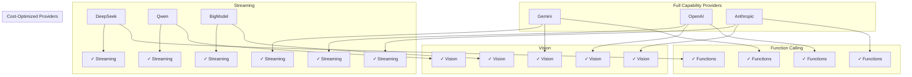
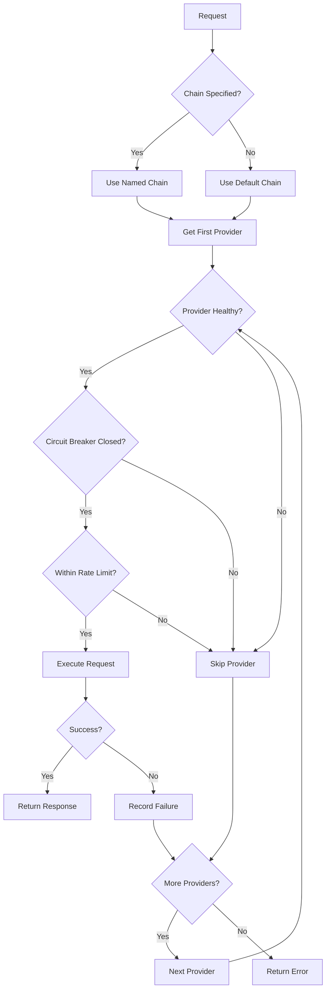
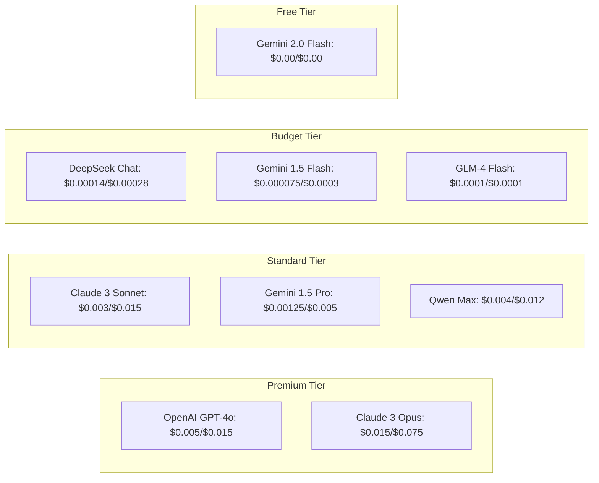
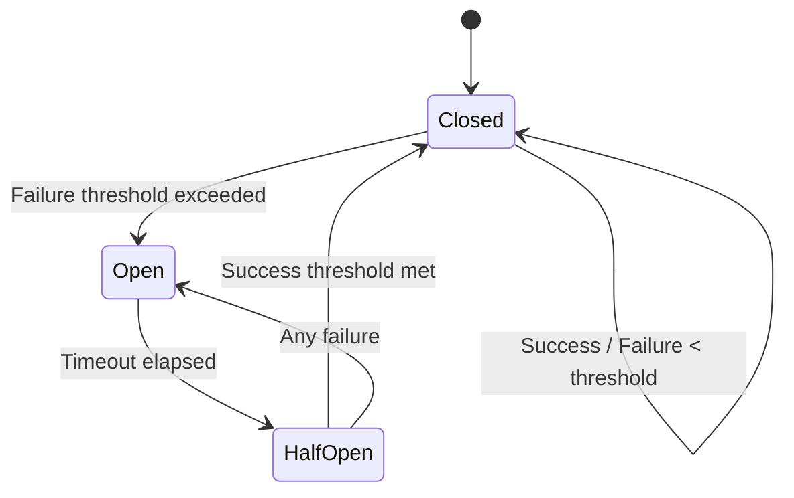
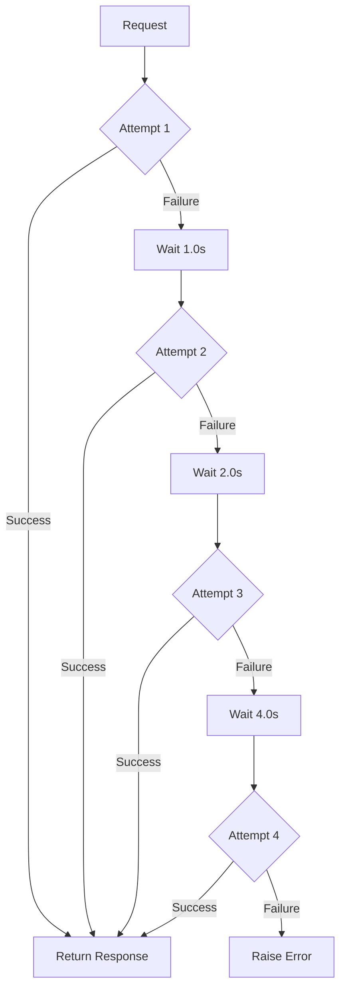
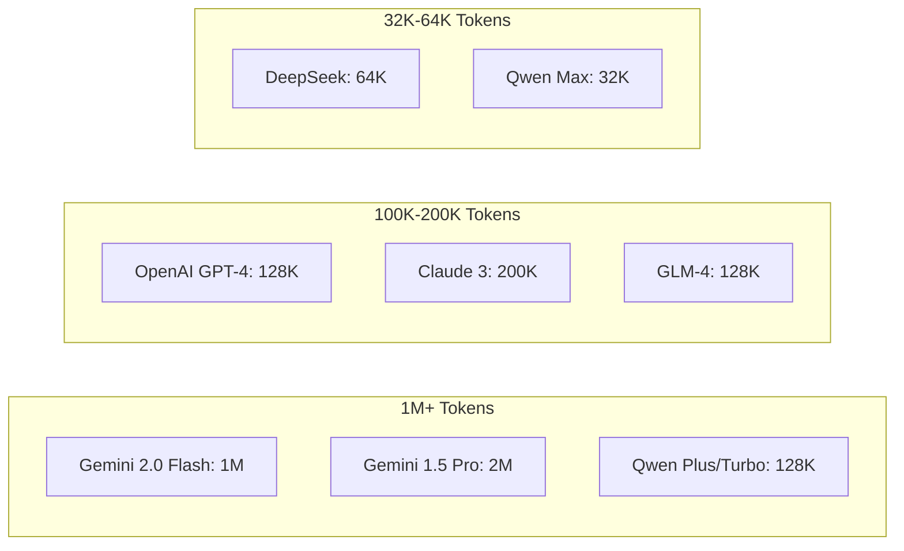

# AI Provider Configuration Map

This document provides comprehensive configuration mappings for all AI providers, including capability matrices, environment variable mappings, failover chain configurations, rate limits, cost/pricing configurations, and circuit breaker settings.

## Table of Contents

1. [Provider Overview Matrix](#provider-overview-matrix)
2. [Provider → Model → Capability Matrix](#provider--model--capability-matrix)
3. [Environment Variable Mapping](#environment-variable-mapping)
4. [Failover Chain Configurations](#failover-chain-configurations)
5. [Rate Limit Configurations](#rate-limit-configurations)
6. [Cost/Pricing Configuration](#costpricing-configuration)
7. [Circuit Breaker Settings](#circuit-breaker-settings)
8. [API Configuration Reference](#api-configuration-reference)
9. [Model Context Windows](#model-context-windows)
10. [Capability Reference](#capability-reference)

---

## Provider Overview Matrix

### Provider Summary

| Provider | ID | Base URL | Auth Type | Status |
|----------|-----|----------|-----------|--------|
| **Google Gemini** | `gemini` | `https://generativelanguage.googleapis.com/v1beta` | API Key | Active |
| **OpenAI** | `openai` | `https://api.openai.com/v1` | Bearer Token | Active |
| **Anthropic** | `anthropic` | `https://api.anthropic.com` | API Key | Active |
| **DeepSeek** | `deepseek` | `https://api.deepseek.com/v1` | API Key | Active |
| **Qwen** | `qwen` | `https://dashscope.aliyuncs.com/compatible-mode/v1` | API Key | Active |
| **BigModel** | `bigmodel` | `https://open.bigmodel.cn/api/paas/v4` | API Key | Active |
| **Cursor** | `cursor` | `https://api.cursor.sh/v1` | API Key | Active |
| **Routeway** | `routeway` | `https://api.routeway.ai/v1` | API Key | Active |

### Provider Capability Overview



---

## Provider → Model → Capability Matrix

### Gemini (Google)

| Model | Context Window | Max Output | Vision | Streaming | Function Calling | JSON Mode | Input $/1K | Output $/1K |
|-------|---------------|------------|--------|-----------|------------------|-----------|------------|-------------|
| `gemini-2.0-flash-exp` | 1,000,000 | 8,192 | ✅ | ✅ | ✅ | ✅ | $0.00 | $0.00 |
| `gemini-1.5-pro` | 2,000,000 | 8,192 | ✅ | ✅ | ✅ | ✅ | $0.00125 | $0.005 |
| `gemini-1.5-flash` | 1,000,000 | 8,192 | ✅ | ✅ | ✅ | ✅ | $0.000075 | $0.0003 |
| `gemini-1.0-pro` | 32,000 | 8,192 | ❌ | ✅ | ✅ | ✅ | $0.0005 | $0.0015 |

**Default Model:** `gemini-2.0-flash-exp`

### OpenAI

| Model | Context Window | Max Output | Vision | Streaming | Function Calling | JSON Mode | Input $/1K | Output $/1K |
|-------|---------------|------------|--------|-----------|------------------|-----------|------------|-------------|
| `gpt-4o` | 128,000 | 4,096 | ✅ | ✅ | ✅ | ✅ | $0.005 | $0.015 |
| `gpt-4o-mini` | 128,000 | 16,384 | ✅ | ✅ | ✅ | ✅ | $0.00015 | $0.0006 |
| `gpt-4-turbo` | 128,000 | 4,096 | ✅ | ✅ | ✅ | ✅ | $0.01 | $0.03 |
| `gpt-4` | 8,192 | 8,192 | ❌ | ✅ | ✅ | ✅ | $0.03 | $0.06 |
| `gpt-3.5-turbo` | 16,385 | 4,096 | ❌ | ✅ | ✅ | ✅ | $0.0005 | $0.0015 |
| `o1-preview` | 128,000 | 32,768 | ❌ | ❌ | ❌ | ❌ | $0.015 | $0.06 |
| `o1-mini` | 128,000 | 65,536 | ❌ | ❌ | ❌ | ❌ | $0.003 | $0.012 |

**Default Model:** `gpt-4o`

### Anthropic

| Model | Context Window | Max Output | Vision | Streaming | Function Calling | JSON Mode | Input $/1K | Output $/1K |
|-------|---------------|------------|--------|-----------|------------------|-----------|------------|-------------|
| `claude-3-opus` | 200,000 | 4,096 | ✅ | ✅ | ✅ | ❌ | $0.015 | $0.075 |
| `claude-3-sonnet` | 200,000 | 4,096 | ✅ | ✅ | ✅ | ❌ | $0.003 | $0.015 |
| `claude-3-haiku` | 200,000 | 4,096 | ✅ | ✅ | ✅ | ❌ | $0.00025 | $0.00125 |
| `claude-3.5-sonnet` | 200,000 | 8,192 | ✅ | ✅ | ✅ | ❌ | $0.003 | $0.015 |

**Default Model:** `claude-3-sonnet`

### DeepSeek

| Model | Context Window | Max Output | Vision | Streaming | Function Calling | JSON Mode | Input $/1K | Output $/1K |
|-------|---------------|------------|--------|-----------|------------------|-----------|------------|-------------|
| `deepseek-chat` | 64,000 | 4,096 | ❌ | ✅ | ✅ | ✅ | $0.00014 | $0.00028 |
| `deepseek-coder` | 64,000 | 4,096 | ❌ | ✅ | ✅ | ✅ | $0.00014 | $0.00028 |
| `deepseek-reasoner` | 64,000 | 8,192 | ❌ | ✅ | ✅ | ✅ | $0.00055 | $0.00219 |

**Default Model:** `deepseek-chat`

### Qwen (Alibaba)

| Model | Context Window | Max Output | Vision | Streaming | Function Calling | JSON Mode | Input $/1K | Output $/1K |
|-------|---------------|------------|--------|-----------|------------------|-----------|------------|-------------|
| `qwen-max` | 32,000 | 8,192 | ❌ | ✅ | ✅ | ✅ | $0.004 | $0.012 |
| `qwen-plus` | 128,000 | 8,192 | ❌ | ✅ | ✅ | ✅ | $0.001 | $0.003 |
| `qwen-turbo` | 128,000 | 8,192 | ❌ | ✅ | ✅ | ✅ | $0.0005 | $0.0015 |
| `qwen-vl-max` | 32,000 | 8,192 | ✅ | ✅ | ❌ | ❌ | $0.004 | $0.012 |

**Default Model:** `qwen-max`

### BigModel (ZhiPu)

| Model | Context Window | Max Output | Vision | Streaming | Function Calling | JSON Mode | Input $/1K | Output $/1K |
|-------|---------------|------------|--------|-----------|------------------|-----------|------------|-------------|
| `glm-4` | 128,000 | 4,096 | ✅ | ✅ | ✅ | ✅ | $0.014 | $0.014 |
| `glm-4-flash` | 128,000 | 4,096 | ✅ | ✅ | ✅ | ✅ | $0.0001 | $0.0001 |
| `glm-4v` | 4,096 | 1,024 | ✅ | ✅ | ❌ | ❌ | $0.014 | $0.014 |

**Default Model:** `glm-4`

### Cursor

| Model | Context Window | Max Output | Vision | Streaming | Function Calling | JSON Mode | Input $/1K | Output $/1K |
|-------|---------------|------------|--------|-----------|------------------|-----------|------------|-------------|
| `cursor-small` | 8,192 | 4,096 | ❌ | ✅ | ✅ | ✅ | $0.001 | $0.002 |
| `cursor-large` | 32,000 | 8,192 | ❌ | ✅ | ✅ | ✅ | $0.004 | $0.008 |

**Default Model:** `cursor-small`

### Routeway

| Model | Context Window | Max Output | Vision | Streaming | Function Calling | JSON Mode | Input $/1K | Output $/1K |
|-------|---------------|------------|--------|-----------|------------------|-----------|------------|-------------|
| `routeway-default` | 128,000 | 8,192 | ✅ | ✅ | ✅ | ✅ | $0.002 | $0.006 |

**Default Model:** `routeway-default`

---

## Environment Variable Mapping

### API Key Variables

| Variable | Provider | Required | Example |
|----------|----------|----------|---------|
| `GEMINI_API_KEY` | Gemini | Yes (if enabled) | `AIza...` |
| `OPENAI_API_KEY` | OpenAI | Yes (if enabled) | `sk-...` |
| `ANTHROPIC_API_KEY` | Anthropic | Yes (if enabled) | `sk-ant-...` |
| `DEEPSEEK_API_KEY` | DeepSeek | Yes (if enabled) | `sk-...` |
| `QWEN_API_KEY` | Qwen | Yes (if enabled) | `sk-...` |
| `BIGMODEL_API_KEY` | BigModel | Yes (if enabled) | `...` |
| `CURSOR_API_KEY` | Cursor | Yes (if enabled) | `...` |
| `ROUTEWAY_API_KEY` | Routeway | Yes (if enabled) | `...` |
| `OPENAI_ORGANIZATION` | OpenAI | No | `org-...` |

### Configuration Variables

| Variable | Description | Default | YAML Override |
|----------|-------------|---------|---------------|
| `AI_CONFIG_PATH` | Path to providers.yaml | `app/config/providers.yaml` | N/A |
| `DEFAULT_PROVIDER` | Default provider override | From YAML | `global.default_provider` |
| `DEFAULT_MODEL` | Default model override | From YAML | `global.default_model` |
| `REQUEST_TIMEOUT` | Request timeout (seconds) | `30` | `global.request_timeout` |
| `MAX_RETRIES` | Maximum retry attempts | `3` | `global.max_retries` |
| `ENABLE_CACHING` | Enable response caching | `true` | `global.enable_caching` |
| `CACHE_TTL` | Cache TTL (seconds) | `3600` | `global.cache_ttl` |
| `LOG_LEVEL` | Logging level | `INFO` | `global.log_level` |

### Feature Flag Variables

| Variable | Description | Default |
|----------|-------------|---------|
| `ENABLE_RATE_LIMITING` | Enable rate limit middleware | `true` |
| `ENABLE_COST_TRACKING` | Enable cost tracking middleware | `true` |
| `ENABLE_CIRCUIT_BREAKER` | Enable circuit breaker | `true` |
| `ENABLE_REQUEST_DEDUPLICATION` | Enable request deduplication | `true` |
| `DAILY_BUDGET` | Daily cost budget (USD) | None |

### Environment Variable Reference in YAML

```yaml
providers:
  gemini:
    api_key: "${GEMINI_API_KEY}"  # References environment variable
    
  openai:
    api_key: "${OPENAI_API_KEY}"
    organization: "${OPENAI_ORGANIZATION:-}"  # Optional with default
```

---

## Failover Chain Configurations

### Pre-configured Chains

| Chain Name | Providers | Use Case |
|------------|-----------|----------|
| `default` | gemini → openai → anthropic | General purpose |
| `premium` | openai → anthropic → gemini | High-quality outputs |
| `cost_optimized` | deepseek → qwen → gemini | Budget-conscious |
| `fast` | gemini → qwen → deepseek | Low latency |
| `embedding` | openai → gemini → qwen → bigmodel | Embedding generation |
| `vision` | gemini → openai → anthropic | Image understanding |
| `code` | cursor → openai → deepseek | Code generation |
| `chinese` | qwen → bigmodel → deepseek | Chinese language |

### Chain Configuration YAML

```yaml
failover_chains:
  default:
    - gemini
    - openai
    - anthropic
  
  premium:
    - openai
    - anthropic
    - gemini
  
  cost_optimized:
    - deepseek
    - qwen
    - gemini
  
  fast:
    - gemini
    - qwen
    - deepseek
  
  embedding:
    - openai
    - gemini
    - qwen
    - bigmodel
  
  vision:
    - gemini
    - openai
    - anthropic
  
  code:
    - cursor
    - openai
    - deepseek
  
  chinese:
    - qwen
    - bigmodel
    - deepseek
```

### Failover Decision Flow



---

## Rate Limit Configurations

### Per-Provider Rate Limits

| Provider | Requests/Min | Tokens/Min | Requests/Day |
|----------|-------------|------------|--------------|
| **Gemini** | 60 | 1,000,000 | - |
| **OpenAI** | 500 | 150,000 | 10,000 |
| **Anthropic** | 50 | 100,000 | - |
| **DeepSeek** | 60 | 500,000 | - |
| **Qwen** | 100 | 1,000,000 | - |
| **BigModel** | 60 | 500,000 | - |
| **Cursor** | 30 | 100,000 | - |
| **Routeway** | 100 | 1,000,000 | - |

### Rate Limit YAML Configuration

```yaml
providers:
  gemini:
    rate_limits:
      requests_per_minute: 60
      tokens_per_minute: 1000000
  
  openai:
    rate_limits:
      requests_per_minute: 500
      tokens_per_minute: 150000
      requests_per_day: 10000
  
  anthropic:
    rate_limits:
      requests_per_minute: 50
      tokens_per_minute: 100000
  
  deepseek:
    rate_limits:
      requests_per_minute: 60
      tokens_per_minute: 500000
  
  qwen:
    rate_limits:
      requests_per_minute: 100
      tokens_per_minute: 1000000
  
  bigmodel:
    rate_limits:
      requests_per_minute: 60
      tokens_per_minute: 500000
  
  cursor:
    rate_limits:
      requests_per_minute: 30
      tokens_per_minute: 100000
  
  routeway:
    rate_limits:
      requests_per_minute: 100
      tokens_per_minute: 1000000
```

### Rate Limit Headers

| Header | Description | Example |
|--------|-------------|---------|
| `X-RateLimit-Limit` | Maximum requests | `500` |
| `X-RateLimit-Remaining` | Remaining requests | `450` |
| `X-RateLimit-Reset` | Reset timestamp | `1705315860` |
| `Retry-After` | Seconds until retry | `45` |

---

## Cost/Pricing Configuration

### Pricing Comparison Chart



### Detailed Pricing Matrix (per 1K tokens)

| Provider | Model | Input | Output | Cached Input | Reasoning |
|----------|-------|-------|--------|--------------|-----------|
| **Gemini** | gemini-2.0-flash-exp | $0.00 | $0.00 | - | - |
| **Gemini** | gemini-1.5-pro | $0.00125 | $0.005 | $0.000315 | - |
| **Gemini** | gemini-1.5-flash | $0.000075 | $0.0003 | $0.00001875 | - |
| **OpenAI** | gpt-4o | $0.005 | $0.015 | $0.0025 | - |
| **OpenAI** | gpt-4o-mini | $0.00015 | $0.0006 | $0.000075 | - |
| **OpenAI** | o1-preview | $0.015 | $0.06 | $0.0075 | $0.06 |
| **OpenAI** | o1-mini | $0.003 | $0.012 | $0.0015 | $0.012 |
| **Anthropic** | claude-3-opus | $0.015 | $0.075 | $0.0015 | - |
| **Anthropic** | claude-3-sonnet | $0.003 | $0.015 | $0.0003 | - |
| **Anthropic** | claude-3-haiku | $0.00025 | $0.00125 | $0.000025 | - |
| **DeepSeek** | deepseek-chat | $0.00014 | $0.00028 | $0.000014 | - |
| **DeepSeek** | deepseek-reasoner | $0.00055 | $0.00219 | - | $0.00055 |
| **Qwen** | qwen-max | $0.004 | $0.012 | - | - |
| **Qwen** | qwen-turbo | $0.0005 | $0.0015 | - | - |
| **BigModel** | glm-4 | $0.014 | $0.014 | - | - |
| **BigModel** | glm-4-flash | $0.0001 | $0.0001 | - | - |

### Pricing YAML Configuration

```yaml
providers:
  openai:
    models:
      gpt-4o:
        pricing:
          input_per_1k: 0.005
          output_per_1k: 0.015
          cached_input_per_1k: 0.0025
      
      o1-preview:
        pricing:
          input_per_1k: 0.015
          output_per_1k: 0.06
          cached_input_per_1k: 0.0075
          reasoning_per_1k: 0.06

  deepseek:
    models:
      deepseek-reasoner:
        pricing:
          input_per_1k: 0.00055
          output_per_1k: 0.00219
          reasoning_per_1k: 0.00055
```

### Cost Calculation Formula

```python
def calculate_cost(
    input_tokens: int,
    output_tokens: int,
    cached_tokens: int = 0,
    reasoning_tokens: int = 0,
    pricing: PricingConfig
) -> float:
    """
    Calculate total cost for a request.
    
    Formula:
    cost = (input_tokens / 1000 * input_per_1k)
         + (output_tokens / 1000 * output_per_1k)
         + (cached_tokens / 1000 * cached_input_per_1k)
         + (reasoning_tokens / 1000 * reasoning_per_1k)
    """
    cost = 0.0
    cost += (input_tokens / 1000) * pricing.input_per_1k
    cost += (output_tokens / 1000) * pricing.output_per_1k
    
    if cached_tokens and pricing.cached_input_per_1k:
        cost += (cached_tokens / 1000) * pricing.cached_input_per_1k
    
    if reasoning_tokens and pricing.reasoning_per_1k:
        cost += (reasoning_tokens / 1000) * pricing.reasoning_per_1k
    
    return round(cost, 6)
```

### Budget Configuration

```yaml
# In application configuration
cost_tracking:
  daily_budget: 50.00  # USD
  provider_budgets:
    openai: 30.00
    anthropic: 15.00
  alert_threshold_percent: 80
```

---

## Circuit Breaker Settings

### Default Circuit Breaker Configuration

```yaml
circuit_breaker:
  # Number of failures before opening circuit
  failure_threshold: 5
  
  # Number of successes in half-open to close
  success_threshold: 3
  
  # Timeout in seconds before moving to half-open
  timeout: 60
  
  # Time window for counting failures (seconds)
  failure_window: 120
```

### Per-Provider Circuit Breaker Overrides

| Provider | Failure Threshold | Success Threshold | Timeout |
|----------|------------------|-------------------|---------|
| **Gemini** | 5 | 3 | 60s |
| **OpenAI** | 5 | 3 | 60s |
| **Anthropic** | 3 | 2 | 120s |
| **DeepSeek** | 5 | 3 | 60s |
| **Qwen** | 5 | 3 | 60s |
| **BigModel** | 5 | 3 | 60s |
| **Cursor** | 3 | 2 | 120s |
| **Routeway** | 5 | 3 | 60s |

### Circuit Breaker State Diagram



### Circuit Breaker YAML Configuration

```yaml
providers:
  anthropic:
    circuit_breaker:
      failure_threshold: 3
      success_threshold: 2
      timeout: 120
      failure_window: 180
  
  cursor:
    circuit_breaker:
      failure_threshold: 3
      success_threshold: 2
      timeout: 120
      failure_window: 180
```

---

## API Configuration Reference

### API Connection Settings

| Provider | Timeout | Max Retries | Retry Delay | Base Delay Multiplier |
|----------|---------|-------------|-------------|----------------------|
| **Gemini** | 30s | 3 | 1.0s | 2.0 |
| **OpenAI** | 60s | 3 | 1.0s | 2.0 |
| **Anthropic** | 60s | 3 | 1.0s | 2.0 |
| **DeepSeek** | 30s | 3 | 1.0s | 2.0 |
| **Qwen** | 30s | 3 | 1.0s | 2.0 |
| **BigModel** | 30s | 3 | 1.0s | 2.0 |
| **Cursor** | 45s | 3 | 1.0s | 2.0 |
| **Routeway** | 30s | 3 | 1.0s | 2.0 |

### API Configuration YAML

```yaml
providers:
  openai:
    api:
      timeout: 60
      max_retries: 3
      retry_delay: 1.0
      base_delay_multiplier: 2.0
      
    # Authentication
    api_key: "${OPENAI_API_KEY}"
    organization: "${OPENAI_ORGANIZATION:-}"
    
  anthropic:
    api:
      timeout: 60
      max_retries: 3
      retry_delay: 1.0
      
    # Authentication
    api_key: "${ANTHROPIC_API_KEY}"
    api_version: "2024-01-01"  # Required for Anthropic
```

### Retry Strategy



---

## Model Context Windows

### Context Window Comparison



### Context Window Reference

| Provider | Model | Context Window | Notes |
|----------|-------|----------------|-------|
| Gemini | gemini-1.5-pro | 2,000,000 | Largest context |
| Gemini | gemini-2.0-flash-exp | 1,000,000 | Free tier |
| Gemini | gemini-1.5-flash | 1,000,000 | Fast, cost-effective |
| OpenAI | gpt-4o | 128,000 | Standard |
| OpenAI | o1-preview | 128,000 | Reasoning model |
| Anthropic | claude-3-* | 200,000 | All Claude 3 models |
| DeepSeek | deepseek-* | 64,000 | All DeepSeek models |
| Qwen | qwen-plus/turbo | 128,000 | Extended context |
| Qwen | qwen-max | 32,000 | High quality |
| BigModel | glm-4 | 128,000 | Standard |

---

## Capability Reference

### Capability Definitions

| Capability | Description | Use Case |
|------------|-------------|----------|
| `supports_streaming` | Token-by-token response streaming | Real-time chat interfaces |
| `supports_vision` | Image understanding | Image analysis, OCR |
| `supports_function_calling` | Structured function invocation | Tool use, API calls |
| `supports_json_mode` | Guaranteed JSON output | Structured data extraction |
| `supports_system_prompt` | System message support | Role definition, constraints |
| `supports_token_counting` | Accurate token counting | Cost estimation, context management |
| `supports_embeddings` | Vector embedding generation | Semantic search, RAG |
| `max_images` | Maximum images per request | Multi-image analysis |

### Full Capability Matrix

| Provider | Streaming | Vision | Functions | JSON | System | Tokens | Embeddings | Max Images |
|----------|-----------|--------|-----------|------|--------|--------|------------|------------|
| **Gemini** | ✅ | ✅ | ✅ | ✅ | ✅ | ✅ | ✅ | 16 |
| **OpenAI** | ✅ | ✅ | ✅ | ✅ | ✅ | ✅ | ✅ | 10 |
| **Anthropic** | ✅ | ✅ | ✅ | ❌ | ✅ | ✅ | ❌ | 20 |
| **DeepSeek** | ✅ | ❌ | ✅ | ✅ | ✅ | ✅ | ❌ | - |
| **Qwen** | ✅ | ✅* | ✅ | ✅ | ✅ | ✅ | ✅ | 8 |
| **BigModel** | ✅ | ✅ | ✅ | ✅ | ✅ | ✅ | ✅ | 4 |
| **Cursor** | ✅ | ❌ | ✅ | ✅ | ✅ | ❌ | ❌ | - |
| **Routeway** | ✅ | ✅ | ✅ | ✅ | ✅ | ✅ | ✅ | 10 |

*Qwen vision supported only on `qwen-vl-*` models

### Capability YAML Configuration

```yaml
providers:
  gemini:
    capabilities:
      supports_streaming: true
      supports_vision: true
      supports_function_calling: true
      supports_json_mode: true
      supports_system_prompt: true
      supports_token_counting: true
      supports_embeddings: true
      max_images: 16
  
  anthropic:
    capabilities:
      supports_streaming: true
      supports_vision: true
      supports_function_calling: true
      supports_json_mode: false  # Not supported
      supports_system_prompt: true
      supports_token_counting: true
      supports_embeddings: false  # Not supported
      max_images: 20
```

---

## Quick Reference Card

### Provider Selection Guide

| Use Case | Recommended Provider | Recommended Model | Failover Chain |
|----------|---------------------|-------------------|----------------|
| General Chat | Gemini | gemini-2.0-flash-exp | `default` |
| High Quality | OpenAI | gpt-4o | `premium` |
| Budget | DeepSeek | deepseek-chat | `cost_optimized` |
| Code Generation | Cursor/OpenAI | cursor-large/gpt-4o | `code` |
| Image Analysis | Gemini | gemini-1.5-pro | `vision` |
| Embeddings | OpenAI | text-embedding-3-small | `embedding` |
| Chinese Text | Qwen | qwen-max | `chinese` |
| Reasoning | OpenAI/DeepSeek | o1-preview/deepseek-reasoner | `premium` |

### Common Configuration Patterns

**Development Environment:**
```yaml
global:
  default_provider: gemini
  default_model: gemini-2.0-flash-exp  # Free tier
  enable_caching: true
  cache_ttl: 3600
```

**Production Environment:**
```yaml
global:
  default_provider: gemini
  default_model: gemini-1.5-flash
  enable_caching: true
  cache_ttl: 1800
  
failover_chains:
  default:
    - gemini
    - openai
    - anthropic
```

**Cost-Optimized:**
```yaml
global:
  default_provider: deepseek
  default_model: deepseek-chat
  
failover_chains:
  default:
    - deepseek
    - qwen
    - gemini
```

---

## Next Steps

- [Integration Guide](./ai_provider_integration_guide.md) - Complete implementation guide
- [API Reference](./ai_provider_api_reference.md) - API documentation
- [Migration Guide](./ai_provider_migration_guide.md) - Migrating from legacy configuration
