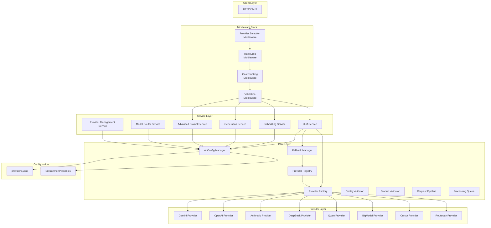
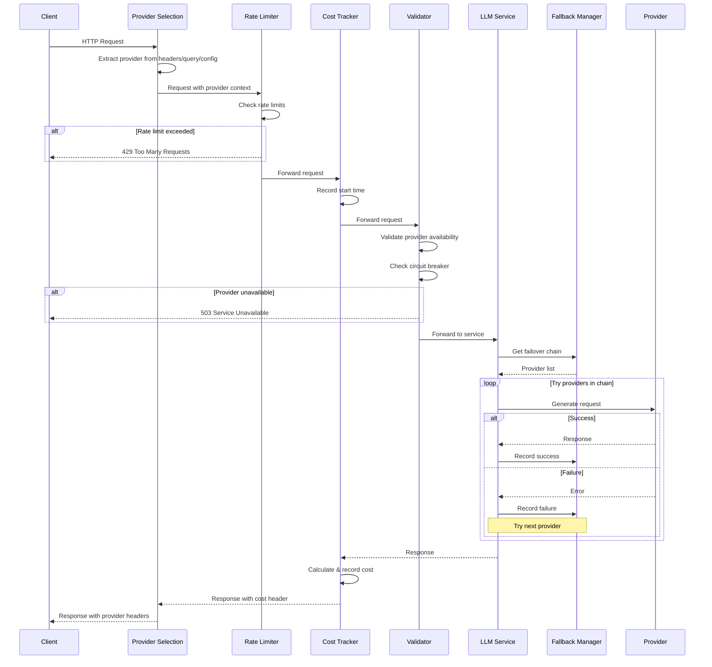
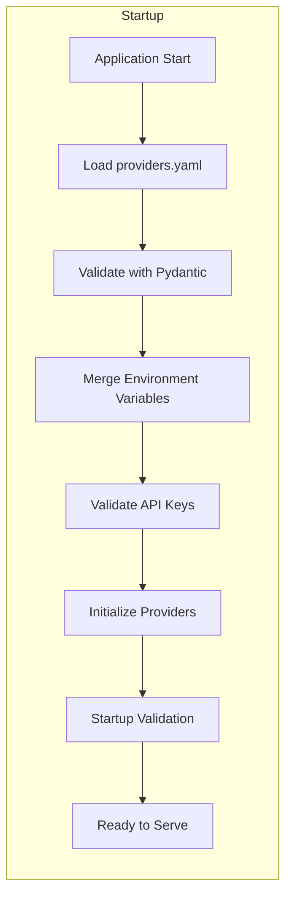
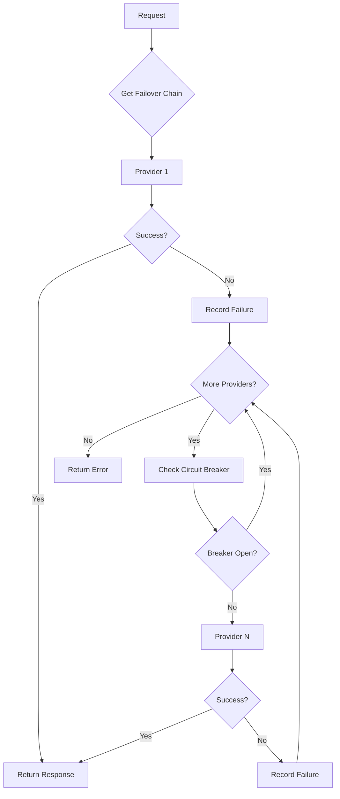

# AI Provider Integration Guide

This comprehensive guide covers the architecture, configuration, and implementation of the AI provider integration layer in the Chimera backend API system.

## Table of Contents

1. [Overview](#overview)
2. [Architecture](#architecture)
3. [Configuration System](#configuration-system)
4. [Supported Providers](#supported-providers)
5. [Quick Start](#quick-start)
6. [Configuration File Reference](#configuration-file-reference)
7. [Environment Variables](#environment-variables)
8. [Provider Configuration Examples](#provider-configuration-examples)
9. [Model Configuration](#model-configuration)
10. [Failover Chain Configuration](#failover-chain-configuration)
11. [Middleware Stack](#middleware-stack)
12. [Advanced Usage](#advanced-usage)
13. [Troubleshooting](#troubleshooting)
14. [FAQ](#faq)

---

## Overview

The AI Provider Integration Layer provides a unified interface for interacting with multiple AI providers including Gemini (Google), OpenAI, Anthropic, DeepSeek, Qwen, BigModel (ZhiPu), Cursor, and Routeway. It features:

- **Unified Configuration**: YAML-based configuration with Pydantic validation
- **Automatic Failover**: Named failover chains for resilient provider switching
- **Cost Tracking**: Real-time cost calculation and budget alerts
- **Rate Limiting**: Config-driven per-provider rate limits
- **Circuit Breaker**: Automatic provider isolation on failures
- **Secure API Keys**: Fernet-encrypted API key storage
- **Health Monitoring**: Continuous provider health checks

---

## Architecture

### High-Level Architecture



### Request Flow



### Configuration Loading Flow



---

## Configuration System

The configuration system uses a three-tier hierarchy:

1. **YAML Configuration** ([`providers.yaml`](../backend-api/app/config/providers.yaml)) - Base configuration
2. **Environment Variables** - Override sensitive values like API keys
3. **Runtime Overrides** - Per-request overrides via headers/query params

### Configuration Manager

The [`AIConfigManager`](../backend-api/app/core/ai_config_manager.py:1) class is the central configuration hub:

```python
from app.core.service_registry import get_ai_config_manager

# Get singleton instance
config_manager = get_ai_config_manager()

# Check if config is loaded
if config_manager.is_loaded():
    config = config_manager.get_config()
    
    # Get provider configuration
    provider = config_manager.get_provider("openai")
    
    # Get default model for provider
    default_model = provider.get_default_model()
    
    # Calculate cost
    cost = config_manager.calculate_cost(
        provider_id="openai",
        model_id="gpt-4",
        input_tokens=1000,
        output_tokens=500
    )
```

### Pydantic Models

Configuration is validated using Pydantic models in [`ai_provider_settings.py`](../backend-api/app/config/ai_provider_settings.py:1):

| Model | Description |
|-------|-------------|
| `AIProviderSettings` | Root configuration model |
| `GlobalConfig` | Global settings (defaults, timeouts) |
| `ProviderConfig` | Per-provider configuration |
| `ModelConfig` | Per-model configuration |
| `CapabilityConfig` | Provider capability flags |
| `RateLimitConfig` | Rate limit settings |
| `PricingConfig` | Token pricing configuration |
| `APIConfig` | API connection settings |

---

## Supported Providers

| Provider | ID | Description | Key Capabilities |
|----------|-----|-------------|------------------|
| **Google Gemini** | `gemini` | Google's multimodal AI | Vision, Streaming, Function Calling |
| **OpenAI** | `openai` | GPT models | Vision, Function Calling, JSON Mode |
| **Anthropic** | `anthropic` | Claude models | Large context, System prompts |
| **DeepSeek** | `deepseek` | DeepSeek models | Cost-effective, Reasoning |
| **Qwen** | `qwen` | Alibaba's Qwen models | Multilingual, Embeddings |
| **BigModel** | `bigmodel` | ZhiPu GLM models | Chinese language, Embeddings |
| **Cursor** | `cursor` | Cursor-specific models | Code generation |
| **Routeway** | `routeway` | Routing proxy | Multi-provider routing |

---

## Quick Start

### 1. Create Configuration File

Create `backend-api/app/config/providers.yaml`:

```yaml
version: "1.0"

global:
  default_provider: "gemini"
  default_model: "gemini-2.0-flash-exp"
  request_timeout: 30
  max_retries: 3
  enable_caching: true
  cache_ttl: 3600

providers:
  gemini:
    enabled: true
    api_key: "${GEMINI_API_KEY}"
    base_url: "https://generativelanguage.googleapis.com/v1beta"
    
    capabilities:
      supports_streaming: true
      supports_vision: true
      supports_function_calling: true
      supports_json_mode: true
      supports_system_prompt: true
      supports_token_counting: true
    
    rate_limits:
      requests_per_minute: 60
      tokens_per_minute: 1000000
    
    models:
      gemini-2.0-flash-exp:
        display_name: "Gemini 2.0 Flash"
        context_window: 1000000
        max_output_tokens: 8192
        is_default: true
        pricing:
          input_per_1k: 0.0
          output_per_1k: 0.0

  openai:
    enabled: true
    api_key: "${OPENAI_API_KEY}"
    base_url: "https://api.openai.com/v1"
    
    models:
      gpt-4:
        display_name: "GPT-4"
        context_window: 8192
        max_output_tokens: 4096
        pricing:
          input_per_1k: 0.03
          output_per_1k: 0.06

failover_chains:
  default:
    - gemini
    - openai
    - anthropic
  
  premium:
    - openai
    - anthropic
    - gemini
  
  cost_optimized:
    - deepseek
    - qwen
    - gemini
```

### 2. Set Environment Variables

Create `.env` file:

```bash
# Provider API Keys
GEMINI_API_KEY=your-gemini-api-key
OPENAI_API_KEY=your-openai-api-key
ANTHROPIC_API_KEY=your-anthropic-api-key
DEEPSEEK_API_KEY=your-deepseek-api-key
QWEN_API_KEY=your-qwen-api-key
BIGMODEL_API_KEY=your-bigmodel-api-key

# Optional Configuration
AI_CONFIG_PATH=app/config/providers.yaml
DEFAULT_PROVIDER=gemini
REQUEST_TIMEOUT=30
ENABLE_RATE_LIMITING=true
ENABLE_COST_TRACKING=true
```

### 3. Initialize in Application

```python
from fastapi import FastAPI
from app.core.ai_config_manager import AIConfigManager
from app.middleware.provider_selection_middleware import ProviderSelectionMiddleware
from app.middleware.rate_limit_middleware import ProviderRateLimitMiddleware
from app.middleware.cost_tracking_middleware import CostTrackingMiddleware
from app.middleware.validation_middleware import ConfigValidationMiddleware

app = FastAPI()

# Add middleware stack (order matters - first added is outermost)
app.add_middleware(ConfigValidationMiddleware)
app.add_middleware(CostTrackingMiddleware)
app.add_middleware(ProviderRateLimitMiddleware)
app.add_middleware(ProviderSelectionMiddleware)

# Initialize config manager
@app.on_event("startup")
async def startup():
    config_manager = AIConfigManager()
    config_manager.load_config("app/config/providers.yaml")
```

### 4. Make API Requests

```bash
# Use default provider
curl -X POST http://localhost:8000/api/v1/generate \
  -H "Content-Type: application/json" \
  -d '{"prompt": "Hello, world!"}'

# Override provider via header
curl -X POST http://localhost:8000/api/v1/generate \
  -H "Content-Type: application/json" \
  -H "X-Provider: openai" \
  -H "X-Model: gpt-4" \
  -d '{"prompt": "Hello, world!"}'

# Override via query parameter
curl -X POST "http://localhost:8000/api/v1/generate?provider=anthropic&model=claude-3-opus" \
  -H "Content-Type: application/json" \
  -d '{"prompt": "Hello, world!"}'

# Use named failover chain
curl -X POST http://localhost:8000/api/v1/generate \
  -H "Content-Type: application/json" \
  -H "X-Failover-Chain: premium" \
  -d '{"prompt": "Hello, world!"}'
```

---

## Configuration File Reference

### providers.yaml Structure

```yaml
# Configuration version
version: "1.0"

# Global settings
global:
  default_provider: string          # Default provider ID
  default_model: string             # Default model ID
  request_timeout: integer          # Request timeout in seconds (default: 30)
  max_retries: integer              # Max retry attempts (default: 3)
  enable_caching: boolean           # Enable response caching (default: true)
  cache_ttl: integer                # Cache TTL in seconds (default: 3600)
  log_level: string                 # Logging level (default: INFO)

# Provider definitions
providers:
  <provider_id>:
    enabled: boolean                # Provider enabled flag
    api_key: string                 # API key (supports ${ENV_VAR} syntax)
    base_url: string                # API base URL
    api_version: string             # Optional API version
    organization: string            # Optional organization ID (OpenAI)
    
    # API connection settings
    api:
      timeout: integer              # Request timeout
      max_retries: integer          # Max retries
      retry_delay: float            # Base retry delay
    
    # Provider capabilities
    capabilities:
      supports_streaming: boolean
      supports_vision: boolean
      supports_function_calling: boolean
      supports_json_mode: boolean
      supports_system_prompt: boolean
      supports_token_counting: boolean
      supports_embeddings: boolean
      max_images: integer
    
    # Rate limiting
    rate_limits:
      requests_per_minute: integer
      tokens_per_minute: integer
      requests_per_day: integer     # Optional daily limit
    
    # Model definitions
    models:
      <model_id>:
        display_name: string
        context_window: integer
        max_output_tokens: integer
        is_default: boolean
        supports_vision: boolean    # Model-specific capability override
        supports_function_calling: boolean
        
        # Pricing per 1K tokens
        pricing:
          input_per_1k: float
          output_per_1k: float
          cached_input_per_1k: float
          reasoning_per_1k: float

# Named failover chains
failover_chains:
  <chain_name>:
    - provider_id_1
    - provider_id_2
    - provider_id_3

# Circuit breaker settings (optional)
circuit_breaker:
  failure_threshold: integer        # Failures before opening (default: 5)
  success_threshold: integer        # Successes to close (default: 3)
  timeout: integer                  # Open state timeout in seconds (default: 60)
```

---

## Environment Variables

### Required Variables

| Variable | Description | Example |
|----------|-------------|---------|
| `GEMINI_API_KEY` | Google Gemini API key | `AIza...` |
| `OPENAI_API_KEY` | OpenAI API key | `sk-...` |
| `ANTHROPIC_API_KEY` | Anthropic API key | `sk-ant-...` |

### Optional Variables

| Variable | Description | Default |
|----------|-------------|---------|
| `AI_CONFIG_PATH` | Path to providers.yaml | `app/config/providers.yaml` |
| `DEFAULT_PROVIDER` | Override default provider | From config |
| `DEFAULT_MODEL` | Override default model | From config |
| `REQUEST_TIMEOUT` | Global request timeout | `30` |
| `MAX_RETRIES` | Maximum retry attempts | `3` |
| `ENABLE_RATE_LIMITING` | Enable rate limiting | `true` |
| `ENABLE_COST_TRACKING` | Enable cost tracking | `true` |
| `DAILY_BUDGET` | Daily cost budget (USD) | None |
| `LOG_LEVEL` | Logging level | `INFO` |

### Provider-Specific Variables

| Variable | Description |
|----------|-------------|
| `DEEPSEEK_API_KEY` | DeepSeek API key |
| `QWEN_API_KEY` | Alibaba Qwen API key |
| `BIGMODEL_API_KEY` | ZhiPu BigModel API key |
| `CURSOR_API_KEY` | Cursor API key |
| `ROUTEWAY_API_KEY` | Routeway API key |
| `OPENAI_ORGANIZATION` | OpenAI organization ID |

---

## Provider Configuration Examples

### Google Gemini

```yaml
gemini:
  enabled: true
  api_key: "${GEMINI_API_KEY}"
  base_url: "https://generativelanguage.googleapis.com/v1beta"
  
  capabilities:
    supports_streaming: true
    supports_vision: true
    supports_function_calling: true
    supports_json_mode: true
    supports_system_prompt: true
    supports_token_counting: true
    supports_embeddings: true
    max_images: 16
  
  rate_limits:
    requests_per_minute: 60
    tokens_per_minute: 1000000
  
  models:
    gemini-2.0-flash-exp:
      display_name: "Gemini 2.0 Flash (Experimental)"
      context_window: 1000000
      max_output_tokens: 8192
      is_default: true
      supports_vision: true
      pricing:
        input_per_1k: 0.0
        output_per_1k: 0.0
    
    gemini-1.5-pro:
      display_name: "Gemini 1.5 Pro"
      context_window: 2000000
      max_output_tokens: 8192
      supports_vision: true
      pricing:
        input_per_1k: 0.00125
        output_per_1k: 0.005
```

### OpenAI

```yaml
openai:
  enabled: true
  api_key: "${OPENAI_API_KEY}"
  base_url: "https://api.openai.com/v1"
  organization: "${OPENAI_ORGANIZATION}"
  
  capabilities:
    supports_streaming: true
    supports_vision: true
    supports_function_calling: true
    supports_json_mode: true
    supports_system_prompt: true
    supports_token_counting: true
    supports_embeddings: true
  
  rate_limits:
    requests_per_minute: 500
    tokens_per_minute: 150000
    requests_per_day: 10000
  
  models:
    gpt-4o:
      display_name: "GPT-4o"
      context_window: 128000
      max_output_tokens: 4096
      is_default: true
      supports_vision: true
      pricing:
        input_per_1k: 0.005
        output_per_1k: 0.015
    
    gpt-4-turbo:
      display_name: "GPT-4 Turbo"
      context_window: 128000
      max_output_tokens: 4096
      supports_vision: true
      pricing:
        input_per_1k: 0.01
        output_per_1k: 0.03
    
    gpt-3.5-turbo:
      display_name: "GPT-3.5 Turbo"
      context_window: 16385
      max_output_tokens: 4096
      pricing:
        input_per_1k: 0.0005
        output_per_1k: 0.0015
```

### Anthropic

```yaml
anthropic:
  enabled: true
  api_key: "${ANTHROPIC_API_KEY}"
  base_url: "https://api.anthropic.com"
  api_version: "2024-01-01"
  
  capabilities:
    supports_streaming: true
    supports_vision: true
    supports_function_calling: true
    supports_json_mode: false
    supports_system_prompt: true
    supports_token_counting: true
  
  rate_limits:
    requests_per_minute: 50
    tokens_per_minute: 100000
  
  models:
    claude-3-opus:
      display_name: "Claude 3 Opus"
      context_window: 200000
      max_output_tokens: 4096
      supports_vision: true
      pricing:
        input_per_1k: 0.015
        output_per_1k: 0.075
    
    claude-3-sonnet:
      display_name: "Claude 3 Sonnet"
      context_window: 200000
      max_output_tokens: 4096
      is_default: true
      supports_vision: true
      pricing:
        input_per_1k: 0.003
        output_per_1k: 0.015
    
    claude-3-haiku:
      display_name: "Claude 3 Haiku"
      context_window: 200000
      max_output_tokens: 4096
      supports_vision: true
      pricing:
        input_per_1k: 0.00025
        output_per_1k: 0.00125
```

### DeepSeek

```yaml
deepseek:
  enabled: true
  api_key: "${DEEPSEEK_API_KEY}"
  base_url: "https://api.deepseek.com/v1"
  
  capabilities:
    supports_streaming: true
    supports_vision: false
    supports_function_calling: true
    supports_json_mode: true
    supports_system_prompt: true
    supports_token_counting: true
  
  rate_limits:
    requests_per_minute: 60
    tokens_per_minute: 500000
  
  models:
    deepseek-chat:
      display_name: "DeepSeek Chat"
      context_window: 64000
      max_output_tokens: 4096
      is_default: true
      pricing:
        input_per_1k: 0.00014
        output_per_1k: 0.00028
    
    deepseek-reasoner:
      display_name: "DeepSeek Reasoner"
      context_window: 64000
      max_output_tokens: 8192
      pricing:
        input_per_1k: 0.00055
        output_per_1k: 0.00219
        reasoning_per_1k: 0.00055
```

### Qwen

```yaml
qwen:
  enabled: true
  api_key: "${QWEN_API_KEY}"
  base_url: "https://dashscope.aliyuncs.com/compatible-mode/v1"
  
  capabilities:
    supports_streaming: true
    supports_vision: true
    supports_function_calling: true
    supports_json_mode: true
    supports_system_prompt: true
    supports_token_counting: true
    supports_embeddings: true
  
  rate_limits:
    requests_per_minute: 100
    tokens_per_minute: 1000000
  
  models:
    qwen-max:
      display_name: "Qwen Max"
      context_window: 32000
      max_output_tokens: 8192
      is_default: true
      pricing:
        input_per_1k: 0.004
        output_per_1k: 0.012
    
    qwen-turbo:
      display_name: "Qwen Turbo"
      context_window: 128000
      max_output_tokens: 8192
      pricing:
        input_per_1k: 0.0005
        output_per_1k: 0.0015
```

### BigModel (ZhiPu)

```yaml
bigmodel:
  enabled: true
  api_key: "${BIGMODEL_API_KEY}"
  base_url: "https://open.bigmodel.cn/api/paas/v4"
  
  capabilities:
    supports_streaming: true
    supports_vision: true
    supports_function_calling: true
    supports_json_mode: true
    supports_system_prompt: true
    supports_token_counting: true
    supports_embeddings: true
  
  rate_limits:
    requests_per_minute: 60
    tokens_per_minute: 500000
  
  models:
    glm-4:
      display_name: "GLM-4"
      context_window: 128000
      max_output_tokens: 4096
      is_default: true
      pricing:
        input_per_1k: 0.014
        output_per_1k: 0.014
    
    glm-4-flash:
      display_name: "GLM-4 Flash"
      context_window: 128000
      max_output_tokens: 4096
      pricing:
        input_per_1k: 0.0001
        output_per_1k: 0.0001
```

### Cursor

```yaml
cursor:
  enabled: true
  api_key: "${CURSOR_API_KEY}"
  base_url: "https://api.cursor.sh/v1"
  
  capabilities:
    supports_streaming: true
    supports_vision: false
    supports_function_calling: true
    supports_json_mode: true
    supports_system_prompt: true
  
  rate_limits:
    requests_per_minute: 30
    tokens_per_minute: 100000
  
  models:
    cursor-small:
      display_name: "Cursor Small"
      context_window: 8192
      max_output_tokens: 4096
      is_default: true
      pricing:
        input_per_1k: 0.001
        output_per_1k: 0.002
```

### Routeway

```yaml
routeway:
  enabled: true
  api_key: "${ROUTEWAY_API_KEY}"
  base_url: "https://api.routeway.ai/v1"
  
  capabilities:
    supports_streaming: true
    supports_vision: true
    supports_function_calling: true
    supports_json_mode: true
    supports_system_prompt: true
  
  rate_limits:
    requests_per_minute: 100
    tokens_per_minute: 1000000
  
  models:
    routeway-default:
      display_name: "Routeway Default"
      context_window: 128000
      max_output_tokens: 8192
      is_default: true
      pricing:
        input_per_1k: 0.002
        output_per_1k: 0.006
```

---

## Model Configuration

### Model Properties

| Property | Type | Required | Description |
|----------|------|----------|-------------|
| `display_name` | string | Yes | Human-readable model name |
| `context_window` | integer | Yes | Maximum context length in tokens |
| `max_output_tokens` | integer | Yes | Maximum output tokens |
| `is_default` | boolean | No | Mark as default model for provider |
| `supports_vision` | boolean | No | Override provider-level vision support |
| `supports_function_calling` | boolean | No | Override function calling support |
| `pricing` | object | No | Token pricing configuration |

### Pricing Configuration

```yaml
pricing:
  input_per_1k: 0.001        # Cost per 1K input tokens
  output_per_1k: 0.002       # Cost per 1K output tokens
  cached_input_per_1k: 0.0005  # Cost per 1K cached input tokens
  reasoning_per_1k: 0.003    # Cost per 1K reasoning tokens
```

### Model Selection Priority

1. Explicit model in request header (`X-Model`)
2. Explicit model in query parameter (`model`)
3. Provider's default model (`is_default: true`)
4. First model in provider's model list
5. Global default model

---

## Failover Chain Configuration

### Named Failover Chains

```yaml
failover_chains:
  # Default chain for general use
  default:
    - gemini
    - openai
    - anthropic
  
  # Premium chain for high-quality outputs
  premium:
    - openai
    - anthropic
    - gemini
  
  # Cost-optimized chain
  cost_optimized:
    - deepseek
    - qwen
    - gemini
  
  # Embedding-specific chain
  embedding:
    - openai
    - gemini
    - qwen
    - bigmodel
  
  # Vision-capable chain
  vision:
    - gemini
    - openai
    - anthropic
  
  # Code generation chain
  code:
    - cursor
    - openai
    - deepseek
```

### Using Failover Chains

**Via Header:**
```bash
curl -X POST http://localhost:8000/api/v1/generate \
  -H "X-Failover-Chain: premium" \
  -d '{"prompt": "Generate high-quality text"}'
```

**Via Query Parameter:**
```bash
curl -X POST "http://localhost:8000/api/v1/generate?failover_chain=cost_optimized" \
  -d '{"prompt": "Generate text efficiently"}'
```

**Programmatically:**
```python
from app.core.fallback_manager import get_fallback_manager

fallback_manager = get_fallback_manager()

# Get named chain
chain = fallback_manager.get_fallback_chain("premium")
# Returns: ["openai", "anthropic", "gemini"]

# Execute with failover
async def generate_with_failover(prompt: str, chain_name: str = "default"):
    chain = fallback_manager.get_failback_chain(chain_name)
    
    for provider in chain:
        if fallback_manager.should_skip_provider(provider):
            continue
        
        try:
            result = await generate(prompt, provider)
            fallback_manager.record_success(provider)
            return result
        except Exception as e:
            fallback_manager.record_failure(provider, str(e))
    
    raise AllProvidersFailedError("All providers in chain failed")
```

### Failover Behavior



---

## Middleware Stack

### Middleware Order (Inner to Outer)

1. **ProviderSelectionMiddleware** - Selects provider from headers/query/config
2. **ProviderRateLimitMiddleware** - Enforces rate limits
3. **CostTrackingMiddleware** - Tracks costs
4. **ConfigValidationMiddleware** - Validates provider availability

### Provider Selection Middleware

Extracts provider context from requests:

- **Headers**: `X-Provider`, `X-Model`, `X-Failover-Chain`
- **Query Params**: `provider`, `model`, `failover_chain`
- **Default**: From configuration

**Response Headers Added:**
- `X-Provider-Used`: Actual provider used
- `X-Model-Used`: Actual model used

### Rate Limit Middleware

Enforces config-driven rate limits:

- Per-minute request limits
- Per-minute token limits
- Per-day request limits (optional)

**Response Headers:**
- `X-RateLimit-Remaining`: Remaining requests
- `X-RateLimit-Reset`: Unix timestamp for reset
- `Retry-After`: Seconds until retry (on 429)

### Cost Tracking Middleware

Tracks AI operation costs:

- Extracts token usage from responses
- Calculates costs using config pricing
- Tracks cumulative costs
- Generates budget alerts

**Response Headers:**
- `X-Request-Cost`: Cost for this request (e.g., `$0.000150`)

### Validation Middleware

Pre-request validation:

- Provider availability check
- Circuit breaker status check
- Rate limit pre-check

---

## Advanced Usage

### Custom Provider Registration

```python
from app.core.provider_registry import ProviderRegistry
from app.domain.interfaces import LLMProvider

class CustomProvider(LLMProvider):
    name = "custom"
    
    async def generate(self, request):
        # Implementation
        pass
    
    async def check_health(self):
        return True

# Register provider
ProviderRegistry.register("custom", CustomProvider)
```

### Dynamic Provider Switching

```python
from app.services.llm_service import LLMService

llm_service = LLMService()

# Switch provider at runtime
await llm_service.switch_provider("anthropic")

# Get current provider
current = llm_service.get_current_provider()
```

### Response Caching

```python
from app.core.provider_factory import get_response_cache

cache = get_response_cache()

# Get cached response
cached = cache.get(prompt, provider, model)
if cached:
    return cached

# Generate and cache
response = await generate(prompt)
cache.set(prompt, provider, model, response, ttl=3600)
```

### Request Deduplication

```python
from app.core.provider_factory import get_request_deduplicator

deduplicator = get_request_deduplicator()

# Check for in-flight request
existing = await deduplicator.get_or_create(request_hash)
if existing:
    return await existing  # Wait for existing request

# Process new request
try:
    response = await process(request)
    deduplicator.complete(request_hash, response)
    return response
except Exception as e:
    deduplicator.fail(request_hash, e)
    raise
```

### Cost Estimation

```python
from app.core.ai_config_manager import get_ai_config_manager

config_manager = get_ai_config_manager()

# Estimate cost before generation
estimated_cost = config_manager.calculate_cost(
    provider_id="openai",
    model_id="gpt-4",
    input_tokens=1500,
    output_tokens=500  # Estimated
)

print(f"Estimated cost: ${estimated_cost:.6f}")
```

---

## Troubleshooting

### Common Issues

#### Provider Not Available

**Symptoms:**
- 503 Service Unavailable
- "AI provider unavailable" error

**Solutions:**
1. Check API key is set in environment
2. Verify provider is enabled in config
3. Check circuit breaker status
4. Verify network connectivity to provider

```bash
# Check provider status
curl http://localhost:8000/api/v1/health/providers
```

#### Rate Limit Exceeded

**Symptoms:**
- 429 Too Many Requests
- `X-RateLimit-Remaining: 0`

**Solutions:**
1. Wait for reset (check `Retry-After` header)
2. Use a different provider via failover chain
3. Increase rate limits in config (if provider allows)

#### Invalid Configuration

**Symptoms:**
- Startup fails with validation error
- "Configuration validation failed" error

**Solutions:**
1. Validate YAML syntax
2. Check required fields are present
3. Verify environment variables are set

```bash
# Validate config manually
python -c "from app.core.ai_config_manager import AIConfigManager; m = AIConfigManager(); m.load_config('app/config/providers.yaml')"
```

#### Cost Tracking Issues

**Symptoms:**
- `X-Request-Cost` header missing
- Costs not recorded

**Solutions:**
1. Verify `pricing` section in model config
2. Check response includes usage data
3. Enable cost tracking middleware

### Debug Mode

Enable debug logging:

```python
import logging
logging.getLogger("app.core.ai_config_manager").setLevel(logging.DEBUG)
logging.getLogger("app.middleware").setLevel(logging.DEBUG)
```

### Health Check Endpoints

```bash
# System health
curl http://localhost:8000/health

# Provider health
curl http://localhost:8000/api/v1/health/providers

# Config status
curl http://localhost:8000/api/v1/config/status
```

---

## FAQ

### Q: How do I add a new provider?

1. Add provider configuration to `providers.yaml`
2. Set API key in environment variables
3. Implement provider adapter if custom (optional)
4. Add to desired failover chains
5. Restart application

### Q: Can I disable a provider temporarily?

Yes, set `enabled: false` in the provider configuration:

```yaml
openai:
  enabled: false
  # ... rest of config
```

### Q: How are API keys secured?

API keys are:
1. Never logged
2. Encrypted at rest using Fernet encryption
3. Loaded from environment variables (recommended)
4. Not included in error responses

### Q: How does the circuit breaker work?

The circuit breaker monitors provider failures:
- **Closed**: Normal operation, requests flow through
- **Open**: After N failures, blocks requests for timeout period
- **Half-Open**: After timeout, allows test requests

Configuration:
```yaml
circuit_breaker:
  failure_threshold: 5   # Open after 5 failures
  success_threshold: 3   # Close after 3 successes
  timeout: 60            # Wait 60 seconds before half-open
```

### Q: How do I prioritize cheaper providers?

Use the `cost_optimized` failover chain or create a custom chain:

```yaml
failover_chains:
  budget:
    - deepseek    # Cheapest
    - qwen
    - gemini      # Free tier available
```

### Q: Can I use multiple models from the same provider?

Yes, specify the model in your request:

```bash
# Use GPT-4o
curl -H "X-Model: gpt-4o" ...

# Use GPT-3.5 Turbo
curl -H "X-Model: gpt-3.5-turbo" ...
```

### Q: How do I monitor costs?

Use the cost tracking API:

```bash
# Get cost summary
curl http://localhost:8000/api/v1/costs/summary

# Get costs by provider
curl http://localhost:8000/api/v1/costs/by-provider

# Get daily costs
curl http://localhost:8000/api/v1/costs/daily
```

### Q: What happens if all providers fail?

If all providers in the failover chain fail:
1. An `AllProvidersFailedError` is raised
2. A 503 response is returned to the client
3. The error includes details about each provider's failure
4. Circuit breakers may open to prevent cascading failures

---

## Next Steps

- [API Reference](./ai_provider_api_reference.md) - Complete API documentation
- [Migration Guide](./ai_provider_migration_guide.md) - Migrating from legacy configuration
- [Configuration Map](./ai_provider_configuration_map.md) - Complete configuration matrix
