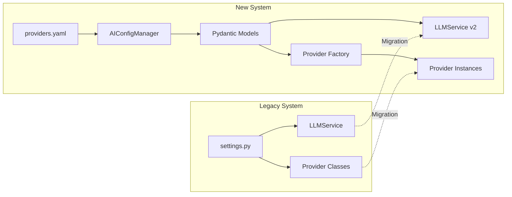

# AI Provider Migration Guide

This guide covers migrating from the legacy Settings-based configuration to the new AI Provider configuration system based on YAML files and Pydantic models.

## Table of Contents

1. [Overview](#overview)
2. [Migration Timeline](#migration-timeline)
3. [Breaking Changes](#breaking-changes)
4. [Migration Steps](#migration-steps)
5. [Configuration Mapping](#configuration-mapping)
6. [Code Migration](#code-migration)
7. [Environment Variable Changes](#environment-variable-changes)
8. [Backward Compatibility](#backward-compatibility)
9. [Rollback Procedures](#rollback-procedures)
10. [Version Compatibility Matrix](#version-compatibility-matrix)
11. [Testing Migration](#testing-migration)
12. [Common Migration Issues](#common-migration-issues)

---

## Overview

### Why Migrate?

The new AI Provider configuration system provides:

| Feature | Legacy System | New System |
|---------|---------------|------------|
| Configuration Format | Python Settings class | YAML + Pydantic models |
| Hot Reload | ❌ Requires restart | ✅ Runtime reload |
| Multi-Provider Support | Limited | ✅ 8 providers |
| Failover Chains | Manual implementation | ✅ Declarative YAML |
| Cost Tracking | Basic | ✅ Per-model pricing |
| Rate Limiting | Global | ✅ Per-provider |
| Circuit Breaker | Manual | ✅ Built-in |
| API Key Security | Environment only | ✅ Encrypted storage |

### Migration Architecture



---

## Migration Timeline

### Recommended Migration Schedule

| Phase | Duration | Activities |
|-------|----------|------------|
| **Phase 1: Preparation** | 1 week | Review current config, create YAML, test in dev |
| **Phase 2: Parallel Run** | 2 weeks | Run both systems, validate outputs |
| **Phase 3: Cutover** | 1 day | Switch to new system, monitor |
| **Phase 4: Cleanup** | 1 week | Remove legacy code, update documentation |

### Version Milestones

- **v2.0.0**: New config system introduced (backward compatible)
- **v2.1.0**: Deprecation warnings for legacy system
- **v3.0.0**: Legacy system removed

---

## Breaking Changes

### API Changes

| Change | Impact | Migration Action |
|--------|--------|------------------|
| Provider selection headers | Medium | Update client code to use `X-Provider`, `X-Model` |
| Rate limit headers | Low | Update monitoring to read new header format |
| Cost tracking response | Low | Update cost parsing for new format |
| Health endpoint response | Medium | Update health checks for new response structure |

### Configuration Changes

| Legacy | New | Notes |
|--------|-----|-------|
| `settings.GEMINI_API_KEY` | `providers.yaml: gemini.api_key` | Or env var |
| `settings.DEFAULT_MODEL` | `global.default_model` | In YAML |
| `settings.LLM_TIMEOUT` | `global.request_timeout` | In YAML |
| `settings.MAX_RETRIES` | `global.max_retries` | In YAML |

### Behavioral Changes

1. **Failover Behavior**: Now uses declarative chains instead of hardcoded order
2. **Rate Limiting**: Per-provider instead of global
3. **Circuit Breaker**: Automatic instead of manual
4. **Caching**: Configurable TTL instead of fixed

---

## Migration Steps

### Step 1: Create providers.yaml

Create the new configuration file based on your current settings:

```yaml
# backend-api/app/config/providers.yaml
version: "1.0"

global:
  # From settings.DEFAULT_PROVIDER
  default_provider: "gemini"
  # From settings.DEFAULT_MODEL
  default_model: "gemini-2.0-flash-exp"
  # From settings.LLM_TIMEOUT
  request_timeout: 30
  # From settings.MAX_RETRIES
  max_retries: 3
  enable_caching: true
  cache_ttl: 3600

providers:
  gemini:
    enabled: true
    # Use environment variable reference
    api_key: "${GEMINI_API_KEY}"
    base_url: "https://generativelanguage.googleapis.com/v1beta"
    
    capabilities:
      supports_streaming: true
      supports_vision: true
      supports_function_calling: true
      supports_json_mode: true
      supports_system_prompt: true
      supports_token_counting: true
    
    rate_limits:
      requests_per_minute: 60
      tokens_per_minute: 1000000
    
    models:
      gemini-2.0-flash-exp:
        display_name: "Gemini 2.0 Flash"
        context_window: 1000000
        max_output_tokens: 8192
        is_default: true
        pricing:
          input_per_1k: 0.0
          output_per_1k: 0.0

# Add other providers...

failover_chains:
  default:
    - gemini
    - openai
    - anthropic
```

### Step 2: Update Environment Variables

**Legacy `.env`:**
```bash
GEMINI_API_KEY=your-key
OPENAI_API_KEY=your-key
DEFAULT_MODEL=gemini-pro
LLM_TIMEOUT=30
MAX_RETRIES=3
```

**New `.env`:**
```bash
# API keys remain the same (referenced in YAML)
GEMINI_API_KEY=your-key
OPENAI_API_KEY=your-key

# New configuration path
AI_CONFIG_PATH=app/config/providers.yaml

# Legacy variables (for backward compatibility during migration)
DEFAULT_MODEL=gemini-2.0-flash-exp
LLM_TIMEOUT=30
MAX_RETRIES=3
```

### Step 3: Update Application Initialization

**Legacy Code:**
```python
# main.py (legacy)
from app.config import settings
from app.services.llm_service import LLMService

app = FastAPI()
llm_service = LLMService(
    api_key=settings.GEMINI_API_KEY,
    model=settings.DEFAULT_MODEL,
    timeout=settings.LLM_TIMEOUT
)
```

**New Code:**
```python
# main.py (new)
from fastapi import FastAPI
from app.core.ai_config_manager import AIConfigManager
from app.core.service_registry import register_ai_config_manager
from app.middleware.provider_selection_middleware import ProviderSelectionMiddleware
from app.middleware.rate_limit_middleware import ProviderRateLimitMiddleware
from app.middleware.cost_tracking_middleware import CostTrackingMiddleware
from app.middleware.validation_middleware import ConfigValidationMiddleware

app = FastAPI()

# Initialize configuration
@app.on_event("startup")
async def startup():
    config_manager = AIConfigManager()
    config_manager.load_config("app/config/providers.yaml")
    register_ai_config_manager(config_manager)

# Add middleware stack
app.add_middleware(ConfigValidationMiddleware)
app.add_middleware(CostTrackingMiddleware)
app.add_middleware(ProviderRateLimitMiddleware)
app.add_middleware(ProviderSelectionMiddleware)
```

### Step 4: Migrate Service Usage

**Legacy Service Usage:**
```python
# routes.py (legacy)
from app.services.llm_service import llm_service
from app.config import settings

@router.post("/generate")
async def generate(request: GenerateRequest):
    result = await llm_service.generate(
        prompt=request.prompt,
        max_tokens=request.max_tokens or settings.DEFAULT_MAX_TOKENS
    )
    return {"text": result.text}
```

**New Service Usage:**
```python
# routes.py (new)
from fastapi import Request
from app.services.llm_service import get_llm_service
from app.middleware.provider_selection_middleware import get_request_provider

@router.post("/generate")
async def generate(request: Request, generate_request: GenerateRequest):
    # Get provider context from middleware
    provider, model = get_request_provider(request)
    
    # Get configured service
    llm_service = get_llm_service()
    
    result = await llm_service.generate_text(
        prompt=generate_request.prompt,
        max_tokens=generate_request.max_tokens,
        provider=provider,
        model=model
    )
    
    return {
        "text": result.text,
        "provider": provider,
        "model": model,
        "cost": result.cost
    }
```

### Step 5: Update Tests

**Legacy Tests:**
```python
# test_llm.py (legacy)
import pytest
from app.services.llm_service import LLMService
from app.config import settings

@pytest.fixture
def llm_service():
    return LLMService(
        api_key=settings.GEMINI_API_KEY,
        model="gemini-pro"
    )

def test_generate(llm_service):
    result = llm_service.generate("Hello")
    assert result.text
```

**New Tests:**
```python
# test_llm.py (new)
import pytest
from unittest.mock import MagicMock
from app.services.llm_service import LLMService
from app.core.ai_config_manager import AIConfigManager

@pytest.fixture
def config_manager():
    manager = AIConfigManager()
    manager.load_config("tests/fixtures/test_providers.yaml")
    return manager

@pytest.fixture
def llm_service(config_manager):
    service = LLMService()
    # Service automatically uses config manager
    return service

def test_generate(llm_service):
    result = await llm_service.generate_text(
        prompt="Hello",
        provider="gemini",
        model="gemini-2.0-flash-exp"
    )
    assert result.text

def test_failover(llm_service):
    # Test failover chain behavior
    result = await llm_service.generate_with_failover(
        prompt="Hello",
        failover_chain="default"
    )
    assert result.text
    assert result.provider in ["gemini", "openai", "anthropic"]
```

### Step 6: Deploy and Monitor

1. **Deploy to staging** with new configuration
2. **Run parallel tests** comparing outputs
3. **Monitor metrics**:
   - Response times
   - Error rates
   - Cost tracking
   - Provider distribution
4. **Deploy to production** after validation
5. **Enable feature flags** for gradual rollout

---

## Configuration Mapping

### Legacy Settings to YAML Mapping

| Legacy Setting | YAML Location | Notes |
|----------------|---------------|-------|
| `GEMINI_API_KEY` | `providers.gemini.api_key` | Use `${ENV_VAR}` syntax |
| `OPENAI_API_KEY` | `providers.openai.api_key` | Use `${ENV_VAR}` syntax |
| `ANTHROPIC_API_KEY` | `providers.anthropic.api_key` | Use `${ENV_VAR}` syntax |
| `DEFAULT_PROVIDER` | `global.default_provider` | String value |
| `DEFAULT_MODEL` | `global.default_model` | String value |
| `LLM_TIMEOUT` | `global.request_timeout` | Integer (seconds) |
| `MAX_RETRIES` | `global.max_retries` | Integer |
| `ENABLE_CACHE` | `global.enable_caching` | Boolean |
| `CACHE_TTL` | `global.cache_ttl` | Integer (seconds) |
| `RATE_LIMIT_RPM` | `providers.<id>.rate_limits.requests_per_minute` | Per-provider |
| `MAX_TOKENS` | `providers.<id>.models.<model>.max_output_tokens` | Per-model |

### Code Pattern Migration

**Provider Selection:**

```python
# Legacy
provider = settings.DEFAULT_PROVIDER
if request.provider:
    provider = request.provider

# New
from app.middleware.provider_selection_middleware import get_request_provider
provider, model = get_request_provider(request)
```

**Rate Limit Check:**

```python
# Legacy
if rate_limiter.check(settings.RATE_LIMIT_RPM):
    raise RateLimitExceeded()

# New (handled by middleware)
# No code needed - middleware handles this automatically
```

**Failover Logic:**

```python
# Legacy
providers = ["gemini", "openai", "anthropic"]
for provider in providers:
    try:
        return await generate(provider, prompt)
    except Exception:
        continue
raise AllProvidersFailedError()

# New
from app.core.fallback_manager import get_fallback_manager

fallback_manager = get_fallback_manager()
chain = fallback_manager.get_fallover_chain("default")
# Or use the service method
result = await llm_service.generate_with_failover(prompt, "default")
```

**Cost Calculation:**

```python
# Legacy
cost = (input_tokens / 1000) * 0.001 + (output_tokens / 1000) * 0.002

# New
from app.core.ai_config_manager import get_ai_config_manager

config_manager = get_ai_config_manager()
cost = config_manager.calculate_cost(
    provider_id="openai",
    model_id="gpt-4",
    input_tokens=input_tokens,
    output_tokens=output_tokens
)
```

---

## Environment Variable Changes

### Removed Variables

The following environment variables are no longer used (configured in YAML instead):

| Variable | Replacement |
|----------|-------------|
| `DEFAULT_PROVIDER` | `global.default_provider` in YAML |
| `DEFAULT_MODEL` | `global.default_model` in YAML |
| `LLM_TIMEOUT` | `global.request_timeout` in YAML |
| `MAX_RETRIES` | `global.max_retries` in YAML |
| `RATE_LIMIT_RPM` | Provider-specific `rate_limits` in YAML |
| `CACHE_ENABLED` | `global.enable_caching` in YAML |
| `CACHE_TTL_SECONDS` | `global.cache_ttl` in YAML |

### New Variables

| Variable | Description | Default |
|----------|-------------|---------|
| `AI_CONFIG_PATH` | Path to providers.yaml | `app/config/providers.yaml` |
| `AI_CONFIG_RELOAD_ENABLED` | Enable hot reload | `true` |
| `ENABLE_RATE_LIMITING` | Enable rate limit middleware | `true` |
| `ENABLE_COST_TRACKING` | Enable cost tracking middleware | `true` |
| `DAILY_BUDGET` | Daily cost budget in USD | None |

### Unchanged Variables

API keys remain as environment variables (referenced in YAML):

- `GEMINI_API_KEY`
- `OPENAI_API_KEY`
- `ANTHROPIC_API_KEY`
- `DEEPSEEK_API_KEY`
- `QWEN_API_KEY`
- `BIGMODEL_API_KEY`

---

## Backward Compatibility

### Compatibility Layer

For gradual migration, a compatibility layer is provided:

```python
# app/config/legacy_compat.py
from app.core.ai_config_manager import get_ai_config_manager
import os

class LegacySettingsCompat:
    """
    Compatibility layer for legacy settings access.
    Maps legacy attribute access to new config system.
    """
    
    @property
    def GEMINI_API_KEY(self):
        config = get_ai_config_manager().get_config()
        provider = config.get_provider("gemini")
        if provider:
            return provider.api_key
        return os.getenv("GEMINI_API_KEY")
    
    @property
    def DEFAULT_PROVIDER(self):
        config = get_ai_config_manager().get_config()
        return config.global_config.default_provider
    
    @property
    def DEFAULT_MODEL(self):
        config = get_ai_config_manager().get_config()
        return config.global_config.default_model
    
    @property
    def LLM_TIMEOUT(self):
        config = get_ai_config_manager().get_config()
        return config.global_config.request_timeout
    
    @property
    def MAX_RETRIES(self):
        config = get_ai_config_manager().get_config()
        return config.global_config.max_retries

# Use this for backward compatibility
settings = LegacySettingsCompat()
```

### Using the Compatibility Layer

```python
# Existing code continues to work
from app.config.legacy_compat import settings

api_key = settings.GEMINI_API_KEY
timeout = settings.LLM_TIMEOUT
```

### Feature Flags for Gradual Migration

```python
# config/feature_flags.py
import os

# Feature flags for migration
USE_NEW_CONFIG_SYSTEM = os.getenv("USE_NEW_CONFIG_SYSTEM", "true").lower() == "true"
USE_NEW_MIDDLEWARE = os.getenv("USE_NEW_MIDDLEWARE", "true").lower() == "true"
USE_NEW_FAILOVER = os.getenv("USE_NEW_FAILOVER", "true").lower() == "true"

# Usage
if USE_NEW_CONFIG_SYSTEM:
    from app.core.ai_config_manager import get_ai_config_manager
    config = get_ai_config_manager().get_config()
else:
    from app.config import settings
    # Legacy behavior
```

---

## Rollback Procedures

### Quick Rollback

If issues occur after migration:

**Step 1: Disable New System**

```bash
# Set environment variables to disable new features
export USE_NEW_CONFIG_SYSTEM=false
export USE_NEW_MIDDLEWARE=false
export USE_NEW_FAILOVER=false

# Restart application
systemctl restart chimera-api
```

**Step 2: Verify Legacy System**

```bash
# Check health
curl http://localhost:8000/health

# Test generation
curl -X POST http://localhost:8000/api/v1/generate \
  -d '{"prompt": "test"}'
```

### Full Rollback

For complete rollback to previous version:

**Step 1: Revert Code**

```bash
# Revert to previous release tag
git checkout v1.x.x

# Reinstall dependencies
poetry install
```

**Step 2: Restore Legacy Configuration**

```bash
# Restore legacy .env
cp .env.backup .env

# Remove new config file
rm -f app/config/providers.yaml
```

**Step 3: Restart Services**

```bash
# Restart application
systemctl restart chimera-api

# Verify
curl http://localhost:8000/health
```

### Rollback Checklist

- [ ] Feature flags disabled
- [ ] Legacy code restored
- [ ] Legacy configuration restored
- [ ] Services restarted
- [ ] Health checks passing
- [ ] Monitoring alerts cleared
- [ ] Team notified

---

## Version Compatibility Matrix

### Python Version Compatibility

| Config System | Python 3.9 | Python 3.10 | Python 3.11 | Python 3.12 |
|---------------|------------|-------------|-------------|-------------|
| Legacy | ✅ | ✅ | ✅ | ⚠️ |
| New (v2.x) | ✅ | ✅ | ✅ | ✅ |

### Dependency Compatibility

| Dependency | Legacy Version | New Version | Notes |
|------------|----------------|-------------|-------|
| Pydantic | 1.x | 2.x | Major version upgrade |
| FastAPI | 0.95+ | 0.100+ | New middleware support |
| httpx | 0.23+ | 0.24+ | Async improvements |
| PyYAML | 5.x | 6.x | Security fixes |

### API Version Compatibility

| Feature | API v1 | API v2 |
|---------|--------|--------|
| Legacy endpoints | ✅ | ✅ (deprecated) |
| New config endpoints | ❌ | ✅ |
| Provider headers | ❌ | ✅ |
| Cost tracking | Basic | Enhanced |
| Rate limit headers | Global | Per-provider |

---

## Testing Migration

### Pre-Migration Tests

Run these tests before starting migration:

```bash
# Test current system
pytest tests/integration/test_llm_service.py -v

# Capture baseline metrics
python scripts/capture_baseline_metrics.py

# Generate test data
python scripts/generate_test_requests.py --output test_data.json
```

### Migration Validation Tests

```python
# tests/migration/test_config_migration.py
import pytest
from app.core.ai_config_manager import AIConfigManager
from app.config.legacy_compat import settings as legacy_settings

class TestConfigMigration:
    """Tests to validate configuration migration."""
    
    @pytest.fixture
    def new_config(self):
        manager = AIConfigManager()
        manager.load_config("app/config/providers.yaml")
        return manager.get_config()
    
    def test_default_provider_matches(self, new_config):
        """Verify default provider matches legacy."""
        legacy = legacy_settings.DEFAULT_PROVIDER
        new = new_config.global_config.default_provider
        assert legacy == new, f"Provider mismatch: {legacy} != {new}"
    
    def test_default_model_matches(self, new_config):
        """Verify default model matches legacy."""
        legacy = legacy_settings.DEFAULT_MODEL
        new = new_config.global_config.default_model
        assert legacy == new, f"Model mismatch: {legacy} != {new}"
    
    def test_timeout_matches(self, new_config):
        """Verify timeout matches legacy."""
        legacy = legacy_settings.LLM_TIMEOUT
        new = new_config.global_config.request_timeout
        assert legacy == new, f"Timeout mismatch: {legacy} != {new}"
    
    def test_api_keys_accessible(self, new_config):
        """Verify API keys are accessible."""
        for provider_id in ["gemini", "openai", "anthropic"]:
            provider = new_config.get_provider(provider_id)
            if provider and provider.enabled:
                assert provider.api_key, f"Missing API key for {provider_id}"
```

### Output Comparison Tests

```python
# tests/migration/test_output_comparison.py
import pytest
import json
from app.services.llm_service import LLMService

class TestOutputComparison:
    """Compare outputs between legacy and new systems."""
    
    @pytest.fixture
    def test_prompts(self):
        with open("test_data.json") as f:
            return json.load(f)
    
    async def test_generation_output_similarity(self, test_prompts):
        """Verify outputs are similar between systems."""
        llm_service = LLMService()
        
        for prompt_data in test_prompts[:10]:  # Test first 10
            prompt = prompt_data["prompt"]
            
            # Generate with new system
            result = await llm_service.generate_text(
                prompt=prompt,
                temperature=0.0,  # Deterministic
                max_tokens=100
            )
            
            # Basic validation
            assert result.text
            assert len(result.text) > 0
            
            # Log for manual review
            print(f"Prompt: {prompt[:50]}...")
            print(f"Output: {result.text[:100]}...")
```

### Performance Comparison

```python
# tests/migration/test_performance.py
import pytest
import time
import statistics

class TestPerformanceComparison:
    """Compare performance between systems."""
    
    async def test_latency_comparison(self):
        """Verify latency is acceptable."""
        from app.services.llm_service import LLMService
        
        llm_service = LLMService()
        latencies = []
        
        for _ in range(10):
            start = time.perf_counter()
            await llm_service.generate_text(
                prompt="Hello, world!",
                max_tokens=50
            )
            latencies.append(time.perf_counter() - start)
        
        avg_latency = statistics.mean(latencies)
        p95_latency = statistics.quantiles(latencies, n=20)[18]
        
        # Assert acceptable performance
        assert avg_latency < 2.0, f"Average latency too high: {avg_latency}s"
        assert p95_latency < 5.0, f"P95 latency too high: {p95_latency}s"
```

---

## Common Migration Issues

### Issue 1: Configuration Not Loading

**Symptoms:**
- `ConfigurationNotLoadedError` on startup
- Empty provider list

**Solution:**
```python
# Verify config path
import os
config_path = os.getenv("AI_CONFIG_PATH", "app/config/providers.yaml")
assert os.path.exists(config_path), f"Config not found: {config_path}"

# Check YAML syntax
import yaml
with open(config_path) as f:
    config = yaml.safe_load(f)
print(f"Loaded {len(config.get('providers', {}))} providers")
```

### Issue 2: API Key Not Found

**Symptoms:**
- `API key not configured` error
- Provider marked as unhealthy

**Solution:**
```bash
# Verify environment variable is set
echo $GEMINI_API_KEY

# Check YAML references correct variable
grep "api_key" app/config/providers.yaml

# Ensure variable is exported
export GEMINI_API_KEY="your-key"
```

### Issue 3: Middleware Order Issues

**Symptoms:**
- Provider context not available
- Rate limits not applied

**Solution:**
```python
# Correct middleware order (first added = outermost)
app.add_middleware(ConfigValidationMiddleware)  # 4th (innermost)
app.add_middleware(CostTrackingMiddleware)      # 3rd
app.add_middleware(ProviderRateLimitMiddleware) # 2nd
app.add_middleware(ProviderSelectionMiddleware) # 1st (outermost)
```

### Issue 4: Pydantic Validation Errors

**Symptoms:**
- `ValidationError` on config load
- Schema mismatch errors

**Solution:**
```python
# Validate YAML against schema
from app.config.ai_provider_settings import AIProviderSettings
import yaml

with open("app/config/providers.yaml") as f:
    raw_config = yaml.safe_load(f)

try:
    config = AIProviderSettings(**raw_config)
    print("Configuration valid!")
except Exception as e:
    print(f"Validation error: {e}")
```

### Issue 5: Failover Chain Not Working

**Symptoms:**
- Requests fail instead of falling back
- Only first provider used

**Solution:**
```python
# Verify failover chain configuration
from app.core.fallback_manager import get_fallback_manager

fm = get_fallback_manager()
chain = fm.get_fallback_chain("default")
print(f"Failover chain: {chain}")

# Check provider health
for provider in chain:
    healthy = not fm.should_skip_provider(provider)
    print(f"{provider}: {'healthy' if healthy else 'unhealthy'}")
```

### Issue 6: Cost Tracking Incorrect

**Symptoms:**
- `X-Request-Cost` header missing
- Costs showing as $0

**Solution:**
```yaml
# Ensure pricing is configured for models
providers:
  openai:
    models:
      gpt-4o:
        pricing:
          input_per_1k: 0.005   # Required
          output_per_1k: 0.015  # Required
```

---

## Migration Checklist

### Pre-Migration

- [ ] Backup current configuration
- [ ] Document current settings values
- [ ] Create providers.yaml from settings
- [ ] Set up feature flags
- [ ] Create rollback plan
- [ ] Notify stakeholders

### During Migration

- [ ] Deploy to staging
- [ ] Run migration validation tests
- [ ] Compare outputs with legacy
- [ ] Verify cost tracking
- [ ] Test failover behavior
- [ ] Monitor error rates

### Post-Migration

- [ ] Enable in production
- [ ] Monitor for 24 hours
- [ ] Update documentation
- [ ] Remove legacy code
- [ ] Archive migration artifacts
- [ ] Conduct retrospective

---

## Next Steps

- [Integration Guide](./ai_provider_integration_guide.md) - Complete implementation guide
- [API Reference](./ai_provider_api_reference.md) - API documentation
- [Configuration Map](./ai_provider_configuration_map.md) - Complete configuration matrix
