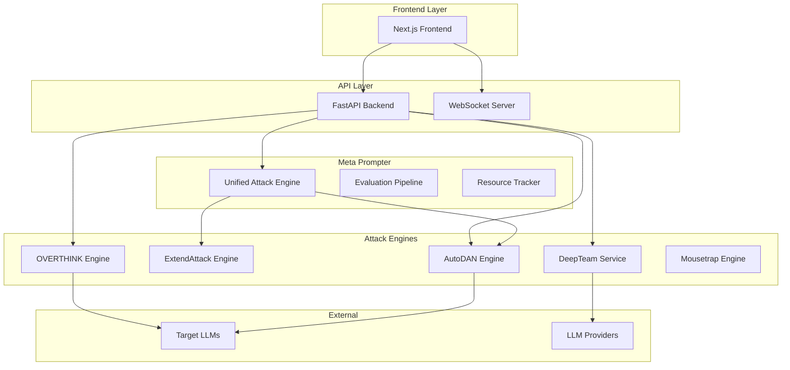
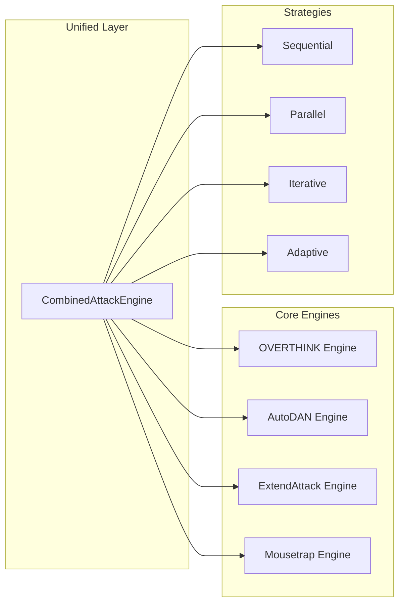
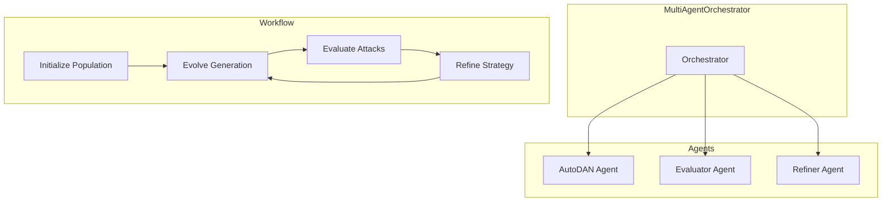
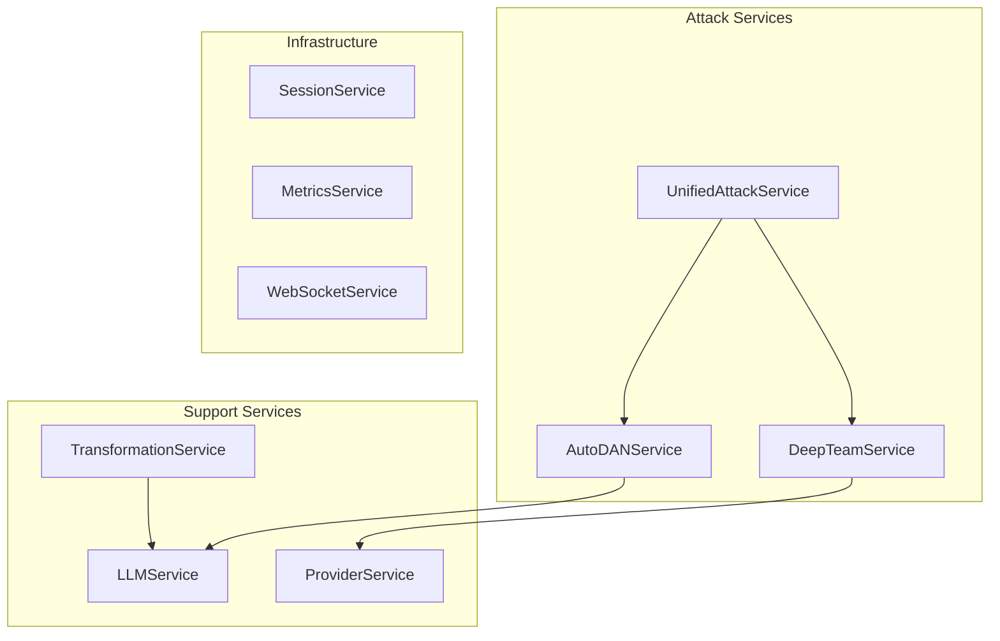
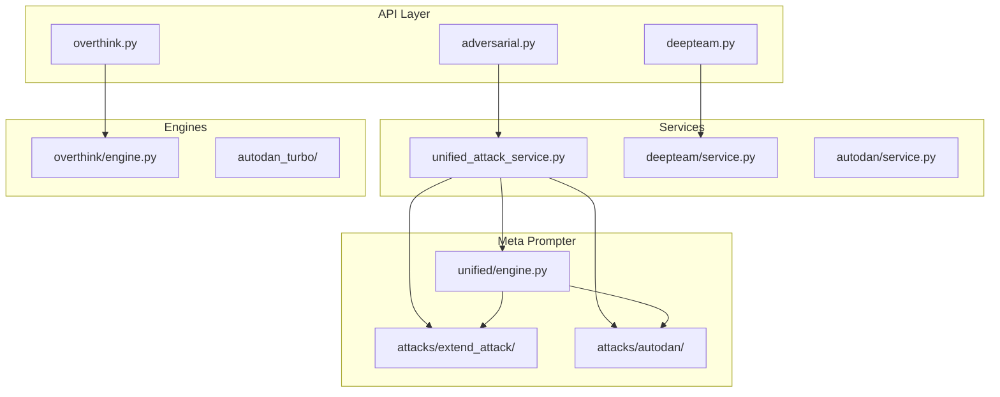

# Chimera Adversarial Framework Architecture Analysis

## Executive Summary

Chimera is a comprehensive adversarial AI security testing framework that integrates multiple attack methodologies for red-teaming Large Language Models (LLMs) and Large Reasoning Models (LRMs). This document provides a detailed analysis of the system architecture, existing attack implementations, and integration points for the OVERTHINK methodology.

**Key Finding**: OVERTHINK is **already fully integrated** into the Chimera framework with a dedicated engine module, API endpoints, and seamless integration with existing attack vectors like AutoDAN and DeepTeam.

---

## Table of Contents

1. [System Architecture Overview](#1-system-architecture-overview)
2. [Backend API Structure](#2-backend-api-structure)
3. [Attack Engines and Methodologies](#3-attack-engines-and-methodologies)
4. [OVERTHINK Integration (Existing)](#4-overthink-integration-existing)
5. [Meta Prompter Framework](#5-meta-prompter-framework)
6. [DeepTeam AutoDAN Integration](#6-deepteam-autodan-integration)
7. [API Endpoint Structure](#7-api-endpoint-structure)
8. [Services Layer Architecture](#8-services-layer-architecture)
9. [Dependency Analysis](#9-dependency-analysis)
10. [Recommended Enhancements](#10-recommended-enhancements)

---

## 1. System Architecture Overview

### High-Level Architecture



### Directory Structure

```
chimera/
├── backend-api/
│   └── app/
│       ├── api/v1/endpoints/    # 44+ API endpoint files
│       ├── engines/             # Attack engine implementations
│       │   ├── overthink/       # OVERTHINK engine module
│       │   ├── autodan_turbo/   # AutoDAN-Turbo engine
│       │   └── autoadv/         # Auto-adversarial engine
│       ├── services/            # Business logic layer
│       │   ├── autodan/         # AutoDAN service
│       │   ├── deepteam/        # DeepTeam integration
│       │   └── transformers/    # Prompt transformers
│       ├── schemas/             # Pydantic models
│       └── models/              # Database models
├── meta_prompter/
│   ├── attacks/                 # Attack implementations
│   │   ├── autodan/            # AutoDAN attack module
│   │   └── extend_attack/      # ExtendAttack implementation
│   └── unified/                # Unified attack framework
├── deepteam_autodan_integration/
│   ├── orchestrator.py         # Multi-agent orchestrator
│   └── agents/                 # Specialized agents
└── frontend/                   # Next.js UI
```

---

## 2. Backend API Structure

### Core Components

| Component | Path | Description |
|-----------|------|-------------|
| Main App | [`backend-api/app/main.py`](../backend-api/app/main.py) | FastAPI application setup with middleware |
| API Router | [`backend-api/app/api/v1/`](../backend-api/app/api/v1/) | Version 1 API endpoints |
| Engines | [`backend-api/app/engines/`](../backend-api/app/engines/) | Attack engine implementations |
| Services | [`backend-api/app/services/`](../backend-api/app/services/) | Business logic services |
| Schemas | [`backend-api/app/schemas/`](../backend-api/app/schemas/) | Request/Response models |

### API Endpoint Categories

The framework exposes **44+ endpoint files** organized by functionality:

| Category | Endpoints | Description |
|----------|-----------|-------------|
| **Adversarial** | `adversarial.py`, `overthink.py` | Unified attack APIs |
| **AutoDAN Family** | `autodan.py`, `autodan_turbo.py`, `autodan_enhanced.py` | Genetic algorithm attacks |
| **DeepTeam** | `deepteam.py` | Red-teaming with 40+ vulnerabilities |
| **Jailbreak** | `jailbreak.py`, `gptfuzz.py` | Jailbreak generation |
| **Transformation** | `transformation.py`, `evasion.py` | Prompt transformation |
| **Infrastructure** | `health.py`, `metrics.py`, `providers.py` | System management |

---

## 3. Attack Engines and Methodologies

### Engine Overview



### Attack Engine Implementations

#### 1. OVERTHINK Engine
**Location**: [`backend-api/app/engines/overthink/`](../backend-api/app/engines/overthink/)

| File | Purpose |
|------|---------|
| [`engine.py`](../backend-api/app/engines/overthink/engine.py) | Main attack orchestration |
| [`models.py`](../backend-api/app/engines/overthink/models.py) | Data models and enums |
| [`decoy_generator.py`](../backend-api/app/engines/overthink/decoy_generator.py) | Decoy problem generation |
| [`context_injector.py`](../backend-api/app/engines/overthink/context_injector.py) | Context injection strategies |
| [`reasoning_scorer.py`](../backend-api/app/engines/overthink/reasoning_scorer.py) | Reasoning token scoring |
| [`icl_genetic_optimizer.py`](../backend-api/app/engines/overthink/icl_genetic_optimizer.py) | ICL genetic optimization |

#### 2. AutoDAN Engine
**Location**: [`backend-api/app/engines/autodan_turbo/`](../backend-api/app/engines/autodan_turbo/)

| File | Purpose |
|------|---------|
| `hybrid_engine.py` | Hybrid attack strategy |
| `lifelong_engine.py` | Lifelong learning |
| `neural_bypass.py` | Neural network bypass |
| `refusal_bypass.py` | Refusal detection bypass |
| `strategy_library.py` | Attack strategy patterns |

#### 3. ExtendAttack Engine
**Location**: [`meta_prompter/attacks/extend_attack/`](../meta_prompter/attacks/extend_attack/)

| File | Purpose |
|------|---------|
| [`core.py`](../meta_prompter/attacks/extend_attack/core.py) | Poly-base ASCII obfuscation |
| `transformers.py` | Character transformers |
| `n_notes.py` | N_note templates |
| `models.py` | Attack result models |

---

## 4. OVERTHINK Integration (Existing)

### Discovery: OVERTHINK is Already Integrated

The analysis reveals that **OVERTHINK is already fully implemented** in Chimera with:

- **Dedicated Engine Module**: Complete implementation in [`backend-api/app/engines/overthink/`](../backend-api/app/engines/overthink/)
- **API Endpoints**: Full REST API at [`/api/v1/overthink`](../backend-api/app/api/v1/endpoints/overthink.py)
- **Unified Integration**: Exposed through the unified adversarial API

### OVERTHINK Attack Techniques

The engine implements **9 attack techniques**:

| Technique | Description | Target |
|-----------|-------------|--------|
| `mdp_decoy` | Markov Decision Process decoys | Reasoning amplification |
| `sudoku_decoy` | Constraint satisfaction puzzles | Token consumption |
| `counting_decoy` | Nested conditional counting | Computation exhaustion |
| `logic_decoy` | Multi-step logical inference | Reasoning chains |
| `hybrid_decoy` | Combined multiple decoy types | Maximum impact |
| `context_aware` | Position and content-sensitive | Targeted injection |
| `context_agnostic` | Universal template injection | Broad coverage |
| `icl_optimized` | ICL-enhanced attacks | Learning optimization |
| `mousetrap_enhanced` | Mousetrap chaotic reasoning | Chaos integration |

### Decoy Types

| Type | Description |
|------|-------------|
| `MDP` | Markov Decision Process problems |
| `Sudoku` | Grid-based constraint puzzles |
| `Counting` | Nested counting tasks |
| `Logic` | Multi-step logic problems |
| `Math` | Recursive calculations |
| `Planning` | Planning problems |
| `Hybrid` | Combined types |

### Injection Strategies

| Strategy | Description |
|----------|-------------|
| `context_aware` | Position and content-sensitive |
| `context_agnostic` | Universal templates |
| `hybrid` | Combined approach |
| `stealth` | Minimal detectability |
| `aggressive` | Maximum amplification |

### Target Models

- OpenAI: `o1`, `o1-mini`, `o3-mini`
- DeepSeek: `deepseek-r1`
- Claude: `claude-3-5-sonnet` (extended thinking)
- Gemini: `gemini-2.0-flash-thinking`

### OVERTHINK API Endpoints

**Base Path**: `/api/v1/overthink`

| Endpoint | Method | Description |
|----------|--------|-------------|
| `/attack` | POST | Execute OVERTHINK attack |
| `/attack/mousetrap` | POST | Mousetrap-enhanced attack |
| `/stats` | GET | Get attack statistics |
| `/decoy-types` | GET | List available decoy types |
| `/estimate-cost` | POST | Estimate attack cost |
| `/reset-stats` | POST | Reset statistics |

### Integration with Unified Adversarial API

OVERTHINK strategies are exposed through the **unified adversarial API** at [`/api/v1/adversarial`](../backend-api/app/api/v1/endpoints/adversarial.py):

```python
# Available OVERTHINK strategies in unified API
OVERTHINK_STRATEGIES = [
    "overthink",           # Base OVERTHINK
    "overthink_mdp",       # MDP decoy variant
    "overthink_sudoku",    # Sudoku decoy variant
    "overthink_hybrid",    # Hybrid decoy variant
    "overthink_mousetrap", # Mousetrap integration
    "overthink_icl",       # ICL-optimized
]
```

---

## 5. Meta Prompter Framework

### Overview

The `meta_prompter` module provides the core adversarial tooling shared across the framework.

### Structure

```
meta_prompter/
├── __init__.py              # Module exports
├── orchestrator.py          # Attack orchestration
├── jailbreak_enhancer.py    # Jailbreak improvement
├── refusal_bypass_optimizer.py  # Refusal bypass
├── registry.py              # Technique registry
├── attacks/
│   ├── autodan/            # AutoDAN attack
│   │   ├── attack.py       # Core attack
│   │   ├── config.py       # Configuration
│   │   └── reasoning_integration.py  # Reasoning enhancement
│   └── extend_attack/      # ExtendAttack
│       ├── core.py         # Main implementation
│       ├── transformers.py # Character transformers
│       └── evaluation/     # Attack evaluation
└── unified/
    ├── engine.py           # CombinedAttackEngine
    ├── evaluation.py       # Evaluation pipeline
    ├── math_framework.py   # Mathematical foundations
    ├── models.py           # Unified models
    ├── optimization.py     # Pareto optimization
    └── resource_tracking.py # Resource management
```

### Combined Attack Engine

The [`CombinedAttackEngine`](../meta_prompter/unified/engine.py) orchestrates multi-vector attacks:

```python
class CombinedAttackEngine:
    """
    Mathematical Formulations:
    - Combined Attack: Q' = Compose(T_extend(Q, ρ), M_autodan(Q, μ, S))
    - Unified Fitness: F(Q') = β * f_resource(Q') + γ * f_jailbreak(Q') - λ * f_detection(Q')
    - Composition Strategies:
      - Sequential: Q' = M(T(Q)) or Q' = T(M(Q))
      - Parallel: Q' = α * T(Q) + (1-α) * M(Q)
      - Iterative: Q'_n = T(M(Q'_{n-1}))
    """
```

### Composition Strategies

| Strategy | Description | Use Case |
|----------|-------------|----------|
| `EXTEND_FIRST` | Obfuscate then mutate | Token amplification priority |
| `AUTODAN_FIRST` | Mutate then obfuscate | Jailbreak priority |
| `PARALLEL` | Both simultaneously | Balanced attack |
| `ITERATIVE` | Alternating optimization | Maximum effectiveness |
| `ADAPTIVE` | Auto-select best | Unknown targets |

---

## 6. DeepTeam AutoDAN Integration

### Multi-Agent Orchestrator

**Location**: [`deepteam_autodan_integration/orchestrator.py`](../deepteam_autodan_integration/orchestrator.py)

The orchestrator coordinates three specialized agents:



### Agent Responsibilities

| Agent | Purpose | Key Methods |
|-------|---------|-------------|
| **AutoDANAgent** | Adversarial prompt generation | `initialize_population()`, `evolve_generation()` |
| **EvaluatorAgent** | Attack effectiveness judging | `evaluate_attack()` |
| **RefinerAgent** | Strategy optimization | `analyze_and_refine()` |

### DeepTeam Service

**Location**: [`backend-api/app/services/deepteam/`](../backend-api/app/services/deepteam/)

| Component | Description |
|-----------|-------------|
| `JailbreakService` | Jailbreak prompt generation |
| `JailbreakPromptGenerator` | Strategy-based generation |
| `StrategyFactory` | Attack strategy factory |

### Attack Strategies

- **PAIR**: Prompt Automatic Iterative Refinement
- **TAP**: Tree of Attack with Pruning
- **Crescendo**: Gradual escalation
- **Gray Box**: Partial model knowledge

---

## 7. API Endpoint Structure

### Adversarial Operations Endpoints

#### Unified Adversarial API (`/api/v1/adversarial`)

```python
# All attack strategies available
ALL_STRATEGIES = {
    # AutoDAN Family
    "autodan", "autodan_turbo", "autodan_genetic",
    "autodan_beam", "autodan_hybrid",
    
    # DeepTeam Attacks
    "pair", "tap", "crescendo", "gray_box",
    
    # Advanced Methods
    "mousetrap", "gradient", "hierarchical",
    
    # OVERTHINK Variants
    "overthink", "overthink_mdp", "overthink_sudoku",
    "overthink_hybrid", "overthink_mousetrap", "overthink_icl",
    
    # Transformation-based
    "quantum_exploit", "deep_inception", "neural_bypass",
    
    # Meta Strategies
    "adaptive", "best_of_n",
}
```

#### OVERTHINK API (`/api/v1/overthink`)

| Endpoint | Method | Request Model | Response Model |
|----------|--------|---------------|----------------|
| `/attack` | POST | `OverthinkAttackRequest` | `OverthinkResponse` |
| `/attack/mousetrap` | POST | `MousetrapFusionRequest` | `MousetrapFusionResponse` |
| `/stats` | GET | - | `OverthinkStatsResponse` |
| `/decoy-types` | GET | - | `DecoyTypesResponse` |
| `/estimate-cost` | POST | `CostEstimateRequest` | `CostEstimateResponse` |

#### DeepTeam API (`/api/v1/deepteam`)

| Endpoint | Method | Description |
|----------|--------|-------------|
| `/generate` | POST | Generate jailbreak prompts |
| `/generate/stream` | POST | Streaming generation |
| `/strategies` | GET | List available strategies |
| `/vulnerabilities` | GET | List vulnerability types |

---

## 8. Services Layer Architecture

### Service Categories



### Key Services

#### UnifiedAttackService

**Location**: [`backend-api/app/services/unified_attack_service.py`](../backend-api/app/services/unified_attack_service.py)

Central orchestrator for multi-vector attacks:

```python
class UnifiedAttackService:
    """
    Orchestrates multi-vector attack lifecycle:
    - Session lifecycle management
    - Attack execution coordination
    - Evaluation pipeline integration
    - Resource budget management
    - Pareto-optimal solution tracking
    """
    
    async def execute_attack(self, session_id, query, strategy) -> AttackExecutionResult
    async def execute_reasoning_extended_attack(self, ...) -> AttackExecutionResult
    async def execute_mutation_optimized_attack(self, ...) -> AttackExecutionResult
```

#### AutoDAN Services

**Location**: [`backend-api/app/services/autodan/`](../backend-api/app/services/autodan/)

| Service | Description |
|---------|-------------|
| `AutoDANService` | Core service with lifelong learning |
| `EnhancedAutoDANService` | Parallel processing and caching |
| `AutoDANResearchService` | Research-focused with ethical protocols |

#### DeepTeam Services

**Location**: [`backend-api/app/services/deepteam/`](../backend-api/app/services/deepteam/)

| Service | Description |
|---------|-------------|
| `JailbreakService` | Jailbreak generation |
| `JailbreakPromptGenerator` | Strategy-based prompt generation |
| `WebSocketHandler` | Real-time streaming |

---

## 9. Dependency Analysis

### Module Dependencies



### Import Chain

```
backend-api/app/services/unified_attack_service.py
├── meta_prompter.unified.engine
│   ├── meta_prompter.attacks.extend_attack.core
│   ├── meta_prompter.attacks.extend_attack.models
│   └── meta_prompter.unified.math_framework
├── meta_prompter.unified.evaluation
├── meta_prompter.unified.models
├── meta_prompter.unified.resource_tracking
└── meta_prompter.attacks.autodan
```

### Critical Dependencies

| Module | Depends On | Purpose |
|--------|------------|---------|
| `unified_attack_service` | `meta_prompter.unified.*` | Attack orchestration |
| `overthink/engine.py` | `overthink/*.py` | OVERTHINK attack execution |
| `CombinedAttackEngine` | `extend_attack`, `autodan` | Multi-vector composition |

---

## 10. Recommended Enhancements

### Since OVERTHINK is Already Integrated

The framework already has comprehensive OVERTHINK support. Potential enhancements include:

#### 1. Enhanced Decoy Types

Add new decoy problem generators:
- **Graph traversal** decoys for reasoning amplification
- **Cryptographic puzzle** decoys for mathematical models
- **Natural language inference** decoys for language models

#### 2. Improved Cost Estimation

Enhance the [`CostEstimator`](../backend-api/app/engines/overthink/reasoning_scorer.py) with:
- Real-time pricing API integration
- Historical cost analysis
- Budget optimization recommendations

#### 3. Advanced Mousetrap Fusion

Strengthen the Mousetrap-OVERTHINK integration:
- Deeper chaotic reasoning injection
- Cross-technique amplification
- Adaptive chaos levels

#### 4. Extended Model Support

Add support for additional reasoning models:
- Google's Gemini Pro with reasoning
- Anthropic's Claude with extended thinking
- Local reasoning models (Llama variants)

#### 5. Evaluation Pipeline Enhancements

Improve attack evaluation:
- More sophisticated success metrics
- Automated A/B testing of techniques
- Cross-model effectiveness comparison

### Implementation Priorities

| Priority | Enhancement | Impact |
|----------|-------------|--------|
| High | Graph traversal decoys | Broader attack coverage |
| High | Real-time cost API | Better budget management |
| Medium | Extended model support | Wider applicability |
| Medium | Evaluation improvements | Better optimization |
| Low | Advanced Mousetrap fusion | Specialized attacks |

---

## Appendix A: Key Code References

### OVERTHINK Engine Core

```python
# backend-api/app/engines/overthink/engine.py:49-63
class OverthinkEngine:
    """
    Core OVERTHINK attack engine.
    
    Implements 9 attack techniques for reasoning token exploitation:
    - mdp_decoy: Markov Decision Process decoys
    - sudoku_decoy: Constraint satisfaction puzzles
    - counting_decoy: Nested conditional counting
    - logic_decoy: Multi-step logical inference
    - hybrid_decoy: Combined multiple decoy types
    - context_aware: Position and content-sensitive injection
    - context_agnostic: Universal template injection
    - icl_optimized: In-Context Learning enhanced attacks
    - mousetrap_enhanced: Integration with Mousetrap chaotic reasoning
    """
```

### Unified Attack Composition

```python
# meta_prompter/unified/engine.py:1-35
"""
Mathematical Formulations:
- Combined Attack: Q' = Compose(T_extend(Q, ρ), M_autodan(Q, μ, S))
- Unified Fitness: F(Q') = β * f_resource(Q') + γ * f_jailbreak(Q') - λ * f_detection(Q')
- Composition Functions:
  - Sequential: Q' = M(T(Q)) or Q' = T(M(Q))
  - Parallel: Q' = α * T(Q) + (1-α) * M(Q) (prompt blending)
  - Iterative: Q'_n = T(M(Q'_{n-1})) for n iterations
"""
```

### OVERTHINK API Request Model

```python
# backend-api/app/engines/overthink/models.py:162-193
@dataclass
class OverthinkRequest:
    """Request for an OVERTHINK attack."""
    prompt: str
    target_model: ReasoningModel
    technique: AttackTechnique
    
    # Decoy configuration
    decoy_types: list[DecoyType] = field(default_factory=lambda: [DecoyType.MDP])
    num_decoys: int = 1
    decoy_difficulty: float = 0.7
    
    # Injection configuration
    injection_strategy: InjectionStrategy = InjectionStrategy.CONTEXT_AWARE
    
    # ICL configuration
    icl_examples: list[str] | None = None
    icl_optimize: bool = False
    
    # Mousetrap integration
    enable_mousetrap: bool = False
    mousetrap_depth: int = 3
```

---

## Appendix B: API Schema Examples

### OVERTHINK Attack Request

```json
{
  "prompt": "Solve this complex problem step by step",
  "target_model": "o1",
  "technique": "hybrid_decoy",
  "decoy_types": ["mdp", "logic", "math"],
  "num_decoys": 3,
  "decoy_difficulty": 0.8,
  "injection_strategy": "context_aware",
  "enable_mousetrap": true,
  "mousetrap_depth": 3,
  "target_amplification": 15.0
}
```

### OVERTHINK Attack Response

```json
{
  "success": true,
  "attack_id": "atk_12345",
  "response": "...",
  "token_metrics": {
    "input_tokens": 150,
    "output_tokens": 2500,
    "reasoning_tokens": 18000,
    "amplification_factor": 12.5
  },
  "cost_metrics": {
    "total_cost": 0.45,
    "cost_amplification_factor": 8.2
  },
  "decoy_problems": [
    {"type": "mdp", "difficulty": 0.8},
    {"type": "logic", "difficulty": 0.7}
  ]
}
```

---

## Conclusion

The Chimera adversarial framework is a mature, well-architected system with **OVERTHINK already fully integrated**. The architecture supports:

1. **Multiple Attack Vectors**: OVERTHINK, AutoDAN, ExtendAttack, DeepTeam
2. **Unified Orchestration**: CombinedAttackEngine for multi-vector attacks
3. **Flexible Composition**: Sequential, parallel, iterative, and adaptive strategies
4. **Comprehensive APIs**: Full REST endpoints for all attack types
5. **Extensible Design**: Easy to add new decoy types and attack techniques

The integration points are well-defined, with clear module boundaries and standardized interfaces. Future enhancements should focus on expanding decoy types, improving cost estimation, and extending model support rather than re-implementing the OVERTHINK methodology.
