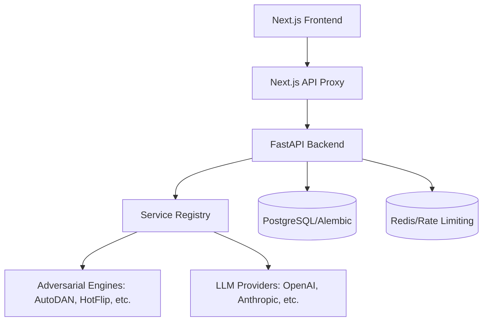

# System Patterns

## System Architecture
Chimera follows a decoupled architecture consisting of a FastAPI backend and a Next.js frontend, coordinated through a proxy layer to handle long-running AI operations.

## Key Technical Decisions
1.  **Service Registry Pattern**: The backend uses a registry to manage dependencies and provide a unified interface for different adversarial engines and LLM providers.
2.  **Next.js API Proxy**: A dedicated proxy route (`/api/v1/[...path]`) handles communication with the backend, using `undici` with a 600s timeout to support long-running adversarial tasks.
3.  **Pydantic v2**: Used for robust data validation and settings management (`pydantic-settings`).
4.  **Alembic**: Manages database migrations for the PostgreSQL backend.
5.  **Tailwind CSS & Shadcn UI**: Provides a consistent and accessible UI framework for the frontend.

## Design Patterns
-   **Orchestrator Pattern**: The backend orchestrates complex workflows involving multiple AI models and adversarial techniques.
-   **Strategy Pattern**: Different adversarial engines (AutoDAN, HotFlip) are implemented as interchangeable strategies within the framework.
-   **Middleware-based Security**: A comprehensive middleware stack handles rate limiting, input validation, CSRF protection, and behavior analysis.

## Security Patterns
-   **Behavior Analysis**: The `JailbreakSecurityMiddleware` analyzes request/response patterns to detect and log potential security events.
-   **Input Sanitization**: HTML escaping and script stripping are applied to prevent injection attacks.
-   **Rate Limiting**: Redis-backed rate limiting protects the API from abuse.
-   **Secure Headers**: HSTS, CSP, and other security headers are enforced (currently pending activation in production).
-   **CORS Validation**: Strict origin validation based on environment configuration.
