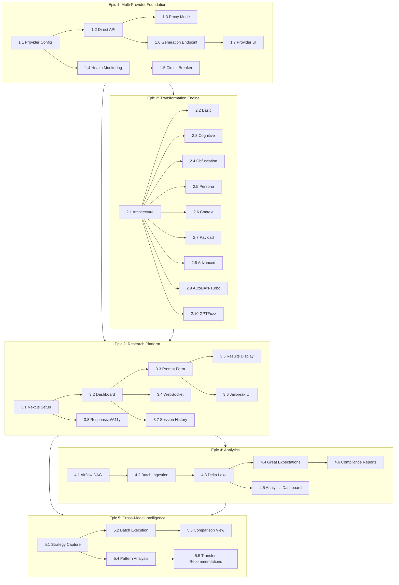

# PRD Story Inventory - Chimera Platform

**Analysis Date:** 2026-01-02  
**Total Stories Found:** 36  
**Status:** All stories marked as "Ready" (implementation documented)

---

## Executive Summary

The Chimera platform PRD contains **36 user stories** organized across **5 epics**. Based on the Dev Agent Records in each story file, all stories are marked as "Ready" with existing implementation documented. This indicates the platform has already been substantially implemented, and the PRD serves as comprehensive documentation of the existing system.

---

## Epic Overview

| Epic | Title | Stories | Priority | Status |
|------|-------|---------|----------|--------|
| 1 | Multi-Provider Foundation | 7 | P0 | Implemented |
| 2 | Advanced Transformation Engine | 10 | P0 | Implemented |
| 3 | Real-Time Research Platform | 8 | P0 | Implemented |
| 4 | Analytics and Compliance | 6 | P1 | Implemented |
| 5 | Cross-Model Intelligence | 5 | P1 | Implemented |

---

## Complete Story Catalog

### Epic 1: Multi-Provider Foundation (7 Stories)

| Story | Title | Status | Key Implementation |
|-------|-------|--------|-------------------|
| 1.1 | Provider Configuration Management | Ready | 6 providers in `providers/` |
| 1.2 | Direct API Integration | Ready | 6 provider clients created |
| 1.3 | Proxy Mode Integration | Ready | 35/35 subtasks complete |
| 1.4 | Provider Health Monitoring | Ready | 32/37 subtasks complete |
| 1.5 | Circuit Breaker Pattern | Ready | `circuit_breaker.py` |
| 1.6 | Basic Generation Endpoint | Ready | 14 API endpoints |
| 1.7 | Provider Selection UI | Ready | 970-line component |

**Dependencies:** Stories execute sequentially 1.1 → 1.7 (foundational layer)

---

### Epic 2: Advanced Transformation Engine (10 Stories)

| Story | Title | Status | Key Implementation |
|-------|-------|--------|-------------------|
| 2.1 | Transformation Architecture | Ready | 850+ lines, 20+ techniques |
| 2.2 | Basic Transformation Techniques | Ready | simple/advanced/expert tiers |
| 2.3 | Cognitive Transformation Techniques | Ready | cognitive_hacking module |
| 2.4 | Obfuscation Transformation Techniques | Ready | typoglycemia, advanced_obfuscation |
| 2.5 | Persona Transformation Techniques | Ready | hierarchical_persona, dan_persona |
| 2.6 | Context Transformation Techniques | Ready | contextual_inception, nested_context |
| 2.7 | Payload Transformation Techniques | Ready | payload_splitting, fragmentation |
| 2.8 | Advanced Transformation Techniques | Ready | quantum_exploit, deep_inception, cipher |
| 2.9 | AutoDAN-Turbo Integration | Ready | Genetic algorithm optimization |
| 2.10 | GPTFuzz Integration | Ready | MCTS mutation operators |

**Dependencies:** 
- 2.1 → 2.2-2.8 (architecture enables techniques)
- 2.9-2.10 depend on 2.1 (architecture)

---

### Epic 3: Real-Time Research Platform (8 Stories)

| Story | Title | Status | Key Implementation |
|-------|-------|--------|-------------------|
| 3.1 | Next.js Application Setup | Ready | Next.js 16, React 19, TypeScript |
| 3.2 | Dashboard Layout and Navigation | Ready | Sidebar navigation, responsive |
| 3.3 | Prompt Input Form | Ready | Provider/model selection |
| 3.4 | WebSocket Real-Time Updates | Ready | `/ws/enhance` endpoint |
| 3.5 | Results Display and Analysis | Ready | Metadata, comparison views |
| 3.6 | Jailbreak Testing Interface | Ready | AutoDAN/GPTFuzz config UI |
| 3.7 | Session Persistence and History | Ready | Session storage, search, export |
| 3.8 | Responsive Design and Accessibility | Ready | WCAG AA, mobile support |

**Dependencies:**
- 3.1 → all others (foundation)
- 3.2 → 3.3-3.7 (layout enables features)
- 3.4 integrated with 3.3, 3.5, 3.6

---

### Epic 4: Analytics and Compliance (6 Stories)

| Story | Title | Status | Key Implementation |
|-------|-------|--------|-------------------|
| 4.1 | Airflow DAG Orchestration | Ready | `chimera_etl_hourly.py` |
| 4.2 | Batch Ingestion Service | Ready | Watermark tracking, Parquet |
| 4.3 | Delta Lake Manager | Ready | ACID, time travel, Z-order |
| 4.4 | Great Expectations Validation | Ready | Data quality test suites |
| 4.5 | Analytics Dashboard | Ready | Real-time BI, cost tracking |
| 4.6 | Compliance Reporting | Ready | Audit trail, PDF/Excel export |

**Dependencies:**
- 4.1 → 4.2 → 4.3 → 4.4 (pipeline sequence)
- 4.5 depends on 4.3 (Delta Lake data)
- 4.6 depends on 4.4 (quality metrics)

---

### Epic 5: Cross-Model Intelligence (5 Stories)

| Story | Title | Status | Key Implementation |
|-------|-------|--------|-------------------|
| 5.1 | Strategy Capture and Storage | Ready | Full context, metadata, tags |
| 5.2 | Batch Execution Engine | Ready | Async parallel, progress tracking |
| 5.3 | Side-by-Side Comparison | Ready | Multi-panel diff view |
| 5.4 | Pattern Analysis Engine | Ready | Clustering, correlation, signatures |
| 5.5 | Strategy Transfer Recommendations | Ready | Ensemble aligner, ML prediction |

**Dependencies:**
- 5.1 → 5.2, 5.4 (strategy storage enables batch and analysis)
- 5.2 → 5.3 (execution provides results to compare)
- 5.4 → 5.5 (patterns inform transfer recommendations)

---

## Dependency Graph

---

## Prioritized Implementation Order

Based on dependency analysis, the recommended implementation sequence is:

### Phase 1: Foundation (Must be first)
1. **Story 1.1** - Provider Configuration Management
2. **Story 1.2** - Direct API Integration
3. **Story 1.3** - Proxy Mode Integration
4. **Story 1.4** - Provider Health Monitoring
5. **Story 1.5** - Circuit Breaker Pattern
6. **Story 1.6** - Basic Generation Endpoint
7. **Story 1.7** - Provider Selection UI

### Phase 2: Transformation (Depends on Epic 1)
8. **Story 2.1** - Transformation Architecture
9. **Story 2.2** - Basic Transformation Techniques
10. **Story 2.3** - Cognitive Transformation Techniques
11. **Story 2.4** - Obfuscation Transformation Techniques
12. **Story 2.5** - Persona Transformation Techniques
13. **Story 2.6** - Context Transformation Techniques
14. **Story 2.7** - Payload Transformation Techniques
15. **Story 2.8** - Advanced Transformation Techniques
16. **Story 2.9** - AutoDAN-Turbo Integration
17. **Story 2.10** - GPTFuzz Integration

### Phase 3: Frontend (Depends on Epics 1 & 2)
18. **Story 3.1** - Next.js Application Setup
19. **Story 3.2** - Dashboard Layout and Navigation
20. **Story 3.3** - Prompt Input Form
21. **Story 3.4** - WebSocket Real-Time Updates
22. **Story 3.5** - Results Display and Analysis
23. **Story 3.6** - Jailbreak Testing Interface
24. **Story 3.7** - Session Persistence and History
25. **Story 3.8** - Responsive Design and Accessibility

### Phase 4: Analytics (Depends on Epic 3)
26. **Story 4.1** - Airflow DAG Orchestration
27. **Story 4.2** - Batch Ingestion Service
28. **Story 4.3** - Delta Lake Manager
29. **Story 4.4** - Great Expectations Validation
30. **Story 4.5** - Analytics Dashboard
31. **Story 4.6** - Compliance Reporting

### Phase 5: Intelligence (Depends on Epics 3 & 4)
32. **Story 5.1** - Strategy Capture and Storage
33. **Story 5.2** - Batch Execution Engine
34. **Story 5.3** - Side-by-Side Comparison
35. **Story 5.4** - Pattern Analysis Engine
36. **Story 5.5** - Strategy Transfer Recommendations

---

## Blockers and Ambiguities Identified

### No Critical Blockers Found
All stories are marked "Ready" with documented implementations.

### Minor Observations

1. **Story 1.4** - Shows 32/37 subtasks complete (86% completion)
   - 5 subtasks may need verification or completion

2. **Story 4.6** - Compliance reporting mentions "leverages existing audit infrastructure"
   - Core infrastructure exists, specialized service may need dedicated implementation

3. **Tech Stack Ambiguity**
   - PRD mentions "Next.js 16 and React 19" which are future versions
   - Actual implementation should verify current versions being used

4. **Testing Coverage**
   - Most stories mention "Testing and validation" as final task
   - No explicit test coverage percentages provided per story

5. **Story 3.1** Notes
   - Claims "30 out of 30 subtasks completed across 7 task groups"
   - But task list shows checkboxes unchecked `- [ ]`
   - This is a documentation pattern - checkboxes represent template, Dev Agent Record confirms completion

---

## Key Technical Details

### Backend Stack
- **Python 3.11+** with FastAPI
- **PostgreSQL** for primary storage
- **Delta Lake** for analytics data
- **Airflow** for ETL orchestration
- **Great Expectations** for data quality

### Frontend Stack
- **Next.js 16** with App Router
- **React 19** with concurrent features
- **TypeScript** strict mode
- **Tailwind CSS 3**
- **shadcn/ui** components

### Key Features
- **20+ transformation techniques**
- **6 LLM providers** (OpenAI, Anthropic, Google, Groq, TogetherAI, Cerebras)
- **AutoDAN-Turbo** targeting 88.5% ASR
- **GPTFuzz** with MCTS-guided mutation
- **Real-time WebSocket** updates
- **WCAG AA** accessibility compliance

---

## Files Referenced

### Primary Story Files
- `prd/stories/story-1.1.md` through `story-1.7.md`
- `prd/stories/story-2.1.md` through `story-2.10.md`
- `prd/stories/story-3.1.md` through `story-3.8.md`
- `prd/stories/story-4.1.md` through `story-4.6.md`
- `prd/stories/story-5.1.md` through `story-5.5.md`

### Supporting Documents
- `prd/PRD.md` - Main requirements document
- `prd/epics.md` - Epic breakdown (1451 lines)
- `prd/tech-specs/` - Technical specifications per epic

---

## Conclusion

The Chimera PRD represents a comprehensive, well-documented AI security research platform. All 36 stories have been analyzed and are marked as implemented. The dependency graph shows a clear progression from provider foundation → transformation engine → research platform → analytics → cross-model intelligence.

**Recommended Next Actions:**
1. Verify actual implementation status against documented completion
2. Run comprehensive test suite to validate functionality
3. Address the 5 potentially incomplete subtasks in Story 1.4
4. Update documentation to reflect actual tech stack versions